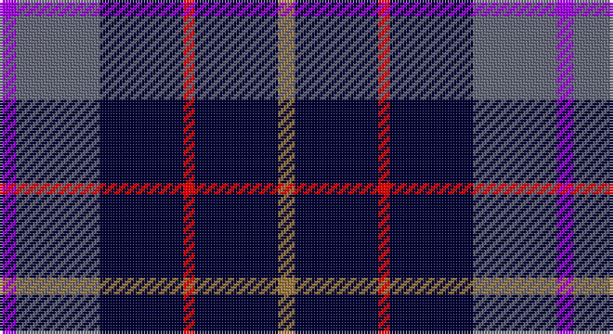

This page is one **sett** — a single exact thread-count. It belongs to the [tartan](/setts/o3k15r2k15n15p3/)
(the same proportion at any scale), whose colour order is pattern [BBKRKR](/stripes/bbkrkr/).

Sourced from register-of-tartans.  It is a [6 stripe tartan](/stripes/stripes6/).

Original link https://www.tartanregister.gov.uk/tartanDetails.aspx?ref=10268

## Register references

External register numbers recorded for this tartan.

- Scottish Register of Tartans: [10268](https://www.tartanregister.gov.uk/tartanDetails.aspx?ref=10268)

## Thread count
P/6 N30 DB30 R4 DB30 LT/6

One full sett is **200 threads**.

## Palette

Palette: <strong>Tartan Register</strong> <small style="color:#888">(2 of 5 colours)</small>
<table><thead><tr><th>Colour</th><th>Threads</th><th>Shade</th><th>Base</th><th>OKLCh</th></tr></thead><tbody><tr><td>P/</td><td style="text-align:right;font-variant-numeric:tabular-nums">6</td><td><code style="background-color:#AA00FF;">#AA00FF</code> <small style="color:#888">#AA00FF</small></td><td>B <code style="background-color:#2A418A;">#2A418A</code></td><td><small style="color:#888">oklch(58.1% 0.299 307.0)</small></td></tr><tr><td>N</td><td style="text-align:right;font-variant-numeric:tabular-nums">30</td><td><code style="background-color:#656879;">#656879</code> <small style="color:#888">#656879</small></td><td>B <code style="background-color:#2A418A;">#2A418A</code></td><td><small style="color:#888">oklch(52.1% 0.027 277.5)</small></td></tr><tr><td>DB</td><td style="text-align:right;font-variant-numeric:tabular-nums">30</td><td><code style="background-color:#000033;">#000033</code> <small style="color:#888">#000033</small></td><td>K <code style="background-color:#000000;">#000000</code></td><td><small style="color:#888">oklch(14.5% 0.101 264.1)</small></td></tr><tr><td>R</td><td style="text-align:right;font-variant-numeric:tabular-nums">4</td><td><code style="background-color:#FF0000;">#FF0000</code> <small style="color:#888">#FF0000</small></td><td>R <code style="background-color:#CC0000;">#CC0000</code></td><td><small style="color:#888">oklch(62.8% 0.258 29.2)</small></td></tr><tr><td>DB</td><td style="text-align:right;font-variant-numeric:tabular-nums">30</td><td><code style="background-color:#000033;">#000033</code> <small style="color:#888">#000033</small></td><td>K <code style="background-color:#000000;">#000000</code></td><td><small style="color:#888">oklch(14.5% 0.101 264.1)</small></td></tr><tr><td>LT/</td><td style="text-align:right;font-variant-numeric:tabular-nums">6</td><td><code style="background-color:#A07C40;">#A07C40</code> <small style="color:#888">#A07C40</small></td><td>R <code style="background-color:#CC0000;">#CC0000</code></td><td><small style="color:#888">oklch(60.9% 0.090 78.5)</small></td></tr></tbody></table>

# Sample pattern

## Nearest tartans

The nearest existing variants by ΔTartan distance, with this tartan at the top so the swatches line up against it.

ΔTartan

Tartan

Sett

—

<a href="/ttd/edit/#slug=o3k15r2k15n15p3~x2">H.M.S. DUNCAN</a> <a class="nn-out" href="/variants/s6/o3k15r2k15n15p3~x2/" title="open its dictionary page">↗</a>

0.85

<a href="/ttd/edit/#slug=db30dp9dg6dp9r4db17w5~x2&amp;base=o3k15r2k15n15p3~x2">Woodcock (2014)</a> <a class="nn-out" href="/variants/s7/db30dp9dg6dp9r4db17w5~x2/" title="open its dictionary page">↗</a>

1.03

<a href="/ttd/edit/#slug=w1db6dy5k1db6ly1~x4&amp;base=o3k15r2k15n15p3~x2">Ancient Atlantic</a> <a class="nn-out" href="/variants/s6/w1db6dy5k1db6ly1~x4/" title="open its dictionary page">↗</a>

1.05

<a href="/ttd/edit/#slug=db36r4db6g18db15k18w4~x2&amp;base=o3k15r2k15n15p3~x2">Grainger (Name)</a> <a class="nn-out" href="/variants/s7/db36r4db6g18db15k18w4~x2/" title="open its dictionary page">↗</a>

1.13

<a href="/ttd/edit/#slug=lo4db23k4g16db23lb4&amp;base=o3k15r2k15n15p3~x2">Baptist Union of Scotland</a> <a class="nn-out" href="/variants/s6/lo4db23k4g16db23lb4/" title="open its dictionary page">↗</a>

1.13

<a href="/ttd/edit/#slug=r1db12k5o3db5w1~x4&amp;base=o3k15r2k15n15p3~x2">Massachusetts</a> <a class="nn-out" href="/variants/s6/r1db12k5o3db5w1~x4/" title="open its dictionary page">↗</a>

1.14

<a href="/ttd/edit/#slug=r1db12k5lo3db5lb1~x4&amp;base=o3k15r2k15n15p3~x2">Massachusetts (Unofficial)</a> <a class="nn-out" href="/variants/s6/r1db12k5lo3db5lb1~x4/" title="open its dictionary page">↗</a>

1.18

<a href="/ttd/edit/#slug=k15ly2k10db18w3~x2&amp;base=o3k15r2k15n15p3~x2">College of Radiographers Corporate Tartan</a> <a class="nn-out" href="/variants/s5/k15ly2k10db18w3~x2/" title="open its dictionary page">↗</a>

1.25

<a href="/ttd/edit/#slug=k15lo2k10db18lb3~x2&amp;base=o3k15r2k15n15p3~x2">College of Radiographers</a> <a class="nn-out" href="/variants/s5/k15lo2k10db18lb3~x2/" title="open its dictionary page">↗</a>

1.33

<a href="/ttd/edit/#slug=db4dg2w2dg4dbi10r2dbi12ly3~x2&amp;base=o3k15r2k15n15p3~x2">United Services, Planning Association</a> <a class="nn-out" href="/variants/s8/db4dg2w2dg4dbi10r2dbi12ly3~x2/" title="open its dictionary page">↗</a>

1.35

<a href="/ttd/edit/#slug=k10p3db4p3k7b3g8k17ly2~x2&amp;base=o3k15r2k15n15p3~x2">Ayrshire Tourist Board</a> <a class="nn-out" href="/variants/s9/k10p3db4p3k7b3g8k17ly2~x2/" title="open its dictionary page">↗</a>

## Neighbour map

Every grey dot is one of 14360 variants placed by the first two principal components of the ΔTartan feature space (44% of its variance). Red is this tartan; blue dots are its nearest — click one to open its page.

<svg viewBox="0 0 640 380" role="img" style="max-width:100%;height:auto;border:1px solid #e0e0e0;border-radius:4px;display:block" xmlns="http://www.w3.org/2000/svg"><image href="/nn/cloud.v1.png" width="640" height="380"/><a href="/variants/s7/db30dp9dg6dp9r4db17w5~x2/"><circle cx="268.6" cy="209.1" r="4" fill="#3465a4"><title>Woodcock (2014)</title></circle></a><a href="/variants/s6/w1db6dy5k1db6ly1~x4/"><circle cx="271.4" cy="230.4" r="4" fill="#3465a4"><title>Ancient Atlantic</title></circle></a><a href="/variants/s7/db36r4db6g18db15k18w4~x2/"><circle cx="263.7" cy="214.6" r="4" fill="#3465a4"><title>Grainger (Name)</title></circle></a><a href="/variants/s6/lo4db23k4g16db23lb4/"><circle cx="274.4" cy="236.1" r="4" fill="#3465a4"><title>Baptist Union of Scotland</title></circle></a><a href="/variants/s6/r1db12k5o3db5w1~x4/"><circle cx="316.5" cy="194.5" r="4" fill="#3465a4"><title>Massachusetts</title></circle></a><a href="/variants/s6/r1db12k5lo3db5lb1~x4/"><circle cx="324.0" cy="199.6" r="4" fill="#3465a4"><title>Massachusetts (Unofficial)</title></circle></a><a href="/variants/s5/k15ly2k10db18w3~x2/"><circle cx="267.1" cy="245.9" r="4" fill="#3465a4"><title>College of Radiographers Corporate Tartan</title></circle></a><a href="/variants/s5/k15lo2k10db18lb3~x2/"><circle cx="273.6" cy="254.0" r="4" fill="#3465a4"><title>College of Radiographers</title></circle></a><a href="/variants/s8/db4dg2w2dg4dbi10r2dbi12ly3~x2/"><circle cx="196.9" cy="195.5" r="4" fill="#3465a4"><title>United Services, Planning Association</title></circle></a><a href="/variants/s9/k10p3db4p3k7b3g8k17ly2~x2/"><circle cx="234.9" cy="186.6" r="4" fill="#3465a4"><title>Ayrshire Tourist Board</title></circle></a><circle cx="251.7" cy="222.3" r="5" fill="#c00000"/></svg>

ID: /variants/s6/o3k15r2k15n15p3~x2/
