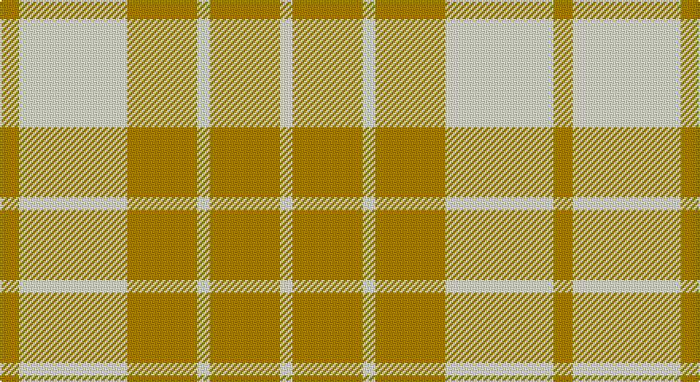

This page is one **sett** — a single exact thread-count. It belongs to the [tartan](/setts/o3w17o11w2o11w2/)
(the same proportion at any scale), whose colour order is pattern [RWRWRW](/stripes/rwrwrw/).

Sourced from register-of-tartans.  It is a [6 stripe tartan](/stripes/stripes6/).

Original link https://www.tartanregister.gov.uk/tartanDetails.aspx?ref=1147

## Also known as

This cloth is also recorded under:

- Fallow Deer, The

2 attestations — the source records this cloth was collapsed from (oldest owns this page)

<ul>
<li>01/01/1972 — Fallow Deer, The (register-of-tartans, <a href="https://www.tartanregister.gov.uk/tartanDetails.aspx?ref=1147">record</a>)</li>
<li>1972 — Fallow Deer (Fashion) (tartans-authority, <a href="http://www.tartansauthority.com/tartan-ferret/display/4835/">record</a>)</li>
</ul>

## Register references

External register numbers recorded for this tartan.

- Scottish Register of Tartans: [1147](https://www.tartanregister.gov.uk/tartanDetails.aspx?ref=1147)
- Scottish Tartans Authority (ITI): 4835

## Thread count
LG/12 LY68 LG44 LY8 LG44 LY/8

One full sett is **348 threads**.

## Palette

Palette: <strong>custom</strong>
<table><thead><tr><th>Colour</th><th>Threads</th><th>Shade</th><th>Base</th><th>OKLCh</th></tr></thead><tbody><tr><td>LG/</td><td style="text-align:right;font-variant-numeric:tabular-nums">12</td><td><code style="background-color:#9C8000;">#9C8000</code> <small style="color:#888">#9C8000</small></td><td>R <code style="background-color:#CC0000;">#CC0000</code></td><td><small style="color:#888">oklch(60.8% 0.125 93.4)</small></td></tr><tr><td>LY</td><td style="text-align:right;font-variant-numeric:tabular-nums">68</td><td><code style="background-color:#F8F4D0;">#F8F4D0</code> <small style="color:#888">#F8F4D0</small></td><td>W <code style="background-color:#F7F7F7;">#F7F7F7</code></td><td><small style="color:#888">oklch(96.1% 0.047 102.0)</small></td></tr><tr><td>LG</td><td style="text-align:right;font-variant-numeric:tabular-nums">44</td><td><code style="background-color:#9C8000;">#9C8000</code> <small style="color:#888">#9C8000</small></td><td>R <code style="background-color:#CC0000;">#CC0000</code></td><td><small style="color:#888">oklch(60.8% 0.125 93.4)</small></td></tr><tr><td>LY</td><td style="text-align:right;font-variant-numeric:tabular-nums">8</td><td><code style="background-color:#F8F4D0;">#F8F4D0</code> <small style="color:#888">#F8F4D0</small></td><td>W <code style="background-color:#F7F7F7;">#F7F7F7</code></td><td><small style="color:#888">oklch(96.1% 0.047 102.0)</small></td></tr><tr><td>LG</td><td style="text-align:right;font-variant-numeric:tabular-nums">44</td><td><code style="background-color:#9C8000;">#9C8000</code> <small style="color:#888">#9C8000</small></td><td>R <code style="background-color:#CC0000;">#CC0000</code></td><td><small style="color:#888">oklch(60.8% 0.125 93.4)</small></td></tr><tr><td>LY/</td><td style="text-align:right;font-variant-numeric:tabular-nums">8</td><td><code style="background-color:#F8F4D0;">#F8F4D0</code> <small style="color:#888">#F8F4D0</small></td><td>W <code style="background-color:#F7F7F7;">#F7F7F7</code></td><td><small style="color:#888">oklch(96.1% 0.047 102.0)</small></td></tr></tbody></table>

# Sample pattern

## Nearest tartans

The nearest existing variants by ΔTartan distance, with this tartan at the top so the swatches line up against it.

ΔTartan

Tartan

Sett

—

<a href="/ttd/edit/#slug=o3w17o11w2o11w2~x4">Fallow Deer, The</a> <a class="nn-out" href="/variants/s6/o3w17o11w2o11w2~x4/" title="open its dictionary page">↗</a>

1.90

<a href="/ttd/edit/#slug=w2r1w2g6w10r6w2g1w2~x4&amp;base=o3w17o11w2o11w2~x4">O'Neill Pipe Band 1999/ Oliver dress</a> <a class="nn-out" href="/variants/s9/w2r1w2g6w10r6w2g1w2~x4/" title="open its dictionary page">↗</a>

1.97

<a href="/ttd/edit/#slug=ly8r2ly8g1r6ly3g4ly2~x4&amp;base=o3w17o11w2o11w2~x4">Glufree</a> <a class="nn-out" href="/variants/s8/ly8r2ly8g1r6ly3g4ly2~x4/" title="open its dictionary page">↗</a>

2.02

<a href="/ttd/edit/#slug=w2o1w2g6w10o6w2g1w2~x2&amp;base=o3w17o11w2o11w2~x4">O'Neill</a> <a class="nn-out" href="/variants/s9/w2o1w2g6w10o6w2g1w2~x2/" title="open its dictionary page">↗</a>

2.06

<a href="/ttd/edit/#slug=dt4ly9w4dt9ly18w1~x2&amp;base=o3w17o11w2o11w2~x4">WVU Mountaineer (Corporate)</a> <a class="nn-out" href="/variants/s6/dt4ly9w4dt9ly18w1~x2/" title="open its dictionary page">↗</a>

2.10

<a href="/ttd/edit/#slug=dy8lr29dy8lo3dy8lr8lo3~x2&amp;base=o3w17o11w2o11w2~x4">Lister (Misty Mountain)</a> <a class="nn-out" href="/variants/s7/dy8lr29dy8lo3dy8lr8lo3~x2/" title="open its dictionary page">↗</a>

2.10

<a href="/ttd/edit/#slug=w2g13lo13w2~x6&amp;base=o3w17o11w2o11w2~x4">Dunoon</a> <a class="nn-out" href="/variants/s4/w2g13lo13w2~x6/" title="open its dictionary page">↗</a>

2.14

<a href="/ttd/edit/#slug=dg4w35g31w4~x2&amp;base=o3w17o11w2o11w2~x4">Lewis, Green (Dance)</a> <a class="nn-out" href="/variants/s4/dg4w35g31w4~x2/" title="open its dictionary page">↗</a>

2.18

<a href="/ttd/edit/#slug=lo40g13lo6db13lo22~x2&amp;base=o3w17o11w2o11w2~x4">Burt's Highlanders (Fashion)</a> <a class="nn-out" href="/variants/s5/lo40g13lo6db13lo22~x2/" title="open its dictionary page">↗</a>

2.19

<a href="/ttd/edit/#slug=g1lb4dy12lb3dy6lb12g1lb1~x4&amp;base=o3w17o11w2o11w2~x4">O'Neill Pipe Band 1970 (Corporate)</a> <a class="nn-out" href="/variants/s8/g1lb4dy12lb3dy6lb12g1lb1~x4/" title="open its dictionary page">↗</a>

2.21

<a href="/ttd/edit/#slug=w12g12w1g12w12lo1~x4&amp;base=o3w17o11w2o11w2~x4">Wallace Green Dress Fashion Tartan</a> <a class="nn-out" href="/variants/s6/w12g12w1g12w12lo1~x4/" title="open its dictionary page">↗</a>

## Neighbour map

Every grey dot is one of 14360 variants placed by the first two principal components of the ΔTartan feature space (44% of its variance). Red is this tartan; blue dots are its nearest — click one to open its page.

<svg viewBox="0 0 640 380" role="img" style="max-width:100%;height:auto;border:1px solid #e0e0e0;border-radius:4px;display:block" xmlns="http://www.w3.org/2000/svg"><image href="/nn/cloud.v1.png" width="640" height="380"/><a href="/variants/s9/w2r1w2g6w10r6w2g1w2~x4/"><circle cx="286.0" cy="184.7" r="4" fill="#3465a4"><title>O'Neill Pipe Band 1999/ Oliver dress</title></circle></a><a href="/variants/s8/ly8r2ly8g1r6ly3g4ly2~x4/"><circle cx="346.7" cy="240.3" r="4" fill="#3465a4"><title>Glufree</title></circle></a><a href="/variants/s9/w2o1w2g6w10o6w2g1w2~x2/"><circle cx="285.4" cy="192.4" r="4" fill="#3465a4"><title>O'Neill</title></circle></a><a href="/variants/s6/dt4ly9w4dt9ly18w1~x2/"><circle cx="314.6" cy="183.4" r="4" fill="#3465a4"><title>WVU Mountaineer (Corporate)</title></circle></a><a href="/variants/s7/dy8lr29dy8lo3dy8lr8lo3~x2/"><circle cx="311.1" cy="200.8" r="4" fill="#3465a4"><title>Lister (Misty Mountain)</title></circle></a><a href="/variants/s4/w2g13lo13w2~x6/"><circle cx="249.7" cy="255.6" r="4" fill="#3465a4"><title>Dunoon</title></circle></a><a href="/variants/s4/dg4w35g31w4~x2/"><circle cx="280.9" cy="231.6" r="4" fill="#3465a4"><title>Lewis, Green (Dance)</title></circle></a><a href="/variants/s5/lo40g13lo6db13lo22~x2/"><circle cx="373.0" cy="245.5" r="4" fill="#3465a4"><title>Burt's Highlanders (Fashion)</title></circle></a><a href="/variants/s8/g1lb4dy12lb3dy6lb12g1lb1~x4/"><circle cx="303.3" cy="192.0" r="4" fill="#3465a4"><title>O'Neill Pipe Band 1970 (Corporate)</title></circle></a><a href="/variants/s6/w12g12w1g12w12lo1~x4/"><circle cx="272.4" cy="224.4" r="4" fill="#3465a4"><title>Wallace Green Dress Fashion Tartan</title></circle></a><circle cx="342.7" cy="240.5" r="5" fill="#c00000"/></svg>

ID: /variants/s6/o3w17o11w2o11w2~x4/
