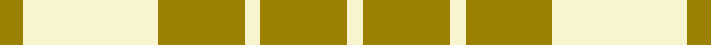

This page is one **sett** — a single exact thread-count. It belongs to the [tartan](/setts/o3w17o11w2o11w2/)
(the same proportion at any scale), whose colour order is pattern [RWRWRW](/stripes/rwrwrw/).

Sourced from register-of-tartans.  It is a [6 stripe tartan](/stripes/stripes6/).

Original link https://www.tartanregister.gov.uk/tartanDetails.aspx?ref=1147

Dataset <small>— provenance for this record, inherited from the source manifest</small>

<dl class="dataset-prov">
<dt>source</dt><dd><a href="/sources/register-of-tartans/">Scottish Register of Tartans</a></dd>
<dt>data captured from</dt><dd><a href="https://github.com/thetartan/tartan-database/blob/master/data/register-of-tartans/data.csv">https://github.com/thetartan/tartan-database/blob/master/data/register-of-tartans/data.csv</a></dd>
<dt>data date</dt><dd>1972 <small>(this record)</small></dd>
<dt>licence</dt><dd><a href="https://www.tartanregister.gov.uk/copyright">Crown copyright</a></dd>
</dl>

Capture chain <small>— the hands this data passed through, oldest first; each capture carries its own licence</small>

<ol class="capture-chain">
<li><a href="https://www.tartanregister.gov.uk/">Scottish Register of Tartans</a> · <a href="https://www.tartanregister.gov.uk/copyright">Crown copyright</a> <small>the living register — still published by National Records of Scotland</small></li>
<li><a href="https://github.com/thetartan/tartan-database">thetartan/tartan-database</a> <small>2016-2017</small> · <a href="https://creativecommons.org/licenses/by-nc-nd/4.0/">CC BY-NC-ND 4.0</a> <small>Levko Kravets's frozen compilation — the capture we vendored, and where its CC licence text came from</small></li>
<li>this dictionary <small>captured 2026-06-10 · commit 5bf86c7566</small> <small>each re-capture is a git commit to data/sources</small></li>
</ol>

## Register references

External register numbers recorded for this tartan.

- Scottish Register of Tartans: [1147](https://www.tartanregister.gov.uk/tartanDetails.aspx?ref=1147)
- Scottish Tartans Authority (ITI): 4835

## Thread count
O/12 W68 O44 W8 O44 W/8

One full sett is **348 threads**.

## Palette
<table><thead><tr><th>Colour</th><th>Shade</th><th>OKLCh</th></tr></thead><tbody><tr><td>O</td><td><code style="background-color:#A65C11;">#A65C11</code> <small style="color:#888">#A65C11</small></td><td><small style="color:#888">oklch(55.0% 0.125 58.3)</small></td></tr><tr><td>W</td><td><code style="background-color:#F7F7F7;">#F7F7F7</code> <small style="color:#888">#F7F7F7</small></td><td><small style="color:#888">oklch(97.6% 0.000 89.9)</small></td></tr></tbody></table>

# Sample pattern

## Nearest tartan variants

The nearest existing variants by ΔTartan distance, with this cloth at the top so the swatches line up against it.

ΔTartan

Threads

Variant

Sett

—

348

<a href="/variants/s6/o3w17o11w2o11w2~x4/">Fallow Deer, The</a>

<a href="/ttd/edit/#slug=r2w1r9w9r1w2~x6&amp;base=o3w17o11w2o11w2~x4" title="compare in the TTD">3.23</a>

264

<a href="/variants/s6/r2w1r9w9r1w2~x6/">Erskine Red &amp; White (Dance)</a>

<a href="/ttd/edit/#slug=r4w35r31w4~x2&amp;base=o3w17o11w2o11w2~x4" title="compare in the TTD">3.31</a>

280

<a href="/variants/s4/r4w35r31w4~x2/">Lewis, Red (Dance)</a>

<a href="/ttd/edit/#slug=o31w5o2w5o4w3o2w7~x2&amp;base=o3w17o11w2o11w2~x4" title="compare in the TTD">3.42</a>

160

<a href="/variants/s8/o31w5o2w5o4w3o2w7~x2/">Menzies, Brown &amp; White</a>

<a href="/ttd/edit/#slug=w2r1w2g6w10r6w2g1w2~x4~w3600000-g2408144&amp;base=o3w17o11w2o11w2~x4" title="compare in the TTD">3.50</a>

240

<a href="/variants/s9/w2r1w2g6w10r6w2g1w2~x4~w3600000-g2408144/">O'Neill Pipe Band 1999/ Oliver dress</a>

<a href="/ttd/edit/#slug=w2r1w2g6w10r6w2g1w2~x4&amp;base=o3w17o11w2o11w2~x4" title="compare in the TTD">3.56</a>

240

<a href="/variants/s9/w2r1w2g6w10r6w2g1w2~x4/">O'Neill Pipe Band 1999 (Corporate)</a>

<a href="/ttd/edit/#slug=r6w2r29w29r2w6~x2&amp;base=o3w17o11w2o11w2~x4" title="compare in the TTD">3.82</a>

272

<a href="/variants/s6/r6w2r29w29r2w6~x2/">Erskine, Burgundy (Dance)</a>

<a href="/ttd/edit/#slug=y8w3y28w32dp3w4~x2&amp;base=o3w17o11w2o11w2~x4" title="compare in the TTD">3.96</a>

288

<a href="/variants/s6/y8w3y28w32dp3w4~x2/">Ailsa Yellow Fashion Tartan</a>

## Neighbour map

Every grey dot is one of 13620 variants placed by the first two principal components of the ΔTartan feature space (42% of its variance). Red is this tartan; blue dots are its nearest — click one to open its page.

<svg viewBox="0 0 640 380" role="img" style="max-width:100%;height:auto;border:1px solid #e0e0e0;border-radius:4px;display:block" xmlns="http://www.w3.org/2000/svg"><image href="/nn/cloud.v1.png" width="640" height="380"/><a href="/variants/s6/r2w1r9w9r1w2~x6/"><circle cx="351.2" cy="233.9" r="4" fill="#3465a4"><title>Erskine Red &amp; White (Dance)</title></circle></a><a href="/variants/s4/r4w35r31w4~x2/"><circle cx="361.0" cy="259.3" r="4" fill="#3465a4"><title>Lewis, Red (Dance)</title></circle></a><a href="/variants/s8/o31w5o2w5o4w3o2w7~x2/"><circle cx="454.5" cy="184.4" r="4" fill="#3465a4"><title>Menzies, Brown &amp; White</title></circle></a><a href="/variants/s9/w2r1w2g6w10r6w2g1w2~x4~w3600000-g2408144/"><circle cx="323.5" cy="220.2" r="4" fill="#3465a4"><title>O'Neill Pipe Band 1999/ Oliver dress</title></circle></a><a href="/variants/s9/w2r1w2g6w10r6w2g1w2~x4/"><circle cx="303.2" cy="213.7" r="4" fill="#3465a4"><title>O'Neill Pipe Band 1999 (Corporate)</title></circle></a><a href="/variants/s6/r6w2r29w29r2w6~x2/"><circle cx="370.4" cy="210.6" r="4" fill="#3465a4"><title>Erskine, Burgundy (Dance)</title></circle></a><a href="/variants/s6/y8w3y28w32dp3w4~x2/"><circle cx="345.4" cy="233.9" r="4" fill="#3465a4"><title>Ailsa Yellow Fashion Tartan</title></circle></a><circle cx="356.8" cy="256.3" r="5" fill="#c00000"/><text x="320" y="376" text-anchor="middle" font-size="11" fill="#999">ground</text><text x="11" y="190" text-anchor="middle" font-size="11" fill="#999" transform="rotate(-90 11 190)">complexity</text></svg>

ID: /variants/s6/o3w17o11w2o11w2~x4/
