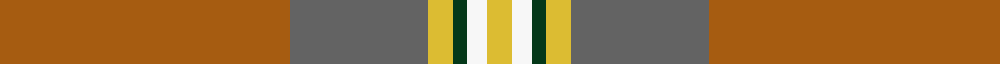

This page is one **sett** — a single exact thread-count. It belongs to the [tartan](/setts/o59n28ly5dg3w4ly5/)
(the same proportion at any scale), whose colour order is pattern [RBYGWY](/stripes/rbygwy/).

Sourced from register-of-tartans.  It is a [6 stripe tartan](/stripes/stripes6/).

Original link https://www.tartanregister.gov.uk/tartanDetails.aspx?ref=10234

## Register references

External register numbers recorded for this tartan.

- Scottish Register of Tartans: [10234](https://www.tartanregister.gov.uk/tartanDetails.aspx?ref=10234)

## Thread count
O/118 N56 LY10 DG6 W8 LY/10

One full sett is **288 threads**.

## Palette
<table><thead><tr><th>Colour</th><th>Shade</th><th>OKLCh</th></tr></thead><tbody><tr><td>B</td><td><code style="background-color:#636363;">#636363</code> <small style="color:#888">#636363</small></td><td><small style="color:#888">oklch(50.0% 0.000 89.9)</small></td></tr><tr><td>K</td><td><code style="background-color:#053819;">#053819</code> <small style="color:#888">#053819</small></td><td><small style="color:#888">oklch(30.0% 0.075 151.3)</small></td></tr><tr><td>LG</td><td><code style="background-color:#8B6E00;">#8B6E00</code> <small style="color:#888">#8B6E00</small></td><td><small style="color:#888">oklch(55.1% 0.113 90.4)</small></td></tr><tr><td>LT</td><td><code style="background-color:#A65C11;">#A65C11</code> <small style="color:#888">#A65C11</small></td><td><small style="color:#888">oklch(55.0% 0.125 58.3)</small></td></tr><tr><td>LY</td><td><code style="background-color:#DCBC32;">#DCBC32</code> <small style="color:#888">#DCBC32</small></td><td><small style="color:#888">oklch(80.0% 0.150 95.2)</small></td></tr><tr><td>W</td><td><code style="background-color:#F7F7F7;">#F7F7F7</code> <small style="color:#888">#F7F7F7</small></td><td><small style="color:#888">oklch(97.6% 0.000 89.9)</small></td></tr></tbody></table>

# Sample pattern

## Nearest variants

The nearest existing variants by ΔTartan distance, with this cloth at the top so the swatches line up against it.

ΔTartan

Threads

Variant

Sett

—

288

<a href="/variants/s6/o59n28ly5dg3w4ly5~x2/">Dundhuin Gold</a>

<a href="/ttd/edit/#slug=o62n17ly12y8dg8~x2&amp;base=o59n28ly5dg3w4ly5~x2" title="compare in the TTD">1.73</a>

288

<a href="/variants/s5/o62n17ly12y8dg8~x2/">Dundhuin Dress (Personal)</a>

<a href="/ttd/edit/#slug=do18o9n9r1lb1~x4&amp;base=o59n28ly5dg3w4ly5~x2" title="compare in the TTD">2.32</a>

228

<a href="/variants/s5/do18o9n9r1lb1~x4/">Jardine</a>

<a href="/ttd/edit/#slug=n10lb3o3r1g1~x10~n1900000-o2500000-g2408144&amp;base=o59n28ly5dg3w4ly5~x2" title="compare in the TTD">2.50</a>

250

<a href="/variants/s5/n10lb3o3r1g1~x10~n1900000-o2500000-g2408144/">Bagpipe Shop, The Corporate Tartan</a>

<a href="/ttd/edit/#slug=n10lb3o3r1g1~x10~n1900000-o2500000&amp;base=o59n28ly5dg3w4ly5~x2" title="compare in the TTD">2.50</a>

250

<a href="/variants/s5/n10lb3o3r1g1~x10~n1900000-o2500000/">Bagpipe Shop, The (Corporate)</a>

## Neighbour map

Every grey dot is one of 13620 variants placed by the first two principal components of the ΔTartan feature space (42% of its variance). Red is this tartan; blue dots are its nearest — click one to open its page.

<svg viewBox="0 0 640 380" role="img" style="max-width:100%;height:auto;border:1px solid #e0e0e0;border-radius:4px;display:block" xmlns="http://www.w3.org/2000/svg"><image href="/nn/cloud.v1.png" width="640" height="380"/><a href="/variants/s5/o62n17ly12y8dg8~x2/"><circle cx="411.6" cy="245.1" r="4" fill="#3465a4"><title>Dundhuin Dress (Personal)</title></circle></a><a href="/variants/s5/do18o9n9r1lb1~x4/"><circle cx="357.2" cy="217.6" r="4" fill="#3465a4"><title>Jardine</title></circle></a><a href="/variants/s5/n10lb3o3r1g1~x10~n1900000-o2500000-g2408144/"><circle cx="367.0" cy="227.9" r="4" fill="#3465a4"><title>Bagpipe Shop, The Corporate Tartan</title></circle></a><a href="/variants/s5/n10lb3o3r1g1~x10~n1900000-o2500000/"><circle cx="371.0" cy="229.2" r="4" fill="#3465a4"><title>Bagpipe Shop, The (Corporate)</title></circle></a><circle cx="429.4" cy="182.1" r="5" fill="#c00000"/><text x="320" y="376" text-anchor="middle" font-size="11" fill="#999">ground</text><text x="11" y="190" text-anchor="middle" font-size="11" fill="#999" transform="rotate(-90 11 190)">complexity</text></svg>

ID: /variants/s6/o59n28ly5dg3w4ly5~x2/
