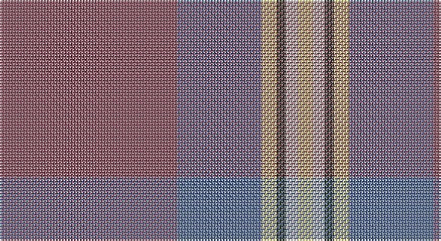

This page is one **sett** — a single exact thread-count. It belongs to the [tartan](/setts/o59t28ly5dg3w4ly5/)
(the same proportion at any scale), whose colour order is pattern [RBYGWY](/stripes/rbygwy/).

Sourced from register-of-tartans.  It is a [6 stripe tartan](/stripes/stripes6/).

Original link https://www.tartanregister.gov.uk/tartanDetails.aspx?ref=10234

## Register references

External register numbers recorded for this tartan.

- Scottish Register of Tartans: [10234](https://www.tartanregister.gov.uk/tartanDetails.aspx?ref=10234)

## Thread count
LT/118 B56 LY10 K6 W8 LY/10

One full sett is **288 threads**.

## Palette

Palette: <strong>Tartan Register</strong> <small style="color:#888">(3 of 6 colours)</small>
<table><thead><tr><th>Colour</th><th>Threads</th><th>Shade</th><th>Base</th><th>OKLCh</th></tr></thead><tbody><tr><td>LT/</td><td style="text-align:right;font-variant-numeric:tabular-nums">118</td><td><code style="background-color:#905966;">#905966</code> <small style="color:#888">#905966</small></td><td>R <code style="background-color:#CC0000;">#CC0000</code></td><td><small style="color:#888">oklch(52.9% 0.074 4.6)</small></td></tr><tr><td>B</td><td style="text-align:right;font-variant-numeric:tabular-nums">56</td><td><code style="background-color:#5F749C;">#5F749C</code> <small style="color:#888">#5F749C</small></td><td>B <code style="background-color:#2A418A;">#2A418A</code></td><td><small style="color:#888">oklch(55.8% 0.067 262.9)</small></td></tr><tr><td>LY</td><td style="text-align:right;font-variant-numeric:tabular-nums">10</td><td><code style="background-color:#F8E38C;">#F8E38C</code> <small style="color:#888">#F8E38C</small></td><td>Y <code style="background-color:#F2BF00;">#F2BF00</code></td><td><small style="color:#888">oklch(91.4% 0.110 96.2)</small></td></tr><tr><td>K</td><td style="text-align:right;font-variant-numeric:tabular-nums">6</td><td><code style="background-color:#23321B;">#23321B</code> <small style="color:#888">#23321B</small></td><td>G <code style="background-color:#006100;">#006100</code></td><td><small style="color:#888">oklch(29.7% 0.045 135.3)</small></td></tr><tr><td>W</td><td style="text-align:right;font-variant-numeric:tabular-nums">8</td><td><code style="background-color:#E5E0D2;">#E5E0D2</code> <small style="color:#888">#E5E0D2</small></td><td>W <code style="background-color:#F7F7F7;">#F7F7F7</code></td><td><small style="color:#888">oklch(90.7% 0.020 90.6)</small></td></tr><tr><td>LY/</td><td style="text-align:right;font-variant-numeric:tabular-nums">10</td><td><code style="background-color:#F8E38C;">#F8E38C</code> <small style="color:#888">#F8E38C</small></td><td>Y <code style="background-color:#F2BF00;">#F2BF00</code></td><td><small style="color:#888">oklch(91.4% 0.110 96.2)</small></td></tr></tbody></table>

# Sample pattern

## Nearest tartans

The nearest existing variants by ΔTartan distance, with this tartan at the top so the swatches line up against it.

ΔTartan

Tartan

Sett

—

<a href="/ttd/edit/#slug=o59t28ly5dg3w4ly5~x2">Dundhuin Gold</a> <a class="nn-out" href="/variants/s6/o59t28ly5dg3w4ly5~x2/" title="open its dictionary page">↗</a>

1.14

<a href="/ttd/edit/#slug=o47w6r24w3dt5lo3~x2&amp;base=o59t28ly5dg3w4ly5~x2">Duminiak (Personal)</a> <a class="nn-out" href="/variants/s6/o47w6r24w3dt5lo3~x2/" title="open its dictionary page">↗</a>

1.23

<a href="/ttd/edit/#slug=y47w6r24w3dp5lo3~x2&amp;base=o59t28ly5dg3w4ly5~x2">Duminiak (Trevose, Pennsylvania)</a> <a class="nn-out" href="/variants/s6/y47w6r24w3dp5lo3~x2/" title="open its dictionary page">↗</a>

1.35

<a href="/ttd/edit/#slug=ri4y2db4y35t27r3~x2&amp;base=o59t28ly5dg3w4ly5~x2">Royal Deeside (District)</a> <a class="nn-out" href="/variants/s6/ri4y2db4y35t27r3~x2/" title="open its dictionary page">↗</a>

1.49

<a href="/ttd/edit/#slug=ly2dy4r4n21w1n1ri1~x4&amp;base=o59t28ly5dg3w4ly5~x2">Edinburgh Fire (Corporate)</a> <a class="nn-out" href="/variants/s7/ly2dy4r4n21w1n1ri1~x4/" title="open its dictionary page">↗</a>

1.50

<a href="/ttd/edit/#slug=ri2g16r1ri2r12ly1t1~x2&amp;base=o59t28ly5dg3w4ly5~x2">Spragg (Name)</a> <a class="nn-out" href="/variants/s7/ri2g16r1ri2r12ly1t1~x2/" title="open its dictionary page">↗</a>

1.52

<a href="/variants/s7/lp6wi2lp1db6o30w1r3~x2/">Kuehle (Personal)</a>

1.53

<a href="/ttd/edit/#slug=lb1o12r1dt1r1dt2r5lb1~x4&amp;base=o59t28ly5dg3w4ly5~x2">Tenmaya Check</a> <a class="nn-out" href="/variants/s8/lb1o12r1dt1r1dt2r5lb1~x4/" title="open its dictionary page">↗</a>

1.54

<a href="/ttd/edit/#slug=r2b4lb18n2lb2n41w2~x2&amp;base=o59t28ly5dg3w4ly5~x2">Haddrell (2013)</a> <a class="nn-out" href="/variants/s7/r2b4lb18n2lb2n41w2~x2/" title="open its dictionary page">↗</a>

1.55

<a href="/ttd/edit/#slug=lb1n12r1dt1r1dt2r5lb1~x4&amp;base=o59t28ly5dg3w4ly5~x2">Tenmaya Corporate Tartan</a> <a class="nn-out" href="/variants/s8/lb1n12r1dt1r1dt2r5lb1~x4/" title="open its dictionary page">↗</a>

1.59

<a href="/ttd/edit/#slug=o3lr4o4k4o18k3n36w3~x2&amp;base=o59t28ly5dg3w4ly5~x2">Hebridean Granite (Fashion)</a> <a class="nn-out" href="/variants/s8/o3lr4o4k4o18k3n36w3~x2/" title="open its dictionary page">↗</a>

## Neighbour map

Every grey dot is one of 14360 variants placed by the first two principal components of the ΔTartan feature space (44% of its variance). Red is this tartan; blue dots are its nearest — click one to open its page.

<svg viewBox="0 0 640 380" role="img" style="max-width:100%;height:auto;border:1px solid #e0e0e0;border-radius:4px;display:block" xmlns="http://www.w3.org/2000/svg"><image href="/nn/cloud.v1.png" width="640" height="380"/><a href="/variants/s6/o47w6r24w3dt5lo3~x2/"><circle cx="324.6" cy="158.8" r="4" fill="#3465a4"><title>Duminiak (Personal)</title></circle></a><a href="/variants/s6/y47w6r24w3dp5lo3~x2/"><circle cx="334.6" cy="167.2" r="4" fill="#3465a4"><title>Duminiak (Trevose, Pennsylvania)</title></circle></a><a href="/variants/s6/ri4y2db4y35t27r3~x2/"><circle cx="341.4" cy="187.2" r="4" fill="#3465a4"><title>Royal Deeside (District)</title></circle></a><a href="/variants/s7/ly2dy4r4n21w1n1ri1~x4/"><circle cx="407.7" cy="130.6" r="4" fill="#3465a4"><title>Edinburgh Fire (Corporate)</title></circle></a><a href="/variants/s7/ri2g16r1ri2r12ly1t1~x2/"><circle cx="298.4" cy="152.7" r="4" fill="#3465a4"><title>Spragg (Name)</title></circle></a><a href="/variants/s7/lp6wi2lp1db6o30w1r3~x2/"><circle cx="376.7" cy="105.4" r="4" fill="#3465a4"><title>Kuehle (Personal)</title></circle></a><a href="/variants/s8/lb1o12r1dt1r1dt2r5lb1~x4/"><circle cx="340.9" cy="182.1" r="4" fill="#3465a4"><title>Tenmaya Check</title></circle></a><a href="/variants/s7/r2b4lb18n2lb2n41w2~x2/"><circle cx="380.4" cy="134.1" r="4" fill="#3465a4"><title>Haddrell (2013)</title></circle></a><a href="/variants/s8/lb1n12r1dt1r1dt2r5lb1~x4/"><circle cx="336.3" cy="182.6" r="4" fill="#3465a4"><title>Tenmaya Corporate Tartan</title></circle></a><a href="/variants/s8/o3lr4o4k4o18k3n36w3~x2/"><circle cx="291.1" cy="167.2" r="4" fill="#3465a4"><title>Hebridean Granite (Fashion)</title></circle></a><circle cx="373.9" cy="160.5" r="5" fill="#c00000"/></svg>

ID: /variants/s6/o59t28ly5dg3w4ly5~x2/
