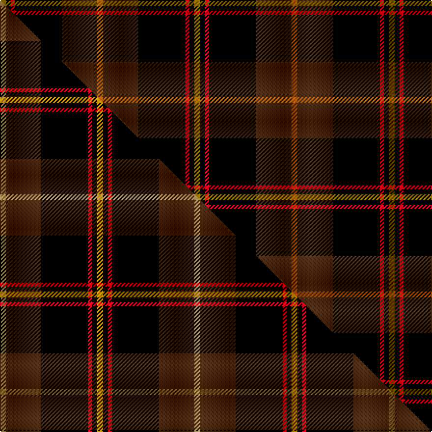

This page is one **sett** — a single exact thread-count. It belongs to the [tartan](/setts/o6do36k48r4k5y6/)
(the same proportion at any scale), whose colour order is pattern [GKRKBR](/stripes/gkrkbr/).

Part of the [Drambuie Hunting](/tartans/drambuie-hunting/) tartan — the named design grouping this sett with its other cloths.

Sourced from weddslist.  It is a [6 stripe tartan](/stripes/stripes6/).

Original link [http://www.weddslist.com/cgi-bin/tartans/pg.pl?source=sts](http://www.weddslist.com/cgi-bin/tartans/pg.pl?source=sts)

Dataset <small>— provenance for this record, inherited from the source manifest</small>

<dl class="dataset-prov">
<dt>source</dt><dd><a href="/sources/weddslist/">Weddslist</a></dd>
<dt>data captured from</dt><dd><a href="https://github.com/thetartan/tartan-database/blob/master/data/weddslist/data.csv">https://github.com/thetartan/tartan-database/blob/master/data/weddslist/data.csv</a></dd>
<dt>data date</dt><dd>2016-11-17 <small>(dataset default)</small></dd>
<dt>licence</dt><dd><a href="https://creativecommons.org/licenses/by-nc-nd/4.0/">CC BY-NC-ND 4.0</a></dd>
</dl>

Capture chain <small>— the hands this data passed through, oldest first; each capture carries its own licence</small>

<ol class="capture-chain">
<li><a href="https://www.weddslist.com/tartans/">Weddslist</a> <small>the living privately compiled reference</small></li>
<li><a href="https://github.com/thetartan/tartan-database">thetartan/tartan-database</a> <small>2016-2017</small> · <a href="https://creativecommons.org/licenses/by-nc-nd/4.0/">CC BY-NC-ND 4.0</a> <small>Levko Kravets's frozen compilation — the capture we vendored, and where its CC licence text came from</small></li>
<li>this dictionary <small>captured 2026-06-10 · commit 5bf86c7566</small> <small>each re-capture is a git commit to data/sources</small></li>
</ol>

## Thread count
Y/6 K5 R4 K48 DO36 O/6

One full sett is **198 threads**.

## Palette
<table><thead><tr><th>Colour</th><th>Shade</th><th>OKLCh</th></tr></thead><tbody><tr><td>DO</td><td><code style="background-color:#412714;">#412714</code> <small style="color:#888">#412714</small></td><td><small style="color:#888">oklch(30.1% 0.050 55.7)</small></td></tr><tr><td>K</td><td><code style="background-color:#000000;">#000000</code> <small style="color:#888">#000000</small></td><td><small style="color:#888">oklch(0.0% 0.000 0.0)</small></td></tr><tr><td>Y</td><td><code style="background-color:#8B6E00;">#8B6E00</code> <small style="color:#888">#8B6E00</small></td><td><small style="color:#888">oklch(55.1% 0.113 90.4)</small></td></tr><tr><td>O</td><td><code style="background-color:#A65C11;">#A65C11</code> <small style="color:#888">#A65C11</small></td><td><small style="color:#888">oklch(55.0% 0.125 58.3)</small></td></tr><tr><td>R</td><td><code style="background-color:#D60020;">#D60020</code> <small style="color:#888">#D60020</small></td><td><small style="color:#888">oklch(55.2% 0.224 25.5)</small></td></tr></tbody></table>

# Sample pattern

## Compared to the master

This cloth is one sett of its design; the master sett (the exemplar the design is anchored on) is below for comparison.

Its **ΔTartan distance** from the master is **0.03** — the same measure the nearest-tartans table ranks by (0 is identical; a re-scale of the same cloth is near 0, a recolour or a different proportion further).

<figure class="master-compare" style="margin:0">

this sett
master sett ★

<figcaption style="color:#888;font-size:smaller">One weave of this sett against the <a href="/setts/ly6do36k48r4k5lyi6/">master sett ★</a>, split on the diagonal: a shared proportion runs seamlessly across it with only the shades shifting; a different proportion breaks on it.</figcaption>
</figure>

## Nearest tartan variants

The nearest existing variants by ΔTartan distance, with this cloth at the top so the swatches line up against it.

ΔTartan

Threads

Variant

Sett

—

198

<a href="/variants/s6/o6do36k48r4k5y6/">Drambuie hunting</a>

<a href="/ttd/edit/#slug=w6dy36k48r4k5ly6~dy1603076-ly3307090&amp;base=o6do36k48r4k5y6" title="compare in the TTD">0.37</a>

198

<a href="/variants/s6/w6dy36k48r4k5ly6~dy1603076-ly3307090/">Drambuie Dress</a>

<a href="/ttd/edit/#slug=y6k5r4k48o36w6&amp;base=o6do36k48r4k5y6" title="compare in the TTD">0.41</a>

198

<a href="/variants/s6/y6k5r4k48o36w6/">Drambuie dress</a>

<a href="/ttd/edit/#slug=o6do36k48r4k5ly6~o2503076-ly2705081&amp;base=o6do36k48r4k5y6" title="compare in the TTD">0.60</a>

198

<a href="/variants/s6/ly6do36k48r4k5lyi6~ly2503076-lyi2705081/">Drambuie Hunting</a>

<a href="/ttd/edit/#slug=dy6k5ly4k48dr36w6&amp;base=o6do36k48r4k5y6" title="compare in the TTD">2.00</a>

198

<a href="/variants/s6/dy6k5ly4k48dr36w6/">Drambuie</a>

<a href="/ttd/edit/#slug=k62db15dp15o20lr5db5k15~x2&amp;base=o6do36k48r4k5y6" title="compare in the TTD">2.06</a>

394

<a href="/variants/s7/k62db15dp15o20lr5db5k15~x2/">Black Raven</a>

<a href="/ttd/edit/#slug=k5r3k27ki37r5g2y2~x2~ki0604259&amp;base=o6do36k48r4k5y6" title="compare in the TTD">2.31</a>

310

<a href="/variants/s7/k5r3k27ki37r5g2y2~x2~ki0604259/">Royal Marines Condor</a>

<a href="/ttd/edit/#slug=k8dr49k8lb3k20lo3~x2&amp;base=o6do36k48r4k5y6" title="compare in the TTD">2.34</a>

342

<a href="/variants/s6/k8dr49k8lb3k20lo3~x2/">Dunbar (District)</a>

<a href="/ttd/edit/#slug=k40dp5k6y26n13k9dy3~x2&amp;base=o6do36k48r4k5y6" title="compare in the TTD">2.45</a>

322

<a href="/variants/s7/k40dp5k6y26n13k9dy3~x2/">de Meuron (Neuchâtel) Dress, The</a>

<a href="/ttd/edit/#slug=k6db4dg44k41w4~x2&amp;base=o6do36k48r4k5y6" title="compare in the TTD">2.63</a>

376

<a href="/variants/s5/k6db4dg44k41w4~x2/">Douglas (Clan)</a>

<a href="/ttd/edit/#slug=w5k26dy26lb7k3r3~x2&amp;base=o6do36k48r4k5y6" title="compare in the TTD">2.85</a>

264

<a href="/variants/s6/w5k26dy26lb7k3r3~x2/">Cornish National District Tartan</a>

## Neighbour map

Every grey dot is one of 13621 variants placed by the first two principal components of the ΔTartan feature space (42% of its variance). Red is this tartan; blue dots are its nearest — click one to open its page.

<svg viewBox="0 0 640 380" role="img" style="max-width:100%;height:auto;border:1px solid #e0e0e0;border-radius:4px;display:block" xmlns="http://www.w3.org/2000/svg"><image href="/nn/cloud.v1.png" width="640" height="380"/><a href="/variants/s6/w6dy36k48r4k5ly6~dy1603076-ly3307090/"><circle cx="216.2" cy="147.9" r="4" fill="#3465a4"><title>Drambuie Dress</title></circle></a><a href="/variants/s6/y6k5r4k48o36w6/"><circle cx="214.4" cy="145.6" r="4" fill="#3465a4"><title>Drambuie dress</title></circle></a><a href="/variants/s6/ly6do36k48r4k5lyi6~ly2503076-lyi2705081/"><circle cx="244.6" cy="155.9" r="4" fill="#3465a4"><title>Drambuie Hunting</title></circle></a><a href="/variants/s6/dy6k5ly4k48dr36w6/"><circle cx="235.9" cy="154.1" r="4" fill="#3465a4"><title>Drambuie</title></circle></a><a href="/variants/s7/k62db15dp15o20lr5db5k15~x2/"><circle cx="241.3" cy="149.6" r="4" fill="#3465a4"><title>Black Raven</title></circle></a><a href="/variants/s7/k5r3k27ki37r5g2y2~x2~ki0604259/"><circle cx="266.6" cy="133.2" r="4" fill="#3465a4"><title>Royal Marines Condor</title></circle></a><a href="/variants/s6/k8dr49k8lb3k20lo3~x2/"><circle cx="325.8" cy="158.1" r="4" fill="#3465a4"><title>Dunbar (District)</title></circle></a><a href="/variants/s7/k40dp5k6y26n13k9dy3~x2/"><circle cx="232.7" cy="155.9" r="4" fill="#3465a4"><title>de Meuron (Neuchâtel) Dress, The</title></circle></a><a href="/variants/s5/k6db4dg44k41w4~x2/"><circle cx="272.7" cy="195.8" r="4" fill="#3465a4"><title>Douglas (Clan)</title></circle></a><a href="/variants/s6/w5k26dy26lb7k3r3~x2/"><circle cx="154.3" cy="174.4" r="4" fill="#3465a4"><title>Cornish National District Tartan</title></circle></a><circle cx="257.7" cy="159.7" r="5" fill="#c00000"/><text x="320" y="376" text-anchor="middle" font-size="11" fill="#999">ground</text><text x="11" y="190" text-anchor="middle" font-size="11" fill="#999" transform="rotate(-90 11 190)">complexity</text></svg>

ID: /variants/s6/o6do36k48r4k5y6/
