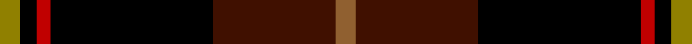
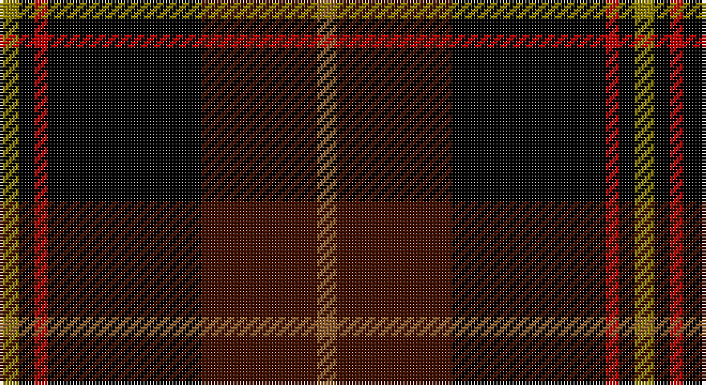

This page is one **sett** — a single exact thread-count. It belongs to the [tartan](/setts/o6dr36k48r4k5y6/)
(the same proportion at any scale), whose colour order is pattern [GKRKBR](/stripes/gkrkbr/).

Part of the [Drambuie Hunting](/tartans/drambuie-hunting/) tartan — the named design grouping this sett with its other cloths.

Sourced from weddslist.  It is a [6 stripe tartan](/stripes/stripes6/).

Original link http://www.weddslist.com/cgi-bin/tartans/pg.pl?source=sts

## Also known as

This cloth is also recorded under:

- Drambuie Htg
- Drambuie hunting

## Thread count
LG/6 K5 R4 K48 DR36 LT/6

One full sett is **198 threads**.

## Palette

Palette: <strong>Ingles Buchan</strong> <small style="color:#888">(1 of 5 colours)</small>
<table><thead><tr><th>Colour</th><th>Threads</th><th>Shade</th><th>Base</th><th>OKLCh</th></tr></thead><tbody><tr><td>LG/</td><td style="text-align:right;font-variant-numeric:tabular-nums">6</td><td><code style="background-color:#908000;">#908000</code> <small style="color:#888">#908000</small></td><td>G <code style="background-color:#006100;">#006100</code></td><td><small style="color:#888">oklch(59.6% 0.124 100.6)</small></td></tr><tr><td>K</td><td style="text-align:right;font-variant-numeric:tabular-nums">5</td><td><code style="background-color:#000000;">#000000</code> <small style="color:#888">#000000</small></td><td>K <code style="background-color:#000000;">#000000</code></td><td><small style="color:#888">oklch(0.0% 0.000 0.0)</small></td></tr><tr><td>R</td><td style="text-align:right;font-variant-numeric:tabular-nums">4</td><td><code style="background-color:#C00000;">#C00000</code> <small style="color:#888">#C00000</small></td><td>R <code style="background-color:#CC0000;">#CC0000</code></td><td><small style="color:#888">oklch(50.7% 0.208 29.2)</small></td></tr><tr><td>K</td><td style="text-align:right;font-variant-numeric:tabular-nums">48</td><td><code style="background-color:#000000;">#000000</code> <small style="color:#888">#000000</small></td><td>K <code style="background-color:#000000;">#000000</code></td><td><small style="color:#888">oklch(0.0% 0.000 0.0)</small></td></tr><tr><td>DR</td><td style="text-align:right;font-variant-numeric:tabular-nums">36</td><td><code style="background-color:#401000;">#401000</code> <small style="color:#888">#401000</small></td><td>B <code style="background-color:#2A418A;">#2A418A</code></td><td><small style="color:#888">oklch(25.3% 0.079 39.9)</small></td></tr><tr><td>LT/</td><td style="text-align:right;font-variant-numeric:tabular-nums">6</td><td><code style="background-color:#906030;">#906030</code> <small style="color:#888">#906030</small></td><td>R <code style="background-color:#CC0000;">#CC0000</code></td><td><small style="color:#888">oklch(53.1% 0.089 63.7)</small></td></tr></tbody></table>

# Sample pattern

## Compared to the master

This cloth is one sett of its design; the master sett (the exemplar the design is anchored on) is below for comparison.

<figure style="margin:0"><figcaption style="color:#888;font-size:smaller">this sett</figcaption></figure>
<figure style="margin:0"><figcaption style="color:#888;font-size:smaller"><a href="/setts/lo6k5r4k48dy36loi6/">master sett →</a></figcaption></figure>

## Nearest tartans

The nearest existing variants by ΔTartan distance, with this tartan at the top so the swatches line up against it.

ΔTartan

Tartan

Sett

—

<a href="/ttd/edit/#slug=o6dr36k48r4k5y6">Drambuie hunting</a> <a class="nn-out" href="/variants/s6/o6dr36k48r4k5y6/" title="open its dictionary page">↗</a>

1.36

<a href="/ttd/edit/#slug=w6r36k48o4k5ly6&amp;base=o6dr36k48r4k5y6">Drambuie</a> <a class="nn-out" href="/variants/s6/w6r36k48o4k5ly6/" title="open its dictionary page">↗</a>

1.45

<a href="/ttd/edit/#slug=lo6k5r4k48dy36loi6&amp;base=o6dr36k48r4k5y6">Drambuie Hunting</a> <a class="nn-out" href="/variants/s6/lo6k5r4k48dy36loi6/" title="open its dictionary page">↗</a>

1.50

<a href="/ttd/edit/#slug=k62db15dp15o20ly5db5k15~x2&amp;base=o6dr36k48r4k5y6">Black Raven</a> <a class="nn-out" href="/variants/s7/k62db15dp15o20ly5db5k15~x2/" title="open its dictionary page">↗</a>

1.54

<a href="/ttd/edit/#slug=w6dy36k48r4k5ly6&amp;base=o6dr36k48r4k5y6">Drambuie Dress</a> <a class="nn-out" href="/variants/s6/w6dy36k48r4k5ly6/" title="open its dictionary page">↗</a>

1.57

<a href="/ttd/edit/#slug=r10k3dg2lb2k22db4k22r4dg4r14lb3~x2&amp;base=o6dr36k48r4k5y6">MacDonald, Sir John A</a> <a class="nn-out" href="/variants/s11/r10k3dg2lb2k22db4k22r4dg4r14lb3~x2/" title="open its dictionary page">↗</a>

1.60

<a href="/variants/s7/k5r3k27ki37r5g2ly2~x2/">Royal Marines Condor</a>

1.62

<a href="/ttd/edit/#slug=w6r36k48lo4k5ly6&amp;base=o6dr36k48r4k5y6">Drambuie</a> <a class="nn-out" href="/variants/s6/w6r36k48lo4k5ly6/" title="open its dictionary page">↗</a>

1.62

<a href="/variants/s7/k3dy3yi6k12y1dyi2dy2~x4/">Joe Strummer Commemorative</a>

1.63

<a href="/ttd/edit/#slug=r10k3g2lb2k22db4k22r4g4r14lb3~x2&amp;base=o6dr36k48r4k5y6">York Region Pipe Band</a> <a class="nn-out" href="/variants/s11/r10k3g2lb2k22db4k22r4g4r14lb3~x2/" title="open its dictionary page">↗</a>

1.64

<a href="/ttd/edit/#slug=m11dr5dg5k40ly3~x2&amp;base=o6dr36k48r4k5y6">MacShimsi Personal Tartan</a> <a class="nn-out" href="/variants/s5/m11dr5dg5k40ly3~x2/" title="open its dictionary page">↗</a>

## Neighbour map

Every grey dot is one of 14360 variants placed by the first two principal components of the ΔTartan feature space (44% of its variance). Red is this tartan; blue dots are its nearest — click one to open its page.

<svg viewBox="0 0 640 380" role="img" style="max-width:100%;height:auto;border:1px solid #e0e0e0;border-radius:4px;display:block" xmlns="http://www.w3.org/2000/svg"><image href="/nn/cloud.v1.png" width="640" height="380"/><a href="/variants/s6/w6r36k48o4k5ly6/"><circle cx="252.3" cy="165.1" r="4" fill="#3465a4"><title>Drambuie</title></circle></a><a href="/variants/s6/lo6k5r4k48dy36loi6/"><circle cx="300.3" cy="190.7" r="4" fill="#3465a4"><title>Drambuie Hunting</title></circle></a><a href="/variants/s7/k62db15dp15o20ly5db5k15~x2/"><circle cx="289.6" cy="186.7" r="4" fill="#3465a4"><title>Black Raven</title></circle></a><a href="/variants/s6/w6dy36k48r4k5ly6/"><circle cx="266.3" cy="174.6" r="4" fill="#3465a4"><title>Drambuie Dress</title></circle></a><a href="/variants/s11/r10k3dg2lb2k22db4k22r4dg4r14lb3~x2/"><circle cx="243.7" cy="159.8" r="4" fill="#3465a4"><title>MacDonald, Sir John A</title></circle></a><a href="/variants/s7/k5r3k27ki37r5g2ly2~x2/"><circle cx="286.4" cy="164.9" r="4" fill="#3465a4"><title>Royal Marines Condor</title></circle></a><a href="/variants/s6/w6r36k48lo4k5ly6/"><circle cx="265.6" cy="167.5" r="4" fill="#3465a4"><title>Drambuie</title></circle></a><a href="/variants/s7/k3dy3yi6k12y1dyi2dy2~x4/"><circle cx="284.7" cy="206.9" r="4" fill="#3465a4"><title>Joe Strummer Commemorative</title></circle></a><a href="/variants/s11/r10k3g2lb2k22db4k22r4g4r14lb3~x2/"><circle cx="240.3" cy="158.1" r="4" fill="#3465a4"><title>York Region Pipe Band</title></circle></a><a href="/variants/s5/m11dr5dg5k40ly3~x2/"><circle cx="365.8" cy="192.1" r="4" fill="#3465a4"><title>MacShimsi Personal Tartan</title></circle></a><circle cx="285.7" cy="189.0" r="5" fill="#c00000"/></svg>

ID: /variants/s6/o6dr36k48r4k5y6/
