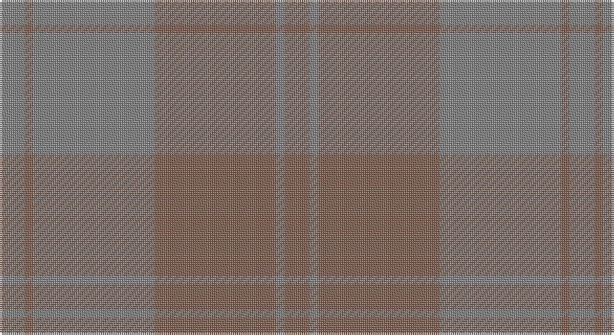

This page is one **sett** — a single exact thread-count. It belongs to the [tartan](/setts/o6y2o29y29o2y6/)
(the same proportion at any scale), whose colour order is pattern [GRGRGR](/stripes/grgrgr/).

Part of the [Harmony 12](/tartans/harmony-12/) tartan — the named design grouping this sett with its other cloths.

Sourced from weddslist.  It is a [6 stripe tartan](/stripes/stripes6/).

Original link http://www.weddslist.com/cgi-bin/tartans/pg.pl?source=sts

## Also known as

This cloth is also recorded under:

- Harmony 12 #2
- Harmony, 12

## Thread count
N/12 LT4 N58 LT58 N4 LT/12

One full sett is **272 threads**.

## Palette

Palette: <strong>Tartan Register</strong> <small style="color:#888">(1 of 2 colours)</small>
<table><thead><tr><th>Colour</th><th>Threads</th><th>Shade</th><th>Base</th><th>OKLCh</th></tr></thead><tbody><tr><td>N/</td><td style="text-align:right;font-variant-numeric:tabular-nums">12</td><td><code style="background-color:#808080;">#808080</code> <small style="color:#888">#808080</small></td><td>G <code style="background-color:#006100;">#006100</code></td><td><small style="color:#888">oklch(60.0% 0.000 89.9)</small></td></tr><tr><td>LT</td><td style="text-align:right;font-variant-numeric:tabular-nums">4</td><td><code style="background-color:#806050;">#806050</code> <small style="color:#888">#806050</small></td><td>R <code style="background-color:#CC0000;">#CC0000</code></td><td><small style="color:#888">oklch(51.7% 0.049 47.8)</small></td></tr><tr><td>N</td><td style="text-align:right;font-variant-numeric:tabular-nums">58</td><td><code style="background-color:#808080;">#808080</code> <small style="color:#888">#808080</small></td><td>G <code style="background-color:#006100;">#006100</code></td><td><small style="color:#888">oklch(60.0% 0.000 89.9)</small></td></tr><tr><td>LT</td><td style="text-align:right;font-variant-numeric:tabular-nums">58</td><td><code style="background-color:#806050;">#806050</code> <small style="color:#888">#806050</small></td><td>R <code style="background-color:#CC0000;">#CC0000</code></td><td><small style="color:#888">oklch(51.7% 0.049 47.8)</small></td></tr><tr><td>N</td><td style="text-align:right;font-variant-numeric:tabular-nums">4</td><td><code style="background-color:#808080;">#808080</code> <small style="color:#888">#808080</small></td><td>G <code style="background-color:#006100;">#006100</code></td><td><small style="color:#888">oklch(60.0% 0.000 89.9)</small></td></tr><tr><td>LT/</td><td style="text-align:right;font-variant-numeric:tabular-nums">12</td><td><code style="background-color:#806050;">#806050</code> <small style="color:#888">#806050</small></td><td>R <code style="background-color:#CC0000;">#CC0000</code></td><td><small style="color:#888">oklch(51.7% 0.049 47.8)</small></td></tr></tbody></table>

# Sample pattern

## Compared to the master

This cloth is one sett of its design; the master sett (the exemplar the design is anchored on) is below for comparison.

<figure style="margin:0"><figcaption style="color:#888;font-size:smaller">this sett</figcaption></figure>
<figure style="margin:0"><figcaption style="color:#888;font-size:smaller"><a href="/setts/db6g2db29g29db2g6/">master sett →</a></figcaption></figure>

## Nearest tartans

The nearest existing variants by ΔTartan distance, with this tartan at the top so the swatches line up against it.

ΔTartan

Tartan

Sett

—

<a href="/ttd/edit/#slug=o6y2o29y29o2y6~x2">Harmony, 12</a> <a class="nn-out" href="/variants/s6/o6y2o29y29o2y6~x2/" title="open its dictionary page">↗</a>

2.19

<a href="/ttd/edit/#slug=dy6dg2dy29dg29dy2dg6~x2&amp;base=o6y2o29y29o2y6~x2">Harmony 11 #2</a> <a class="nn-out" href="/variants/s6/dy6dg2dy29dg29dy2dg6~x2/" title="open its dictionary page">↗</a>

2.32

<a href="/ttd/edit/#slug=t10y1t1y10t18y5~x2&amp;base=o6y2o29y29o2y6~x2">Harmony 13</a> <a class="nn-out" href="/variants/s6/t10y1t1y10t18y5~x2/" title="open its dictionary page">↗</a>

2.62

<a href="/ttd/edit/#slug=dy2n4y12n3dy6t2n24dy2n2y2~x2&amp;base=o6y2o29y29o2y6~x2">Wicklow Irish County Tartan</a> <a class="nn-out" href="/variants/s10/dy2n4y12n3dy6t2n24dy2n2y2~x2/" title="open its dictionary page">↗</a>

2.68

<a href="/ttd/edit/#slug=lo5n2y8n1y8n4y4n6y18lr1lo5~x2&amp;base=o6y2o29y29o2y6~x2">Bute Heather, Ancient Wth'd (Fashion</a> <a class="nn-out" href="/variants/s11/lo5n2y8n1y8n4y4n6y18lr1lo5~x2/" title="open its dictionary page">↗</a>

2.70

<a href="/ttd/edit/#slug=oi12o6oi2ly1~x4&amp;base=o6y2o29y29o2y6~x2">Loch Garth</a> <a class="nn-out" href="/variants/s4/oi12o6oi2ly1~x4/" title="open its dictionary page">↗</a>

2.82

<a href="/ttd/edit/#slug=r3o8r3o20oi20o3oi8oi3~x2&amp;base=o6y2o29y29o2y6~x2">Miyuki, House Check Tan, 1004A</a> <a class="nn-out" href="/variants/s8/r3o8r3o20oi20o3oi8oi3~x2/" title="open its dictionary page">↗</a>

2.97

<a href="/ttd/edit/#slug=t48o28w4o28t48ly3~x2&amp;base=o6y2o29y29o2y6~x2">McKerrell of Hillhouse Dress</a> <a class="nn-out" href="/variants/s6/t48o28w4o28t48ly3~x2/" title="open its dictionary page">↗</a>

3.47

<a href="/ttd/edit/#slug=oi1o1oi1o1oi4o3lo1~x12&amp;base=o6y2o29y29o2y6~x2">Burns' Birthplace (Commem)</a> <a class="nn-out" href="/variants/s7/oi1o1oi1o1oi4o3lo1~x12/" title="open its dictionary page">↗</a>

3.51

<a href="/ttd/edit/#slug=y14n7lo6n2~x8&amp;base=o6y2o29y29o2y6~x2">Outlander #3</a> <a class="nn-out" href="/variants/s4/y14n7lo6n2~x8/" title="open its dictionary page">↗</a>

3.55

<a href="/ttd/edit/#slug=y34n27r3n27y34w3~x2&amp;base=o6y2o29y29o2y6~x2">London Regiment (Military)</a> <a class="nn-out" href="/variants/s6/y34n27r3n27y34w3~x2/" title="open its dictionary page">↗</a>

## Neighbour map

Every grey dot is one of 14360 variants placed by the first two principal components of the ΔTartan feature space (44% of its variance). Red is this tartan; blue dots are its nearest — click one to open its page.

<svg viewBox="0 0 640 380" role="img" style="max-width:100%;height:auto;border:1px solid #e0e0e0;border-radius:4px;display:block" xmlns="http://www.w3.org/2000/svg"><image href="/nn/cloud.v1.png" width="640" height="380"/><a href="/variants/s6/dy6dg2dy29dg29dy2dg6~x2/"><circle cx="622.7" cy="366.0" r="4" fill="#3465a4"><title>Harmony 11 #2</title></circle></a><a href="/variants/s6/t10y1t1y10t18y5~x2/"><circle cx="626.0" cy="366.0" r="4" fill="#3465a4"><title>Harmony 13</title></circle></a><a href="/variants/s10/dy2n4y12n3dy6t2n24dy2n2y2~x2/"><circle cx="552.4" cy="298.8" r="4" fill="#3465a4"><title>Wicklow Irish County Tartan</title></circle></a><a href="/variants/s11/lo5n2y8n1y8n4y4n6y18lr1lo5~x2/"><circle cx="560.0" cy="292.2" r="4" fill="#3465a4"><title>Bute Heather, Ancient Wth'd (Fashion</title></circle></a><a href="/variants/s4/oi12o6oi2ly1~x4/"><circle cx="620.0" cy="354.7" r="4" fill="#3465a4"><title>Loch Garth</title></circle></a><a href="/variants/s8/r3o8r3o20oi20o3oi8oi3~x2/"><circle cx="553.5" cy="366.0" r="4" fill="#3465a4"><title>Miyuki, House Check Tan, 1004A</title></circle></a><a href="/variants/s6/t48o28w4o28t48ly3~x2/"><circle cx="550.9" cy="328.9" r="4" fill="#3465a4"><title>McKerrell of Hillhouse Dress</title></circle></a><a href="/variants/s7/oi1o1oi1o1oi4o3lo1~x12/"><circle cx="513.5" cy="366.0" r="4" fill="#3465a4"><title>Burns' Birthplace (Commem)</title></circle></a><a href="/variants/s4/y14n7lo6n2~x8/"><circle cx="437.4" cy="366.0" r="4" fill="#3465a4"><title>Outlander #3</title></circle></a><a href="/variants/s6/y34n27r3n27y34w3~x2/"><circle cx="468.5" cy="328.4" r="4" fill="#3465a4"><title>London Regiment (Military)</title></circle></a><circle cx="626.0" cy="359.7" r="5" fill="#c00000"/></svg>

ID: /variants/s6/o6y2o29y29o2y6~x2/
