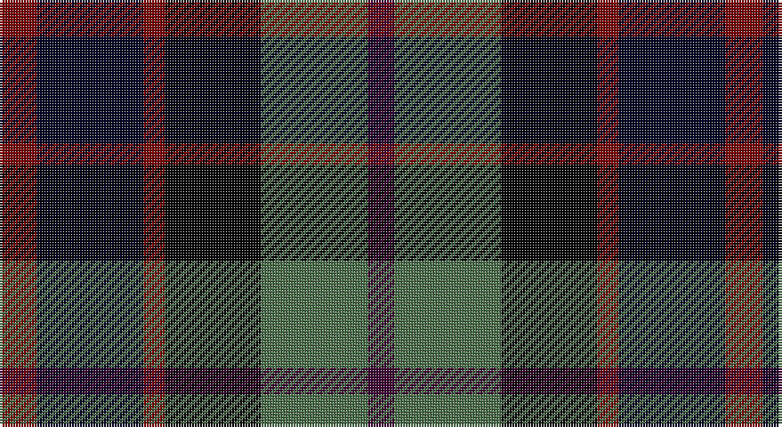

This page is one **sett** — a single exact thread-count. It belongs to the [tartan](/setts/o7ki20o4k18y20dp5/)
(the same proportion at any scale), whose colour order is pattern [BGKRKR](/stripes/bgkrkr/).

Part of the [Williamson](/tartans/williamson/) tartan — the named design grouping this sett with its other cloths.

Sourced from register-of-tartans.  It is a [6 stripe tartan](/stripes/stripes6/).

Original link https://www.tartanregister.gov.uk/tartanDetails.aspx?ref=4629

## Register references

External register numbers recorded for this tartan.

- Scottish Register of Tartans: [4629](https://www.tartanregister.gov.uk/tartanDetails.aspx?ref=4629)
- Scottish Tartans Authority (ITI): 4077

## Thread count
DR/14 Ka40 DR8 K36 G40 DP/10

One full sett is **272 threads**.

## Palette

Palette: <strong>Ingles Buchan</strong> <small style="color:#888">(1 of 5 colours)</small>
<table><thead><tr><th>Colour</th><th>Threads</th><th>Shade</th><th>Base</th><th>OKLCh</th></tr></thead><tbody><tr><td>DR/</td><td style="text-align:right;font-variant-numeric:tabular-nums">14</td><td><code style="background-color:#7A0002;">#7A0002</code> <small style="color:#888">#7A0002</small></td><td>R <code style="background-color:#CC0000;">#CC0000</code></td><td><small style="color:#888">oklch(36.4% 0.149 28.7)</small></td></tr><tr><td>Ka</td><td style="text-align:right;font-variant-numeric:tabular-nums">40</td><td><code style="background-color:#000024;">#000024</code> <small style="color:#888">#000024</small></td><td>K <code style="background-color:#000000;">#000000</code></td><td><small style="color:#888">oklch(11.8% 0.082 264.1)</small></td></tr><tr><td>DR</td><td style="text-align:right;font-variant-numeric:tabular-nums">8</td><td><code style="background-color:#7A0002;">#7A0002</code> <small style="color:#888">#7A0002</small></td><td>R <code style="background-color:#CC0000;">#CC0000</code></td><td><small style="color:#888">oklch(36.4% 0.149 28.7)</small></td></tr><tr><td>K</td><td style="text-align:right;font-variant-numeric:tabular-nums">36</td><td><code style="background-color:#000000;">#000000</code> <small style="color:#888">#000000</small></td><td>K <code style="background-color:#000000;">#000000</code></td><td><small style="color:#888">oklch(0.0% 0.000 0.0)</small></td></tr><tr><td>G</td><td style="text-align:right;font-variant-numeric:tabular-nums">40</td><td><code style="background-color:#4B6F4B;">#4B6F4B</code> <small style="color:#888">#4B6F4B</small></td><td>G <code style="background-color:#006100;">#006100</code></td><td><small style="color:#888">oklch(50.4% 0.070 144.5)</small></td></tr><tr><td>DP/</td><td style="text-align:right;font-variant-numeric:tabular-nums">10</td><td><code style="background-color:#3F0035;">#3F0035</code> <small style="color:#888">#3F0035</small></td><td>B <code style="background-color:#2A418A;">#2A418A</code></td><td><small style="color:#888">oklch(25.1% 0.111 336.3)</small></td></tr></tbody></table>

# Sample pattern

## Nearest tartans

The nearest existing variants by ΔTartan distance, with this tartan at the top so the swatches line up against it.

ΔTartan

Tartan

Sett

—

<a href="/ttd/edit/#slug=o7ki20o4k18y20dp5~x2">Williamson (Personal)</a> <a class="nn-out" href="/variants/s6/o7ki20o4k18y20dp5~x2/" title="open its dictionary page">↗</a>

1.22

<a href="/ttd/edit/#slug=dg3lb2k3dg8k8db8r2db3&amp;base=o7ki20o4k18y20dp5~x2">Davidson Double</a> <a class="nn-out" href="/variants/s8/dg3lb2k3dg8k8db8r2db3/" title="open its dictionary page">↗</a>

1.23

<a href="/ttd/edit/#slug=lr3db14k12dg12k2ly3~x2&amp;base=o7ki20o4k18y20dp5~x2">MacNiel of Barra</a> <a class="nn-out" href="/variants/s6/lr3db14k12dg12k2ly3~x2/" title="open its dictionary page">↗</a>

1.23

<a href="/ttd/edit/#slug=lr3db14k12dg12k2ly3&amp;base=o7ki20o4k18y20dp5~x2">MacNiel of Barra</a> <a class="nn-out" href="/variants/s6/lr3db14k12dg12k2ly3/" title="open its dictionary page">↗</a>

1.24

<a href="/ttd/edit/#slug=r2db8k8lr1dg8k1~x2&amp;base=o7ki20o4k18y20dp5~x2">Leslie Hunting</a> <a class="nn-out" href="/variants/s6/r2db8k8lr1dg8k1~x2/" title="open its dictionary page">↗</a>

1.24

<a href="/ttd/edit/#slug=r2db8k8lr1dg8k1&amp;base=o7ki20o4k18y20dp5~x2">Leslie Hunting</a> <a class="nn-out" href="/variants/s6/r2db8k8lr1dg8k1/" title="open its dictionary page">↗</a>

1.29

<a href="/ttd/edit/#slug=o8g4db16g4k14o14db4b3~x2&amp;base=o7ki20o4k18y20dp5~x2">Hinnigan (Personal)</a> <a class="nn-out" href="/variants/s8/o8g4db16g4k14o14db4b3~x2/" title="open its dictionary page">↗</a>

1.30

<a href="/ttd/edit/#slug=r1db6k3dg6lr1~x2&amp;base=o7ki20o4k18y20dp5~x2">Davidson of Tulloch</a> <a class="nn-out" href="/variants/s5/r1db6k3dg6lr1~x2/" title="open its dictionary page">↗</a>

1.31

<a href="/ttd/edit/#slug=r4dg15k15db15lb4~x2&amp;base=o7ki20o4k18y20dp5~x2">Dalmeny #1</a> <a class="nn-out" href="/variants/s5/r4dg15k15db15lb4~x2/" title="open its dictionary page">↗</a>

1.32

<a href="/ttd/edit/#slug=dp27db4k27g27lo4~x2&amp;base=o7ki20o4k18y20dp5~x2">Selkirk (Personal)</a> <a class="nn-out" href="/variants/s5/dp27db4k27g27lo4~x2/" title="open its dictionary page">↗</a>

1.33

<a href="/ttd/edit/#slug=r1dr7db7k7g7dr7r1~x4&amp;base=o7ki20o4k18y20dp5~x2">Tennant</a> <a class="nn-out" href="/variants/s7/r1dr7db7k7g7dr7r1~x4/" title="open its dictionary page">↗</a>

## Neighbour map

Every grey dot is one of 14360 variants placed by the first two principal components of the ΔTartan feature space (44% of its variance). Red is this tartan; blue dots are its nearest — click one to open its page.

<svg viewBox="0 0 640 380" role="img" style="max-width:100%;height:auto;border:1px solid #e0e0e0;border-radius:4px;display:block" xmlns="http://www.w3.org/2000/svg"><image href="/nn/cloud.v1.png" width="640" height="380"/><a href="/variants/s8/dg3lb2k3dg8k8db8r2db3/"><circle cx="66.4" cy="246.5" r="4" fill="#3465a4"><title>Davidson Double</title></circle></a><a href="/variants/s6/lr3db14k12dg12k2ly3~x2/"><circle cx="100.5" cy="229.9" r="4" fill="#3465a4"><title>MacNiel of Barra</title></circle></a><a href="/variants/s6/lr3db14k12dg12k2ly3/"><circle cx="100.5" cy="229.9" r="4" fill="#3465a4"><title>MacNiel of Barra</title></circle></a><a href="/variants/s6/r2db8k8lr1dg8k1~x2/"><circle cx="139.3" cy="227.9" r="4" fill="#3465a4"><title>Leslie Hunting</title></circle></a><a href="/variants/s6/r2db8k8lr1dg8k1/"><circle cx="139.3" cy="227.9" r="4" fill="#3465a4"><title>Leslie Hunting</title></circle></a><a href="/variants/s8/o8g4db16g4k14o14db4b3~x2/"><circle cx="84.4" cy="225.6" r="4" fill="#3465a4"><title>Hinnigan (Personal)</title></circle></a><a href="/variants/s5/r1db6k3dg6lr1~x2/"><circle cx="140.3" cy="250.6" r="4" fill="#3465a4"><title>Davidson of Tulloch</title></circle></a><a href="/variants/s5/r4dg15k15db15lb4~x2/"><circle cx="90.0" cy="287.7" r="4" fill="#3465a4"><title>Dalmeny #1</title></circle></a><a href="/variants/s5/dp27db4k27g27lo4~x2/"><circle cx="136.0" cy="244.5" r="4" fill="#3465a4"><title>Selkirk (Personal)</title></circle></a><a href="/variants/s7/r1dr7db7k7g7dr7r1~x4/"><circle cx="121.7" cy="238.9" r="4" fill="#3465a4"><title>Tennant</title></circle></a><circle cx="76.8" cy="252.6" r="5" fill="#c00000"/></svg>

ID: /variants/s6/o7ki20o4k18y20dp5~x2/
