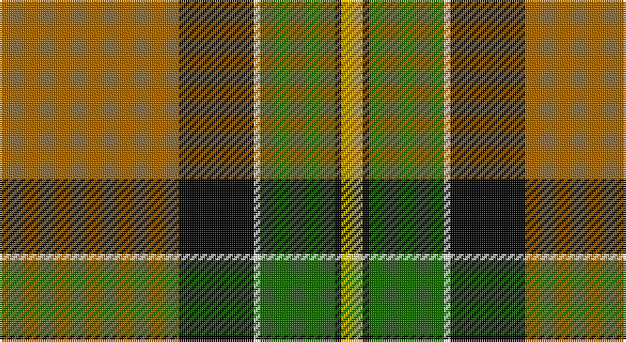

This page is one **sett** — a single exact thread-count. It belongs to the [tartan](/setts/o84k35w3g35k3ly10/)
(the same proportion at any scale), whose colour order is pattern [RKWGKY](/stripes/rkwgky/).

Part of the [Brandon](/tartans/brandon/) tartan — the named design grouping this sett with its other cloths.

Sourced from register-of-tartans.  It is a [6 stripe tartan](/stripes/stripes6/).

Original link https://www.tartanregister.gov.uk/tartanDetails.aspx?ref=339

## Register references

External register numbers recorded for this tartan.

- Scottish Register of Tartans: [339](https://www.tartanregister.gov.uk/tartanDetails.aspx?ref=339)
- Scottish Tartans Authority (ITI): 1884
- Scottish Tartans World Register: 1884

## Thread count
DO/84 K35 W3 G35 K3 Y/10

One full sett is **246 threads**.

## Palette

Palette: <strong>Tartan Register</strong> <small style="color:#888">(3 of 5 colours)</small>
<table><thead><tr><th>Colour</th><th>Threads</th><th>Shade</th><th>Base</th><th>OKLCh</th></tr></thead><tbody><tr><td>DO/</td><td style="text-align:right;font-variant-numeric:tabular-nums">84</td><td><code style="background-color:#A06400;">#A06400</code> <small style="color:#888">#A06400</small></td><td>R <code style="background-color:#CC0000;">#CC0000</code></td><td><small style="color:#888">oklch(55.6% 0.121 69.2)</small></td></tr><tr><td>K</td><td style="text-align:right;font-variant-numeric:tabular-nums">35</td><td><code style="background-color:#000000;">#000000</code> <small style="color:#888">#000000</small></td><td>K <code style="background-color:#000000;">#000000</code></td><td><small style="color:#888">oklch(0.0% 0.000 0.0)</small></td></tr><tr><td>W</td><td style="text-align:right;font-variant-numeric:tabular-nums">3</td><td><code style="background-color:#FFFFFF;">#FFFFFF</code> <small style="color:#888">#FFFFFF</small></td><td>W <code style="background-color:#F7F7F7;">#F7F7F7</code></td><td><small style="color:#888">oklch(100.0% 0.000 89.9)</small></td></tr><tr><td>G</td><td style="text-align:right;font-variant-numeric:tabular-nums">35</td><td><code style="background-color:#146400;">#146400</code> <small style="color:#888">#146400</small></td><td>G <code style="background-color:#006100;">#006100</code></td><td><small style="color:#888">oklch(43.9% 0.144 140.9)</small></td></tr><tr><td>K</td><td style="text-align:right;font-variant-numeric:tabular-nums">3</td><td><code style="background-color:#000000;">#000000</code> <small style="color:#888">#000000</small></td><td>K <code style="background-color:#000000;">#000000</code></td><td><small style="color:#888">oklch(0.0% 0.000 0.0)</small></td></tr><tr><td>Y/</td><td style="text-align:right;font-variant-numeric:tabular-nums">10</td><td><code style="background-color:#DCC000;">#DCC000</code> <small style="color:#888">#DCC000</small></td><td>Y <code style="background-color:#F2BF00;">#F2BF00</code></td><td><small style="color:#888">oklch(80.7% 0.167 98.6)</small></td></tr></tbody></table>

# Sample pattern

## Nearest tartans

The nearest existing variants by ΔTartan distance, with this tartan at the top so the swatches line up against it.

ΔTartan

Tartan

Sett

—

<a href="/ttd/edit/#slug=o84k35w3g35k3ly10">Brandon (Manitoba)</a> <a class="nn-out" href="/variants/s6/o84k35w3g35k3ly10/" title="open its dictionary page">↗</a>

0.09

<a href="/ttd/edit/#slug=o84k35lr3g35k3ly10&amp;base=o84k35w3g35k3ly10">Brandon (Manitoba) (District)</a> <a class="nn-out" href="/variants/s6/o84k35lr3g35k3ly10/" title="open its dictionary page">↗</a>

0.87

<a href="/ttd/edit/#slug=y83k35w3g35k3ly10&amp;base=o84k35w3g35k3ly10">Brandon, Manitoba</a> <a class="nn-out" href="/variants/s6/y83k35w3g35k3ly10/" title="open its dictionary page">↗</a>

1.33

<a href="/ttd/edit/#slug=dy30ly5t10k10w2k2~x2&amp;base=o84k35w3g35k3ly10">Bryan Wedding (Personal)</a> <a class="nn-out" href="/variants/s6/dy30ly5t10k10w2k2~x2/" title="open its dictionary page">↗</a>

1.36

<a href="/ttd/edit/#slug=k54lr6k6lr6o20lo40k6ly3&amp;base=o84k35w3g35k3ly10">Clyde Valley HOG</a> <a class="nn-out" href="/variants/s8/k54lr6k6lr6o20lo40k6ly3/" title="open its dictionary page">↗</a>

1.42

<a href="/ttd/edit/#slug=g3r16w4k6g28r1g3~x2&amp;base=o84k35w3g35k3ly10">Pollock</a> <a class="nn-out" href="/variants/s7/g3r16w4k6g28r1g3~x2/" title="open its dictionary page">↗</a>

1.42

<a href="/ttd/edit/#slug=ly4k1dg16k16r1w3~x2&amp;base=o84k35w3g35k3ly10">MacLamroc</a> <a class="nn-out" href="/variants/s6/ly4k1dg16k16r1w3~x2/" title="open its dictionary page">↗</a>

1.43

<a href="/ttd/edit/#slug=k6r2g17r16k1t2~x2&amp;base=o84k35w3g35k3ly10">Unidentified 12</a> <a class="nn-out" href="/variants/s6/k6r2g17r16k1t2~x2/" title="open its dictionary page">↗</a>

1.45

<a href="/ttd/edit/#slug=lo16k7w1g7k1ly3~x4&amp;base=o84k35w3g35k3ly10">Hamilton of Brandon (Fashion)</a> <a class="nn-out" href="/variants/s6/lo16k7w1g7k1ly3~x4/" title="open its dictionary page">↗</a>

1.50

<a href="/ttd/edit/#slug=k3g2k21w11g1y21g2y3~x2&amp;base=o84k35w3g35k3ly10">Dalveen (Fashion)</a> <a class="nn-out" href="/variants/s8/k3g2k21w11g1y21g2y3~x2/" title="open its dictionary page">↗</a>

1.61

<a href="/ttd/edit/#slug=r10w2k10w10dy35k5~x2&amp;base=o84k35w3g35k3ly10">Loch Ness</a> <a class="nn-out" href="/variants/s6/r10w2k10w10dy35k5~x2/" title="open its dictionary page">↗</a>

## Neighbour map

Every grey dot is one of 14360 variants placed by the first two principal components of the ΔTartan feature space (44% of its variance). Red is this tartan; blue dots are its nearest — click one to open its page.

<svg viewBox="0 0 640 380" role="img" style="max-width:100%;height:auto;border:1px solid #e0e0e0;border-radius:4px;display:block" xmlns="http://www.w3.org/2000/svg"><image href="/nn/cloud.v1.png" width="640" height="380"/><a href="/variants/s6/o84k35lr3g35k3ly10/"><circle cx="262.5" cy="133.6" r="4" fill="#3465a4"><title>Brandon (Manitoba) (District)</title></circle></a><a href="/variants/s6/y83k35w3g35k3ly10/"><circle cx="249.1" cy="134.0" r="4" fill="#3465a4"><title>Brandon, Manitoba</title></circle></a><a href="/variants/s6/dy30ly5t10k10w2k2~x2/"><circle cx="251.9" cy="162.2" r="4" fill="#3465a4"><title>Bryan Wedding (Personal)</title></circle></a><a href="/variants/s8/k54lr6k6lr6o20lo40k6ly3/"><circle cx="228.4" cy="132.1" r="4" fill="#3465a4"><title>Clyde Valley HOG</title></circle></a><a href="/variants/s7/g3r16w4k6g28r1g3~x2/"><circle cx="321.3" cy="141.9" r="4" fill="#3465a4"><title>Pollock</title></circle></a><a href="/variants/s6/ly4k1dg16k16r1w3~x2/"><circle cx="212.3" cy="163.5" r="4" fill="#3465a4"><title>MacLamroc</title></circle></a><a href="/variants/s6/k6r2g17r16k1t2~x2/"><circle cx="234.6" cy="171.3" r="4" fill="#3465a4"><title>Unidentified 12</title></circle></a><a href="/variants/s6/lo16k7w1g7k1ly3~x4/"><circle cx="215.3" cy="163.5" r="4" fill="#3465a4"><title>Hamilton of Brandon (Fashion)</title></circle></a><a href="/variants/s8/k3g2k21w11g1y21g2y3~x2/"><circle cx="197.7" cy="131.4" r="4" fill="#3465a4"><title>Dalveen (Fashion)</title></circle></a><a href="/variants/s6/r10w2k10w10dy35k5~x2/"><circle cx="252.3" cy="170.0" r="4" fill="#3465a4"><title>Loch Ness</title></circle></a><circle cx="259.9" cy="132.2" r="5" fill="#c00000"/></svg>

ID: /variants/s6/o84k35w3g35k3ly10/
