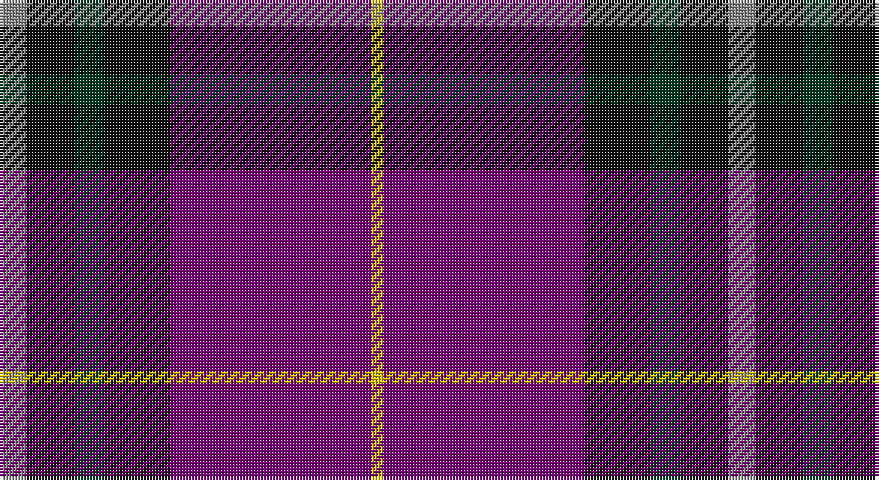

This page is one **sett** — a single exact thread-count. It belongs to the [tartan](/setts/o9k16dg10k22dp67ly4/)
(the same proportion at any scale), whose colour order is pattern [RKGKBY](/stripes/rkgkby/).

Part of the [Widows Sons Scotland](/tartans/widows-sons-scotland/) tartan — the named design grouping this sett with its other cloths.

Sourced from tartans-authority.  It is a [6 stripe tartan](/stripes/stripes6/).

Original link http://www.tartansauthority.com/tartan-ferret/display/10965/

## Register references

External register numbers recorded for this tartan.

- Scottish Register of Tartans: [10965](https://www.tartanregister.gov.uk/tartanDetails?ref=10965)
- Scottish Tartans Authority (ITI): 10965

## Thread count
N/9 K16 DG10 K22 P67 Y/4

One full sett is **243 threads**.

## Palette

Palette: <strong>Tartan Register</strong>
<table><thead><tr><th>Colour</th><th>Threads</th><th>Shade</th><th>Base</th><th>OKLCh</th></tr></thead><tbody><tr><td>N/</td><td style="text-align:right;font-variant-numeric:tabular-nums">9</td><td><code style="background-color:#888888;">#888888</code> <small style="color:#888">#888888</small></td><td>R <code style="background-color:#CC0000;">#CC0000</code></td><td><small style="color:#888">oklch(62.7% 0.000 89.9)</small></td></tr><tr><td>K</td><td style="text-align:right;font-variant-numeric:tabular-nums">16</td><td><code style="background-color:#101010;">#101010</code> <small style="color:#888">#101010</small></td><td>K <code style="background-color:#000000;">#000000</code></td><td><small style="color:#888">oklch(17.3% 0.000 89.9)</small></td></tr><tr><td>DG</td><td style="text-align:right;font-variant-numeric:tabular-nums">10</td><td><code style="background-color:#003820;">#003820</code> <small style="color:#888">#003820</small></td><td>G <code style="background-color:#006100;">#006100</code></td><td><small style="color:#888">oklch(30.0% 0.070 158.3)</small></td></tr><tr><td>K</td><td style="text-align:right;font-variant-numeric:tabular-nums">22</td><td><code style="background-color:#101010;">#101010</code> <small style="color:#888">#101010</small></td><td>K <code style="background-color:#000000;">#000000</code></td><td><small style="color:#888">oklch(17.3% 0.000 89.9)</small></td></tr><tr><td>P</td><td style="text-align:right;font-variant-numeric:tabular-nums">67</td><td><code style="background-color:#780078;">#780078</code> <small style="color:#888">#780078</small></td><td>B <code style="background-color:#2A418A;">#2A418A</code></td><td><small style="color:#888">oklch(40.2% 0.185 328.4)</small></td></tr><tr><td>Y/</td><td style="text-align:right;font-variant-numeric:tabular-nums">4</td><td><code style="background-color:#E8C000;">#E8C000</code> <small style="color:#888">#E8C000</small></td><td>Y <code style="background-color:#F2BF00;">#F2BF00</code></td><td><small style="color:#888">oklch(81.9% 0.168 93.7)</small></td></tr></tbody></table>

# Sample pattern

## Compared to the master

This cloth is one sett of its design; the master sett (the exemplar the design is anchored on) is below for comparison.

<figure style="margin:0"><figcaption style="color:#888;font-size:smaller">this sett</figcaption></figure>
<figure style="margin:0"><figcaption style="color:#888;font-size:smaller"><a href="/setts/lb9k16dg10k22dp67lo4/">master sett →</a></figcaption></figure>

## Nearest tartans

The nearest existing variants by ΔTartan distance, with this tartan at the top so the swatches line up against it.

ΔTartan

Tartan

Sett

—

<a href="/ttd/edit/#slug=o9k16dg10k22dp67ly4">Widows Sons Scotland (MRA)</a> <a class="nn-out" href="/variants/s6/o9k16dg10k22dp67ly4/" title="open its dictionary page">↗</a>

0.90

<a href="/ttd/edit/#slug=lb9k16dg10k22dp67lo4&amp;base=o9k16dg10k22dp67ly4">Widows Sons Scotland (MRA)</a> <a class="nn-out" href="/variants/s6/lb9k16dg10k22dp67lo4/" title="open its dictionary page">↗</a>

1.06

<a href="/ttd/edit/#slug=lb12dg16k12dg24dp75lo4&amp;base=o9k16dg10k22dp67ly4">Widows Sons Scotland Dress</a> <a class="nn-out" href="/variants/s6/lb12dg16k12dg24dp75lo4/" title="open its dictionary page">↗</a>

1.14

<a href="/ttd/edit/#slug=lb12g12k12g24dp75ly4&amp;base=o9k16dg10k22dp67ly4">Widows Sons Scotland Dress</a> <a class="nn-out" href="/variants/s6/lb12g12k12g24dp75ly4/" title="open its dictionary page">↗</a>

1.14

<a href="/ttd/edit/#slug=k2m1db17m17dt1ly2~x4&amp;base=o9k16dg10k22dp67ly4">Murdoch</a> <a class="nn-out" href="/variants/s6/k2m1db17m17dt1ly2~x4/" title="open its dictionary page">↗</a>

1.20

<a href="/ttd/edit/#slug=r30db5r3db33g8k3db8w2~x2&amp;base=o9k16dg10k22dp67ly4">St. Margaret Youth Group (Corporate)</a> <a class="nn-out" href="/variants/s8/r30db5r3db33g8k3db8w2~x2/" title="open its dictionary page">↗</a>

1.24

<a href="/ttd/edit/#slug=k1r7k1r7db16g1~x4&amp;base=o9k16dg10k22dp67ly4">Robinson Dress (Pendleton) #1</a> <a class="nn-out" href="/variants/s6/k1r7k1r7db16g1~x4/" title="open its dictionary page">↗</a>

1.27

<a href="/ttd/edit/#slug=r14lr6db38k3g2~x2&amp;base=o9k16dg10k22dp67ly4">Doten (2013)</a> <a class="nn-out" href="/variants/s5/r14lr6db38k3g2~x2/" title="open its dictionary page">↗</a>

1.27

<a href="/ttd/edit/#slug=ri28r1db18ly2g1db18~x2&amp;base=o9k16dg10k22dp67ly4">European Judo Union</a> <a class="nn-out" href="/variants/s6/ri28r1db18ly2g1db18~x2/" title="open its dictionary page">↗</a>

1.29

<a href="/ttd/edit/#slug=r10db4r6db30k10db5w2~x2&amp;base=o9k16dg10k22dp67ly4">Heritage of Wales (Fashion)</a> <a class="nn-out" href="/variants/s7/r10db4r6db30k10db5w2~x2/" title="open its dictionary page">↗</a>

1.32

<a href="/ttd/edit/#slug=r16db2o6r3k4t2db40t6~x2&amp;base=o9k16dg10k22dp67ly4">St. Leonards (Corporate)</a> <a class="nn-out" href="/variants/s8/r16db2o6r3k4t2db40t6~x2/" title="open its dictionary page">↗</a>

## Neighbour map

Every grey dot is one of 14360 variants placed by the first two principal components of the ΔTartan feature space (44% of its variance). Red is this tartan; blue dots are its nearest — click one to open its page.

<svg viewBox="0 0 640 380" role="img" style="max-width:100%;height:auto;border:1px solid #e0e0e0;border-radius:4px;display:block" xmlns="http://www.w3.org/2000/svg"><image href="/nn/cloud.v1.png" width="640" height="380"/><a href="/variants/s6/lb9k16dg10k22dp67lo4/"><circle cx="292.1" cy="166.9" r="4" fill="#3465a4"><title>Widows Sons Scotland (MRA)</title></circle></a><a href="/variants/s6/lb12dg16k12dg24dp75lo4/"><circle cx="291.7" cy="162.4" r="4" fill="#3465a4"><title>Widows Sons Scotland Dress</title></circle></a><a href="/variants/s6/lb12g12k12g24dp75ly4/"><circle cx="297.8" cy="150.4" r="4" fill="#3465a4"><title>Widows Sons Scotland Dress</title></circle></a><a href="/variants/s6/k2m1db17m17dt1ly2~x4/"><circle cx="313.9" cy="172.4" r="4" fill="#3465a4"><title>Murdoch</title></circle></a><a href="/variants/s8/r30db5r3db33g8k3db8w2~x2/"><circle cx="321.4" cy="171.0" r="4" fill="#3465a4"><title>St. Margaret Youth Group (Corporate)</title></circle></a><a href="/variants/s6/k1r7k1r7db16g1~x4/"><circle cx="328.3" cy="182.9" r="4" fill="#3465a4"><title>Robinson Dress (Pendleton) #1</title></circle></a><a href="/variants/s5/r14lr6db38k3g2~x2/"><circle cx="347.5" cy="163.9" r="4" fill="#3465a4"><title>Doten (2013)</title></circle></a><a href="/variants/s6/ri28r1db18ly2g1db18~x2/"><circle cx="364.3" cy="160.9" r="4" fill="#3465a4"><title>European Judo Union</title></circle></a><a href="/variants/s7/r10db4r6db30k10db5w2~x2/"><circle cx="339.5" cy="188.0" r="4" fill="#3465a4"><title>Heritage of Wales (Fashion)</title></circle></a><a href="/variants/s8/r16db2o6r3k4t2db40t6~x2/"><circle cx="318.2" cy="137.0" r="4" fill="#3465a4"><title>St. Leonards (Corporate)</title></circle></a><circle cx="308.9" cy="169.4" r="5" fill="#c00000"/></svg>

ID: /variants/s6/o9k16dg10k22dp67ly4/
