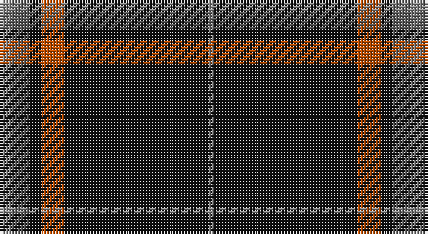

This page is one **sett** — a single exact thread-count. It belongs to the [tartan](/setts/oi4n6k4o8k49oi2/)
(the same proportion at any scale), whose colour order is pattern [RBKRKR](/stripes/rbkrkr/).

Part of the [Harley Davidson](/tartans/harley-davidson/) tartan — the named design grouping this sett with its other cloths.

Sourced from tartans-authority.  It is a [6 stripe tartan](/stripes/stripes6/).

Original link http://www.tartansauthority.com/tartan-ferret/display/5816/

## Register references

External register numbers recorded for this tartan.

- Scottish Tartans Authority (ITI): 5816

## Thread count
Na/4 N6 K4 DO8 K49 Na/2

One full sett is **140 threads**.

## Palette

Palette: <strong>Tartan Register</strong> <small style="color:#888">(2 of 4 colours)</small>
<table><thead><tr><th>Colour</th><th>Threads</th><th>Shade</th><th>Base</th><th>OKLCh</th></tr></thead><tbody><tr><td>Na/</td><td style="text-align:right;font-variant-numeric:tabular-nums">4</td><td><code style="background-color:#888888;">#888888</code> <small style="color:#888">#888888</small></td><td>R <code style="background-color:#CC0000;">#CC0000</code></td><td><small style="color:#888">oklch(62.7% 0.000 89.9)</small></td></tr><tr><td>N</td><td style="text-align:right;font-variant-numeric:tabular-nums">6</td><td><code style="background-color:#5C5C5C;">#5C5C5C</code> <small style="color:#888">#5C5C5C</small></td><td>B <code style="background-color:#2A418A;">#2A418A</code></td><td><small style="color:#888">oklch(47.5% 0.000 89.9)</small></td></tr><tr><td>K</td><td style="text-align:right;font-variant-numeric:tabular-nums">4</td><td><code style="background-color:#101010;">#101010</code> <small style="color:#888">#101010</small></td><td>K <code style="background-color:#000000;">#000000</code></td><td><small style="color:#888">oklch(17.3% 0.000 89.9)</small></td></tr><tr><td>DO</td><td style="text-align:right;font-variant-numeric:tabular-nums">8</td><td><code style="background-color:#B84C00;">#B84C00</code> <small style="color:#888">#B84C00</small></td><td>R <code style="background-color:#CC0000;">#CC0000</code></td><td><small style="color:#888">oklch(55.1% 0.156 45.5)</small></td></tr><tr><td>K</td><td style="text-align:right;font-variant-numeric:tabular-nums">49</td><td><code style="background-color:#101010;">#101010</code> <small style="color:#888">#101010</small></td><td>K <code style="background-color:#000000;">#000000</code></td><td><small style="color:#888">oklch(17.3% 0.000 89.9)</small></td></tr><tr><td>Na/</td><td style="text-align:right;font-variant-numeric:tabular-nums">2</td><td><code style="background-color:#888888;">#888888</code> <small style="color:#888">#888888</small></td><td>R <code style="background-color:#CC0000;">#CC0000</code></td><td><small style="color:#888">oklch(62.7% 0.000 89.9)</small></td></tr></tbody></table>

# Sample pattern

## Compared to the master

This cloth is one sett of its design; the master sett (the exemplar the design is anchored on) is below for comparison.

<figure style="margin:0"><figcaption style="color:#888;font-size:smaller">this sett</figcaption></figure>
<figure style="margin:0"><figcaption style="color:#888;font-size:smaller"><a href="/setts/k49o8k4n6oi4n6k4o8k49oi2/">master sett →</a></figcaption></figure>

## Nearest tartans

The nearest existing variants by ΔTartan distance, with this tartan at the top so the swatches line up against it.

ΔTartan

Tartan

Sett

—

<a href="/ttd/edit/#slug=oi4n6k4o8k49oi2">Harley Davidson (Corporate)</a> <a class="nn-out" href="/variants/s6/oi4n6k4o8k49oi2/" title="open its dictionary page">↗</a>

0.88

<a href="/ttd/edit/#slug=k42t2r3k5r16k8ly2k3~x2&amp;base=oi4n6k4o8k49oi2">Highland Brewing Company</a> <a class="nn-out" href="/variants/s8/k42t2r3k5r16k8ly2k3~x2/" title="open its dictionary page">↗</a>

1.15

<a href="/ttd/edit/#slug=k65r27w2k4ly5~x2&amp;base=oi4n6k4o8k49oi2">Perry Dress (Personal)</a> <a class="nn-out" href="/variants/s5/k65r27w2k4ly5~x2/" title="open its dictionary page">↗</a>

1.20

<a href="/ttd/edit/#slug=k49o8k4n6oi4n6k4o8k49oi2&amp;base=oi4n6k4o8k49oi2">Harley Davidson</a> <a class="nn-out" href="/variants/s10/k49o8k4n6oi4n6k4o8k49oi2/" title="open its dictionary page">↗</a>

1.24

<a href="/ttd/edit/#slug=k10n2k2n8k40r4k5ri2~x2&amp;base=oi4n6k4o8k49oi2">Laird Abdullah (Personal)</a> <a class="nn-out" href="/variants/s8/k10n2k2n8k40r4k5ri2~x2/" title="open its dictionary page">↗</a>

1.27

<a href="/ttd/edit/#slug=db8r1k6r1lo8r1k45lo1~x2&amp;base=oi4n6k4o8k49oi2">degli Uberti, Baron of Cartsburn (Personal)</a> <a class="nn-out" href="/variants/s8/db8r1k6r1lo8r1k45lo1~x2/" title="open its dictionary page">↗</a>

1.29

<a href="/ttd/edit/#slug=r3n12k50ly3~x2&amp;base=oi4n6k4o8k49oi2">Rogues (United States), The</a> <a class="nn-out" href="/variants/s4/r3n12k50ly3~x2/" title="open its dictionary page">↗</a>

1.36

<a href="/ttd/edit/#slug=k75g26lr2g4lo5~x2&amp;base=oi4n6k4o8k49oi2">Perry Hunting (Green) (Personal)</a> <a class="nn-out" href="/variants/s5/k75g26lr2g4lo5~x2/" title="open its dictionary page">↗</a>

1.37

<a href="/ttd/edit/#slug=k50db6r6o6w3~x2&amp;base=oi4n6k4o8k49oi2">Friends of Nordegg (Corporate)</a> <a class="nn-out" href="/variants/s5/k50db6r6o6w3~x2/" title="open its dictionary page">↗</a>

1.37

<a href="/ttd/edit/#slug=k75y26y3k4ly6~x2&amp;base=oi4n6k4o8k49oi2">Perry Ancient (Personal)</a> <a class="nn-out" href="/variants/s5/k75y26y3k4ly6~x2/" title="open its dictionary page">↗</a>

1.39

<a href="/ttd/edit/#slug=k80r6dg3r12k2w2~x2&amp;base=oi4n6k4o8k49oi2">Dellen</a> <a class="nn-out" href="/variants/s6/k80r6dg3r12k2w2~x2/" title="open its dictionary page">↗</a>

## Neighbour map

Every grey dot is one of 14360 variants placed by the first two principal components of the ΔTartan feature space (44% of its variance). Red is this tartan; blue dots are its nearest — click one to open its page.

<svg viewBox="0 0 640 380" role="img" style="max-width:100%;height:auto;border:1px solid #e0e0e0;border-radius:4px;display:block" xmlns="http://www.w3.org/2000/svg"><image href="/nn/cloud.v1.png" width="640" height="380"/><a href="/variants/s8/k42t2r3k5r16k8ly2k3~x2/"><circle cx="480.6" cy="162.1" r="4" fill="#3465a4"><title>Highland Brewing Company</title></circle></a><a href="/variants/s5/k65r27w2k4ly5~x2/"><circle cx="456.4" cy="164.7" r="4" fill="#3465a4"><title>Perry Dress (Personal)</title></circle></a><a href="/variants/s10/k49o8k4n6oi4n6k4o8k49oi2/"><circle cx="507.3" cy="155.0" r="4" fill="#3465a4"><title>Harley Davidson</title></circle></a><a href="/variants/s8/k10n2k2n8k40r4k5ri2~x2/"><circle cx="537.7" cy="174.3" r="4" fill="#3465a4"><title>Laird Abdullah (Personal)</title></circle></a><a href="/variants/s8/db8r1k6r1lo8r1k45lo1~x2/"><circle cx="498.9" cy="118.5" r="4" fill="#3465a4"><title>degli Uberti, Baron of Cartsburn (Personal)</title></circle></a><a href="/variants/s4/r3n12k50ly3~x2/"><circle cx="465.1" cy="201.0" r="4" fill="#3465a4"><title>Rogues (United States), The</title></circle></a><a href="/variants/s5/k75g26lr2g4lo5~x2/"><circle cx="465.7" cy="167.0" r="4" fill="#3465a4"><title>Perry Hunting (Green) (Personal)</title></circle></a><a href="/variants/s5/k50db6r6o6w3~x2/"><circle cx="418.0" cy="165.3" r="4" fill="#3465a4"><title>Friends of Nordegg (Corporate)</title></circle></a><a href="/variants/s5/k75y26y3k4ly6~x2/"><circle cx="462.0" cy="183.0" r="4" fill="#3465a4"><title>Perry Ancient (Personal)</title></circle></a><a href="/variants/s6/k80r6dg3r12k2w2~x2/"><circle cx="581.8" cy="141.7" r="4" fill="#3465a4"><title>Dellen</title></circle></a><circle cx="488.8" cy="164.8" r="5" fill="#c00000"/></svg>

ID: /variants/s6/oi4n6k4o8k49oi2/
