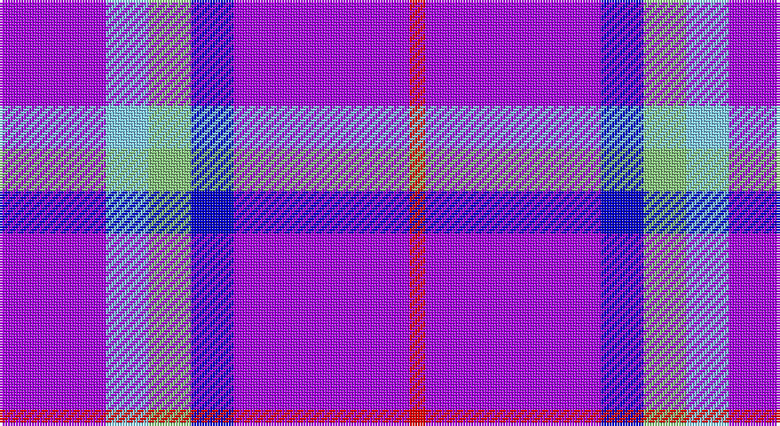

This page is one **sett** — a single exact thread-count. It belongs to the [tartan](/setts/p20lt8lg8db8p33r3/)
(the same proportion at any scale), whose colour order is pattern [BWYBBR](/stripes/bwybbr/).

Sourced from register-of-tartans.  It is a [6 stripe tartan](/stripes/stripes6/).

Original link https://www.tartanregister.gov.uk/tartanDetails.aspx?ref=10215

## Register references

External register numbers recorded for this tartan.

- Scottish Register of Tartans: [10215](https://www.tartanregister.gov.uk/tartanDetails.aspx?ref=10215)

## Thread count
P/40 LB16 LG16 B16 P66 R/6

One full sett is **274 threads**.

## Palette

Palette: <strong>Tartan Register</strong>
<table><thead><tr><th>Colour</th><th>Threads</th><th>Shade</th><th>Base</th><th>OKLCh</th></tr></thead><tbody><tr><td>P/</td><td style="text-align:right;font-variant-numeric:tabular-nums">40</td><td><code style="background-color:#AA00FF;">#AA00FF</code> <small style="color:#888">#AA00FF</small></td><td>B <code style="background-color:#2A418A;">#2A418A</code></td><td><small style="color:#888">oklch(58.1% 0.299 307.0)</small></td></tr><tr><td>LB</td><td style="text-align:right;font-variant-numeric:tabular-nums">16</td><td><code style="background-color:#82CFFD;">#82CFFD</code> <small style="color:#888">#82CFFD</small></td><td>W <code style="background-color:#F7F7F7;">#F7F7F7</code></td><td><small style="color:#888">oklch(82.2% 0.100 236.0)</small></td></tr><tr><td>LG</td><td style="text-align:right;font-variant-numeric:tabular-nums">16</td><td><code style="background-color:#86C67C;">#86C67C</code> <small style="color:#888">#86C67C</small></td><td>Y <code style="background-color:#F2BF00;">#F2BF00</code></td><td><small style="color:#888">oklch(76.5% 0.122 141.1)</small></td></tr><tr><td>B</td><td style="text-align:right;font-variant-numeric:tabular-nums">16</td><td><code style="background-color:#0000CD;">#0000CD</code> <small style="color:#888">#0000CD</small></td><td>B <code style="background-color:#2A418A;">#2A418A</code></td><td><small style="color:#888">oklch(38.3% 0.266 264.1)</small></td></tr><tr><td>P</td><td style="text-align:right;font-variant-numeric:tabular-nums">66</td><td><code style="background-color:#AA00FF;">#AA00FF</code> <small style="color:#888">#AA00FF</small></td><td>B <code style="background-color:#2A418A;">#2A418A</code></td><td><small style="color:#888">oklch(58.1% 0.299 307.0)</small></td></tr><tr><td>R/</td><td style="text-align:right;font-variant-numeric:tabular-nums">6</td><td><code style="background-color:#FF0000;">#FF0000</code> <small style="color:#888">#FF0000</small></td><td>R <code style="background-color:#CC0000;">#CC0000</code></td><td><small style="color:#888">oklch(62.8% 0.258 29.2)</small></td></tr></tbody></table>

# Sample pattern

## Nearest tartans

The nearest existing variants by ΔTartan distance, with this tartan at the top so the swatches line up against it.

ΔTartan

Tartan

Sett

—

<a href="/ttd/edit/#slug=p20lt8lg8db8p33r3~x2">McIntosh, Stuart (Personal)</a> <a class="nn-out" href="/variants/s6/p20lt8lg8db8p33r3~x2/" title="open its dictionary page">↗</a>

2.43

<a href="/ttd/edit/#slug=b8w4b50k12b4k15r5~x2&amp;base=p20lt8lg8db8p33r3~x2">Instakilt, Blue (Fashion)</a> <a class="nn-out" href="/variants/s7/b8w4b50k12b4k15r5~x2/" title="open its dictionary page">↗</a>

2.45

<a href="/ttd/edit/#slug=p12k4p5k4p32lb5p5k10p5lbi5p5lbi18w4&amp;base=p20lt8lg8db8p33r3~x2">Life Goes on Foundation</a> <a class="nn-out" href="/variants/s13/p12k4p5k4p32lb5p5k10p5lbi5p5lbi18w4/" title="open its dictionary page">↗</a>

2.59

<a href="/ttd/edit/#slug=r28k2b36k2w4k2b7~x2&amp;base=p20lt8lg8db8p33r3~x2">Presbyterian College Band (Corp)</a> <a class="nn-out" href="/variants/s7/r28k2b36k2w4k2b7~x2/" title="open its dictionary page">↗</a>

2.88

<a href="/ttd/edit/#slug=dp30m5dp5t4dp4g12~x2&amp;base=p20lt8lg8db8p33r3~x2">International Festival of Authors</a> <a class="nn-out" href="/variants/s6/dp30m5dp5t4dp4g12~x2/" title="open its dictionary page">↗</a>

2.88

<a href="/ttd/edit/#slug=dp24k4lb10db3dp3w2~x2&amp;base=p20lt8lg8db8p33r3~x2">Cramer (Personal)</a> <a class="nn-out" href="/variants/s6/dp24k4lb10db3dp3w2~x2/" title="open its dictionary page">↗</a>

2.89

<a href="/ttd/edit/#slug=r14w6db38k3g2~x2&amp;base=p20lt8lg8db8p33r3~x2">Doten (2013)</a> <a class="nn-out" href="/variants/s5/r14w6db38k3g2~x2/" title="open its dictionary page">↗</a>

2.89

<a href="/ttd/edit/#slug=p46k6g9ly9r4&amp;base=p20lt8lg8db8p33r3~x2">Ayllu Thuban</a> <a class="nn-out" href="/variants/s5/p46k6g9ly9r4/" title="open its dictionary page">↗</a>

2.90

<a href="/ttd/edit/#slug=dp15w2k3dp30k4o3dp15w6~x2&amp;base=p20lt8lg8db8p33r3~x2">Stephen F Austin State University</a> <a class="nn-out" href="/variants/s8/dp15w2k3dp30k4o3dp15w6~x2/" title="open its dictionary page">↗</a>

2.93

<a href="/ttd/edit/#slug=p9lb1g2lb1db4r1~x12&amp;base=p20lt8lg8db8p33r3~x2">McIntosh, Georgina (Personal)</a> <a class="nn-out" href="/variants/s6/p9lb1g2lb1db4r1~x12/" title="open its dictionary page">↗</a>

2.94

<a href="/ttd/edit/#slug=b130k9b21ly8b21w8b35r70&amp;base=p20lt8lg8db8p33r3~x2">Maud, Mary</a> <a class="nn-out" href="/variants/s8/b130k9b21ly8b21w8b35r70/" title="open its dictionary page">↗</a>

## Neighbour map

Every grey dot is one of 14360 variants placed by the first two principal components of the ΔTartan feature space (44% of its variance). Red is this tartan; blue dots are its nearest — click one to open its page.

<svg viewBox="0 0 640 380" role="img" style="max-width:100%;height:auto;border:1px solid #e0e0e0;border-radius:4px;display:block" xmlns="http://www.w3.org/2000/svg"><image href="/nn/cloud.v1.png" width="640" height="380"/><a href="/variants/s7/b8w4b50k12b4k15r5~x2/"><circle cx="350.9" cy="170.7" r="4" fill="#3465a4"><title>Instakilt, Blue (Fashion)</title></circle></a><a href="/variants/s13/p12k4p5k4p32lb5p5k10p5lbi5p5lbi18w4/"><circle cx="227.3" cy="140.9" r="4" fill="#3465a4"><title>Life Goes on Foundation</title></circle></a><a href="/variants/s7/r28k2b36k2w4k2b7~x2/"><circle cx="327.3" cy="151.8" r="4" fill="#3465a4"><title>Presbyterian College Band (Corp)</title></circle></a><a href="/variants/s6/dp30m5dp5t4dp4g12~x2/"><circle cx="348.3" cy="211.4" r="4" fill="#3465a4"><title>International Festival of Authors</title></circle></a><a href="/variants/s6/dp24k4lb10db3dp3w2~x2/"><circle cx="298.1" cy="156.8" r="4" fill="#3465a4"><title>Cramer (Personal)</title></circle></a><a href="/variants/s5/r14w6db38k3g2~x2/"><circle cx="309.6" cy="148.5" r="4" fill="#3465a4"><title>Doten (2013)</title></circle></a><a href="/variants/s5/p46k6g9ly9r4/"><circle cx="308.7" cy="157.9" r="4" fill="#3465a4"><title>Ayllu Thuban</title></circle></a><a href="/variants/s8/dp15w2k3dp30k4o3dp15w6~x2/"><circle cx="450.7" cy="172.9" r="4" fill="#3465a4"><title>Stephen F Austin State University</title></circle></a><a href="/variants/s6/p9lb1g2lb1db4r1~x12/"><circle cx="248.3" cy="187.2" r="4" fill="#3465a4"><title>McIntosh, Georgina (Personal)</title></circle></a><a href="/variants/s8/b130k9b21ly8b21w8b35r70/"><circle cx="386.2" cy="148.9" r="4" fill="#3465a4"><title>Maud, Mary</title></circle></a><circle cx="334.4" cy="184.4" r="5" fill="#c00000"/></svg>

ID: /variants/s6/p20lt8lg8db8p33r3~x2/
