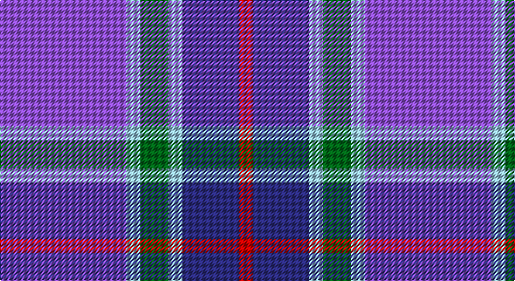

This page is one **sett** — a single exact thread-count. It belongs to the [tartan](/setts/p9lb1g2lb1db4r1/)
(the same proportion at any scale), whose colour order is pattern [BWGWBR](/stripes/bwgwbr/).

Part of the [McIntosh, Georgina](/tartans/mcintosh-georgina/) tartan — the named design grouping this sett with its other cloths.

Sourced from register-of-tartans.  It is a [6 stripe tartan](/stripes/stripes6/).

Original link https://www.tartanregister.gov.uk/tartanDetails.aspx?ref=2889

2 attestations — the source records this cloth was collapsed from (oldest owns this page)

<ul>
<li>01/03/2003 — McIntosh, Georgina (Personal) (register-of-tartans, <a href="https://www.tartanregister.gov.uk/tartanDetails.aspx?ref=2889">record</a>)</li>
<li>pre 2007 — McIntosh, Georgina (Personal) (tartans-authority, <a href="http://www.tartansauthority.com/tartan-ferret/display/7382/">record</a>)</li>
</ul>

## Register references

External register numbers recorded for this tartan.

- Scottish Register of Tartans: [2889](https://www.tartanregister.gov.uk/tartanDetails.aspx?ref=2889)
- Scottish Tartans Authority (ITI): 7382
- Scottish Tartans World Register: 2936

## Thread count
P/108 LB12 G24 LB12 DB48 R/12

One full sett is **312 threads**.

## Palette

Palette: <strong>Tartan Register</strong> <small style="color:#888">(4 of 5 colours)</small>
<table><thead><tr><th>Colour</th><th>Threads</th><th>Shade</th><th>Base</th><th>OKLCh</th></tr></thead><tbody><tr><td>P/</td><td style="text-align:right;font-variant-numeric:tabular-nums">108</td><td><code style="background-color:#9050D8;">#9050D8</code> <small style="color:#888">#9050D8</small></td><td>B <code style="background-color:#2A418A;">#2A418A</code></td><td><small style="color:#888">oklch(57.3% 0.201 302.1)</small></td></tr><tr><td>LB</td><td style="text-align:right;font-variant-numeric:tabular-nums">12</td><td><code style="background-color:#98C8E8;">#98C8E8</code> <small style="color:#888">#98C8E8</small></td><td>W <code style="background-color:#F7F7F7;">#F7F7F7</code></td><td><small style="color:#888">oklch(81.0% 0.068 237.9)</small></td></tr><tr><td>G</td><td style="text-align:right;font-variant-numeric:tabular-nums">24</td><td><code style="background-color:#006818;">#006818</code> <small style="color:#888">#006818</small></td><td>G <code style="background-color:#006100;">#006100</code></td><td><small style="color:#888">oklch(45.0% 0.142 145.0)</small></td></tr><tr><td>LB</td><td style="text-align:right;font-variant-numeric:tabular-nums">12</td><td><code style="background-color:#98C8E8;">#98C8E8</code> <small style="color:#888">#98C8E8</small></td><td>W <code style="background-color:#F7F7F7;">#F7F7F7</code></td><td><small style="color:#888">oklch(81.0% 0.068 237.9)</small></td></tr><tr><td>DB</td><td style="text-align:right;font-variant-numeric:tabular-nums">48</td><td><code style="background-color:#2C2C80;">#2C2C80</code> <small style="color:#888">#2C2C80</small></td><td>B <code style="background-color:#2A418A;">#2A418A</code></td><td><small style="color:#888">oklch(35.0% 0.138 276.6)</small></td></tr><tr><td>R/</td><td style="text-align:right;font-variant-numeric:tabular-nums">12</td><td><code style="background-color:#C80000;">#C80000</code> <small style="color:#888">#C80000</small></td><td>R <code style="background-color:#CC0000;">#CC0000</code></td><td><small style="color:#888">oklch(52.3% 0.215 29.2)</small></td></tr></tbody></table>

# Sample pattern

## Nearest tartans

The nearest existing variants by ΔTartan distance, with this tartan at the top so the swatches line up against it.

ΔTartan

Tartan

Sett

—

<a href="/ttd/edit/#slug=p9lb1g2lb1db4r1~x12">McIntosh, Georgina (Personal)</a> <a class="nn-out" href="/variants/s6/p9lb1g2lb1db4r1~x12/" title="open its dictionary page">↗</a>

1.26

<a href="/ttd/edit/#slug=dp2lp1dp10db1y10k1y2~x4&amp;base=p9lb1g2lb1db4r1~x12">Lennox Primary School</a> <a class="nn-out" href="/variants/s7/dp2lp1dp10db1y10k1y2~x4/" title="open its dictionary page">↗</a>

1.37

<a href="/ttd/edit/#slug=db4dpi2dp3db24t24w3~x2&amp;base=p9lb1g2lb1db4r1~x12">Aberdeen Academy of Performing Art</a> <a class="nn-out" href="/variants/s6/db4dpi2dp3db24t24w3~x2/" title="open its dictionary page">↗</a>

1.50

<a href="/ttd/edit/#slug=p26w2p3db15o26r2o3db4~x2&amp;base=p9lb1g2lb1db4r1~x12">Scottish Highlander Dress (Fashion)</a> <a class="nn-out" href="/variants/s8/p26w2p3db15o26r2o3db4~x2/" title="open its dictionary page">↗</a>

1.60

<a href="/ttd/edit/#slug=t12db6t50dbi39p12dp6p6w4&amp;base=p9lb1g2lb1db4r1~x12">Pride of the Nation (Fashion)</a> <a class="nn-out" href="/variants/s8/t12db6t50dbi39p12dp6p6w4/" title="open its dictionary page">↗</a>

1.64

<a href="/ttd/edit/#slug=w3dt2db15t15r2~x4&amp;base=p9lb1g2lb1db4r1~x12">SABA</a> <a class="nn-out" href="/variants/s5/w3dt2db15t15r2~x4/" title="open its dictionary page">↗</a>

1.67

<a href="/ttd/edit/#slug=db30dp9g6dp9r4db17w5~x2&amp;base=p9lb1g2lb1db4r1~x12">Woodcock (2014)</a> <a class="nn-out" href="/variants/s7/db30dp9g6dp9r4db17w5~x2/" title="open its dictionary page">↗</a>

1.70

<a href="/ttd/edit/#slug=y16r8b57db56lb8&amp;base=p9lb1g2lb1db4r1~x12">Bryson (1988)</a> <a class="nn-out" href="/variants/s5/y16r8b57db56lb8/" title="open its dictionary page">↗</a>

1.72

<a href="/ttd/edit/#slug=db30b10lb10db5m3ly3g3~x2&amp;base=p9lb1g2lb1db4r1~x12">Wrigglesworth (Name)</a> <a class="nn-out" href="/variants/s7/db30b10lb10db5m3ly3g3~x2/" title="open its dictionary page">↗</a>

1.73

<a href="/ttd/edit/#slug=r10w5db30b20r3~x4&amp;base=p9lb1g2lb1db4r1~x12">Lands of Liberty</a> <a class="nn-out" href="/variants/s5/r10w5db30b20r3~x4/" title="open its dictionary page">↗</a>

1.75

<a href="/ttd/edit/#slug=p16lp2p5dp12p8lg2db4p8dp23lg4~x2&amp;base=p9lb1g2lb1db4r1~x12">Learmonth Family (Herts) (Personal)</a> <a class="nn-out" href="/variants/s10/p16lp2p5dp12p8lg2db4p8dp23lg4~x2/" title="open its dictionary page">↗</a>

## Neighbour map

Every grey dot is one of 14360 variants placed by the first two principal components of the ΔTartan feature space (44% of its variance). Red is this tartan; blue dots are its nearest — click one to open its page.

<svg viewBox="0 0 640 380" role="img" style="max-width:100%;height:auto;border:1px solid #e0e0e0;border-radius:4px;display:block" xmlns="http://www.w3.org/2000/svg"><image href="/nn/cloud.v1.png" width="640" height="380"/><a href="/variants/s7/dp2lp1dp10db1y10k1y2~x4/"><circle cx="278.0" cy="182.8" r="4" fill="#3465a4"><title>Lennox Primary School</title></circle></a><a href="/variants/s6/db4dpi2dp3db24t24w3~x2/"><circle cx="265.6" cy="184.4" r="4" fill="#3465a4"><title>Aberdeen Academy of Performing Art</title></circle></a><a href="/variants/s8/p26w2p3db15o26r2o3db4~x2/"><circle cx="213.0" cy="163.9" r="4" fill="#3465a4"><title>Scottish Highlander Dress (Fashion)</title></circle></a><a href="/variants/s8/t12db6t50dbi39p12dp6p6w4/"><circle cx="217.0" cy="153.8" r="4" fill="#3465a4"><title>Pride of the Nation (Fashion)</title></circle></a><a href="/variants/s5/w3dt2db15t15r2~x4/"><circle cx="202.9" cy="219.6" r="4" fill="#3465a4"><title>SABA</title></circle></a><a href="/variants/s7/db30dp9g6dp9r4db17w5~x2/"><circle cx="281.7" cy="214.4" r="4" fill="#3465a4"><title>Woodcock (2014)</title></circle></a><a href="/variants/s5/y16r8b57db56lb8/"><circle cx="177.0" cy="221.4" r="4" fill="#3465a4"><title>Bryson (1988)</title></circle></a><a href="/variants/s7/db30b10lb10db5m3ly3g3~x2/"><circle cx="238.1" cy="160.4" r="4" fill="#3465a4"><title>Wrigglesworth (Name)</title></circle></a><a href="/variants/s5/r10w5db30b20r3~x4/"><circle cx="210.1" cy="216.9" r="4" fill="#3465a4"><title>Lands of Liberty</title></circle></a><a href="/variants/s10/p16lp2p5dp12p8lg2db4p8dp23lg4~x2/"><circle cx="240.9" cy="177.1" r="4" fill="#3465a4"><title>Learmonth Family (Herts) (Personal)</title></circle></a><circle cx="248.3" cy="187.2" r="5" fill="#c00000"/></svg>

ID: /variants/s6/p9lb1g2lb1db4r1~x12/
