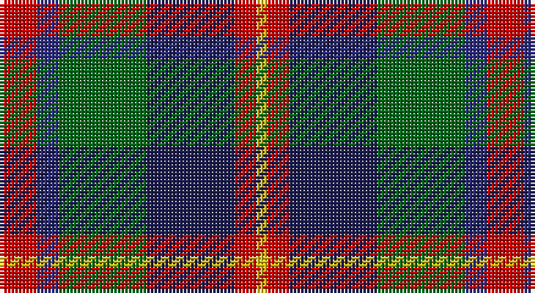

This page is one **sett** — a single exact thread-count. It belongs to the [tartan](/setts/r10db6g24dbi24r6ly3/)
(the same proportion at any scale), whose colour order is pattern [RBGBRY](/stripes/rbgbry/).

Part of the [Canine All Dogs](/tartans/canine-all-dogs/) tartan — the named design grouping this sett with its other cloths.

Sourced from tartans-authority.  It is a [6 stripe tartan](/stripes/stripes6/).

Original link http://www.tartansauthority.com/tartan-ferret/display/10030/

## Register references

External register numbers recorded for this tartan.

- Scottish Register of Tartans: [10030](https://www.tartanregister.gov.uk/tartanDetails?ref=10030)
- Scottish Tartans Authority (ITI): 10030

## Thread count
R/10 DB6 G24 DBa24 R6 Y/3

One full sett is **133 threads**.

## Palette

Palette: <strong>Tartan Register</strong>
<table><thead><tr><th>Colour</th><th>Threads</th><th>Shade</th><th>Base</th><th>OKLCh</th></tr></thead><tbody><tr><td>R/</td><td style="text-align:right;font-variant-numeric:tabular-nums">10</td><td><code style="background-color:#C80000;">#C80000</code> <small style="color:#888">#C80000</small></td><td>R <code style="background-color:#CC0000;">#CC0000</code></td><td><small style="color:#888">oklch(52.3% 0.215 29.2)</small></td></tr><tr><td>DB</td><td style="text-align:right;font-variant-numeric:tabular-nums">6</td><td><code style="background-color:#2C2C80;">#2C2C80</code> <small style="color:#888">#2C2C80</small></td><td>B <code style="background-color:#2A418A;">#2A418A</code></td><td><small style="color:#888">oklch(35.0% 0.138 276.6)</small></td></tr><tr><td>G</td><td style="text-align:right;font-variant-numeric:tabular-nums">24</td><td><code style="background-color:#006818;">#006818</code> <small style="color:#888">#006818</small></td><td>G <code style="background-color:#006100;">#006100</code></td><td><small style="color:#888">oklch(45.0% 0.142 145.0)</small></td></tr><tr><td>DBa</td><td style="text-align:right;font-variant-numeric:tabular-nums">24</td><td><code style="background-color:#1C1C50;">#1C1C50</code> <small style="color:#888">#1C1C50</small></td><td>B <code style="background-color:#2A418A;">#2A418A</code></td><td><small style="color:#888">oklch(26.2% 0.093 277.9)</small></td></tr><tr><td>R</td><td style="text-align:right;font-variant-numeric:tabular-nums">6</td><td><code style="background-color:#C80000;">#C80000</code> <small style="color:#888">#C80000</small></td><td>R <code style="background-color:#CC0000;">#CC0000</code></td><td><small style="color:#888">oklch(52.3% 0.215 29.2)</small></td></tr><tr><td>Y/</td><td style="text-align:right;font-variant-numeric:tabular-nums">3</td><td><code style="background-color:#E8C000;">#E8C000</code> <small style="color:#888">#E8C000</small></td><td>Y <code style="background-color:#F2BF00;">#F2BF00</code></td><td><small style="color:#888">oklch(81.9% 0.168 93.7)</small></td></tr></tbody></table>

# Sample pattern

## Compared to the master

This cloth is one sett of its design; the master sett (the exemplar the design is anchored on) is below for comparison.

<figure style="margin:0"><figcaption style="color:#888;font-size:smaller">this sett</figcaption></figure>
<figure style="margin:0"><figcaption style="color:#888;font-size:smaller"><a href="/setts/r5t3g24db24r4ly2/">master sett →</a></figcaption></figure>

## Nearest tartans

The nearest existing variants by ΔTartan distance, with this tartan at the top so the swatches line up against it.

ΔTartan

Tartan

Sett

—

<a href="/ttd/edit/#slug=r10db6g24dbi24r6ly3">Canine All Dogs (Fashion)</a> <a class="nn-out" href="/variants/s6/r10db6g24dbi24r6ly3/" title="open its dictionary page">↗</a>

0.76

<a href="/ttd/edit/#slug=r2dy8db2t4k4t1~x6&amp;base=r10db6g24dbi24r6ly3">Thompson's Fancy Personal Tartan</a> <a class="nn-out" href="/variants/s6/r2dy8db2t4k4t1~x6/" title="open its dictionary page">↗</a>

0.80

<a href="/ttd/edit/#slug=g3db12w1dg12r12dg2~x2&amp;base=r10db6g24dbi24r6ly3">Patterson, John (Personal)</a> <a class="nn-out" href="/variants/s6/g3db12w1dg12r12dg2~x2/" title="open its dictionary page">↗</a>

0.80

<a href="/ttd/edit/#slug=k4b21dy10y4k20r6b3~x2&amp;base=r10db6g24dbi24r6ly3">Swankie (Personal)</a> <a class="nn-out" href="/variants/s7/k4b21dy10y4k20r6b3~x2/" title="open its dictionary page">↗</a>

0.82

<a href="/ttd/edit/#slug=db6g27db3k19dp27w3~x2&amp;base=r10db6g24dbi24r6ly3">Gold Brothers</a> <a class="nn-out" href="/variants/s6/db6g27db3k19dp27w3~x2/" title="open its dictionary page">↗</a>

0.82

<a href="/ttd/edit/#slug=dgi3db12w1dg12r12dg2~x2&amp;base=r10db6g24dbi24r6ly3">Patterson, John (Personal)</a> <a class="nn-out" href="/variants/s6/dgi3db12w1dg12r12dg2~x2/" title="open its dictionary page">↗</a>

0.84

<a href="/ttd/edit/#slug=m3k17n11m2o20w2~x2&amp;base=r10db6g24dbi24r6ly3">Commonwealth Games Council (Corp.)</a> <a class="nn-out" href="/variants/s6/m3k17n11m2o20w2~x2/" title="open its dictionary page">↗</a>

0.87

<a href="/ttd/edit/#slug=r2o8db2t4k4t1~x6&amp;base=r10db6g24dbi24r6ly3">Thom(p)son's, Fancy</a> <a class="nn-out" href="/variants/s6/r2o8db2t4k4t1~x6/" title="open its dictionary page">↗</a>

0.87

<a href="/ttd/edit/#slug=o56k12o7k12o7g50db50ly10&amp;base=r10db6g24dbi24r6ly3">Sikh</a> <a class="nn-out" href="/variants/s8/o56k12o7k12o7g50db50ly10/" title="open its dictionary page">↗</a>

0.90

<a href="/ttd/edit/#slug=dp27db4k27g27lo4~x2&amp;base=r10db6g24dbi24r6ly3">Selkirk (Personal)</a> <a class="nn-out" href="/variants/s5/dp27db4k27g27lo4~x2/" title="open its dictionary page">↗</a>

0.90

<a href="/ttd/edit/#slug=db18r3k9r3g23ly3~x2&amp;base=r10db6g24dbi24r6ly3">Royal College of Physicians (Corp)</a> <a class="nn-out" href="/variants/s6/db18r3k9r3g23ly3~x2/" title="open its dictionary page">↗</a>

## Neighbour map

Every grey dot is one of 14360 variants placed by the first two principal components of the ΔTartan feature space (44% of its variance). Red is this tartan; blue dots are its nearest — click one to open its page.

<svg viewBox="0 0 640 380" role="img" style="max-width:100%;height:auto;border:1px solid #e0e0e0;border-radius:4px;display:block" xmlns="http://www.w3.org/2000/svg"><image href="/nn/cloud.v1.png" width="640" height="380"/><a href="/variants/s6/r2dy8db2t4k4t1~x6/"><circle cx="163.1" cy="226.4" r="4" fill="#3465a4"><title>Thompson's Fancy Personal Tartan</title></circle></a><a href="/variants/s6/g3db12w1dg12r12dg2~x2/"><circle cx="168.9" cy="200.8" r="4" fill="#3465a4"><title>Patterson, John (Personal)</title></circle></a><a href="/variants/s7/k4b21dy10y4k20r6b3~x2/"><circle cx="147.2" cy="214.6" r="4" fill="#3465a4"><title>Swankie (Personal)</title></circle></a><a href="/variants/s6/db6g27db3k19dp27w3~x2/"><circle cx="140.8" cy="208.0" r="4" fill="#3465a4"><title>Gold Brothers</title></circle></a><a href="/variants/s6/dgi3db12w1dg12r12dg2~x2/"><circle cx="162.9" cy="196.7" r="4" fill="#3465a4"><title>Patterson, John (Personal)</title></circle></a><a href="/variants/s6/m3k17n11m2o20w2~x2/"><circle cx="159.8" cy="192.2" r="4" fill="#3465a4"><title>Commonwealth Games Council (Corp.)</title></circle></a><a href="/variants/s6/r2o8db2t4k4t1~x6/"><circle cx="135.0" cy="212.1" r="4" fill="#3465a4"><title>Thom(p)son's, Fancy</title></circle></a><a href="/variants/s8/o56k12o7k12o7g50db50ly10/"><circle cx="142.3" cy="189.5" r="4" fill="#3465a4"><title>Sikh</title></circle></a><a href="/variants/s5/dp27db4k27g27lo4~x2/"><circle cx="136.0" cy="244.5" r="4" fill="#3465a4"><title>Selkirk (Personal)</title></circle></a><a href="/variants/s6/db18r3k9r3g23ly3~x2/"><circle cx="168.5" cy="211.9" r="4" fill="#3465a4"><title>Royal College of Physicians (Corp)</title></circle></a><circle cx="141.9" cy="215.2" r="5" fill="#c00000"/></svg>

ID: /variants/s6/r10db6g24dbi24r6ly3/
