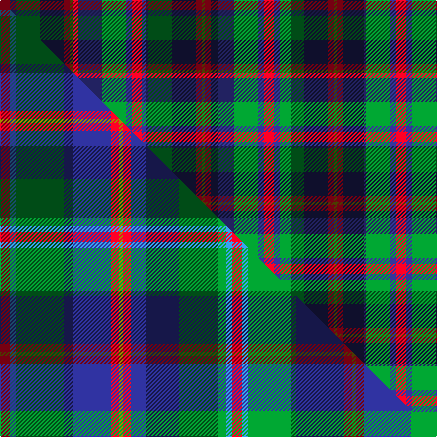

This page is one **sett** — a single exact thread-count. It belongs to the [tartan](/setts/r10dbi6g24db24r6y3/)
(the same proportion at any scale), whose colour order is pattern [GRBGBR](/stripes/grbgbr/).

Part of the [Canine All Dogs](/tartans/canine-all-dogs/) tartan — the named design grouping this sett with its other cloths.

Sourced from tartans-authority.  It is a [6 stripe tartan](/stripes/stripes6/).

Original link http://www.tartansauthority.com/tartan-ferret/display/10030/

## Register references

External register numbers recorded for this tartan.

- Scottish Register of Tartans: [10030](https://www.tartanregister.gov.uk/tartanDetails?ref=10030)
- Scottish Tartans Authority (ITI): 10030

## Thread count
R/10 DBi6 G24 DB24 R6 Y/3

One full sett is **133 threads**.

## Palette
<table><thead><tr><th>Colour</th><th>Shade</th><th>OKLCh</th></tr></thead><tbody><tr><td>DB</td><td><code style="background-color:#2C2C80;">#2C2C80</code> <small style="color:#888">#2C2C80</small></td><td><small style="color:#888">oklch(35.0% 0.138 276.6)</small></td></tr><tr><td>DB</td><td><code style="background-color:#1C1C50;">#1C1C50</code> <small style="color:#888">#1C1C50</small></td><td><small style="color:#888">oklch(26.2% 0.093 277.9)</small></td></tr><tr><td>G</td><td><code style="background-color:#008B2A;">#008B2A</code> <small style="color:#888">#008B2A</small></td><td><small style="color:#888">oklch(55.4% 0.170 145.9)</small></td></tr><tr><td>R</td><td><code style="background-color:#D60020;">#D60020</code> <small style="color:#888">#D60020</small></td><td><small style="color:#888">oklch(55.2% 0.224 25.5)</small></td></tr><tr><td>Y</td><td><code style="background-color:#8B6E00;">#8B6E00</code> <small style="color:#888">#8B6E00</small></td><td><small style="color:#888">oklch(55.1% 0.113 90.4)</small></td></tr></tbody></table>

# Sample pattern

## Compared to the master

This cloth is one sett of its design; the master sett (the exemplar the design is anchored on) is below for comparison.

Its **ΔTartan distance** from the master is **0.41** — the same measure the nearest-tartans table ranks by (0 is identical; a re-scale of the same cloth is near 0, a recolour or a different proportion further).

<figure class="master-compare" style="margin:0">

this sett
master sett ★

<figcaption style="color:#888;font-size:smaller">One weave of this sett against the <a href="/setts/r5t3g24db24r4y2/">master sett ★</a>, split on the diagonal: a shared proportion runs seamlessly across it with only the shades shifting; a different proportion breaks on it.</figcaption>
</figure>

## Nearest tartan variants

The nearest existing variants by ΔTartan distance, with this cloth at the top so the swatches line up against it.

ΔTartan

Threads

Variant

Sett

—

133

<a href="/variants/s6/r10dbi6g24db24r6y3~dbi1406275-db1004274/">Canine All Dogs (Fashion)</a>

<a href="/ttd/edit/#slug=r5t3g24db24r4y2~x2~t2405244-db1406275&amp;base=r10dbi6g24db24r6y3~dbi1406275-db1004274" title="compare in the TTD">0.41</a>

234

<a href="/variants/s6/r5t3g24db24r4y2~x2~t2405244-db1406275/">Canine All Dogs</a>

<a href="/ttd/edit/#slug=r2ly2db9dy1dg9r1w1~x2&amp;base=r10dbi6g24db24r6y3~dbi1406275-db1004274" title="compare in the TTD">1.45</a>

94

<a href="/variants/s7/r2ly2db9dy1dg9r1w1~x2/">Unidentified (ex Tony Murray)</a>

<a href="/ttd/edit/#slug=dg5t2dg9db19r9ly2~x2&amp;base=r10dbi6g24db24r6y3~dbi1406275-db1004274" title="compare in the TTD">1.54</a>

170

<a href="/variants/s6/dg5t2dg9db19r9ly2~x2/">Lyle and Scott</a>

<a href="/ttd/edit/#slug=dg5db2dg9k19r9y2~x2~db1406275-k0705267&amp;base=r10dbi6g24db24r6y3~dbi1406275-db1004274" title="compare in the TTD">1.54</a>

170

<a href="/variants/s6/dg5dbi2dg9db19r9y2~x2~dbi1406275-db0705267/">Lyle and Scott</a>

<a href="/ttd/edit/#slug=r7y3g28db28w3~x2&amp;base=r10dbi6g24db24r6y3~dbi1406275-db1004274" title="compare in the TTD">1.82</a>

256

<a href="/variants/s5/r7y3g28db28w3~x2/">Turnbull, hunting</a>

<a href="/ttd/edit/#slug=db9r3y1r3g9r3y1~x2&amp;base=r10dbi6g24db24r6y3~dbi1406275-db1004274" title="compare in the TTD">1.88</a>

96

<a href="/variants/s7/db9r3y1r3g9r3y1~x2/">Logan #2</a>

<a href="/ttd/edit/#slug=n7w1r6db10g10w1~x4&amp;base=r10dbi6g24db24r6y3~dbi1406275-db1004274" title="compare in the TTD">1.96</a>

248

<a href="/variants/s6/n7w1r6db10g10w1~x4/">McEachem (Name)</a>

<a href="/ttd/edit/#slug=n7w1r6db10dg10w1~x4&amp;base=r10dbi6g24db24r6y3~dbi1406275-db1004274" title="compare in the TTD">1.96</a>

248

<a href="/variants/s6/n7w1r6db10dg10w1~x4/">McEachern, Andrew</a>

<a href="/ttd/edit/#slug=y25r10g10db11w2~x2&amp;base=r10dbi6g24db24r6y3~dbi1406275-db1004274" title="compare in the TTD">2.03</a>

178

<a href="/variants/s5/y25r10g10db11w2~x2/">Samye</a>

<a href="/ttd/edit/#slug=dr21r3dr3r3dr3db19g22lb3~x2&amp;base=r10dbi6g24db24r6y3~dbi1406275-db1004274" title="compare in the TTD">2.11</a>

260

<a href="/variants/s8/dr21r3dr3r3dr3db19g22lb3~x2/">Akins Clan (Personal)</a>

## Neighbour map

Every grey dot is one of 13620 variants placed by the first two principal components of the ΔTartan feature space (42% of its variance). Red is this tartan; blue dots are its nearest — click one to open its page.

<svg viewBox="0 0 640 380" role="img" style="max-width:100%;height:auto;border:1px solid #e0e0e0;border-radius:4px;display:block" xmlns="http://www.w3.org/2000/svg"><image href="/nn/cloud.v1.png" width="640" height="380"/><a href="/variants/s6/r5t3g24db24r4y2~x2~t2405244-db1406275/"><circle cx="236.3" cy="196.4" r="4" fill="#3465a4"><title>Canine All Dogs</title></circle></a><a href="/variants/s7/r2ly2db9dy1dg9r1w1~x2/"><circle cx="164.9" cy="176.5" r="4" fill="#3465a4"><title>Unidentified (ex Tony Murray)</title></circle></a><a href="/variants/s6/dg5t2dg9db19r9ly2~x2/"><circle cx="219.4" cy="216.9" r="4" fill="#3465a4"><title>Lyle and Scott</title></circle></a><a href="/variants/s6/dg5dbi2dg9db19r9y2~x2~dbi1406275-db0705267/"><circle cx="220.1" cy="214.8" r="4" fill="#3465a4"><title>Lyle and Scott</title></circle></a><a href="/variants/s5/r7y3g28db28w3~x2/"><circle cx="212.0" cy="213.1" r="4" fill="#3465a4"><title>Turnbull, hunting</title></circle></a><a href="/variants/s7/db9r3y1r3g9r3y1~x2/"><circle cx="182.7" cy="221.8" r="4" fill="#3465a4"><title>Logan #2</title></circle></a><a href="/variants/s6/n7w1r6db10g10w1~x4/"><circle cx="135.7" cy="229.3" r="4" fill="#3465a4"><title>McEachem (Name)</title></circle></a><a href="/variants/s6/n7w1r6db10dg10w1~x4/"><circle cx="144.4" cy="229.3" r="4" fill="#3465a4"><title>McEachern, Andrew</title></circle></a><a href="/variants/s5/y25r10g10db11w2~x2/"><circle cx="226.2" cy="228.0" r="4" fill="#3465a4"><title>Samye</title></circle></a><a href="/variants/s8/dr21r3dr3r3dr3db19g22lb3~x2/"><circle cx="180.5" cy="204.5" r="4" fill="#3465a4"><title>Akins Clan (Personal)</title></circle></a><circle cx="163.1" cy="226.3" r="5" fill="#c00000"/><text x="320" y="376" text-anchor="middle" font-size="11" fill="#999">ground</text><text x="11" y="190" text-anchor="middle" font-size="11" fill="#999" transform="rotate(-90 11 190)">complexity</text></svg>

ID: /variants/s6/r10dbi6g24db24r6y3~dbi1406275-db1004274/
