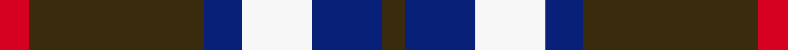

This is one **variant** — a specific cloth: this exact thread count and colourway, with its own
provenance below. It is one weaving of the [sett](/setts/r10dy60db13w24db24dy8/) (the scale-free proportion — the
same cloth at any scale or shade), whose colour order is pattern [GBWBGR](/stripes/gbwbgr/).

Sourced from register-of-tartans.  It is a [6 stripe tartan](/stripes/stripes6/).

Original link [https://www.tartanregister.gov.uk/tartanDetails.aspx?ref=10815](https://www.tartanregister.gov.uk/tartanDetails.aspx?ref=10815)

2 attestations — the source records this cloth was collapsed from (oldest owns this page)

<ul>
<li>09/12/2011 — Bronte House Check (register-of-tartans, <a href="https://www.tartanregister.gov.uk/tartanDetails.aspx?ref=10815">record</a>)  <em>The House Check was designed to distinguish Bronte, a division of Abraham & Sons Ltd, as a brand with a distinctive house fabric design.</em></li>
<li>09/12/2011 — Bronte House Check (Fashion) (tartans-authority, <a href="https://www.tartanregister.gov.uk/tartanDetails.aspx?ref=10815">record</a>)  <em>The House Check was designed to distinguish Bronte, a division of Abraham & Sons Ltd, as a brand with a distinctive house fabric design. Only to be woven by Abraham Moon & Sons Ltd.</em></li>
</ul>

Dataset <small>— provenance for this record, inherited from the source manifest</small>

<dl class="dataset-prov">
<dt>source</dt><dd><a href="/sources/register-of-tartans/">Scottish Register of Tartans</a></dd>
<dt>data captured from</dt><dd><a href="https://github.com/thetartan/tartan-database/blob/master/data/register-of-tartans/data.csv">https://github.com/thetartan/tartan-database/blob/master/data/register-of-tartans/data.csv</a></dd>
<dt>data date</dt><dd>09/12/2011 <small>(this record)</small></dd>
<dt>licence</dt><dd><a href="https://www.tartanregister.gov.uk/copyright">Crown copyright</a></dd>
</dl>

Capture chain <small>— the hands this data passed through, oldest first; each capture carries its own licence</small>

<ol class="capture-chain">
<li><a href="https://www.tartanregister.gov.uk/">Scottish Register of Tartans</a> · <a href="https://www.tartanregister.gov.uk/copyright">Crown copyright</a> <small>the living register — still published by National Records of Scotland</small></li>
<li><a href="https://github.com/thetartan/tartan-database">thetartan/tartan-database</a> <small>2016-2017</small> · <a href="https://creativecommons.org/licenses/by-nc-nd/4.0/">CC BY-NC-ND 4.0</a> <small>Levko Kravets's frozen compilation — the capture we vendored, and where its CC licence text came from</small></li>
<li>this dictionary <small>captured 2026-06-10 · commit 5bf86c7566</small> <small>each re-capture is a git commit to data/sources</small></li>
</ol>

## Register references

External register numbers recorded for this tartan.

- Scottish Register of Tartans: [10815](https://www.tartanregister.gov.uk/tartanDetails?ref=10815)
- Scottish Tartans Authority (ITI): 10815

## Thread count
R/10 DY60 DB13 W24 DB24 DY/8

One full sett is **260 threads**.

## Palette
<table><thead><tr><th>Colour</th><th>Shade</th><th>OKLCh</th></tr></thead><tbody><tr><td>DB</td><td><code style="background-color:#082077;">#082077</code> <small style="color:#888">#082077</small></td><td><small style="color:#888">oklch(30.0% 0.149 265.1)</small></td></tr><tr><td>W</td><td><code style="background-color:#F7F7F7;">#F7F7F7</code> <small style="color:#888">#F7F7F7</small></td><td><small style="color:#888">oklch(97.6% 0.000 89.9)</small></td></tr><tr><td>R</td><td><code style="background-color:#D60020;">#D60020</code> <small style="color:#888">#D60020</small></td><td><small style="color:#888">oklch(55.2% 0.224 25.5)</small></td></tr><tr><td>DY</td><td><code style="background-color:#3A2B0D;">#3A2B0D</code> <small style="color:#888">#3A2B0D</small></td><td><small style="color:#888">oklch(30.0% 0.049 82.0)</small></td></tr></tbody></table>

# Sample pattern

## Nearest tartan variants

The nearest existing variants by ΔTartan distance, with this cloth at the top so the swatches line up against it.

ΔTartan

Threads

Variant

Sett

—

260

<a href="/variants/s6/r10dy60db13w24db24dy8/">Bronte House Check</a>

<a href="/ttd/edit/#slug=r5db35k25db8ly10r5~x2&amp;base=r10dy60db13w24db24dy8" title="compare in the TTD">1.74</a>

332

<a href="/variants/s6/r5db35k25db8ly10r5~x2/">University of Notre Dame</a>

<a href="/ttd/edit/#slug=db10w3db12y14r4~x2&amp;base=r10dy60db13w24db24dy8" title="compare in the TTD">1.91</a>

144

<a href="/variants/s5/db10w3db12y14r4~x2/">MacLeod, of Argentina</a>

<a href="/ttd/edit/#slug=db3r2g5r8db12w3~x2&amp;base=r10dy60db13w24db24dy8" title="compare in the TTD">1.94</a>

120

<a href="/variants/s6/db3r2g5r8db12w3~x2/">Edinburgh Bus Company (Corporate)</a>

<a href="/ttd/edit/#slug=lb4dy28g6lb12k12lb3~x2&amp;base=r10dy60db13w24db24dy8" title="compare in the TTD">2.12</a>

246

<a href="/variants/s6/lb4dy28g6lb12k12lb3~x2/">MacTavish Hunting</a>

<a href="/ttd/edit/#slug=lb3dy26g4lb13k13lb2~x2&amp;base=r10dy60db13w24db24dy8" title="compare in the TTD">2.27</a>

234

<a href="/variants/s6/lb3dy26g4lb13k13lb2~x2/">MacTavish Hunting Clan Tartan</a>

<a href="/ttd/edit/#slug=lb1dr6db1lb3k3lb1~x8&amp;base=r10dy60db13w24db24dy8" title="compare in the TTD">2.49</a>

224

<a href="/variants/s6/lb1dr6db1lb3k3lb1~x8/">MacTavish #2</a>

<a href="/ttd/edit/#slug=r3w8db4dg14r4db2~x4&amp;base=r10dy60db13w24db24dy8" title="compare in the TTD">2.51</a>

260

<a href="/variants/s6/r3w8db4dg14r4db2~x4/">MacKintosh Dress (Scott Adie)</a>

<a href="/ttd/edit/#slug=w5lb34k24lb4dr24lb4~x2&amp;base=r10dy60db13w24db24dy8" title="compare in the TTD">2.55</a>

362

<a href="/variants/s6/w5lb34k24lb4dr24lb4~x2/">Wcwm 759-3</a>

<a href="/ttd/edit/#slug=k4lb4k4n15dr2~x4&amp;base=r10dy60db13w24db24dy8" title="compare in the TTD">2.59</a>

208

<a href="/variants/s5/k4lb4k4n15dr2~x4/">Oban Grey (Fashion)</a>

<a href="/ttd/edit/#slug=db3dbi1g5db3r9db1r1db2~x4~db0906265-dbi1208266&amp;base=r10dy60db13w24db24dy8" title="compare in the TTD">2.63</a>

180

<a href="/variants/s8/db3dbi1g5db3r9db1r1db2~x4~db0906265-dbi1208266/">Unidentified #61</a>

## Neighbour map

Every grey dot is one of 13621 variants placed by the first two principal components of the ΔTartan feature space (42% of its variance). Red is this tartan; blue dots are its nearest — click one to open its page.

<svg viewBox="0 0 640 380" role="img" style="max-width:100%;height:auto;border:1px solid #e0e0e0;border-radius:4px;display:block" xmlns="http://www.w3.org/2000/svg"><image href="/nn/cloud.v1.png" width="640" height="380"/><a href="/variants/s6/r5db35k25db8ly10r5~x2/"><circle cx="199.8" cy="208.8" r="4" fill="#3465a4"><title>University of Notre Dame</title></circle></a><a href="/variants/s5/db10w3db12y14r4~x2/"><circle cx="225.2" cy="279.5" r="4" fill="#3465a4"><title>MacLeod, of Argentina</title></circle></a><a href="/variants/s6/db3r2g5r8db12w3~x2/"><circle cx="193.9" cy="242.5" r="4" fill="#3465a4"><title>Edinburgh Bus Company (Corporate)</title></circle></a><a href="/variants/s6/lb4dy28g6lb12k12lb3~x2/"><circle cx="181.7" cy="205.6" r="4" fill="#3465a4"><title>MacTavish Hunting</title></circle></a><a href="/variants/s6/lb3dy26g4lb13k13lb2~x2/"><circle cx="194.0" cy="188.5" r="4" fill="#3465a4"><title>MacTavish Hunting Clan Tartan</title></circle></a><a href="/variants/s6/lb1dr6db1lb3k3lb1~x8/"><circle cx="156.6" cy="223.6" r="4" fill="#3465a4"><title>MacTavish #2</title></circle></a><a href="/variants/s6/r3w8db4dg14r4db2~x4/"><circle cx="157.6" cy="230.2" r="4" fill="#3465a4"><title>MacKintosh Dress (Scott Adie)</title></circle></a><a href="/variants/s6/w5lb34k24lb4dr24lb4~x2/"><circle cx="175.6" cy="205.4" r="4" fill="#3465a4"><title>Wcwm 759-3</title></circle></a><a href="/variants/s5/k4lb4k4n15dr2~x4/"><circle cx="227.7" cy="213.1" r="4" fill="#3465a4"><title>Oban Grey (Fashion)</title></circle></a><a href="/variants/s8/db3dbi1g5db3r9db1r1db2~x4~db0906265-dbi1208266/"><circle cx="210.5" cy="202.7" r="4" fill="#3465a4"><title>Unidentified #61</title></circle></a><circle cx="222.0" cy="222.0" r="5" fill="#c00000"/><text x="320" y="376" text-anchor="middle" font-size="11" fill="#999">ground</text><text x="11" y="190" text-anchor="middle" font-size="11" fill="#999" transform="rotate(-90 11 190)">complexity</text></svg>

ID: /variants/s6/r10dy60db13w24db24dy8/
