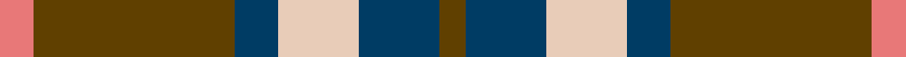
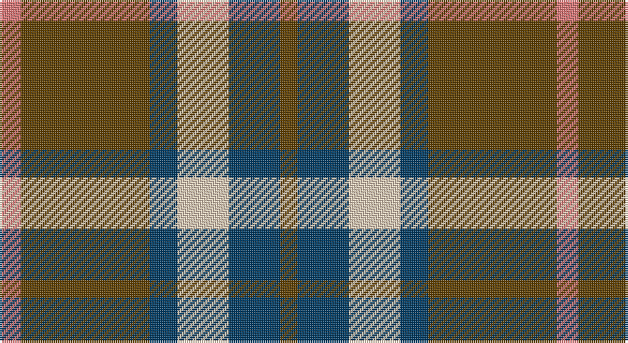

This page is one **sett** — a single exact thread-count. It belongs to the [tartan](/setts/r10dy60dt13lb24dt24dy8/)
(the same proportion at any scale), whose colour order is pattern [GBWBGR](/stripes/gbwbgr/).

Part of the [Bronte House Check](/tartans/bronte-house-check/) tartan — the named design grouping this sett with its other cloths.

Sourced from tartans-authority.  It is a [6 stripe tartan](/stripes/stripes6/).

Original link http://www.tartansauthority.com/tartan-ferret/display/10815/

## Register references

External register numbers recorded for this tartan.

- Scottish Register of Tartans: [10815](https://www.tartanregister.gov.uk/tartanDetails?ref=10815)
- Scottish Tartans Authority (ITI): 10815

## Thread count
LRa/10 T60 DB13 LR24 DB24 T/8

One full sett is **260 threads**.

## Palette

Palette: <strong>Tartan Register</strong>
<table><thead><tr><th>Colour</th><th>Threads</th><th>Shade</th><th>Base</th><th>OKLCh</th></tr></thead><tbody><tr><td>LRa/</td><td style="text-align:right;font-variant-numeric:tabular-nums">10</td><td><code style="background-color:#E87878;">#E87878</code> <small style="color:#888">#E87878</small></td><td>R <code style="background-color:#CC0000;">#CC0000</code></td><td><small style="color:#888">oklch(70.0% 0.139 21.2)</small></td></tr><tr><td>T</td><td style="text-align:right;font-variant-numeric:tabular-nums">60</td><td><code style="background-color:#604000;">#604000</code> <small style="color:#888">#604000</small></td><td>G <code style="background-color:#006100;">#006100</code></td><td><small style="color:#888">oklch(39.8% 0.083 76.8)</small></td></tr><tr><td>DB</td><td style="text-align:right;font-variant-numeric:tabular-nums">13</td><td><code style="background-color:#003C64;">#003C64</code> <small style="color:#888">#003C64</small></td><td>B <code style="background-color:#2A418A;">#2A418A</code></td><td><small style="color:#888">oklch(34.5% 0.089 246.0)</small></td></tr><tr><td>LR</td><td style="text-align:right;font-variant-numeric:tabular-nums">24</td><td><code style="background-color:#E8CCB8;">#E8CCB8</code> <small style="color:#888">#E8CCB8</small></td><td>W <code style="background-color:#F7F7F7;">#F7F7F7</code></td><td><small style="color:#888">oklch(86.3% 0.042 57.7)</small></td></tr><tr><td>DB</td><td style="text-align:right;font-variant-numeric:tabular-nums">24</td><td><code style="background-color:#003C64;">#003C64</code> <small style="color:#888">#003C64</small></td><td>B <code style="background-color:#2A418A;">#2A418A</code></td><td><small style="color:#888">oklch(34.5% 0.089 246.0)</small></td></tr><tr><td>T/</td><td style="text-align:right;font-variant-numeric:tabular-nums">8</td><td><code style="background-color:#604000;">#604000</code> <small style="color:#888">#604000</small></td><td>G <code style="background-color:#006100;">#006100</code></td><td><small style="color:#888">oklch(39.8% 0.083 76.8)</small></td></tr></tbody></table>

# Sample pattern

## Compared to the master

This cloth is one sett of its design; the master sett (the exemplar the design is anchored on) is below for comparison.

<figure style="margin:0"><figcaption style="color:#888;font-size:smaller">this sett</figcaption></figure>
<figure style="margin:0"><figcaption style="color:#888;font-size:smaller"><a href="/setts/m10dy60dt13lo24dt24dy8/">master sett →</a></figcaption></figure>

## Nearest tartans

The nearest existing variants by ΔTartan distance, with this tartan at the top so the swatches line up against it.

ΔTartan

Tartan

Sett

—

<a href="/ttd/edit/#slug=r10dy60dt13lb24dt24dy8">Bronte House Check (Fashion)</a> <a class="nn-out" href="/variants/s6/r10dy60dt13lb24dt24dy8/" title="open its dictionary page">↗</a>

0.77

<a href="/ttd/edit/#slug=r2dg17r8db8ly2~x4&amp;base=r10dy60dt13lb24dt24dy8">British Hills</a> <a class="nn-out" href="/variants/s5/r2dg17r8db8ly2~x4/" title="open its dictionary page">↗</a>

0.84

<a href="/ttd/edit/#slug=k4lb4k4o15r2~x4&amp;base=r10dy60dt13lb24dt24dy8">Oban Grey (Fashion)</a> <a class="nn-out" href="/variants/s5/k4lb4k4o15r2~x4/" title="open its dictionary page">↗</a>

0.86

<a href="/ttd/edit/#slug=r3y27k6lo13k14r3~x2&amp;base=r10dy60dt13lb24dt24dy8">Thompson/Thomson/MacTavish special grey</a> <a class="nn-out" href="/variants/s6/r3y27k6lo13k14r3~x2/" title="open its dictionary page">↗</a>

0.97

<a href="/ttd/edit/#slug=m10dy60dt13lo24dt24dy8&amp;base=r10dy60dt13lb24dt24dy8">Bronte House Check</a> <a class="nn-out" href="/variants/s6/m10dy60dt13lo24dt24dy8/" title="open its dictionary page">↗</a>

0.98

<a href="/ttd/edit/#slug=g15r3p11t2~x2&amp;base=r10dy60dt13lb24dt24dy8">MacNab 7</a> <a class="nn-out" href="/variants/s4/g15r3p11t2~x2/" title="open its dictionary page">↗</a>

1.00

<a href="/ttd/edit/#slug=m3dg6lo2db2lo11dg2lo2m3~x2&amp;base=r10dy60dt13lb24dt24dy8">Invertere (Daks #1) (Fashion)</a> <a class="nn-out" href="/variants/s8/m3dg6lo2db2lo11dg2lo2m3~x2/" title="open its dictionary page">↗</a>

1.05

<a href="/ttd/edit/#slug=t4o28g6t12k12t3~x2&amp;base=r10dy60dt13lb24dt24dy8">MacTavish / Thom(p)son, hunting</a> <a class="nn-out" href="/variants/s6/t4o28g6t12k12t3~x2/" title="open its dictionary page">↗</a>

1.07

<a href="/ttd/edit/#slug=lo3t7do2m2do14t2do2lo3~x2&amp;base=r10dy60dt13lb24dt24dy8">Daks (Blue Loden)</a> <a class="nn-out" href="/variants/s8/lo3t7do2m2do14t2do2lo3~x2/" title="open its dictionary page">↗</a>

1.07

<a href="/ttd/edit/#slug=o5dp3o18k16ly3~x4&amp;base=r10dy60dt13lb24dt24dy8">New York State Police Pipe Band</a> <a class="nn-out" href="/variants/s5/o5dp3o18k16ly3~x4/" title="open its dictionary page">↗</a>

1.09

<a href="/ttd/edit/#slug=k3g25o3k15lr24g3~x2&amp;base=r10dy60dt13lb24dt24dy8">Un-named (D C Dalgliesh) #3</a> <a class="nn-out" href="/variants/s6/k3g25o3k15lr24g3~x2/" title="open its dictionary page">↗</a>

## Neighbour map

Every grey dot is one of 14360 variants placed by the first two principal components of the ΔTartan feature space (44% of its variance). Red is this tartan; blue dots are its nearest — click one to open its page.

<svg viewBox="0 0 640 380" role="img" style="max-width:100%;height:auto;border:1px solid #e0e0e0;border-radius:4px;display:block" xmlns="http://www.w3.org/2000/svg"><image href="/nn/cloud.v1.png" width="640" height="380"/><a href="/variants/s5/r2dg17r8db8ly2~x4/"><circle cx="220.0" cy="222.2" r="4" fill="#3465a4"><title>British Hills</title></circle></a><a href="/variants/s5/k4lb4k4o15r2~x4/"><circle cx="241.8" cy="218.9" r="4" fill="#3465a4"><title>Oban Grey (Fashion)</title></circle></a><a href="/variants/s6/r3y27k6lo13k14r3~x2/"><circle cx="191.8" cy="207.7" r="4" fill="#3465a4"><title>Thompson/Thomson/MacTavish special grey</title></circle></a><a href="/variants/s6/m10dy60dt13lo24dt24dy8/"><circle cx="248.2" cy="223.4" r="4" fill="#3465a4"><title>Bronte House Check</title></circle></a><a href="/variants/s4/g15r3p11t2~x2/"><circle cx="251.6" cy="249.7" r="4" fill="#3465a4"><title>MacNab 7</title></circle></a><a href="/variants/s8/m3dg6lo2db2lo11dg2lo2m3~x2/"><circle cx="230.8" cy="225.8" r="4" fill="#3465a4"><title>Invertere (Daks #1) (Fashion)</title></circle></a><a href="/variants/s6/t4o28g6t12k12t3~x2/"><circle cx="202.1" cy="213.8" r="4" fill="#3465a4"><title>MacTavish / Thom(p)son, hunting</title></circle></a><a href="/variants/s8/lo3t7do2m2do14t2do2lo3~x2/"><circle cx="266.5" cy="207.2" r="4" fill="#3465a4"><title>Daks (Blue Loden)</title></circle></a><a href="/variants/s5/o5dp3o18k16ly3~x4/"><circle cx="234.9" cy="235.1" r="4" fill="#3465a4"><title>New York State Police Pipe Band</title></circle></a><a href="/variants/s6/k3g25o3k15lr24g3~x2/"><circle cx="179.5" cy="206.9" r="4" fill="#3465a4"><title>Un-named (D C Dalgliesh) #3</title></circle></a><circle cx="231.6" cy="221.3" r="5" fill="#c00000"/></svg>

ID: /variants/s6/r10dy60dt13lb24dt24dy8/
