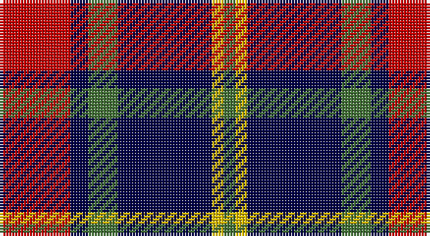

This page is one **sett** — a single exact thread-count. It belongs to the [tartan](/setts/r12db3g5db16ly2g2/)
(the same proportion at any scale), whose colour order is pattern [GYBGBR](/stripes/gybgbr/).

Sourced from tartans-authority.  It is a [6 stripe tartan](/stripes/stripes6/).

Original link http://www.tartansauthority.com/tartan-ferret/display/954/

## Also known as

This cloth is also recorded under:

- Dunbog Primary
- Dunbog, Primary School

## Register references

External register numbers recorded for this tartan.

- Scottish Tartans Authority (ITI): 954

## Thread count
R/24 DB6 G10 DB32 Y4 G/4

One full sett is **132 threads**.

## Palette

Palette: <strong>Tartan Register</strong> <small style="color:#888">(3 of 4 colours)</small>
<table><thead><tr><th>Colour</th><th>Threads</th><th>Shade</th><th>Base</th><th>OKLCh</th></tr></thead><tbody><tr><td>R/</td><td style="text-align:right;font-variant-numeric:tabular-nums">24</td><td><code style="background-color:#C80000;">#C80000</code> <small style="color:#888">#C80000</small></td><td>R <code style="background-color:#CC0000;">#CC0000</code></td><td><small style="color:#888">oklch(52.3% 0.215 29.2)</small></td></tr><tr><td>DB</td><td style="text-align:right;font-variant-numeric:tabular-nums">6</td><td><code style="background-color:#000048;">#000048</code> <small style="color:#888">#000048</small></td><td>B <code style="background-color:#2A418A;">#2A418A</code></td><td><small style="color:#888">oklch(18.2% 0.126 264.1)</small></td></tr><tr><td>G</td><td style="text-align:right;font-variant-numeric:tabular-nums">10</td><td><code style="background-color:#447438;">#447438</code> <small style="color:#888">#447438</small></td><td>G <code style="background-color:#006100;">#006100</code></td><td><small style="color:#888">oklch(50.9% 0.104 139.6)</small></td></tr><tr><td>DB</td><td style="text-align:right;font-variant-numeric:tabular-nums">32</td><td><code style="background-color:#000048;">#000048</code> <small style="color:#888">#000048</small></td><td>B <code style="background-color:#2A418A;">#2A418A</code></td><td><small style="color:#888">oklch(18.2% 0.126 264.1)</small></td></tr><tr><td>Y</td><td style="text-align:right;font-variant-numeric:tabular-nums">4</td><td><code style="background-color:#E8C000;">#E8C000</code> <small style="color:#888">#E8C000</small></td><td>Y <code style="background-color:#F2BF00;">#F2BF00</code></td><td><small style="color:#888">oklch(81.9% 0.168 93.7)</small></td></tr><tr><td>G/</td><td style="text-align:right;font-variant-numeric:tabular-nums">4</td><td><code style="background-color:#447438;">#447438</code> <small style="color:#888">#447438</small></td><td>G <code style="background-color:#006100;">#006100</code></td><td><small style="color:#888">oklch(50.9% 0.104 139.6)</small></td></tr></tbody></table>

# Sample pattern

## Nearest tartans

The nearest existing variants by ΔTartan distance, with this tartan at the top so the swatches line up against it.

ΔTartan

Tartan

Sett

—

<a href="/ttd/edit/#slug=r12db3g5db16ly2g2~x2">Dunbog Primary (School)</a> <a class="nn-out" href="/variants/s6/r12db3g5db16ly2g2~x2/" title="open its dictionary page">↗</a>

0.66

<a href="/ttd/edit/#slug=r5db35k25db8ly10r5~x2&amp;base=r12db3g5db16ly2g2~x2">University of Notre Dame</a> <a class="nn-out" href="/variants/s6/r5db35k25db8ly10r5~x2/" title="open its dictionary page">↗</a>

0.91

<a href="/ttd/edit/#slug=lb5o34k24o4r24o4~x2&amp;base=r12db3g5db16ly2g2~x2">Wcwm 759-3</a> <a class="nn-out" href="/variants/s6/lb5o34k24o4r24o4~x2/" title="open its dictionary page">↗</a>

0.98

<a href="/ttd/edit/#slug=k3lb3k3n10r1~x6&amp;base=r12db3g5db16ly2g2~x2">Greystone (Burberry Grey)</a> <a class="nn-out" href="/variants/s5/k3lb3k3n10r1~x6/" title="open its dictionary page">↗</a>

1.01

<a href="/ttd/edit/#slug=db5k1g1k1r3k1~x4&amp;base=r12db3g5db16ly2g2~x2">Clerk</a> <a class="nn-out" href="/variants/s6/db5k1g1k1r3k1~x4/" title="open its dictionary page">↗</a>

1.04

<a href="/ttd/edit/#slug=b2r12db2b6k6b1~x2&amp;base=r12db3g5db16ly2g2~x2">MacTavish</a> <a class="nn-out" href="/variants/s6/b2r12db2b6k6b1~x2/" title="open its dictionary page">↗</a>

1.04

<a href="/ttd/edit/#slug=b2r12db2b6k6b1&amp;base=r12db3g5db16ly2g2~x2">MacTavish</a> <a class="nn-out" href="/variants/s6/b2r12db2b6k6b1/" title="open its dictionary page">↗</a>

1.04

<a href="/ttd/edit/#slug=r8k18r6k18b27k2w3~x2&amp;base=r12db3g5db16ly2g2~x2">MacKean (Personal)</a> <a class="nn-out" href="/variants/s7/r8k18r6k18b27k2w3~x2/" title="open its dictionary page">↗</a>

1.07

<a href="/ttd/edit/#slug=db3r2g5r8db12w3~x2&amp;base=r12db3g5db16ly2g2~x2">Edinburgh Bus Company (Corporate)</a> <a class="nn-out" href="/variants/s6/db3r2g5r8db12w3~x2/" title="open its dictionary page">↗</a>

1.12

<a href="/ttd/edit/#slug=g3k15r8g2o8k2~x4&amp;base=r12db3g5db16ly2g2~x2">Thompson Black (Fashion)</a> <a class="nn-out" href="/variants/s6/g3k15r8g2o8k2~x4/" title="open its dictionary page">↗</a>

1.13

<a href="/ttd/edit/#slug=r2b13dr3b3dr16lb2~x4&amp;base=r12db3g5db16ly2g2~x2">MacArthur-Fox Blue (Personal)</a> <a class="nn-out" href="/variants/s6/r2b13dr3b3dr16lb2~x4/" title="open its dictionary page">↗</a>

## Neighbour map

Every grey dot is one of 14360 variants placed by the first two principal components of the ΔTartan feature space (44% of its variance). Red is this tartan; blue dots are its nearest — click one to open its page.

<svg viewBox="0 0 640 380" role="img" style="max-width:100%;height:auto;border:1px solid #e0e0e0;border-radius:4px;display:block" xmlns="http://www.w3.org/2000/svg"><image href="/nn/cloud.v1.png" width="640" height="380"/><a href="/variants/s6/r5db35k25db8ly10r5~x2/"><circle cx="220.4" cy="222.4" r="4" fill="#3465a4"><title>University of Notre Dame</title></circle></a><a href="/variants/s6/lb5o34k24o4r24o4~x2/"><circle cx="190.3" cy="203.2" r="4" fill="#3465a4"><title>Wcwm 759-3</title></circle></a><a href="/variants/s5/k3lb3k3n10r1~x6/"><circle cx="230.4" cy="210.3" r="4" fill="#3465a4"><title>Greystone (Burberry Grey)</title></circle></a><a href="/variants/s6/db5k1g1k1r3k1~x4/"><circle cx="172.1" cy="234.5" r="4" fill="#3465a4"><title>Clerk</title></circle></a><a href="/variants/s6/b2r12db2b6k6b1~x2/"><circle cx="209.9" cy="196.7" r="4" fill="#3465a4"><title>MacTavish</title></circle></a><a href="/variants/s6/b2r12db2b6k6b1/"><circle cx="209.9" cy="196.7" r="4" fill="#3465a4"><title>MacTavish</title></circle></a><a href="/variants/s7/r8k18r6k18b27k2w3~x2/"><circle cx="229.8" cy="195.6" r="4" fill="#3465a4"><title>MacKean (Personal)</title></circle></a><a href="/variants/s6/db3r2g5r8db12w3~x2/"><circle cx="181.6" cy="231.2" r="4" fill="#3465a4"><title>Edinburgh Bus Company (Corporate)</title></circle></a><a href="/variants/s6/g3k15r8g2o8k2~x4/"><circle cx="200.8" cy="224.2" r="4" fill="#3465a4"><title>Thompson Black (Fashion)</title></circle></a><a href="/variants/s6/r2b13dr3b3dr16lb2~x4/"><circle cx="278.6" cy="217.5" r="4" fill="#3465a4"><title>MacArthur-Fox Blue (Personal)</title></circle></a><circle cx="223.3" cy="210.7" r="5" fill="#c00000"/></svg>

ID: /variants/s6/r12db3g5db16ly2g2~x2/
