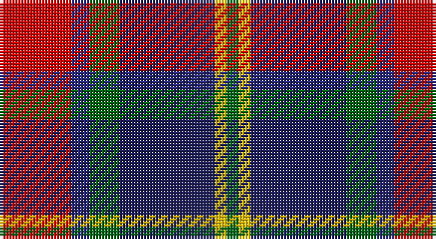

This page is one **sett** — a single exact thread-count. It belongs to the [tartan](/setts/r12dbi3g5db16ly2g2/)
(the same proportion at any scale), whose colour order is pattern [GYBGBR](/stripes/gybgbr/).

Sourced from house-of-tartan.  It is a [6 stripe tartan](/stripes/stripes6/).

Original link http://www.house-of-tartan.scotland.net/house/TartanViewjs.asp?colr=Def&tnam=954

## Provenance

Earliest known date: 1985 C. Armstrong is a pupil at the school.

## Thread count
R/24 DB6 G10 DBa32 Y4 G/4

One full sett is **132 threads**.

## Palette

Palette: <strong>Tartan Register</strong>
<table><thead><tr><th>Colour</th><th>Threads</th><th>Shade</th><th>Base</th><th>OKLCh</th></tr></thead><tbody><tr><td>R/</td><td style="text-align:right;font-variant-numeric:tabular-nums">24</td><td><code style="background-color:#C80000;">#C80000</code> <small style="color:#888">#C80000</small></td><td>R <code style="background-color:#CC0000;">#CC0000</code></td><td><small style="color:#888">oklch(52.3% 0.215 29.2)</small></td></tr><tr><td>DB</td><td style="text-align:right;font-variant-numeric:tabular-nums">6</td><td><code style="background-color:#2C2C80;">#2C2C80</code> <small style="color:#888">#2C2C80</small></td><td>B <code style="background-color:#2A418A;">#2A418A</code></td><td><small style="color:#888">oklch(35.0% 0.138 276.6)</small></td></tr><tr><td>G</td><td style="text-align:right;font-variant-numeric:tabular-nums">10</td><td><code style="background-color:#006818;">#006818</code> <small style="color:#888">#006818</small></td><td>G <code style="background-color:#006100;">#006100</code></td><td><small style="color:#888">oklch(45.0% 0.142 145.0)</small></td></tr><tr><td>DBa</td><td style="text-align:right;font-variant-numeric:tabular-nums">32</td><td><code style="background-color:#202060;">#202060</code> <small style="color:#888">#202060</small></td><td>B <code style="background-color:#2A418A;">#2A418A</code></td><td><small style="color:#888">oklch(28.9% 0.111 276.9)</small></td></tr><tr><td>Y</td><td style="text-align:right;font-variant-numeric:tabular-nums">4</td><td><code style="background-color:#E8C000;">#E8C000</code> <small style="color:#888">#E8C000</small></td><td>Y <code style="background-color:#F2BF00;">#F2BF00</code></td><td><small style="color:#888">oklch(81.9% 0.168 93.7)</small></td></tr><tr><td>G/</td><td style="text-align:right;font-variant-numeric:tabular-nums">4</td><td><code style="background-color:#006818;">#006818</code> <small style="color:#888">#006818</small></td><td>G <code style="background-color:#006100;">#006100</code></td><td><small style="color:#888">oklch(45.0% 0.142 145.0)</small></td></tr></tbody></table>

# Sample pattern

## Nearest tartans

The nearest existing variants by ΔTartan distance, with this tartan at the top so the swatches line up against it.

ΔTartan

Tartan

Sett

—

<a href="/ttd/edit/#slug=r12dbi3g5db16ly2g2~x2">Dunbog Primary School Corporate Tartan</a> <a class="nn-out" href="/variants/s6/r12dbi3g5db16ly2g2~x2/" title="open its dictionary page">↗</a>

0.81

<a href="/ttd/edit/#slug=r12db3g5dbi16ly2g2~x2&amp;base=r12dbi3g5db16ly2g2~x2">Dunbog, Primary School</a> <a class="nn-out" href="/variants/s6/r12db3g5dbi16ly2g2~x2/" title="open its dictionary page">↗</a>

0.86

<a href="/ttd/edit/#slug=db31t4db6k19r20ly4~x2&amp;base=r12dbi3g5db16ly2g2~x2">Fife (McGill)</a> <a class="nn-out" href="/variants/s6/db31t4db6k19r20ly4~x2/" title="open its dictionary page">↗</a>

0.88

<a href="/ttd/edit/#slug=r2o8db2t4k4t1~x6&amp;base=r12dbi3g5db16ly2g2~x2">Thom(p)son's, Fancy</a> <a class="nn-out" href="/variants/s6/r2o8db2t4k4t1~x6/" title="open its dictionary page">↗</a>

0.90

<a href="/ttd/edit/#slug=m3k17n11m2o20w2~x2&amp;base=r12dbi3g5db16ly2g2~x2">Commonwealth Games Council (Corp.)</a> <a class="nn-out" href="/variants/s6/m3k17n11m2o20w2~x2/" title="open its dictionary page">↗</a>

0.93

<a href="/ttd/edit/#slug=dgi3db12w1dg12r12dg2~x2&amp;base=r12dbi3g5db16ly2g2~x2">Patterson, John (Personal)</a> <a class="nn-out" href="/variants/s6/dgi3db12w1dg12r12dg2~x2/" title="open its dictionary page">↗</a>

0.94

<a href="/ttd/edit/#slug=db15r6dg8k2w2k2~x6&amp;base=r12dbi3g5db16ly2g2~x2">Stovell (2015)</a> <a class="nn-out" href="/variants/s6/db15r6dg8k2w2k2~x6/" title="open its dictionary page">↗</a>

0.94

<a href="/ttd/edit/#slug=dp2r2dp16k17dg16k2ly2~x2&amp;base=r12dbi3g5db16ly2g2~x2">Zangenberg (Personal)</a> <a class="nn-out" href="/variants/s7/dp2r2dp16k17dg16k2ly2~x2/" title="open its dictionary page">↗</a>

0.98

<a href="/ttd/edit/#slug=g3db12w1dg12r12dg2~x2&amp;base=r12dbi3g5db16ly2g2~x2">Patterson, John (Personal)</a> <a class="nn-out" href="/variants/s6/g3db12w1dg12r12dg2~x2/" title="open its dictionary page">↗</a>

0.99

<a href="/ttd/edit/#slug=m21r3m3r3m3db19g22b3~x2&amp;base=r12dbi3g5db16ly2g2~x2">Akins</a> <a class="nn-out" href="/variants/s8/m21r3m3r3m3db19g22b3~x2/" title="open its dictionary page">↗</a>

0.99

<a href="/ttd/edit/#slug=lb4k13g6r16lbi2r2g2~x2&amp;base=r12dbi3g5db16ly2g2~x2">Caledonian Brewery Corporate Tartan</a> <a class="nn-out" href="/variants/s7/lb4k13g6r16lbi2r2g2~x2/" title="open its dictionary page">↗</a>

## Neighbour map

Every grey dot is one of 14360 variants placed by the first two principal components of the ΔTartan feature space (44% of its variance). Red is this tartan; blue dots are its nearest — click one to open its page.

<svg viewBox="0 0 640 380" role="img" style="max-width:100%;height:auto;border:1px solid #e0e0e0;border-radius:4px;display:block" xmlns="http://www.w3.org/2000/svg"><image href="/nn/cloud.v1.png" width="640" height="380"/><a href="/variants/s6/r12db3g5dbi16ly2g2~x2/"><circle cx="159.6" cy="194.4" r="4" fill="#3465a4"><title>Dunbog, Primary School</title></circle></a><a href="/variants/s6/db31t4db6k19r20ly4~x2/"><circle cx="188.2" cy="210.2" r="4" fill="#3465a4"><title>Fife (McGill)</title></circle></a><a href="/variants/s6/r2o8db2t4k4t1~x6/"><circle cx="135.0" cy="212.1" r="4" fill="#3465a4"><title>Thom(p)son's, Fancy</title></circle></a><a href="/variants/s6/m3k17n11m2o20w2~x2/"><circle cx="159.8" cy="192.2" r="4" fill="#3465a4"><title>Commonwealth Games Council (Corp.)</title></circle></a><a href="/variants/s6/dgi3db12w1dg12r12dg2~x2/"><circle cx="162.9" cy="196.7" r="4" fill="#3465a4"><title>Patterson, John (Personal)</title></circle></a><a href="/variants/s6/db15r6dg8k2w2k2~x6/"><circle cx="182.0" cy="211.7" r="4" fill="#3465a4"><title>Stovell (2015)</title></circle></a><a href="/variants/s7/dp2r2dp16k17dg16k2ly2~x2/"><circle cx="172.2" cy="195.8" r="4" fill="#3465a4"><title>Zangenberg (Personal)</title></circle></a><a href="/variants/s6/g3db12w1dg12r12dg2~x2/"><circle cx="168.9" cy="200.8" r="4" fill="#3465a4"><title>Patterson, John (Personal)</title></circle></a><a href="/variants/s8/m21r3m3r3m3db19g22b3~x2/"><circle cx="158.6" cy="191.4" r="4" fill="#3465a4"><title>Akins</title></circle></a><a href="/variants/s7/lb4k13g6r16lbi2r2g2~x2/"><circle cx="171.7" cy="189.2" r="4" fill="#3465a4"><title>Caledonian Brewery Corporate Tartan</title></circle></a><circle cx="180.0" cy="200.4" r="5" fill="#c00000"/></svg>

ID: /variants/s6/r12dbi3g5db16ly2g2~x2/
