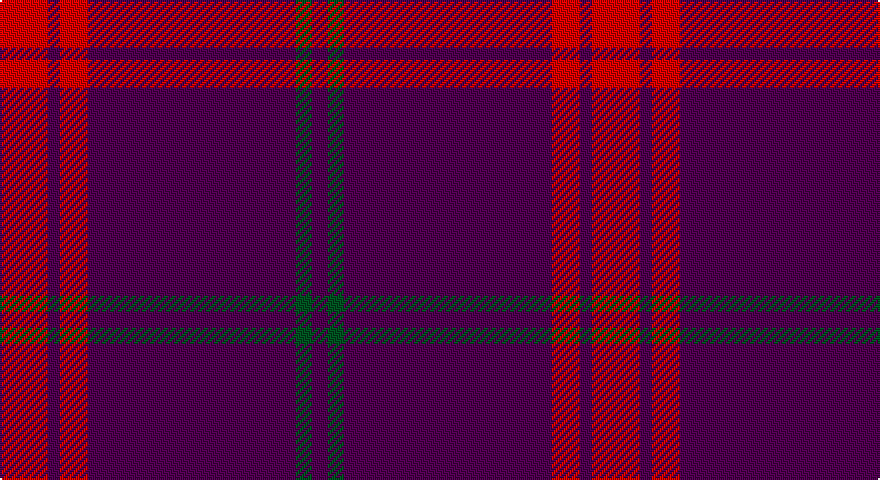

This page is one **sett** — a single exact thread-count. It belongs to the [tartan](/setts/r12dp3r7dp52dg4dp4/)
(the same proportion at any scale), whose colour order is pattern [BGBRBR](/stripes/bgbrbr/).

Sourced from register-of-tartans.  It is a [6 stripe tartan](/stripes/stripes6/).

Original link https://www.tartanregister.gov.uk/tartanDetails.aspx?ref=2254

## Register references

External register numbers recorded for this tartan.

- Scottish Register of Tartans: [2254](https://www.tartanregister.gov.uk/tartanDetails.aspx?ref=2254)
- Scottish Tartans World Register: 2774

## Thread count
R/24 DP6 R14 DP104 G8 DP/8

One full sett is **296 threads**.

## Palette

Palette: <strong>Tartan Register</strong> <small style="color:#888">(2 of 3 colours)</small>
<table><thead><tr><th>Colour</th><th>Threads</th><th>Shade</th><th>Base</th><th>OKLCh</th></tr></thead><tbody><tr><td>R/</td><td style="text-align:right;font-variant-numeric:tabular-nums">24</td><td><code style="background-color:#DC0000;">#DC0000</code> <small style="color:#888">#DC0000</small></td><td>R <code style="background-color:#CC0000;">#CC0000</code></td><td><small style="color:#888">oklch(56.2% 0.230 29.2)</small></td></tr><tr><td>DP</td><td style="text-align:right;font-variant-numeric:tabular-nums">6</td><td><code style="background-color:#500050;">#500050</code> <small style="color:#888">#500050</small></td><td>B <code style="background-color:#2A418A;">#2A418A</code></td><td><small style="color:#888">oklch(30.3% 0.139 328.4)</small></td></tr><tr><td>R</td><td style="text-align:right;font-variant-numeric:tabular-nums">14</td><td><code style="background-color:#DC0000;">#DC0000</code> <small style="color:#888">#DC0000</small></td><td>R <code style="background-color:#CC0000;">#CC0000</code></td><td><small style="color:#888">oklch(56.2% 0.230 29.2)</small></td></tr><tr><td>DP</td><td style="text-align:right;font-variant-numeric:tabular-nums">104</td><td><code style="background-color:#500050;">#500050</code> <small style="color:#888">#500050</small></td><td>B <code style="background-color:#2A418A;">#2A418A</code></td><td><small style="color:#888">oklch(30.3% 0.139 328.4)</small></td></tr><tr><td>G</td><td style="text-align:right;font-variant-numeric:tabular-nums">8</td><td><code style="background-color:#005020;">#005020</code> <small style="color:#888">#005020</small></td><td>G <code style="background-color:#006100;">#006100</code></td><td><small style="color:#888">oklch(37.7% 0.105 149.6)</small></td></tr><tr><td>DP/</td><td style="text-align:right;font-variant-numeric:tabular-nums">8</td><td><code style="background-color:#500050;">#500050</code> <small style="color:#888">#500050</small></td><td>B <code style="background-color:#2A418A;">#2A418A</code></td><td><small style="color:#888">oklch(30.3% 0.139 328.4)</small></td></tr></tbody></table>

# Sample pattern

## Nearest tartans

The nearest existing variants by ΔTartan distance, with this tartan at the top so the swatches line up against it.

ΔTartan

Tartan

Sett

—

<a href="/ttd/edit/#slug=r12dp3r7dp52dg4dp4~x2">Lynch Variant</a> <a class="nn-out" href="/variants/s6/r12dp3r7dp52dg4dp4~x2/" title="open its dictionary page">↗</a>

1.66

<a href="/ttd/edit/#slug=m18g1k5g1k1g1m9~x2&amp;base=r12dp3r7dp52dg4dp4~x2">Inverness, Augustus</a> <a class="nn-out" href="/variants/s7/m18g1k5g1k1g1m9~x2/" title="open its dictionary page">↗</a>

1.84

<a href="/ttd/edit/#slug=m64db18m2db3m2db3m14t8m2t4m2~x2&amp;base=r12dp3r7dp52dg4dp4~x2">Bennet</a> <a class="nn-out" href="/variants/s11/m64db18m2db3m2db3m14t8m2t4m2~x2/" title="open its dictionary page">↗</a>

2.01

<a href="/ttd/edit/#slug=k4r40k1r3k1w3k4~x2&amp;base=r12dp3r7dp52dg4dp4~x2">Salt Lake County (District)</a> <a class="nn-out" href="/variants/s7/k4r40k1r3k1w3k4~x2/" title="open its dictionary page">↗</a>

2.02

<a href="/ttd/edit/#slug=dp57m5dp2m8lb2dp3ly2dp14~x2&amp;base=r12dp3r7dp52dg4dp4~x2">Cairngorms National Park</a> <a class="nn-out" href="/variants/s8/dp57m5dp2m8lb2dp3ly2dp14~x2/" title="open its dictionary page">↗</a>

2.08

<a href="/ttd/edit/#slug=r19db6r14db101g7db7&amp;base=r12dp3r7dp52dg4dp4~x2">Lynch Family Tartan</a> <a class="nn-out" href="/variants/s6/r19db6r14db101g7db7/" title="open its dictionary page">↗</a>

2.09

<a href="/ttd/edit/#slug=dp3g1dp9r3~x4&amp;base=r12dp3r7dp52dg4dp4~x2">Highland Spring (1988) (Corporate)</a> <a class="nn-out" href="/variants/s4/dp3g1dp9r3~x4/" title="open its dictionary page">↗</a>

2.10

<a href="/variants/s6/r40b8r1w2~x4/">Lyon College (Corporate)</a>

2.10

<a href="/ttd/edit/#slug=dg1k2dp27k2ly1~x2&amp;base=r12dp3r7dp52dg4dp4~x2">Carolina University, Western</a> <a class="nn-out" href="/variants/s5/dg1k2dp27k2ly1~x2/" title="open its dictionary page">↗</a>

2.12

<a href="/ttd/edit/#slug=r15db4r1db1r1db1r1db1r1db1~x4&amp;base=r12dp3r7dp52dg4dp4~x2">Masai Shuka 23 (Artefact)</a> <a class="nn-out" href="/variants/s10/r15db4r1db1r1db1r1db1r1db1~x4/" title="open its dictionary page">↗</a>

2.13

<a href="/variants/s10/r30db8r2k1r2k1~x2/">Masai Shuka 27 (Artefact)</a>

## Neighbour map

Every grey dot is one of 14360 variants placed by the first two principal components of the ΔTartan feature space (44% of its variance). Red is this tartan; blue dots are its nearest — click one to open its page.

<svg viewBox="0 0 640 380" role="img" style="max-width:100%;height:auto;border:1px solid #e0e0e0;border-radius:4px;display:block" xmlns="http://www.w3.org/2000/svg"><image href="/nn/cloud.v1.png" width="640" height="380"/><a href="/variants/s7/m18g1k5g1k1g1m9~x2/"><circle cx="507.3" cy="180.7" r="4" fill="#3465a4"><title>Inverness, Augustus</title></circle></a><a href="/variants/s11/m64db18m2db3m2db3m14t8m2t4m2~x2/"><circle cx="548.3" cy="131.1" r="4" fill="#3465a4"><title>Bennet</title></circle></a><a href="/variants/s7/k4r40k1r3k1w3k4~x2/"><circle cx="593.5" cy="132.3" r="4" fill="#3465a4"><title>Salt Lake County (District)</title></circle></a><a href="/variants/s8/dp57m5dp2m8lb2dp3ly2dp14~x2/"><circle cx="613.7" cy="146.2" r="4" fill="#3465a4"><title>Cairngorms National Park</title></circle></a><a href="/variants/s6/r19db6r14db101g7db7/"><circle cx="530.1" cy="198.7" r="4" fill="#3465a4"><title>Lynch Family Tartan</title></circle></a><a href="/variants/s4/dp3g1dp9r3~x4/"><circle cx="501.3" cy="276.3" r="4" fill="#3465a4"><title>Highland Spring (1988) (Corporate)</title></circle></a><a href="/variants/s6/r40b8r1w2~x4/"><circle cx="527.8" cy="144.9" r="4" fill="#3465a4"><title>Lyon College (Corporate)</title></circle></a><a href="/variants/s5/dg1k2dp27k2ly1~x2/"><circle cx="622.1" cy="161.1" r="4" fill="#3465a4"><title>Carolina University, Western</title></circle></a><a href="/variants/s10/r15db4r1db1r1db1r1db1r1db1~x4/"><circle cx="530.7" cy="161.5" r="4" fill="#3465a4"><title>Masai Shuka 23 (Artefact)</title></circle></a><a href="/variants/s10/r30db8r2k1r2k1~x2/"><circle cx="494.5" cy="121.0" r="4" fill="#3465a4"><title>Masai Shuka 27 (Artefact)</title></circle></a><circle cx="528.9" cy="190.8" r="5" fill="#c00000"/></svg>

ID: /variants/s6/r12dp3r7dp52dg4dp4~x2/
