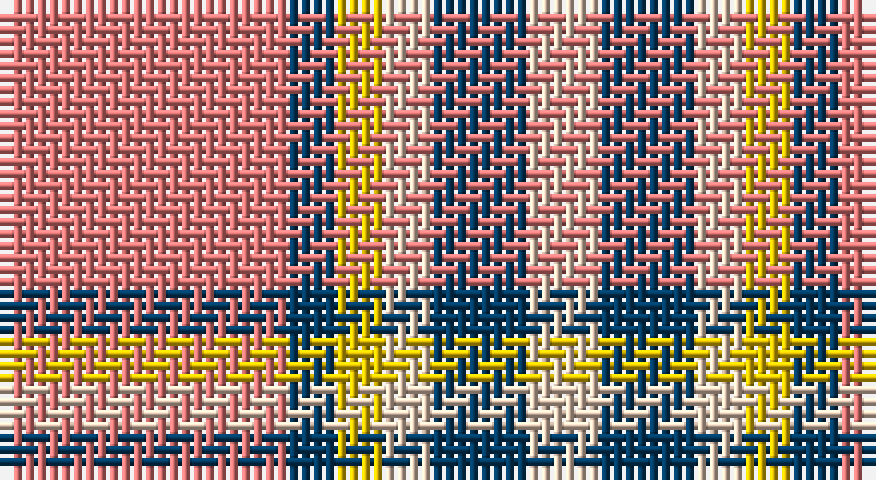

This page is one **sett** — a single exact thread-count. It belongs to the [tartan](/setts/r12dt2ly2lb2dt4lb3/)
(the same proportion at any scale), whose colour order is pattern [RBYWBW](/stripes/rbywbw/).

Sourced from tartans-authority.  It is a [6 stripe tartan](/stripes/stripes6/).

Original link http://www.tartansauthority.com/tartan-ferret/display/10758/

## Register references

External register numbers recorded for this tartan.

- Scottish Register of Tartans: [10758](https://www.tartanregister.gov.uk/tartanDetails?ref=10758)
- Scottish Tartans Authority (ITI): 10758

## Thread count
LRa/24 DB4 Y4 LR4 DB8 LR/6

One full sett is **70 threads**.

## Palette

Palette: <strong>Tartan Register</strong>
<table><thead><tr><th>Colour</th><th>Threads</th><th>Shade</th><th>Base</th><th>OKLCh</th></tr></thead><tbody><tr><td>LRa/</td><td style="text-align:right;font-variant-numeric:tabular-nums">24</td><td><code style="background-color:#E87878;">#E87878</code> <small style="color:#888">#E87878</small></td><td>R <code style="background-color:#CC0000;">#CC0000</code></td><td><small style="color:#888">oklch(70.0% 0.139 21.2)</small></td></tr><tr><td>DB</td><td style="text-align:right;font-variant-numeric:tabular-nums">4</td><td><code style="background-color:#003C64;">#003C64</code> <small style="color:#888">#003C64</small></td><td>B <code style="background-color:#2A418A;">#2A418A</code></td><td><small style="color:#888">oklch(34.5% 0.089 246.0)</small></td></tr><tr><td>Y</td><td style="text-align:right;font-variant-numeric:tabular-nums">4</td><td><code style="background-color:#E8C000;">#E8C000</code> <small style="color:#888">#E8C000</small></td><td>Y <code style="background-color:#F2BF00;">#F2BF00</code></td><td><small style="color:#888">oklch(81.9% 0.168 93.7)</small></td></tr><tr><td>LR</td><td style="text-align:right;font-variant-numeric:tabular-nums">4</td><td><code style="background-color:#E8CCB8;">#E8CCB8</code> <small style="color:#888">#E8CCB8</small></td><td>W <code style="background-color:#F7F7F7;">#F7F7F7</code></td><td><small style="color:#888">oklch(86.3% 0.042 57.7)</small></td></tr><tr><td>DB</td><td style="text-align:right;font-variant-numeric:tabular-nums">8</td><td><code style="background-color:#003C64;">#003C64</code> <small style="color:#888">#003C64</small></td><td>B <code style="background-color:#2A418A;">#2A418A</code></td><td><small style="color:#888">oklch(34.5% 0.089 246.0)</small></td></tr><tr><td>LR/</td><td style="text-align:right;font-variant-numeric:tabular-nums">6</td><td><code style="background-color:#E8CCB8;">#E8CCB8</code> <small style="color:#888">#E8CCB8</small></td><td>W <code style="background-color:#F7F7F7;">#F7F7F7</code></td><td><small style="color:#888">oklch(86.3% 0.042 57.7)</small></td></tr></tbody></table>

# Sample pattern

## Nearest tartans

The nearest existing variants by ΔTartan distance, with this tartan at the top so the swatches line up against it.

ΔTartan

Tartan

Sett

—

<a href="/ttd/edit/#slug=r12dt2ly2lb2dt4lb3~x2">Winnipeg Embroiders' Guild (Corp.)</a> <a class="nn-out" href="/variants/s6/r12dt2ly2lb2dt4lb3~x2/" title="open its dictionary page">↗</a>

1.07

<a href="/ttd/edit/#slug=k4t28r6w12r12w3~x2&amp;base=r12dt2ly2lb2dt4lb3~x2">Thompson, D.C. (Personal)</a> <a class="nn-out" href="/variants/s6/k4t28r6w12r12w3~x2/" title="open its dictionary page">↗</a>

1.23

<a href="/ttd/edit/#slug=r4lbi30y14lb11y4~x2&amp;base=r12dt2ly2lb2dt4lb3~x2">Trinity Bicycles (Corporate)</a> <a class="nn-out" href="/variants/s5/r4lbi30y14lb11y4~x2/" title="open its dictionary page">↗</a>

1.34

<a href="/ttd/edit/#slug=o25k4w8r16~x4&amp;base=r12dt2ly2lb2dt4lb3~x2">Buckeye</a> <a class="nn-out" href="/variants/s4/o25k4w8r16~x4/" title="open its dictionary page">↗</a>

1.36

<a href="/ttd/edit/#slug=m30k7o20ly4k4~x2&amp;base=r12dt2ly2lb2dt4lb3~x2">Drumfintley (Fashion)</a> <a class="nn-out" href="/variants/s5/m30k7o20ly4k4~x2/" title="open its dictionary page">↗</a>

1.44

<a href="/ttd/edit/#slug=y25k4w8r16~x4&amp;base=r12dt2ly2lb2dt4lb3~x2">Buckeye</a> <a class="nn-out" href="/variants/s4/y25k4w8r16~x4/" title="open its dictionary page">↗</a>

1.44

<a href="/ttd/edit/#slug=w5p3w26r20w3r8ly3~x2&amp;base=r12dt2ly2lb2dt4lb3~x2">MacPherson, Red</a> <a class="nn-out" href="/variants/s7/w5p3w26r20w3r8ly3~x2/" title="open its dictionary page">↗</a>

1.46

<a href="/ttd/edit/#slug=w5dp3w26r20w3r8ly3~x2&amp;base=r12dt2ly2lb2dt4lb3~x2">MacPherson Dress Red (Dance)</a> <a class="nn-out" href="/variants/s7/w5dp3w26r20w3r8ly3~x2/" title="open its dictionary page">↗</a>

1.49

<a href="/ttd/edit/#slug=r8lg15b12r29w4~x2&amp;base=r12dt2ly2lb2dt4lb3~x2">Snowbird (Corporate)</a> <a class="nn-out" href="/variants/s5/r8lg15b12r29w4~x2/" title="open its dictionary page">↗</a>

1.49

<a href="/ttd/edit/#slug=r4lyi1r3ly1lyi8ly2~x4&amp;base=r12dt2ly2lb2dt4lb3~x2">Buchele Check (Fashion?)</a> <a class="nn-out" href="/variants/s6/r4lyi1r3ly1lyi8ly2~x4/" title="open its dictionary page">↗</a>

1.53

<a href="/ttd/edit/#slug=oi6ly3oi20o20oi3o3lb6~x2&amp;base=r12dt2ly2lb2dt4lb3~x2">Banff</a> <a class="nn-out" href="/variants/s7/oi6ly3oi20o20oi3o3lb6~x2/" title="open its dictionary page">↗</a>

## Neighbour map

Every grey dot is one of 14360 variants placed by the first two principal components of the ΔTartan feature space (44% of its variance). Red is this tartan; blue dots are its nearest — click one to open its page.

<svg viewBox="0 0 640 380" role="img" style="max-width:100%;height:auto;border:1px solid #e0e0e0;border-radius:4px;display:block" xmlns="http://www.w3.org/2000/svg"><image href="/nn/cloud.v1.png" width="640" height="380"/><a href="/variants/s6/k4t28r6w12r12w3~x2/"><circle cx="203.0" cy="196.3" r="4" fill="#3465a4"><title>Thompson, D.C. (Personal)</title></circle></a><a href="/variants/s5/r4lbi30y14lb11y4~x2/"><circle cx="233.7" cy="221.6" r="4" fill="#3465a4"><title>Trinity Bicycles (Corporate)</title></circle></a><a href="/variants/s4/o25k4w8r16~x4/"><circle cx="204.4" cy="242.1" r="4" fill="#3465a4"><title>Buckeye</title></circle></a><a href="/variants/s5/m30k7o20ly4k4~x2/"><circle cx="233.4" cy="220.5" r="4" fill="#3465a4"><title>Drumfintley (Fashion)</title></circle></a><a href="/variants/s4/y25k4w8r16~x4/"><circle cx="208.4" cy="244.4" r="4" fill="#3465a4"><title>Buckeye</title></circle></a><a href="/variants/s7/w5p3w26r20w3r8ly3~x2/"><circle cx="263.8" cy="169.4" r="4" fill="#3465a4"><title>MacPherson, Red</title></circle></a><a href="/variants/s7/w5dp3w26r20w3r8ly3~x2/"><circle cx="265.3" cy="169.5" r="4" fill="#3465a4"><title>MacPherson Dress Red (Dance)</title></circle></a><a href="/variants/s5/r8lg15b12r29w4~x2/"><circle cx="267.6" cy="236.1" r="4" fill="#3465a4"><title>Snowbird (Corporate)</title></circle></a><a href="/variants/s6/r4lyi1r3ly1lyi8ly2~x4/"><circle cx="259.3" cy="217.0" r="4" fill="#3465a4"><title>Buchele Check (Fashion?)</title></circle></a><a href="/variants/s7/oi6ly3oi20o20oi3o3lb6~x2/"><circle cx="247.2" cy="200.1" r="4" fill="#3465a4"><title>Banff</title></circle></a><circle cx="220.6" cy="202.6" r="5" fill="#c00000"/></svg>

ID: /variants/s6/r12dt2ly2lb2dt4lb3~x2/
