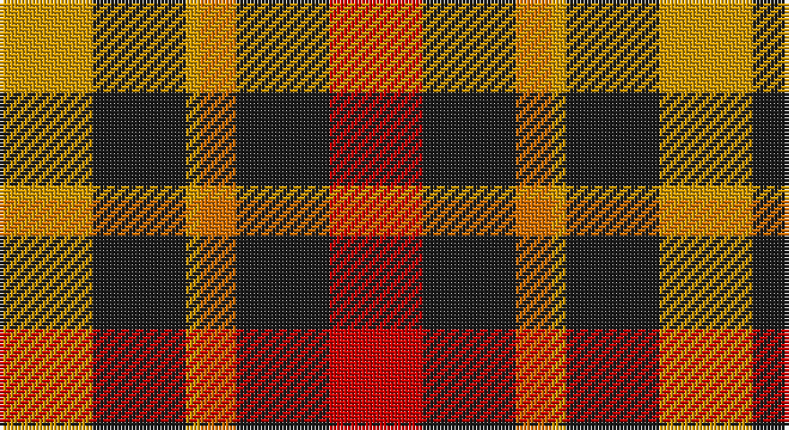

This page is one **sett** — a single exact thread-count. It belongs to the [tartan](/setts/r13dt13o5lo2dt13lo13/)
(the same proportion at any scale), whose colour order is pattern [RBRYBY](/stripes/rbryby/).

Sourced from register-of-tartans.  It is a [6 stripe tartan](/stripes/stripes6/).

Original link https://www.tartanregister.gov.uk/tartanDetails.aspx?ref=5748

2 attestations — the source records this cloth was collapsed from (oldest owns this page)

<ul>
<li>01/01/2008 — Torana (register-of-tartans, <a href="https://www.tartanregister.gov.uk/tartanDetails.aspx?ref=5748">record</a>)</li>
<li>2008 — Torana (Fashion) (tartans-authority, <a href="http://www.tartansauthority.com/tartan-ferret/display/7778/">record</a>)</li>
</ul>

## Register references

External register numbers recorded for this tartan.

- Scottish Register of Tartans: [5748](https://www.tartanregister.gov.uk/tartanDetails.aspx?ref=5748)
- Scottish Tartans Authority (ITI): 7778

## Thread count
DY/26 K26 DY4 O10 K26 R/26

One full sett is **184 threads**.

## Palette

Palette: <strong>Tartan Register</strong> <small style="color:#888">(2 of 4 colours)</small>
<table><thead><tr><th>Colour</th><th>Threads</th><th>Shade</th><th>Base</th><th>OKLCh</th></tr></thead><tbody><tr><td>DY/</td><td style="text-align:right;font-variant-numeric:tabular-nums">26</td><td><code style="background-color:#D09800;">#D09800</code> <small style="color:#888">#D09800</small></td><td>Y <code style="background-color:#F2BF00;">#F2BF00</code></td><td><small style="color:#888">oklch(71.4% 0.147 82.1)</small></td></tr><tr><td>K</td><td style="text-align:right;font-variant-numeric:tabular-nums">26</td><td><code style="background-color:#1C1C1C;">#1C1C1C</code> <small style="color:#888">#1C1C1C</small></td><td>B <code style="background-color:#2A418A;">#2A418A</code></td><td><small style="color:#888">oklch(22.6% 0.000 89.9)</small></td></tr><tr><td>DY</td><td style="text-align:right;font-variant-numeric:tabular-nums">4</td><td><code style="background-color:#D09800;">#D09800</code> <small style="color:#888">#D09800</small></td><td>Y <code style="background-color:#F2BF00;">#F2BF00</code></td><td><small style="color:#888">oklch(71.4% 0.147 82.1)</small></td></tr><tr><td>O</td><td style="text-align:right;font-variant-numeric:tabular-nums">10</td><td><code style="background-color:#D87000;">#D87000</code> <small style="color:#888">#D87000</small></td><td>R <code style="background-color:#CC0000;">#CC0000</code></td><td><small style="color:#888">oklch(65.3% 0.161 55.3)</small></td></tr><tr><td>K</td><td style="text-align:right;font-variant-numeric:tabular-nums">26</td><td><code style="background-color:#1C1C1C;">#1C1C1C</code> <small style="color:#888">#1C1C1C</small></td><td>B <code style="background-color:#2A418A;">#2A418A</code></td><td><small style="color:#888">oklch(22.6% 0.000 89.9)</small></td></tr><tr><td>R/</td><td style="text-align:right;font-variant-numeric:tabular-nums">26</td><td><code style="background-color:#C80000;">#C80000</code> <small style="color:#888">#C80000</small></td><td>R <code style="background-color:#CC0000;">#CC0000</code></td><td><small style="color:#888">oklch(52.3% 0.215 29.2)</small></td></tr></tbody></table>

# Sample pattern

## Nearest tartans

The nearest existing variants by ΔTartan distance, with this tartan at the top so the swatches line up against it.

ΔTartan

Tartan

Sett

—

<a href="/ttd/edit/#slug=r13dt13o5lo2dt13lo13~x2">Torana</a> <a class="nn-out" href="/variants/s6/r13dt13o5lo2dt13lo13~x2/" title="open its dictionary page">↗</a>

0.85

<a href="/ttd/edit/#slug=r6g5k5g5r6t1~x4&amp;base=r13dt13o5lo2dt13lo13~x2">Norwich No.028</a> <a class="nn-out" href="/variants/s6/r6g5k5g5r6t1~x4/" title="open its dictionary page">↗</a>

0.98

<a href="/ttd/edit/#slug=dg9w1r9k9r9~x8&amp;base=r13dt13o5lo2dt13lo13~x2">Unidentified item</a> <a class="nn-out" href="/variants/s5/dg9w1r9k9r9~x8/" title="open its dictionary page">↗</a>

1.03

<a href="/ttd/edit/#slug=r8t3k4g6r4k1r4~x2&amp;base=r13dt13o5lo2dt13lo13~x2">MacDuff</a> <a class="nn-out" href="/variants/s7/r8t3k4g6r4k1r4~x2/" title="open its dictionary page">↗</a>

1.07

<a href="/ttd/edit/#slug=r9k9r9w1g9~x8&amp;base=r13dt13o5lo2dt13lo13~x2">Unidentified, item</a> <a class="nn-out" href="/variants/s5/r9k9r9w1g9~x8/" title="open its dictionary page">↗</a>

1.24

<a href="/ttd/edit/#slug=r8t3k4dg6r4k1r4~x2&amp;base=r13dt13o5lo2dt13lo13~x2">MacDuff #5</a> <a class="nn-out" href="/variants/s7/r8t3k4dg6r4k1r4~x2/" title="open its dictionary page">↗</a>

1.24

<a href="/ttd/edit/#slug=r14k3r14g13db8g13~x2&amp;base=r13dt13o5lo2dt13lo13~x2">Tulsa</a> <a class="nn-out" href="/variants/s6/r14k3r14g13db8g13~x2/" title="open its dictionary page">↗</a>

1.26

<a href="/ttd/edit/#slug=r2ly1r5k4g5w1~x4&amp;base=r13dt13o5lo2dt13lo13~x2">Aboyne II (Fashion)</a> <a class="nn-out" href="/variants/s6/r2ly1r5k4g5w1~x4/" title="open its dictionary page">↗</a>

1.29

<a href="/ttd/edit/#slug=dt2k2dt2r5ly1~x12&amp;base=r13dt13o5lo2dt13lo13~x2">Chivas Regal (Corporate)</a> <a class="nn-out" href="/variants/s5/dt2k2dt2r5ly1~x12/" title="open its dictionary page">↗</a>

1.29

<a href="/ttd/edit/#slug=r10k1r3y7k7y5ly3~x4&amp;base=r13dt13o5lo2dt13lo13~x2">Wcwm 1651</a> <a class="nn-out" href="/variants/s7/r10k1r3y7k7y5ly3~x4/" title="open its dictionary page">↗</a>

1.30

<a href="/ttd/edit/#slug=r8db3k4g6r4k1r4~x4&amp;base=r13dt13o5lo2dt13lo13~x2">MacDuff Clan Tartan</a> <a class="nn-out" href="/variants/s7/r8db3k4g6r4k1r4~x4/" title="open its dictionary page">↗</a>

## Neighbour map

Every grey dot is one of 14360 variants placed by the first two principal components of the ΔTartan feature space (44% of its variance). Red is this tartan; blue dots are its nearest — click one to open its page.

<svg viewBox="0 0 640 380" role="img" style="max-width:100%;height:auto;border:1px solid #e0e0e0;border-radius:4px;display:block" xmlns="http://www.w3.org/2000/svg"><image href="/nn/cloud.v1.png" width="640" height="380"/><a href="/variants/s6/r6g5k5g5r6t1~x4/"><circle cx="149.7" cy="267.7" r="4" fill="#3465a4"><title>Norwich No.028</title></circle></a><a href="/variants/s5/dg9w1r9k9r9~x8/"><circle cx="211.6" cy="248.9" r="4" fill="#3465a4"><title>Unidentified item</title></circle></a><a href="/variants/s7/r8t3k4g6r4k1r4~x2/"><circle cx="213.8" cy="229.9" r="4" fill="#3465a4"><title>MacDuff</title></circle></a><a href="/variants/s5/r9k9r9w1g9~x8/"><circle cx="192.6" cy="244.7" r="4" fill="#3465a4"><title>Unidentified, item</title></circle></a><a href="/variants/s7/r8t3k4dg6r4k1r4~x2/"><circle cx="230.9" cy="233.9" r="4" fill="#3465a4"><title>MacDuff #5</title></circle></a><a href="/variants/s6/r14k3r14g13db8g13~x2/"><circle cx="164.7" cy="283.0" r="4" fill="#3465a4"><title>Tulsa</title></circle></a><a href="/variants/s6/r2ly1r5k4g5w1~x4/"><circle cx="112.9" cy="222.9" r="4" fill="#3465a4"><title>Aboyne II (Fashion)</title></circle></a><a href="/variants/s5/dt2k2dt2r5ly1~x12/"><circle cx="175.6" cy="262.7" r="4" fill="#3465a4"><title>Chivas Regal (Corporate)</title></circle></a><a href="/variants/s7/r10k1r3y7k7y5ly3~x4/"><circle cx="156.8" cy="220.2" r="4" fill="#3465a4"><title>Wcwm 1651</title></circle></a><a href="/variants/s7/r8db3k4g6r4k1r4~x4/"><circle cx="239.1" cy="240.6" r="4" fill="#3465a4"><title>MacDuff Clan Tartan</title></circle></a><circle cx="162.9" cy="246.7" r="5" fill="#c00000"/></svg>

ID: /variants/s6/r13dt13o5lo2dt13lo13~x2/
