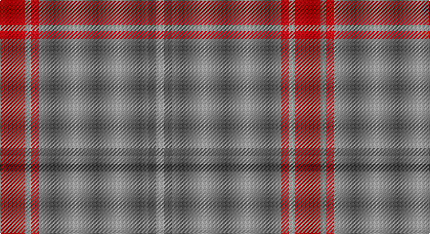

This page is one **sett** — a single exact thread-count. It belongs to the [tartan](/setts/r13y3r4y56n4y4/)
(the same proportion at any scale), whose colour order is pattern [GBGRGR](/stripes/gbgrgr/).

Sourced from weddslist.  It is a [6 stripe tartan](/stripes/stripes6/).

Original link http://www.weddslist.com/cgi-bin/tartans/pg.pl?source=sts

## Thread count
R/26 Na6 R8 Na112 N8 Na/8

One full sett is **302 threads**.

## Palette

Palette: <strong>Tartan Register</strong> <small style="color:#888">(2 of 3 colours)</small>
<table><thead><tr><th>Colour</th><th>Threads</th><th>Shade</th><th>Base</th><th>OKLCh</th></tr></thead><tbody><tr><td>R/</td><td style="text-align:right;font-variant-numeric:tabular-nums">26</td><td><code style="background-color:#C00000;">#C00000</code> <small style="color:#888">#C00000</small></td><td>R <code style="background-color:#CC0000;">#CC0000</code></td><td><small style="color:#888">oklch(50.7% 0.208 29.2)</small></td></tr><tr><td>Na</td><td style="text-align:right;font-variant-numeric:tabular-nums">6</td><td><code style="background-color:#808080;">#808080</code> <small style="color:#888">#808080</small></td><td>G <code style="background-color:#006100;">#006100</code></td><td><small style="color:#888">oklch(60.0% 0.000 89.9)</small></td></tr><tr><td>R</td><td style="text-align:right;font-variant-numeric:tabular-nums">8</td><td><code style="background-color:#C00000;">#C00000</code> <small style="color:#888">#C00000</small></td><td>R <code style="background-color:#CC0000;">#CC0000</code></td><td><small style="color:#888">oklch(50.7% 0.208 29.2)</small></td></tr><tr><td>Na</td><td style="text-align:right;font-variant-numeric:tabular-nums">112</td><td><code style="background-color:#808080;">#808080</code> <small style="color:#888">#808080</small></td><td>G <code style="background-color:#006100;">#006100</code></td><td><small style="color:#888">oklch(60.0% 0.000 89.9)</small></td></tr><tr><td>N</td><td style="text-align:right;font-variant-numeric:tabular-nums">8</td><td><code style="background-color:#505050;">#505050</code> <small style="color:#888">#505050</small></td><td>B <code style="background-color:#2A418A;">#2A418A</code></td><td><small style="color:#888">oklch(43.1% 0.000 89.9)</small></td></tr><tr><td>Na/</td><td style="text-align:right;font-variant-numeric:tabular-nums">8</td><td><code style="background-color:#808080;">#808080</code> <small style="color:#888">#808080</small></td><td>G <code style="background-color:#006100;">#006100</code></td><td><small style="color:#888">oklch(60.0% 0.000 89.9)</small></td></tr></tbody></table>

# Sample pattern

## Nearest tartans

The nearest existing variants by ΔTartan distance, with this tartan at the top so the swatches line up against it.

ΔTartan

Tartan

Sett

—

<a href="/ttd/edit/#slug=r13y3r4y56n4y4~x2">Auchairne grey</a> <a class="nn-out" href="/variants/s6/r13y3r4y56n4y4~x2/" title="open its dictionary page">↗</a>

0.28

<a href="/ttd/edit/#slug=r13o3r4o56n4o4~x2&amp;base=r13y3r4y56n4y4~x2">Auchairne Grey</a> <a class="nn-out" href="/variants/s6/r13o3r4o56n4o4~x2/" title="open its dictionary page">↗</a>

1.69

<a href="/ttd/edit/#slug=y60g13y9r8ly4~x2&amp;base=r13y3r4y56n4y4~x2">Ballantyne (Personal)</a> <a class="nn-out" href="/variants/s5/y60g13y9r8ly4~x2/" title="open its dictionary page">↗</a>

1.84

<a href="/ttd/edit/#slug=n65k2n4lr2n10r24~x2&amp;base=r13y3r4y56n4y4~x2">Norsemen (Corporate)</a> <a class="nn-out" href="/variants/s6/n65k2n4lr2n10r24~x2/" title="open its dictionary page">↗</a>

1.93

<a href="/ttd/edit/#slug=y40r8y4w2y4ly5~x2&amp;base=r13y3r4y56n4y4~x2">Reid (1939)</a> <a class="nn-out" href="/variants/s6/y40r8y4w2y4ly5~x2/" title="open its dictionary page">↗</a>

2.06

<a href="/ttd/edit/#slug=o60dg13o9oi8ly4~x2&amp;base=r13y3r4y56n4y4~x2">Ballantyne Personal Tartan</a> <a class="nn-out" href="/variants/s5/o60dg13o9oi8ly4~x2/" title="open its dictionary page">↗</a>

2.11

<a href="/ttd/edit/#slug=o16lb8dy1lb2dy1lb1dy8o34w2~x2&amp;base=r13y3r4y56n4y4~x2">Stuart of Bute St Colmac</a> <a class="nn-out" href="/variants/s9/o16lb8dy1lb2dy1lb1dy8o34w2~x2/" title="open its dictionary page">↗</a>

2.14

<a href="/ttd/edit/#slug=db3y1w1y25w1y1p3~x2&amp;base=r13y3r4y56n4y4~x2">St Giles, Check</a> <a class="nn-out" href="/variants/s7/db3y1w1y25w1y1p3~x2/" title="open its dictionary page">↗</a>

2.18

<a href="/ttd/edit/#slug=w2o44dt8o2dt2o3r1~x2&amp;base=r13y3r4y56n4y4~x2">Reece, Mathew</a> <a class="nn-out" href="/variants/s7/w2o44dt8o2dt2o3r1~x2/" title="open its dictionary page">↗</a>

2.20

<a href="/ttd/edit/#slug=o5g1o32r1o8r9o2g2g3r3g1~x2&amp;base=r13y3r4y56n4y4~x2">Portosalvo (Corporate)</a> <a class="nn-out" href="/variants/s11/o5g1o32r1o8r9o2g2g3r3g1~x2/" title="open its dictionary page">↗</a>

2.21

<a href="/ttd/edit/#slug=y65r27w2y4ly5~x2&amp;base=r13y3r4y56n4y4~x2">Perry, Arisaid</a> <a class="nn-out" href="/variants/s5/y65r27w2y4ly5~x2/" title="open its dictionary page">↗</a>

## Neighbour map

Every grey dot is one of 14360 variants placed by the first two principal components of the ΔTartan feature space (44% of its variance). Red is this tartan; blue dots are its nearest — click one to open its page.

<svg viewBox="0 0 640 380" role="img" style="max-width:100%;height:auto;border:1px solid #e0e0e0;border-radius:4px;display:block" xmlns="http://www.w3.org/2000/svg"><image href="/nn/cloud.v1.png" width="640" height="380"/><a href="/variants/s6/r13o3r4o56n4o4~x2/"><circle cx="602.4" cy="213.0" r="4" fill="#3465a4"><title>Auchairne Grey</title></circle></a><a href="/variants/s5/y60g13y9r8ly4~x2/"><circle cx="526.7" cy="226.0" r="4" fill="#3465a4"><title>Ballantyne (Personal)</title></circle></a><a href="/variants/s6/n65k2n4lr2n10r24~x2/"><circle cx="578.6" cy="186.4" r="4" fill="#3465a4"><title>Norsemen (Corporate)</title></circle></a><a href="/variants/s6/y40r8y4w2y4ly5~x2/"><circle cx="564.5" cy="187.4" r="4" fill="#3465a4"><title>Reid (1939)</title></circle></a><a href="/variants/s5/o60dg13o9oi8ly4~x2/"><circle cx="505.7" cy="212.7" r="4" fill="#3465a4"><title>Ballantyne Personal Tartan</title></circle></a><a href="/variants/s9/o16lb8dy1lb2dy1lb1dy8o34w2~x2/"><circle cx="528.2" cy="165.1" r="4" fill="#3465a4"><title>Stuart of Bute St Colmac</title></circle></a><a href="/variants/s7/db3y1w1y25w1y1p3~x2/"><circle cx="573.3" cy="153.6" r="4" fill="#3465a4"><title>St Giles, Check</title></circle></a><a href="/variants/s7/w2o44dt8o2dt2o3r1~x2/"><circle cx="626.0" cy="135.6" r="4" fill="#3465a4"><title>Reece, Mathew</title></circle></a><a href="/variants/s11/o5g1o32r1o8r9o2g2g3r3g1~x2/"><circle cx="538.0" cy="141.2" r="4" fill="#3465a4"><title>Portosalvo (Corporate)</title></circle></a><a href="/variants/s5/y65r27w2y4ly5~x2/"><circle cx="507.0" cy="174.4" r="4" fill="#3465a4"><title>Perry, Arisaid</title></circle></a><circle cx="608.4" cy="217.5" r="5" fill="#c00000"/></svg>

ID: /variants/s6/r13y3r4y56n4y4~x2/
