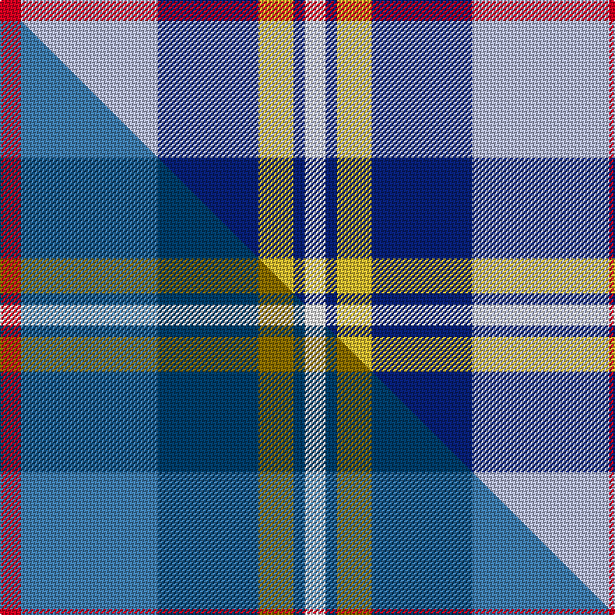

This page is one **sett** — a single exact thread-count. It belongs to the [tartan](/setts/r15lb98db72ly25db8w15/)
(the same proportion at any scale), whose colour order is pattern [RWBYBW](/stripes/rwbybw/).

Part of the [Afternoon Tea / Earl](/tartans/afternoon-tea-earl/) tartan — the named design grouping this sett with its other cloths.

Sourced from tartans-authority.  It is a [6 stripe tartan](/stripes/stripes6/).

Original link http://www.tartansauthority.com/tartan-ferret/display/11277/

## Register references

External register numbers recorded for this tartan.

- Scottish Register of Tartans: [11277](https://www.tartanregister.gov.uk/tartanDetails?ref=11277)
- Scottish Tartans Authority (ITI): 11277

## Thread count
R/15 LB98 DB72 LY25 DB8 W/15

One full sett is **436 threads**.

## Palette
<table><thead><tr><th>Colour</th><th>Shade</th><th>OKLCh</th></tr></thead><tbody><tr><td>LB</td><td><code style="background-color:#B5BBDE;">#B5BBDE</code> <small style="color:#888">#B5BBDE</small></td><td><small style="color:#888">oklch(79.9% 0.050 277.6)</small></td></tr><tr><td>DB</td><td><code style="background-color:#082077;">#082077</code> <small style="color:#888">#082077</small></td><td><small style="color:#888">oklch(30.0% 0.149 265.1)</small></td></tr><tr><td>R</td><td><code style="background-color:#D60020;">#D60020</code> <small style="color:#888">#D60020</small></td><td><small style="color:#888">oklch(55.2% 0.224 25.5)</small></td></tr><tr><td>W</td><td><code style="background-color:#F7F7F7;">#F7F7F7</code> <small style="color:#888">#F7F7F7</small></td><td><small style="color:#888">oklch(97.6% 0.000 89.9)</small></td></tr><tr><td>LY</td><td><code style="background-color:#DCBC32;">#DCBC32</code> <small style="color:#888">#DCBC32</small></td><td><small style="color:#888">oklch(80.0% 0.150 95.2)</small></td></tr></tbody></table>

# Sample pattern

## Compared to the master

This cloth is one sett of its design; the master sett (the exemplar the design is anchored on) is below for comparison.

Its **ΔTartan distance** from the master is **1.98** — the same measure the nearest-tartans table ranks by (0 is identical; a re-scale of the same cloth is near 0, a recolour or a different proportion further).

<figure class="master-compare" style="margin:0">

this sett
master sett ★

<figcaption style="color:#888;font-size:smaller">One weave of this sett against the <a href="/setts/r15t98db72y25db8w15/">master sett ★</a>, split on the diagonal: a shared proportion runs seamlessly across it with only the shades shifting; a different proportion breaks on it.</figcaption>
</figure>

## Nearest variants

The nearest existing variants by ΔTartan distance, with this cloth at the top so the swatches line up against it.

ΔTartan

Threads

Variant

Sett

—

436

<a href="/variants/s6/r15lb98db72ly25db8w15/">Afternoon Tea / Earl Grey</a>

<a href="/ttd/edit/#slug=db9y9db9lb23r3~x2&amp;base=r15lb98db72ly25db8w15" title="compare in the TTD">0.81</a>

188

<a href="/variants/s5/db9y9db9lb23r3~x2/">Tilburg (District)</a>

<a href="/ttd/edit/#slug=db1lb9w3y3db9y1g1r1~x4&amp;base=r15lb98db72ly25db8w15" title="compare in the TTD">1.92</a>

216

<a href="/variants/s8/db1lb9w3y3db9y1g1r1~x4/">Curd (2013)</a>

<a href="/ttd/edit/#slug=g4w28db14y2lb17g4~x2&amp;base=r15lb98db72ly25db8w15" title="compare in the TTD">2.11</a>

260

<a href="/variants/s6/g4w28db14y2lb17g4~x2/">Allanton Dress (Fashion)</a>

<a href="/ttd/edit/#slug=r12ly3w14db10ly2db24r2~x2&amp;base=r15lb98db72ly25db8w15" title="compare in the TTD">2.20</a>

240

<a href="/variants/s7/r12ly3w14db10ly2db24r2~x2/">Yusra (Personal)</a>

<a href="/ttd/edit/#slug=r10w5db30lb20r3~x4&amp;base=r15lb98db72ly25db8w15" title="compare in the TTD">2.29</a>

492

<a href="/variants/s5/r10w5db30lb20r3~x4/">Lands of Liberty</a>

<a href="/ttd/edit/#slug=w8lb30g5w3db8r5&amp;base=r15lb98db72ly25db8w15" title="compare in the TTD">2.32</a>

105

<a href="/variants/s6/w8lb30g5w3db8r5/">Roseberry</a>

<a href="/ttd/edit/#slug=r15w10db48lb32r6~x2&amp;base=r15lb98db72ly25db8w15" title="compare in the TTD">2.35</a>

402

<a href="/variants/s5/r15w10db48lb32r6~x2/">Lands of Liberty (Fashion)</a>

<a href="/ttd/edit/#slug=db9w4dg36lb36r4~x2&amp;base=r15lb98db72ly25db8w15" title="compare in the TTD">2.37</a>

330

<a href="/variants/s5/db9w4dg36lb36r4~x2/">Alvis of Lee (Personal)</a>

<a href="/ttd/edit/#slug=db13y2r4g2lb8w2~x6&amp;base=r15lb98db72ly25db8w15" title="compare in the TTD">2.51</a>

282

<a href="/variants/s6/db13y2r4g2lb8w2~x6/">Meh Dundee</a>

<a href="/ttd/edit/#slug=lb6ly6t21db32r3~x2&amp;base=r15lb98db72ly25db8w15" title="compare in the TTD">2.59</a>

254

<a href="/variants/s5/lb6ly6t21db32r3~x2/">Jamieson, Robert (Personal)</a>

## Neighbour map

Every grey dot is one of 13620 variants placed by the first two principal components of the ΔTartan feature space (42% of its variance). Red is this tartan; blue dots are its nearest — click one to open its page.

<svg viewBox="0 0 640 380" role="img" style="max-width:100%;height:auto;border:1px solid #e0e0e0;border-radius:4px;display:block" xmlns="http://www.w3.org/2000/svg"><image href="/nn/cloud.v1.png" width="640" height="380"/><a href="/variants/s5/db9y9db9lb23r3~x2/"><circle cx="209.9" cy="250.3" r="4" fill="#3465a4"><title>Tilburg (District)</title></circle></a><a href="/variants/s8/db1lb9w3y3db9y1g1r1~x4/"><circle cx="133.1" cy="168.4" r="4" fill="#3465a4"><title>Curd (2013)</title></circle></a><a href="/variants/s6/g4w28db14y2lb17g4~x2/"><circle cx="198.7" cy="203.6" r="4" fill="#3465a4"><title>Allanton Dress (Fashion)</title></circle></a><a href="/variants/s7/r12ly3w14db10ly2db24r2~x2/"><circle cx="228.4" cy="189.2" r="4" fill="#3465a4"><title>Yusra (Personal)</title></circle></a><a href="/variants/s5/r10w5db30lb20r3~x4/"><circle cx="210.3" cy="218.5" r="4" fill="#3465a4"><title>Lands of Liberty</title></circle></a><a href="/variants/s6/w8lb30g5w3db8r5/"><circle cx="246.8" cy="195.0" r="4" fill="#3465a4"><title>Roseberry</title></circle></a><a href="/variants/s5/r15w10db48lb32r6~x2/"><circle cx="193.7" cy="230.2" r="4" fill="#3465a4"><title>Lands of Liberty (Fashion)</title></circle></a><a href="/variants/s5/db9w4dg36lb36r4~x2/"><circle cx="196.8" cy="210.2" r="4" fill="#3465a4"><title>Alvis of Lee (Personal)</title></circle></a><a href="/variants/s6/db13y2r4g2lb8w2~x6/"><circle cx="143.5" cy="200.7" r="4" fill="#3465a4"><title>Meh Dundee</title></circle></a><a href="/variants/s5/lb6ly6t21db32r3~x2/"><circle cx="241.6" cy="212.4" r="4" fill="#3465a4"><title>Jamieson, Robert (Personal)</title></circle></a><circle cx="208.0" cy="191.5" r="5" fill="#c00000"/><text x="320" y="376" text-anchor="middle" font-size="11" fill="#999">ground</text><text x="11" y="190" text-anchor="middle" font-size="11" fill="#999" transform="rotate(-90 11 190)">complexity</text></svg>

ID: /variants/s6/r15lb98db72ly25db8w15/
