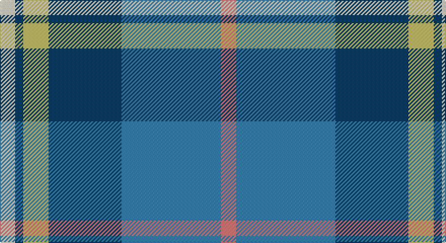

This page is one **sett** — a single exact thread-count. It belongs to the [tartan](/setts/r15t98dt72ly25dt8w15/)
(the same proportion at any scale), whose colour order is pattern [RBBYBW](/stripes/rbbybw/).

Part of the [Afternoon Tea / Earl](/tartans/afternoon-tea-earl/) tartan — the named design grouping this sett with its other cloths.

Sourced from register-of-tartans.  It is a [6 stripe tartan](/stripes/stripes6/).

Original link https://www.tartanregister.gov.uk/tartanDetails.aspx?ref=11277

## Also known as

This cloth is also recorded under:

- Afternoon Tea / Earl Grey

## Register references

External register numbers recorded for this tartan.

- Scottish Register of Tartans: [11277](https://www.tartanregister.gov.uk/tartanDetails.aspx?ref=11277)

## Thread count
W/15 DB8 LG25 DB72 B98 LR/15

One full sett is **436 threads**.

## Palette

Palette: <strong>Tartan Register</strong> <small style="color:#888">(4 of 5 colours)</small>
<table><thead><tr><th>Colour</th><th>Threads</th><th>Shade</th><th>Base</th><th>OKLCh</th></tr></thead><tbody><tr><td>W/</td><td style="text-align:right;font-variant-numeric:tabular-nums">15</td><td><code style="background-color:#F0E0C8;">#F0E0C8</code> <small style="color:#888">#F0E0C8</small></td><td>W <code style="background-color:#F7F7F7;">#F7F7F7</code></td><td><small style="color:#888">oklch(91.3% 0.036 78.1)</small></td></tr><tr><td>DB</td><td style="text-align:right;font-variant-numeric:tabular-nums">8</td><td><code style="background-color:#003C64;">#003C64</code> <small style="color:#888">#003C64</small></td><td>B <code style="background-color:#2A418A;">#2A418A</code></td><td><small style="color:#888">oklch(34.5% 0.089 246.0)</small></td></tr><tr><td>LG</td><td style="text-align:right;font-variant-numeric:tabular-nums">25</td><td><code style="background-color:#C4BC68;">#C4BC68</code> <small style="color:#888">#C4BC68</small></td><td>Y <code style="background-color:#F2BF00;">#F2BF00</code></td><td><small style="color:#888">oklch(78.4% 0.107 103.7)</small></td></tr><tr><td>DB</td><td style="text-align:right;font-variant-numeric:tabular-nums">72</td><td><code style="background-color:#003C64;">#003C64</code> <small style="color:#888">#003C64</small></td><td>B <code style="background-color:#2A418A;">#2A418A</code></td><td><small style="color:#888">oklch(34.5% 0.089 246.0)</small></td></tr><tr><td>B</td><td style="text-align:right;font-variant-numeric:tabular-nums">98</td><td><code style="background-color:#3682AF;">#3682AF</code> <small style="color:#888">#3682AF</small></td><td>B <code style="background-color:#2A418A;">#2A418A</code></td><td><small style="color:#888">oklch(57.9% 0.101 238.2)</small></td></tr><tr><td>LR/</td><td style="text-align:right;font-variant-numeric:tabular-nums">15</td><td><code style="background-color:#E87878;">#E87878</code> <small style="color:#888">#E87878</small></td><td>R <code style="background-color:#CC0000;">#CC0000</code></td><td><small style="color:#888">oklch(70.0% 0.139 21.2)</small></td></tr></tbody></table>

# Sample pattern

## Nearest tartans

The nearest existing variants by ΔTartan distance, with this tartan at the top so the swatches line up against it.

ΔTartan

Tartan

Sett

—

<a href="/ttd/edit/#slug=r15t98dt72ly25dt8w15">Afternoon Tea / Earl Grey</a> <a class="nn-out" href="/variants/s6/r15t98dt72ly25dt8w15/" title="open its dictionary page">↗</a>

0.69

<a href="/ttd/edit/#slug=w15lg98dt72b25dt8ly15&amp;base=r15t98dt72ly25dt8w15">Afternoon Tea / Mint Tea</a> <a class="nn-out" href="/variants/s6/w15lg98dt72b25dt8ly15/" title="open its dictionary page">↗</a>

0.87

<a href="/ttd/edit/#slug=g5db15t11w2t1w1dg4~x4&amp;base=r15t98dt72ly25dt8w15">Highlands Country Club</a> <a class="nn-out" href="/variants/s7/g5db15t11w2t1w1dg4~x4/" title="open its dictionary page">↗</a>

0.93

<a href="/ttd/edit/#slug=w3b12db1g15m3w1~x4&amp;base=r15t98dt72ly25dt8w15">Eeraerts, Laurent (Personal)</a> <a class="nn-out" href="/variants/s6/w3b12db1g15m3w1~x4/" title="open its dictionary page">↗</a>

0.98

<a href="/ttd/edit/#slug=lb6lo6b21dt32r3~x2&amp;base=r15t98dt72ly25dt8w15">Jamieson, Robert (Personal)</a> <a class="nn-out" href="/variants/s5/lb6lo6b21dt32r3~x2/" title="open its dictionary page">↗</a>

0.98

<a href="/ttd/edit/#slug=dt36t21ly4lb12dp2~x2&amp;base=r15t98dt72ly25dt8w15">Emond, Kenneth (Personal)</a> <a class="nn-out" href="/variants/s5/dt36t21ly4lb12dp2~x2/" title="open its dictionary page">↗</a>

1.05

<a href="/ttd/edit/#slug=b5dy28lb5k20lo5b47lo4~x2&amp;base=r15t98dt72ly25dt8w15">State Seal of Washington (Fashion)</a> <a class="nn-out" href="/variants/s7/b5dy28lb5k20lo5b47lo4~x2/" title="open its dictionary page">↗</a>

1.05

<a href="/ttd/edit/#slug=dt4b28dt11w2dt2g14ly2~x2&amp;base=r15t98dt72ly25dt8w15">Rhode Island, State of</a> <a class="nn-out" href="/variants/s7/dt4b28dt11w2dt2g14ly2~x2/" title="open its dictionary page">↗</a>

1.06

<a href="/ttd/edit/#slug=g11lo10dt11b33w3~x2&amp;base=r15t98dt72ly25dt8w15">Sterling (Name)</a> <a class="nn-out" href="/variants/s5/g11lo10dt11b33w3~x2/" title="open its dictionary page">↗</a>

1.06

<a href="/ttd/edit/#slug=g5mi3g32k16b32m3b5~x2&amp;base=r15t98dt72ly25dt8w15">MacThomas</a> <a class="nn-out" href="/variants/s7/g5mi3g32k16b32m3b5~x2/" title="open its dictionary page">↗</a>

1.08

<a href="/ttd/edit/#slug=db20k6lo4db3g20w2~x2&amp;base=r15t98dt72ly25dt8w15">DeLoughery (Personal)</a> <a class="nn-out" href="/variants/s6/db20k6lo4db3g20w2~x2/" title="open its dictionary page">↗</a>

## Neighbour map

Every grey dot is one of 14360 variants placed by the first two principal components of the ΔTartan feature space (44% of its variance). Red is this tartan; blue dots are its nearest — click one to open its page.

<svg viewBox="0 0 640 380" role="img" style="max-width:100%;height:auto;border:1px solid #e0e0e0;border-radius:4px;display:block" xmlns="http://www.w3.org/2000/svg"><image href="/nn/cloud.v1.png" width="640" height="380"/><a href="/variants/s6/w15lg98dt72b25dt8ly15/"><circle cx="192.8" cy="182.3" r="4" fill="#3465a4"><title>Afternoon Tea / Mint Tea</title></circle></a><a href="/variants/s7/g5db15t11w2t1w1dg4~x4/"><circle cx="198.6" cy="178.9" r="4" fill="#3465a4"><title>Highlands Country Club</title></circle></a><a href="/variants/s6/w3b12db1g15m3w1~x4/"><circle cx="204.5" cy="165.5" r="4" fill="#3465a4"><title>Eeraerts, Laurent (Personal)</title></circle></a><a href="/variants/s5/lb6lo6b21dt32r3~x2/"><circle cx="240.9" cy="214.8" r="4" fill="#3465a4"><title>Jamieson, Robert (Personal)</title></circle></a><a href="/variants/s5/dt36t21ly4lb12dp2~x2/"><circle cx="239.8" cy="180.6" r="4" fill="#3465a4"><title>Emond, Kenneth (Personal)</title></circle></a><a href="/variants/s7/b5dy28lb5k20lo5b47lo4~x2/"><circle cx="218.6" cy="177.7" r="4" fill="#3465a4"><title>State Seal of Washington (Fashion)</title></circle></a><a href="/variants/s7/dt4b28dt11w2dt2g14ly2~x2/"><circle cx="246.4" cy="182.1" r="4" fill="#3465a4"><title>Rhode Island, State of</title></circle></a><a href="/variants/s5/g11lo10dt11b33w3~x2/"><circle cx="228.7" cy="219.6" r="4" fill="#3465a4"><title>Sterling (Name)</title></circle></a><a href="/variants/s7/g5mi3g32k16b32m3b5~x2/"><circle cx="212.0" cy="199.5" r="4" fill="#3465a4"><title>MacThomas</title></circle></a><a href="/variants/s6/db20k6lo4db3g20w2~x2/"><circle cx="206.5" cy="204.1" r="4" fill="#3465a4"><title>DeLoughery (Personal)</title></circle></a><circle cx="207.9" cy="186.9" r="5" fill="#c00000"/></svg>

ID: /variants/s6/r15t98dt72ly25dt8w15/
