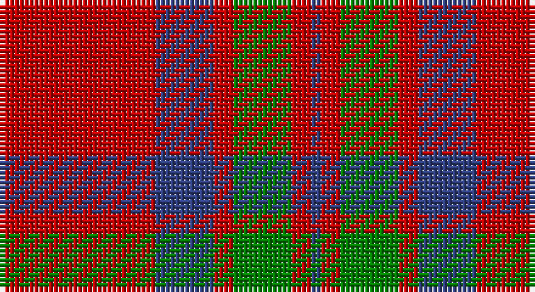

This page is one **sett** — a single exact thread-count. It belongs to the [tartan](/setts/r16db6r2g6r2db1/)
(the same proportion at any scale), whose colour order is pattern [BRGRBR](/stripes/brgrbr/).

Sourced from weddslist.  It is a [6 stripe tartan](/stripes/stripes6/).

Original link http://www.weddslist.com/cgi-bin/tartans/pg.pl?source=sts

## Thread count
R/32 B12 R4 G12 R4 B/2

One full sett is **98 threads**.

## Palette

Palette: <strong>custom</strong>
<table><thead><tr><th>Colour</th><th>Threads</th><th>Shade</th><th>Base</th><th>OKLCh</th></tr></thead><tbody><tr><td>R/</td><td style="text-align:right;font-variant-numeric:tabular-nums">32</td><td><code style="background-color:#C00000;">#C00000</code> <small style="color:#888">#C00000</small></td><td>R <code style="background-color:#CC0000;">#CC0000</code></td><td><small style="color:#888">oklch(50.7% 0.208 29.2)</small></td></tr><tr><td>B</td><td style="text-align:right;font-variant-numeric:tabular-nums">12</td><td><code style="background-color:#304080;">#304080</code> <small style="color:#888">#304080</small></td><td>B <code style="background-color:#2A418A;">#2A418A</code></td><td><small style="color:#888">oklch(39.4% 0.109 270.2)</small></td></tr><tr><td>R</td><td style="text-align:right;font-variant-numeric:tabular-nums">4</td><td><code style="background-color:#C00000;">#C00000</code> <small style="color:#888">#C00000</small></td><td>R <code style="background-color:#CC0000;">#CC0000</code></td><td><small style="color:#888">oklch(50.7% 0.208 29.2)</small></td></tr><tr><td>G</td><td style="text-align:right;font-variant-numeric:tabular-nums">12</td><td><code style="background-color:#008000;">#008000</code> <small style="color:#888">#008000</small></td><td>G <code style="background-color:#006100;">#006100</code></td><td><small style="color:#888">oklch(52.0% 0.177 142.5)</small></td></tr><tr><td>R</td><td style="text-align:right;font-variant-numeric:tabular-nums">4</td><td><code style="background-color:#C00000;">#C00000</code> <small style="color:#888">#C00000</small></td><td>R <code style="background-color:#CC0000;">#CC0000</code></td><td><small style="color:#888">oklch(50.7% 0.208 29.2)</small></td></tr><tr><td>B/</td><td style="text-align:right;font-variant-numeric:tabular-nums">2</td><td><code style="background-color:#304080;">#304080</code> <small style="color:#888">#304080</small></td><td>B <code style="background-color:#2A418A;">#2A418A</code></td><td><small style="color:#888">oklch(39.4% 0.109 270.2)</small></td></tr></tbody></table>

# Sample pattern

## Nearest tartans

The nearest existing variants by ΔTartan distance, with this tartan at the top so the swatches line up against it.

ΔTartan

Tartan

Sett

—

<a href="/ttd/edit/#slug=r16db6r2g6r2db1~x2">MacKintosh, Plaid</a> <a class="nn-out" href="/variants/s6/r16db6r2g6r2db1~x2/" title="open its dictionary page">↗</a>

0.43

<a href="/ttd/edit/#slug=r16db6r2dg6r2db1~x2&amp;base=r16db6r2g6r2db1~x2">MacKintosh Plaid</a> <a class="nn-out" href="/variants/s6/r16db6r2dg6r2db1~x2/" title="open its dictionary page">↗</a>

0.60

<a href="/ttd/edit/#slug=db2r25g10r2db10r2~x2&amp;base=r16db6r2g6r2db1~x2">Grant of Lurg</a> <a class="nn-out" href="/variants/s6/db2r25g10r2db10r2~x2/" title="open its dictionary page">↗</a>

0.63

<a href="/ttd/edit/#slug=r68db18r9g34r9db3~x2&amp;base=r16db6r2g6r2db1~x2">MacKintosh 3</a> <a class="nn-out" href="/variants/s6/r68db18r9g34r9db3~x2/" title="open its dictionary page">↗</a>

0.63

<a href="/ttd/edit/#slug=r70db20r10g40r10db3&amp;base=r16db6r2g6r2db1~x2">MacKintosh</a> <a class="nn-out" href="/variants/s6/r70db20r10g40r10db3/" title="open its dictionary page">↗</a>

0.67

<a href="/ttd/edit/#slug=r22db5r2g11r3db1~x2&amp;base=r16db6r2g6r2db1~x2">MacKintosh 1</a> <a class="nn-out" href="/variants/s6/r22db5r2g11r3db1~x2/" title="open its dictionary page">↗</a>

0.74

<a href="/ttd/edit/#slug=r68db18r9dg34r9db3~x2&amp;base=r16db6r2g6r2db1~x2">MacKintosh #2</a> <a class="nn-out" href="/variants/s6/r68db18r9dg34r9db3~x2/" title="open its dictionary page">↗</a>

0.82

<a href="/ttd/edit/#slug=db4r3db3r22g8r2~x2&amp;base=r16db6r2g6r2db1~x2">Auld Reekie</a> <a class="nn-out" href="/variants/s6/db4r3db3r22g8r2~x2/" title="open its dictionary page">↗</a>

0.86

<a href="/ttd/edit/#slug=m6lb2m30g12m3g12m3~x2&amp;base=r16db6r2g6r2db1~x2">Crawford</a> <a class="nn-out" href="/variants/s7/m6lb2m30g12m3g12m3~x2/" title="open its dictionary page">↗</a>

0.86

<a href="/ttd/edit/#slug=m6w2m30g12m3g12m3~x2&amp;base=r16db6r2g6r2db1~x2">Crawford (Clan)</a> <a class="nn-out" href="/variants/s7/m6w2m30g12m3g12m3~x2/" title="open its dictionary page">↗</a>

0.89

<a href="/ttd/edit/#slug=r2db1r16db4r1g10r1~x4&amp;base=r16db6r2g6r2db1~x2">Robertson - 1988 (Corporate)</a> <a class="nn-out" href="/variants/s7/r2db1r16db4r1g10r1~x4/" title="open its dictionary page">↗</a>

## Neighbour map

Every grey dot is one of 14360 variants placed by the first two principal components of the ΔTartan feature space (44% of its variance). Red is this tartan; blue dots are its nearest — click one to open its page.

<svg viewBox="0 0 640 380" role="img" style="max-width:100%;height:auto;border:1px solid #e0e0e0;border-radius:4px;display:block" xmlns="http://www.w3.org/2000/svg"><image href="/nn/cloud.v1.png" width="640" height="380"/><a href="/variants/s6/r16db6r2dg6r2db1~x2/"><circle cx="401.8" cy="200.5" r="4" fill="#3465a4"><title>MacKintosh Plaid</title></circle></a><a href="/variants/s6/db2r25g10r2db10r2~x2/"><circle cx="369.4" cy="207.4" r="4" fill="#3465a4"><title>Grant of Lurg</title></circle></a><a href="/variants/s6/r68db18r9g34r9db3~x2/"><circle cx="417.9" cy="188.3" r="4" fill="#3465a4"><title>MacKintosh 3</title></circle></a><a href="/variants/s6/r70db20r10g40r10db3/"><circle cx="400.1" cy="188.2" r="4" fill="#3465a4"><title>MacKintosh</title></circle></a><a href="/variants/s6/r22db5r2g11r3db1~x2/"><circle cx="423.8" cy="185.6" r="4" fill="#3465a4"><title>MacKintosh 1</title></circle></a><a href="/variants/s6/r68db18r9dg34r9db3~x2/"><circle cx="411.4" cy="181.0" r="4" fill="#3465a4"><title>MacKintosh #2</title></circle></a><a href="/variants/s6/db4r3db3r22g8r2~x2/"><circle cx="416.2" cy="207.8" r="4" fill="#3465a4"><title>Auld Reekie</title></circle></a><a href="/variants/s7/m6lb2m30g12m3g12m3~x2/"><circle cx="425.7" cy="204.0" r="4" fill="#3465a4"><title>Crawford</title></circle></a><a href="/variants/s7/m6w2m30g12m3g12m3~x2/"><circle cx="419.7" cy="200.9" r="4" fill="#3465a4"><title>Crawford (Clan)</title></circle></a><a href="/variants/s7/r2db1r16db4r1g10r1~x4/"><circle cx="374.6" cy="178.0" r="4" fill="#3465a4"><title>Robertson - 1988 (Corporate)</title></circle></a><circle cx="401.6" cy="202.3" r="5" fill="#c00000"/></svg>

ID: /variants/s6/r16db6r2g6r2db1~x2/
