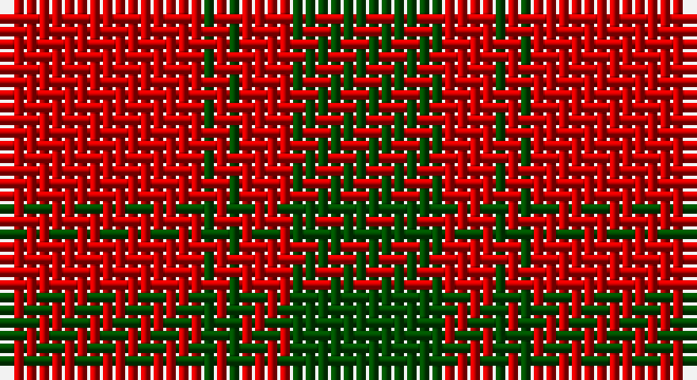

This page is one **sett** — a single exact thread-count. It belongs to the [tartan](/setts/r16dg1r1dg1r4dg12/)
(the same proportion at any scale), whose colour order is pattern [GRGRGR](/stripes/grgrgr/).

Sourced from weddslist.  It is a [6 stripe tartan](/stripes/stripes6/).

Original link http://www.weddslist.com/cgi-bin/tartans/pg.pl?source=rb

## Also known as

This cloth is also recorded under:

- MacQuarrie
- MacQuarrie #5
- MacQuarrie 7

2 attestations — the source records this cloth was collapsed from (oldest owns this page)

<ul>
<li>undated — MacQuarrie (weddslist, <a href="http://www.weddslist.com/cgi-bin/tartans/pg.pl?source=rb">record</a>)</li>
<li>undated — MacQuarie (weddslist, <a href="http://www.weddslist.com/cgi-bin/tartans/pg.pl?source=x">record</a>)</li>
</ul>

## Thread count
R/16 G1 R1 G1 R4 G/12

One full sett is **42 threads**.

## Palette

Palette: <strong>Tartan Register</strong>
<table><thead><tr><th>Colour</th><th>Threads</th><th>Shade</th><th>Base</th><th>OKLCh</th></tr></thead><tbody><tr><td>R/</td><td style="text-align:right;font-variant-numeric:tabular-nums">16</td><td><code style="background-color:#C80000;">#C80000</code> <small style="color:#888">#C80000</small></td><td>R <code style="background-color:#CC0000;">#CC0000</code></td><td><small style="color:#888">oklch(52.3% 0.215 29.2)</small></td></tr><tr><td>G</td><td style="text-align:right;font-variant-numeric:tabular-nums">1</td><td><code style="background-color:#004C00;">#004C00</code> <small style="color:#888">#004C00</small></td><td>G <code style="background-color:#006100;">#006100</code></td><td><small style="color:#888">oklch(36.1% 0.123 142.5)</small></td></tr><tr><td>R</td><td style="text-align:right;font-variant-numeric:tabular-nums">1</td><td><code style="background-color:#C80000;">#C80000</code> <small style="color:#888">#C80000</small></td><td>R <code style="background-color:#CC0000;">#CC0000</code></td><td><small style="color:#888">oklch(52.3% 0.215 29.2)</small></td></tr><tr><td>G</td><td style="text-align:right;font-variant-numeric:tabular-nums">1</td><td><code style="background-color:#004C00;">#004C00</code> <small style="color:#888">#004C00</small></td><td>G <code style="background-color:#006100;">#006100</code></td><td><small style="color:#888">oklch(36.1% 0.123 142.5)</small></td></tr><tr><td>R</td><td style="text-align:right;font-variant-numeric:tabular-nums">4</td><td><code style="background-color:#C80000;">#C80000</code> <small style="color:#888">#C80000</small></td><td>R <code style="background-color:#CC0000;">#CC0000</code></td><td><small style="color:#888">oklch(52.3% 0.215 29.2)</small></td></tr><tr><td>G/</td><td style="text-align:right;font-variant-numeric:tabular-nums">12</td><td><code style="background-color:#004C00;">#004C00</code> <small style="color:#888">#004C00</small></td><td>G <code style="background-color:#006100;">#006100</code></td><td><small style="color:#888">oklch(36.1% 0.123 142.5)</small></td></tr></tbody></table>

# Sample pattern

## Nearest tartans

The nearest existing variants by ΔTartan distance, with this tartan at the top so the swatches line up against it.

ΔTartan

Tartan

Sett

—

<a href="/ttd/edit/#slug=r16dg1r1dg1r4dg12">MacQuarrie</a> <a class="nn-out" href="/variants/s6/r16dg1r1dg1r4dg12/" title="open its dictionary page">↗</a>

0.31

<a href="/ttd/edit/#slug=r16dg1r1dg1r4dg12~x2&amp;base=r16dg1r1dg1r4dg12">MacQuarrie 7</a> <a class="nn-out" href="/variants/s6/r16dg1r1dg1r4dg12~x2/" title="open its dictionary page">↗</a>

0.43

<a href="/ttd/edit/#slug=r16g1r1g1r4g12~x4&amp;base=r16dg1r1dg1r4dg12">MacQuarrie #5</a> <a class="nn-out" href="/variants/s6/r16g1r1g1r4g12~x4/" title="open its dictionary page">↗</a>

0.97

<a href="/ttd/edit/#slug=r2dg6r2dg6r16ly1~x2&amp;base=r16dg1r1dg1r4dg12">Cameron</a> <a class="nn-out" href="/variants/s6/r2dg6r2dg6r16ly1~x2/" title="open its dictionary page">↗</a>

1.01

<a href="/ttd/edit/#slug=r2g6r2g6r16ly1~x4&amp;base=r16dg1r1dg1r4dg12">Cameron (Clan)</a> <a class="nn-out" href="/variants/s6/r2g6r2g6r16ly1~x4/" title="open its dictionary page">↗</a>

1.01

<a href="/ttd/edit/#slug=r6lb2r30dg12r3dg12r3&amp;base=r16dg1r1dg1r4dg12">Crawford</a> <a class="nn-out" href="/variants/s7/r6lb2r30dg12r3dg12r3/" title="open its dictionary page">↗</a>

1.03

<a href="/ttd/edit/#slug=r1dg6r1dg6r15ly1~x2&amp;base=r16dg1r1dg1r4dg12">Cameron Clan D</a> <a class="nn-out" href="/variants/s6/r1dg6r1dg6r15ly1~x2/" title="open its dictionary page">↗</a>

1.14

<a href="/ttd/edit/#slug=r2g6r2g6r16ly1~x2&amp;base=r16dg1r1dg1r4dg12">Cameron</a> <a class="nn-out" href="/variants/s6/r2g6r2g6r16ly1~x2/" title="open its dictionary page">↗</a>

1.17

<a href="/ttd/edit/#slug=dg14r4dg2r2dg2r4dg19r30dg2r9~x2&amp;base=r16dg1r1dg1r4dg12">Livingstone</a> <a class="nn-out" href="/variants/s10/dg14r4dg2r2dg2r4dg19r30dg2r9~x2/" title="open its dictionary page">↗</a>

1.21

<a href="/ttd/edit/#slug=dg6r1dg24r28dg1r4~x2&amp;base=r16dg1r1dg1r4dg12">Erskine</a> <a class="nn-out" href="/variants/s6/dg6r1dg24r28dg1r4~x2/" title="open its dictionary page">↗</a>

1.25

<a href="/ttd/edit/#slug=r22db5r2g11r3db1~x2&amp;base=r16dg1r1dg1r4dg12">MacKintosh 1</a> <a class="nn-out" href="/variants/s6/r22db5r2g11r3db1~x2/" title="open its dictionary page">↗</a>

## Neighbour map

Every grey dot is one of 14360 variants placed by the first two principal components of the ΔTartan feature space (44% of its variance). Red is this tartan; blue dots are its nearest — click one to open its page.

<svg viewBox="0 0 640 380" role="img" style="max-width:100%;height:auto;border:1px solid #e0e0e0;border-radius:4px;display:block" xmlns="http://www.w3.org/2000/svg"><image href="/nn/cloud.v1.png" width="640" height="380"/><a href="/variants/s6/r16dg1r1dg1r4dg12~x2/"><circle cx="453.9" cy="216.0" r="4" fill="#3465a4"><title>MacQuarrie 7</title></circle></a><a href="/variants/s6/r16g1r1g1r4g12~x4/"><circle cx="455.5" cy="215.6" r="4" fill="#3465a4"><title>MacQuarrie #5</title></circle></a><a href="/variants/s6/r2dg6r2dg6r16ly1~x2/"><circle cx="413.4" cy="199.1" r="4" fill="#3465a4"><title>Cameron</title></circle></a><a href="/variants/s6/r2g6r2g6r16ly1~x4/"><circle cx="420.6" cy="202.7" r="4" fill="#3465a4"><title>Cameron (Clan)</title></circle></a><a href="/variants/s7/r6lb2r30dg12r3dg12r3/"><circle cx="416.0" cy="194.0" r="4" fill="#3465a4"><title>Crawford</title></circle></a><a href="/variants/s6/r1dg6r1dg6r15ly1~x2/"><circle cx="393.3" cy="195.9" r="4" fill="#3465a4"><title>Cameron Clan D</title></circle></a><a href="/variants/s6/r2g6r2g6r16ly1~x2/"><circle cx="415.5" cy="201.3" r="4" fill="#3465a4"><title>Cameron</title></circle></a><a href="/variants/s10/dg14r4dg2r2dg2r4dg19r30dg2r9~x2/"><circle cx="407.9" cy="188.2" r="4" fill="#3465a4"><title>Livingstone</title></circle></a><a href="/variants/s6/dg6r1dg24r28dg1r4~x2/"><circle cx="433.2" cy="195.6" r="4" fill="#3465a4"><title>Erskine</title></circle></a><a href="/variants/s6/r22db5r2g11r3db1~x2/"><circle cx="423.8" cy="185.6" r="4" fill="#3465a4"><title>MacKintosh 1</title></circle></a><circle cx="450.8" cy="213.4" r="5" fill="#c00000"/></svg>

ID: /variants/s6/r16dg1r1dg1r4dg12/
