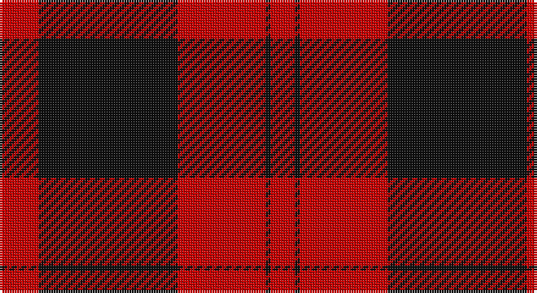

This page is one **sett** — a single exact thread-count. It belongs to the [tartan](/setts/r16k57r36k2r4r2/)
(the same proportion at any scale), whose colour order is pattern [RKRKRR](/stripes/rkrkrr/).

Part of the [Rosser](/tartans/rosser/) tartan — the named design grouping this sett with its other cloths.

Sourced from tartans-authority.  It is a [6 stripe tartan](/stripes/stripes6/).

Original link http://www.tartansauthority.com/tartan-ferret/display/4128/

## Also known as

This cloth is also recorded under:

- Rosser of Wales

## Register references

External register numbers recorded for this tartan.

- Scottish Tartans Authority (ITI): 4128

## Thread count
Ra/16 K57 R36 K2 R4 Ra/2

One full sett is **216 threads**.

## Palette

Palette: <strong>Tartan Register</strong>
<table><thead><tr><th>Colour</th><th>Threads</th><th>Shade</th><th>Base</th><th>OKLCh</th></tr></thead><tbody><tr><td>Ra/</td><td style="text-align:right;font-variant-numeric:tabular-nums">16</td><td><code style="background-color:#C80000;">#C80000</code> <small style="color:#888">#C80000</small></td><td>R <code style="background-color:#CC0000;">#CC0000</code></td><td><small style="color:#888">oklch(52.3% 0.215 29.2)</small></td></tr><tr><td>K</td><td style="text-align:right;font-variant-numeric:tabular-nums">57</td><td><code style="background-color:#101010;">#101010</code> <small style="color:#888">#101010</small></td><td>K <code style="background-color:#000000;">#000000</code></td><td><small style="color:#888">oklch(17.3% 0.000 89.9)</small></td></tr><tr><td>R</td><td style="text-align:right;font-variant-numeric:tabular-nums">36</td><td><code style="background-color:#C80000;">#C80000</code> <small style="color:#888">#C80000</small></td><td>R <code style="background-color:#CC0000;">#CC0000</code></td><td><small style="color:#888">oklch(52.3% 0.215 29.2)</small></td></tr><tr><td>K</td><td style="text-align:right;font-variant-numeric:tabular-nums">2</td><td><code style="background-color:#101010;">#101010</code> <small style="color:#888">#101010</small></td><td>K <code style="background-color:#000000;">#000000</code></td><td><small style="color:#888">oklch(17.3% 0.000 89.9)</small></td></tr><tr><td>R</td><td style="text-align:right;font-variant-numeric:tabular-nums">4</td><td><code style="background-color:#C80000;">#C80000</code> <small style="color:#888">#C80000</small></td><td>R <code style="background-color:#CC0000;">#CC0000</code></td><td><small style="color:#888">oklch(52.3% 0.215 29.2)</small></td></tr><tr><td>Ra/</td><td style="text-align:right;font-variant-numeric:tabular-nums">2</td><td><code style="background-color:#C80000;">#C80000</code> <small style="color:#888">#C80000</small></td><td>R <code style="background-color:#CC0000;">#CC0000</code></td><td><small style="color:#888">oklch(52.3% 0.215 29.2)</small></td></tr></tbody></table>

# Sample pattern

## Compared to the master

This cloth is one sett of its design; the master sett (the exemplar the design is anchored on) is below for comparison.

<figure style="margin:0"><figcaption style="color:#888;font-size:smaller">this sett</figcaption></figure>
<figure style="margin:0"><figcaption style="color:#888;font-size:smaller"><a href="/setts/dg16k57r36k2r4dg2/">master sett →</a></figcaption></figure>

## Nearest tartans

The nearest existing variants by ΔTartan distance, with this tartan at the top so the swatches line up against it.

ΔTartan

Tartan

Sett

—

<a href="/ttd/edit/#slug=r16k57r36k2r4r2">Rosser (Welsh Name)</a> <a class="nn-out" href="/variants/s6/r16k57r36k2r4r2/" title="open its dictionary page">↗</a>

0.94

<a href="/ttd/edit/#slug=dg16k57r36k2r4dg2&amp;base=r16k57r36k2r4r2">Rosser of Wales</a> <a class="nn-out" href="/variants/s6/dg16k57r36k2r4dg2/" title="open its dictionary page">↗</a>

1.06

<a href="/ttd/edit/#slug=r6dg21k8r28k1r4~x2&amp;base=r16k57r36k2r4r2">Dunbar</a> <a class="nn-out" href="/variants/s6/r6dg21k8r28k1r4~x2/" title="open its dictionary page">↗</a>

1.09

<a href="/ttd/edit/#slug=k4w2k28r30k1r3~x2&amp;base=r16k57r36k2r4r2">Ramsay of Dalhousie</a> <a class="nn-out" href="/variants/s6/k4w2k28r30k1r3~x2/" title="open its dictionary page">↗</a>

1.18

<a href="/ttd/edit/#slug=r2db12r2dg12r24w1~x2&amp;base=r16k57r36k2r4r2">Fraser</a> <a class="nn-out" href="/variants/s6/r2db12r2dg12r24w1~x2/" title="open its dictionary page">↗</a>

1.22

<a href="/ttd/edit/#slug=k4w1k28r30dp1r3~x2&amp;base=r16k57r36k2r4r2">Ramsay (Red)</a> <a class="nn-out" href="/variants/s6/k4w1k28r30dp1r3~x2/" title="open its dictionary page">↗</a>

1.23

<a href="/ttd/edit/#slug=k3r1k30r28k1r1w3~x2&amp;base=r16k57r36k2r4r2">Cunningham</a> <a class="nn-out" href="/variants/s7/k3r1k30r28k1r1w3~x2/" title="open its dictionary page">↗</a>

1.25

<a href="/ttd/edit/#slug=r60dp20r8dg45r8dp2~x2&amp;base=r16k57r36k2r4r2">Caledonian</a> <a class="nn-out" href="/variants/s6/r60dp20r8dg45r8dp2~x2/" title="open its dictionary page">↗</a>

1.27

<a href="/ttd/edit/#slug=r6dg21k8r28dg1r4~x2&amp;base=r16k57r36k2r4r2">Dunbar</a> <a class="nn-out" href="/variants/s6/r6dg21k8r28dg1r4~x2/" title="open its dictionary page">↗</a>

1.28

<a href="/ttd/edit/#slug=r1k3lb2k28r30k1r2lb1~x2&amp;base=r16k57r36k2r4r2">Las Vegas Fire Fighters</a> <a class="nn-out" href="/variants/s8/r1k3lb2k28r30k1r2lb1~x2/" title="open its dictionary page">↗</a>

1.29

<a href="/ttd/edit/#slug=r20k2r2k15w1~x2&amp;base=r16k57r36k2r4r2">Masai Shuka 15 (Artefact)</a> <a class="nn-out" href="/variants/s5/r20k2r2k15w1~x2/" title="open its dictionary page">↗</a>

## Neighbour map

Every grey dot is one of 14360 variants placed by the first two principal components of the ΔTartan feature space (44% of its variance). Red is this tartan; blue dots are its nearest — click one to open its page.

<svg viewBox="0 0 640 380" role="img" style="max-width:100%;height:auto;border:1px solid #e0e0e0;border-radius:4px;display:block" xmlns="http://www.w3.org/2000/svg"><image href="/nn/cloud.v1.png" width="640" height="380"/><a href="/variants/s6/dg16k57r36k2r4dg2/"><circle cx="358.3" cy="173.6" r="4" fill="#3465a4"><title>Rosser of Wales</title></circle></a><a href="/variants/s6/r6dg21k8r28k1r4~x2/"><circle cx="377.3" cy="186.3" r="4" fill="#3465a4"><title>Dunbar</title></circle></a><a href="/variants/s6/k4w2k28r30k1r3~x2/"><circle cx="369.6" cy="151.3" r="4" fill="#3465a4"><title>Ramsay of Dalhousie</title></circle></a><a href="/variants/s6/r2db12r2dg12r24w1~x2/"><circle cx="321.0" cy="162.2" r="4" fill="#3465a4"><title>Fraser</title></circle></a><a href="/variants/s6/k4w1k28r30dp1r3~x2/"><circle cx="366.7" cy="141.2" r="4" fill="#3465a4"><title>Ramsay (Red)</title></circle></a><a href="/variants/s7/k3r1k30r28k1r1w3~x2/"><circle cx="375.9" cy="133.9" r="4" fill="#3465a4"><title>Cunningham</title></circle></a><a href="/variants/s6/r60dp20r8dg45r8dp2~x2/"><circle cx="369.2" cy="172.4" r="4" fill="#3465a4"><title>Caledonian</title></circle></a><a href="/variants/s6/r6dg21k8r28dg1r4~x2/"><circle cx="365.4" cy="175.9" r="4" fill="#3465a4"><title>Dunbar</title></circle></a><a href="/variants/s8/r1k3lb2k28r30k1r2lb1~x2/"><circle cx="381.5" cy="127.9" r="4" fill="#3465a4"><title>Las Vegas Fire Fighters</title></circle></a><a href="/variants/s5/r20k2r2k15w1~x2/"><circle cx="385.2" cy="184.7" r="4" fill="#3465a4"><title>Masai Shuka 15 (Artefact)</title></circle></a><circle cx="361.6" cy="167.0" r="5" fill="#c00000"/></svg>

ID: /variants/s6/r16k57r36k2r4r2/
