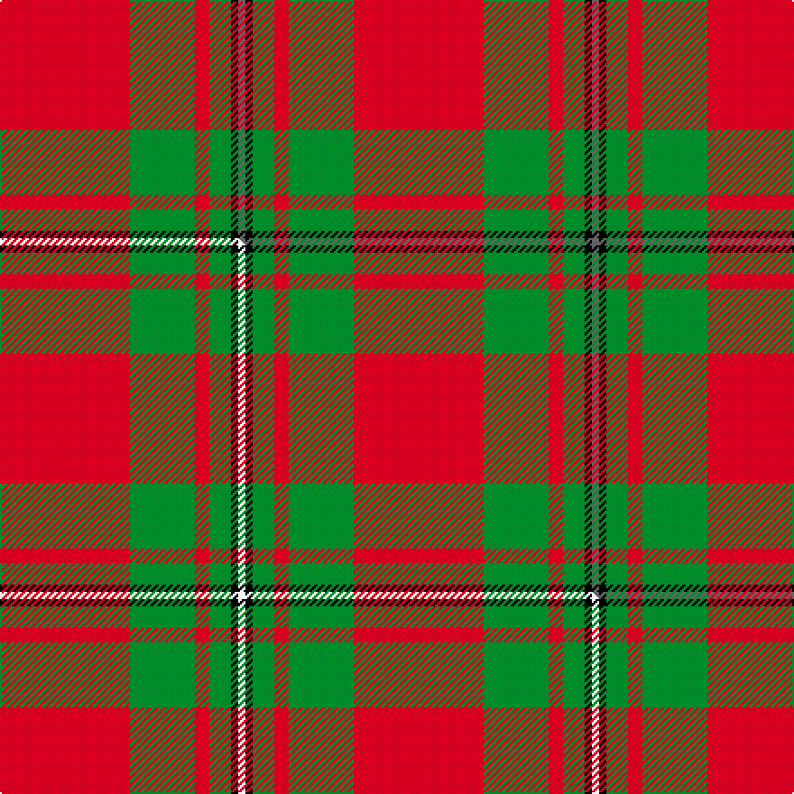

This page is one **sett** — a single exact thread-count. It belongs to the [tartan](/setts/r18g9r2g3k1n1/)
(the same proportion at any scale), whose colour order is pattern [BKGRGR](/stripes/bkgrgr/).

Part of the [MacGregor of Cardney](/tartans/macgregor-of-cardney/) tartan — the named design grouping this sett with its other cloths.

Sourced from tartans-authority.  It is a [6 stripe tartan](/stripes/stripes6/).

Original link http://www.tartansauthority.com/tartan-ferret/display/1285/

## Register references

External register numbers recorded for this tartan.

- Scottish Tartans Authority (ITI): 1285

## Thread count
R/72 G36 R8 G12 K4 N/4

One full sett is **196 threads**.

## Palette
<table><thead><tr><th>Colour</th><th>Shade</th><th>OKLCh</th></tr></thead><tbody><tr><td>G</td><td><code style="background-color:#008B2A;">#008B2A</code> <small style="color:#888">#008B2A</small></td><td><small style="color:#888">oklch(55.4% 0.170 145.9)</small></td></tr><tr><td>K</td><td><code style="background-color:#000000;">#000000</code> <small style="color:#888">#000000</small></td><td><small style="color:#888">oklch(0.0% 0.000 0.0)</small></td></tr><tr><td>N</td><td><code style="background-color:#636363;">#636363</code> <small style="color:#888">#636363</small></td><td><small style="color:#888">oklch(50.0% 0.000 89.9)</small></td></tr><tr><td>R</td><td><code style="background-color:#D60020;">#D60020</code> <small style="color:#888">#D60020</small></td><td><small style="color:#888">oklch(55.2% 0.224 25.5)</small></td></tr></tbody></table>

# Sample pattern

## Compared to the master

This cloth is one sett of its design; the master sett (the exemplar the design is anchored on) is below for comparison.

Its **ΔTartan distance** from the master is **0.03** — the same measure the nearest-tartans table ranks by (0 is identical; a re-scale of the same cloth is near 0, a recolour or a different proportion further).

<figure class="master-compare" style="margin:0">

this sett
master sett ★

<figcaption style="color:#888;font-size:smaller">One weave of this sett against the <a href="/setts/r18g9r2g3k1w1/">master sett ★</a>, split on the diagonal: a shared proportion runs seamlessly across it with only the shades shifting; a different proportion breaks on it.</figcaption>
</figure>

## Nearest tartan variants

The nearest existing variants by ΔTartan distance, with this cloth at the top so the swatches line up against it.

ΔTartan

Threads

Variant

Sett

—

196

<a href="/variants/s6/r18g9r2g3k1n1~x4/">MacGregor of Cardney - 1930 (Clan)</a>

<a href="/ttd/edit/#slug=r18g9r2g3k1w1~x4&amp;base=r18g9r2g3k1n1~x4" title="compare in the TTD">0.03</a>

196

<a href="/variants/s6/r18g9r2g3k1w1~x4/">MacGregor of Cardney</a>

<a href="/ttd/edit/#slug=r96g42r16g17k4n6&amp;base=r18g9r2g3k1n1~x4" title="compare in the TTD">0.37</a>

260

<a href="/variants/s6/r96g42r16g17k4n6/">MacGregor, Glengyle</a>

<a href="/ttd/edit/#slug=r36g18r4g6k1w2~x2&amp;base=r18g9r2g3k1n1~x4" title="compare in the TTD">0.51</a>

192

<a href="/variants/s6/r36g18r4g6k1w2~x2/">MacGregor #3</a>

<a href="/ttd/edit/#slug=r36g18r4g6k1w2&amp;base=r18g9r2g3k1n1~x4" title="compare in the TTD">0.51</a>

96

<a href="/variants/s6/r36g18r4g6k1w2/">MacGregor</a>

<a href="/ttd/edit/#slug=r41g19r7g8k1w3~x2&amp;base=r18g9r2g3k1n1~x4" title="compare in the TTD">0.58</a>

228

<a href="/variants/s6/r41g19r7g8k1w3~x2/">MacGregor #4</a>

<a href="/ttd/edit/#slug=r96g42r16g17k4lb6&amp;base=r18g9r2g3k1n1~x4" title="compare in the TTD">0.67</a>

260

<a href="/variants/s6/r96g42r16g17k4lb6/">MacGregor Hunting Glengyle Clan Tartan</a>

<a href="/ttd/edit/#slug=r32lb5g17r4g5w2~x2&amp;base=r18g9r2g3k1n1~x4" title="compare in the TTD">0.75</a>

192

<a href="/variants/s6/r32lb5g17r4g5w2~x2/">Wilson's, No 5</a>

<a href="/ttd/edit/#slug=r35g16r5g5w2k3~x2&amp;base=r18g9r2g3k1n1~x4" title="compare in the TTD">0.78</a>

188

<a href="/variants/s6/r35g16r5g5w2k3~x2/">MacGregor</a>

<a href="/ttd/edit/#slug=g7r3g1r9k1~x2&amp;base=r18g9r2g3k1n1~x4" title="compare in the TTD">0.89</a>

68

<a href="/variants/s5/g7r3g1r9k1~x2/">MacDonald of Sleat</a>

<a href="/ttd/edit/#slug=g16r5g2r18k2~x2&amp;base=r18g9r2g3k1n1~x4" title="compare in the TTD">0.97</a>

136

<a href="/variants/s5/g16r5g2r18k2~x2/">MacDonald, Lord of The Isles (Artef)</a>

## Neighbour map

Every grey dot is one of 13620 variants placed by the first two principal components of the ΔTartan feature space (42% of its variance). Red is this tartan; blue dots are its nearest — click one to open its page.

<svg viewBox="0 0 640 380" role="img" style="max-width:100%;height:auto;border:1px solid #e0e0e0;border-radius:4px;display:block" xmlns="http://www.w3.org/2000/svg"><image href="/nn/cloud.v1.png" width="640" height="380"/><a href="/variants/s6/r18g9r2g3k1w1~x4/"><circle cx="357.3" cy="152.6" r="4" fill="#3465a4"><title>MacGregor of Cardney</title></circle></a><a href="/variants/s6/r96g42r16g17k4n6/"><circle cx="399.1" cy="148.2" r="4" fill="#3465a4"><title>MacGregor, Glengyle</title></circle></a><a href="/variants/s6/r36g18r4g6k1w2~x2/"><circle cx="394.9" cy="127.6" r="4" fill="#3465a4"><title>MacGregor #3</title></circle></a><a href="/variants/s6/r36g18r4g6k1w2/"><circle cx="394.9" cy="127.6" r="4" fill="#3465a4"><title>MacGregor</title></circle></a><a href="/variants/s6/r41g19r7g8k1w3~x2/"><circle cx="398.5" cy="127.1" r="4" fill="#3465a4"><title>MacGregor #4</title></circle></a><a href="/variants/s6/r96g42r16g17k4lb6/"><circle cx="392.4" cy="146.0" r="4" fill="#3465a4"><title>MacGregor Hunting Glengyle Clan Tartan</title></circle></a><a href="/variants/s6/r32lb5g17r4g5w2~x2/"><circle cx="355.5" cy="184.5" r="4" fill="#3465a4"><title>Wilson's, No 5</title></circle></a><a href="/variants/s6/r35g16r5g5w2k3~x2/"><circle cx="351.7" cy="150.1" r="4" fill="#3465a4"><title>MacGregor</title></circle></a><a href="/variants/s5/g7r3g1r9k1~x2/"><circle cx="328.9" cy="221.7" r="4" fill="#3465a4"><title>MacDonald of Sleat</title></circle></a><a href="/variants/s5/g16r5g2r18k2~x2/"><circle cx="315.8" cy="220.4" r="4" fill="#3465a4"><title>MacDonald, Lord of The Isles (Artef)</title></circle></a><circle cx="369.1" cy="156.4" r="5" fill="#c00000"/><text x="320" y="376" text-anchor="middle" font-size="11" fill="#999">ground</text><text x="11" y="190" text-anchor="middle" font-size="11" fill="#999" transform="rotate(-90 11 190)">complexity</text></svg>

ID: /variants/s6/r18g9r2g3k1n1~x4/
