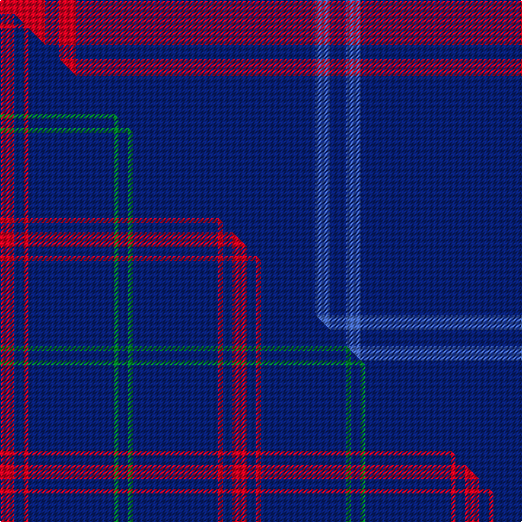

This is one **variant** — a specific cloth: this exact thread count and colourway, with its own
provenance below. It is one weaving of the [sett](/setts/r19db6r7db101b6db7/) (the scale-free proportion — the
same cloth at any scale or shade), whose colour order is pattern [BBBRBR](/stripes/bbbrbr/).

Part of the [Lynch](/tartans/lynch/) tartan — the named design grouping this sett with its other cloths.

Sourced from weddslist.  It is a [6 stripe tartan](/stripes/stripes6/).

Original link [http://www.weddslist.com/cgi-bin/tartans/pg.pl?source=sts](http://www.weddslist.com/cgi-bin/tartans/pg.pl?source=sts)

Dataset <small>— provenance for this record, inherited from the source manifest</small>

<dl class="dataset-prov">
<dt>source</dt><dd><a href="/sources/weddslist/">Weddslist</a></dd>
<dt>data captured from</dt><dd><a href="https://github.com/thetartan/tartan-database/blob/master/data/weddslist/data.csv">https://github.com/thetartan/tartan-database/blob/master/data/weddslist/data.csv</a></dd>
<dt>data date</dt><dd>2016-11-17 <small>(dataset default)</small></dd>
<dt>licence</dt><dd><a href="https://creativecommons.org/licenses/by-nc-nd/4.0/">CC BY-NC-ND 4.0</a></dd>
</dl>

Capture chain <small>— the hands this data passed through, oldest first; each capture carries its own licence</small>

<ol class="capture-chain">
<li><a href="https://www.weddslist.com/tartans/">Weddslist</a> <small>the living privately compiled reference</small></li>
<li><a href="https://github.com/thetartan/tartan-database">thetartan/tartan-database</a> <small>2016-2017</small> · <a href="https://creativecommons.org/licenses/by-nc-nd/4.0/">CC BY-NC-ND 4.0</a> <small>Levko Kravets's frozen compilation — the capture we vendored, and where its CC licence text came from</small></li>
<li>this dictionary <small>captured 2026-06-10 · commit 5bf86c7566</small> <small>each re-capture is a git commit to data/sources</small></li>
</ol>

## Thread count
R/38 DB12 R14 DB202 B12 DB/14

One full sett is **532 threads**.

## Palette
<table><thead><tr><th>Colour</th><th>Shade</th><th>OKLCh</th></tr></thead><tbody><tr><td>DB</td><td><code style="background-color:#082077;">#082077</code> <small style="color:#888">#082077</small></td><td><small style="color:#888">oklch(30.0% 0.149 265.1)</small></td></tr><tr><td>B</td><td><code style="background-color:#466CC8;">#466CC8</code> <small style="color:#888">#466CC8</small></td><td><small style="color:#888">oklch(55.1% 0.149 265.0)</small></td></tr><tr><td>R</td><td><code style="background-color:#D60020;">#D60020</code> <small style="color:#888">#D60020</small></td><td><small style="color:#888">oklch(55.2% 0.224 25.5)</small></td></tr></tbody></table>

# Sample pattern

## Compared to the master

This cloth is one sett of its design; the master sett (the exemplar the design is anchored on) is below for comparison.

Its **ΔTartan distance** from the master is **0.53** — the same measure the nearest-tartans table ranks by (0 is identical; a re-scale of the same cloth is near 0, a recolour or a different proportion further).

<figure class="master-compare" style="margin:0">

this sett
master sett ★

<figcaption style="color:#888;font-size:smaller">One weave of this sett against the <a href="/setts/r3db2r1db18g1db2/">master sett ★</a>, split on the diagonal: a shared proportion runs seamlessly across it with only the shades shifting; a different proportion breaks on it.</figcaption>
</figure>

## Nearest tartan variants

The nearest existing variants by ΔTartan distance, with this cloth at the top so the swatches line up against it.

ΔTartan

Threads

Variant

Sett

—

532

<a href="/variants/s6/r19db6r7db101b6db7~x2/">Lynch</a>

<a href="/ttd/edit/#slug=r19db6r14db101g7db7&amp;base=r19db6r7db101b6db7~x2" title="compare in the TTD">0.49</a>

282

<a href="/variants/s6/r19db6r14db101g7db7/">Lynch Family Tartan</a>

<a href="/ttd/edit/#slug=r3db2r1db18g1db2~x4&amp;base=r19db6r7db101b6db7~x2" title="compare in the TTD">0.53</a>

196

<a href="/variants/s6/r3db2r1db18g1db2~x4/">Lynch</a>

<a href="/ttd/edit/#slug=db10r1db10r2db10r1g2~x2&amp;base=r19db6r7db101b6db7~x2" title="compare in the TTD">1.28</a>

120

<a href="/variants/s7/db10r1db10r2db10r1g2~x2/">Hebrides #5</a>

<a href="/ttd/edit/#slug=db2r7db2r7db22y2~x2&amp;base=r19db6r7db101b6db7~x2" title="compare in the TTD">1.29</a>

160

<a href="/variants/s6/db2r7db2r7db22y2~x2/">MacQueen variant</a>

<a href="/ttd/edit/#slug=db35w4db10dr3r3dr3~x4&amp;base=r19db6r7db101b6db7~x2" title="compare in the TTD">1.87</a>

312

<a href="/variants/s6/db35w4db10dr3r3dr3~x4/">Steffen, Markus (Personal)</a>

<a href="/ttd/edit/#slug=db35w4db10r3ri3r3~x4~r1706009-ri2109032&amp;base=r19db6r7db101b6db7~x2" title="compare in the TTD">1.87</a>

312

<a href="/variants/s6/db35w4db10r3ri3r3~x4~r1706009-ri2109032/">Steffen, Morris (Personal)</a>

<a href="/ttd/edit/#slug=r5db20r3db20w6db3lb2db1~x2&amp;base=r19db6r7db101b6db7~x2" title="compare in the TTD">1.95</a>

228

<a href="/variants/s8/r5db20r3db20w6db3lb2db1~x2/">Masai Shuka 29 (Artefact)</a>

<a href="/ttd/edit/#slug=n55db18w3db2r2db6~x2~n1604274-db0805267&amp;base=r19db6r7db101b6db7~x2" title="compare in the TTD">1.99</a>

222

<a href="/variants/s6/dbi55db18w3db2r2db6~x2~dbi1604274-db0805267/">S.C.O.T.S.</a>

<a href="/ttd/edit/#slug=db35k10db4w2db3r2~x2&amp;base=r19db6r7db101b6db7~x2" title="compare in the TTD">2.41</a>

150

<a href="/variants/s6/db35k10db4w2db3r2~x2/">Laidlaw's Highland Drovers</a>

<a href="/ttd/edit/#slug=db12lb1k2db1r1~x8&amp;base=r19db6r7db101b6db7~x2" title="compare in the TTD">2.75</a>

168

<a href="/variants/s5/db12lb1k2db1r1~x8/">Lochcarron (1985)</a>

## Neighbour map

Every grey dot is one of 13621 variants placed by the first two principal components of the ΔTartan feature space (42% of its variance). Red is this tartan; blue dots are its nearest — click one to open its page.

<svg viewBox="0 0 640 380" role="img" style="max-width:100%;height:auto;border:1px solid #e0e0e0;border-radius:4px;display:block" xmlns="http://www.w3.org/2000/svg"><image href="/nn/cloud.v1.png" width="640" height="380"/><a href="/variants/s6/r19db6r14db101g7db7/"><circle cx="504.4" cy="173.1" r="4" fill="#3465a4"><title>Lynch Family Tartan</title></circle></a><a href="/variants/s6/r3db2r1db18g1db2~x4/"><circle cx="577.0" cy="173.7" r="4" fill="#3465a4"><title>Lynch</title></circle></a><a href="/variants/s7/db10r1db10r2db10r1g2~x2/"><circle cx="532.9" cy="201.3" r="4" fill="#3465a4"><title>Hebrides #5</title></circle></a><a href="/variants/s6/db2r7db2r7db22y2~x2/"><circle cx="397.6" cy="205.5" r="4" fill="#3465a4"><title>MacQueen variant</title></circle></a><a href="/variants/s6/db35w4db10dr3r3dr3~x4/"><circle cx="475.9" cy="178.0" r="4" fill="#3465a4"><title>Steffen, Markus (Personal)</title></circle></a><a href="/variants/s6/db35w4db10r3ri3r3~x4~r1706009-ri2109032/"><circle cx="467.2" cy="171.8" r="4" fill="#3465a4"><title>Steffen, Morris (Personal)</title></circle></a><a href="/variants/s8/r5db20r3db20w6db3lb2db1~x2/"><circle cx="417.0" cy="153.5" r="4" fill="#3465a4"><title>Masai Shuka 29 (Artefact)</title></circle></a><a href="/variants/s6/dbi55db18w3db2r2db6~x2~dbi1604274-db0805267/"><circle cx="477.2" cy="161.6" r="4" fill="#3465a4"><title>S.C.O.T.S.</title></circle></a><a href="/variants/s6/db35k10db4w2db3r2~x2/"><circle cx="452.4" cy="145.6" r="4" fill="#3465a4"><title>Laidlaw's Highland Drovers</title></circle></a><a href="/variants/s5/db12lb1k2db1r1~x8/"><circle cx="459.8" cy="167.7" r="4" fill="#3465a4"><title>Lochcarron (1985)</title></circle></a><circle cx="553.0" cy="172.5" r="5" fill="#c00000"/><text x="320" y="376" text-anchor="middle" font-size="11" fill="#999">ground</text><text x="11" y="190" text-anchor="middle" font-size="11" fill="#999" transform="rotate(-90 11 190)">complexity</text></svg>

ID: /variants/s6/r19db6r7db101b6db7~x2/
