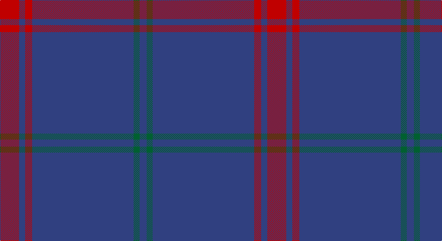

This page is one **sett** — a single exact thread-count. It belongs to the [tartan](/setts/r19db6r7db101dg6db7/)
(the same proportion at any scale), whose colour order is pattern [BGBRBR](/stripes/bgbrbr/).

Part of the [Lynch](/tartans/lynch/) tartan — the named design grouping this sett with its other cloths.

Sourced from weddslist.  It is a [6 stripe tartan](/stripes/stripes6/).

Original link http://www.weddslist.com/cgi-bin/tartans/pg.pl?source=sts

## Thread count
R/38 B12 R14 B202 G12 B/14

One full sett is **532 threads**.

## Palette

Palette: <strong>custom</strong>
<table><thead><tr><th>Colour</th><th>Threads</th><th>Shade</th><th>Base</th><th>OKLCh</th></tr></thead><tbody><tr><td>R/</td><td style="text-align:right;font-variant-numeric:tabular-nums">38</td><td><code style="background-color:#C00000;">#C00000</code> <small style="color:#888">#C00000</small></td><td>R <code style="background-color:#CC0000;">#CC0000</code></td><td><small style="color:#888">oklch(50.7% 0.208 29.2)</small></td></tr><tr><td>B</td><td style="text-align:right;font-variant-numeric:tabular-nums">12</td><td><code style="background-color:#304080;">#304080</code> <small style="color:#888">#304080</small></td><td>B <code style="background-color:#2A418A;">#2A418A</code></td><td><small style="color:#888">oklch(39.4% 0.109 270.2)</small></td></tr><tr><td>R</td><td style="text-align:right;font-variant-numeric:tabular-nums">14</td><td><code style="background-color:#C00000;">#C00000</code> <small style="color:#888">#C00000</small></td><td>R <code style="background-color:#CC0000;">#CC0000</code></td><td><small style="color:#888">oklch(50.7% 0.208 29.2)</small></td></tr><tr><td>B</td><td style="text-align:right;font-variant-numeric:tabular-nums">202</td><td><code style="background-color:#304080;">#304080</code> <small style="color:#888">#304080</small></td><td>B <code style="background-color:#2A418A;">#2A418A</code></td><td><small style="color:#888">oklch(39.4% 0.109 270.2)</small></td></tr><tr><td>G</td><td style="text-align:right;font-variant-numeric:tabular-nums">12</td><td><code style="background-color:#006030;">#006030</code> <small style="color:#888">#006030</small></td><td>G <code style="background-color:#006100;">#006100</code></td><td><small style="color:#888">oklch(42.9% 0.111 152.8)</small></td></tr><tr><td>B/</td><td style="text-align:right;font-variant-numeric:tabular-nums">14</td><td><code style="background-color:#304080;">#304080</code> <small style="color:#888">#304080</small></td><td>B <code style="background-color:#2A418A;">#2A418A</code></td><td><small style="color:#888">oklch(39.4% 0.109 270.2)</small></td></tr></tbody></table>

# Sample pattern

## Compared to the master

This cloth is one sett of its design; the master sett (the exemplar the design is anchored on) is below for comparison.

<figure style="margin:0"><figcaption style="color:#888;font-size:smaller">this sett</figcaption></figure>
<figure style="margin:0"><figcaption style="color:#888;font-size:smaller"><a href="/setts/r3db2r1db18g1db2/">master sett →</a></figcaption></figure>

## Nearest tartans

The nearest existing variants by ΔTartan distance, with this tartan at the top so the swatches line up against it.

ΔTartan

Tartan

Sett

—

<a href="/ttd/edit/#slug=r19db6r7db101dg6db7~x2">Lynch</a> <a class="nn-out" href="/variants/s6/r19db6r7db101dg6db7~x2/" title="open its dictionary page">↗</a>

1.14

<a href="/ttd/edit/#slug=r3db2r1db18g1db2~x4&amp;base=r19db6r7db101dg6db7~x2">Lynch</a> <a class="nn-out" href="/variants/s6/r3db2r1db18g1db2~x4/" title="open its dictionary page">↗</a>

1.31

<a href="/ttd/edit/#slug=r19db6r14db101g7db7&amp;base=r19db6r7db101dg6db7~x2">Lynch Family Tartan</a> <a class="nn-out" href="/variants/s6/r19db6r14db101g7db7/" title="open its dictionary page">↗</a>

1.54

<a href="/ttd/edit/#slug=dt72b6dt12b17w6~x2&amp;base=r19db6r7db101dg6db7~x2">GulfMark</a> <a class="nn-out" href="/variants/s5/dt72b6dt12b17w6~x2/" title="open its dictionary page">↗</a>

1.67

<a href="/ttd/edit/#slug=b11db7b3db70lb4db6~x2&amp;base=r19db6r7db101dg6db7~x2">Auchairne (Corporate)</a> <a class="nn-out" href="/variants/s6/b11db7b3db70lb4db6~x2/" title="open its dictionary page">↗</a>

1.68

<a href="/variants/s6/n65ki2n4k2n10r24~x2/">Norsemen, The</a>

1.80

<a href="/ttd/edit/#slug=db1t1db8r1~x2&amp;base=r19db6r7db101dg6db7~x2">Lochaber #3</a> <a class="nn-out" href="/variants/s4/db1t1db8r1~x2/" title="open its dictionary page">↗</a>

1.88

<a href="/ttd/edit/#slug=db6lo2db7g4db3g6db2g4db39ly2~x2&amp;base=r19db6r7db101dg6db7~x2">Seletar Shipping (Corporate)</a> <a class="nn-out" href="/variants/s10/db6lo2db7g4db3g6db2g4db39ly2~x2/" title="open its dictionary page">↗</a>

1.89

<a href="/ttd/edit/#slug=db144r9t44db4t4db4&amp;base=r19db6r7db101dg6db7~x2">United French Freemasons (Corporate</a> <a class="nn-out" href="/variants/s6/db144r9t44db4t4db4/" title="open its dictionary page">↗</a>

1.91

<a href="/ttd/edit/#slug=dt32r3dt4k2lo3~x2&amp;base=r19db6r7db101dg6db7~x2">MacLaine of Lochbuie Hunting</a> <a class="nn-out" href="/variants/s5/dt32r3dt4k2lo3~x2/" title="open its dictionary page">↗</a>

1.92

<a href="/ttd/edit/#slug=db48dg14r3dg2r3dg2~x2&amp;base=r19db6r7db101dg6db7~x2">Wilson #2</a> <a class="nn-out" href="/variants/s6/db48dg14r3dg2r3dg2~x2/" title="open its dictionary page">↗</a>

## Neighbour map

Every grey dot is one of 14360 variants placed by the first two principal components of the ΔTartan feature space (44% of its variance). Red is this tartan; blue dots are its nearest — click one to open its page.

<svg viewBox="0 0 640 380" role="img" style="max-width:100%;height:auto;border:1px solid #e0e0e0;border-radius:4px;display:block" xmlns="http://www.w3.org/2000/svg"><image href="/nn/cloud.v1.png" width="640" height="380"/><a href="/variants/s6/r3db2r1db18g1db2~x4/"><circle cx="601.3" cy="205.3" r="4" fill="#3465a4"><title>Lynch</title></circle></a><a href="/variants/s6/r19db6r14db101g7db7/"><circle cx="530.1" cy="198.7" r="4" fill="#3465a4"><title>Lynch Family Tartan</title></circle></a><a href="/variants/s5/dt72b6dt12b17w6~x2/"><circle cx="511.4" cy="237.4" r="4" fill="#3465a4"><title>GulfMark</title></circle></a><a href="/variants/s6/b11db7b3db70lb4db6~x2/"><circle cx="612.6" cy="198.8" r="4" fill="#3465a4"><title>Auchairne (Corporate)</title></circle></a><a href="/variants/s6/n65ki2n4k2n10r24~x2/"><circle cx="551.6" cy="177.2" r="4" fill="#3465a4"><title>Norsemen, The</title></circle></a><a href="/variants/s4/db1t1db8r1~x2/"><circle cx="590.0" cy="280.1" r="4" fill="#3465a4"><title>Lochaber #3</title></circle></a><a href="/variants/s10/db6lo2db7g4db3g6db2g4db39ly2~x2/"><circle cx="524.5" cy="163.5" r="4" fill="#3465a4"><title>Seletar Shipping (Corporate)</title></circle></a><a href="/variants/s6/db144r9t44db4t4db4/"><circle cx="557.3" cy="176.8" r="4" fill="#3465a4"><title>United French Freemasons (Corporate</title></circle></a><a href="/variants/s5/dt32r3dt4k2lo3~x2/"><circle cx="584.8" cy="213.0" r="4" fill="#3465a4"><title>MacLaine of Lochbuie Hunting</title></circle></a><a href="/variants/s6/db48dg14r3dg2r3dg2~x2/"><circle cx="520.3" cy="205.4" r="4" fill="#3465a4"><title>Wilson #2</title></circle></a><circle cx="593.9" cy="211.5" r="5" fill="#c00000"/></svg>

ID: /variants/s6/r19db6r7db101dg6db7~x2/
