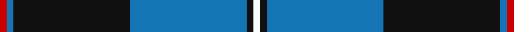
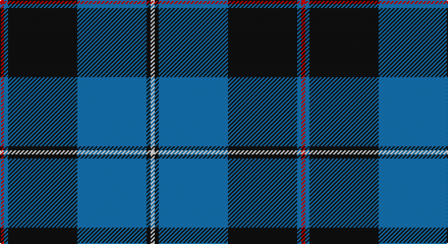

This page is one **sett** — a single exact thread-count. It belongs to the [tartan](/setts/r1b1k17b17k1w1/)
(the same proportion at any scale), whose colour order is pattern [RBKBKW](/stripes/rbkbkw/).

Part of the [Sorbie](/tartans/sorbie/) tartan — the named design grouping this sett with its other cloths.

Sourced from tartans-authority.  It is a [6 stripe tartan](/stripes/stripes6/).

Original link http://www.tartansauthority.com/tartan-ferret/display/6313/

## Register references

External register numbers recorded for this tartan.

- Scottish Tartans Authority (ITI): 6313

## Thread count
R/4 B4 K68 B68 K4 W/4

One full sett is **296 threads**.

## Palette

Palette: <strong>Tartan Register</strong>
<table><thead><tr><th>Colour</th><th>Threads</th><th>Shade</th><th>Base</th><th>OKLCh</th></tr></thead><tbody><tr><td>R/</td><td style="text-align:right;font-variant-numeric:tabular-nums">4</td><td><code style="background-color:#C80000;">#C80000</code> <small style="color:#888">#C80000</small></td><td>R <code style="background-color:#CC0000;">#CC0000</code></td><td><small style="color:#888">oklch(52.3% 0.215 29.2)</small></td></tr><tr><td>B</td><td style="text-align:right;font-variant-numeric:tabular-nums">4</td><td><code style="background-color:#1474B4;">#1474B4</code> <small style="color:#888">#1474B4</small></td><td>B <code style="background-color:#2A418A;">#2A418A</code></td><td><small style="color:#888">oklch(54.0% 0.129 245.1)</small></td></tr><tr><td>K</td><td style="text-align:right;font-variant-numeric:tabular-nums">68</td><td><code style="background-color:#101010;">#101010</code> <small style="color:#888">#101010</small></td><td>K <code style="background-color:#000000;">#000000</code></td><td><small style="color:#888">oklch(17.3% 0.000 89.9)</small></td></tr><tr><td>B</td><td style="text-align:right;font-variant-numeric:tabular-nums">68</td><td><code style="background-color:#1474B4;">#1474B4</code> <small style="color:#888">#1474B4</small></td><td>B <code style="background-color:#2A418A;">#2A418A</code></td><td><small style="color:#888">oklch(54.0% 0.129 245.1)</small></td></tr><tr><td>K</td><td style="text-align:right;font-variant-numeric:tabular-nums">4</td><td><code style="background-color:#101010;">#101010</code> <small style="color:#888">#101010</small></td><td>K <code style="background-color:#000000;">#000000</code></td><td><small style="color:#888">oklch(17.3% 0.000 89.9)</small></td></tr><tr><td>W/</td><td style="text-align:right;font-variant-numeric:tabular-nums">4</td><td><code style="background-color:#FCFCFC;">#FCFCFC</code> <small style="color:#888">#FCFCFC</small></td><td>W <code style="background-color:#F7F7F7;">#F7F7F7</code></td><td><small style="color:#888">oklch(99.1% 0.000 89.9)</small></td></tr></tbody></table>

# Sample pattern

## Compared to the master

This cloth is one sett of its design; the master sett (the exemplar the design is anchored on) is below for comparison.

<figure style="margin:0"><figcaption style="color:#888;font-size:smaller">this sett</figcaption></figure>
<figure style="margin:0"><figcaption style="color:#888;font-size:smaller"><a href="/setts/k1b17k17b1r1b1k17b17k1w1/">master sett →</a></figcaption></figure>

## Nearest tartans

The nearest existing variants by ΔTartan distance, with this tartan at the top so the swatches line up against it.

ΔTartan

Tartan

Sett

—

<a href="/ttd/edit/#slug=r1b1k17b17k1w1~x4">Sorbie (Name)</a> <a class="nn-out" href="/variants/s6/r1b1k17b17k1w1~x4/" title="open its dictionary page">↗</a>

0.83

<a href="/ttd/edit/#slug=k36r3k3r3k9b36g3b2~x2&amp;base=r1b1k17b17k1w1~x4">Home (Clan)</a> <a class="nn-out" href="/variants/s8/k36r3k3r3k9b36g3b2~x2/" title="open its dictionary page">↗</a>

1.03

<a href="/ttd/edit/#slug=r3k1b27k27w3~x2&amp;base=r1b1k17b17k1w1~x4">Bro-Spirit of Northmen (Corporate)</a> <a class="nn-out" href="/variants/s5/r3k1b27k27w3~x2/" title="open its dictionary page">↗</a>

1.10

<a href="/variants/s6/ly8k3b40ki12k3ly3~x2/">Wolverine Corporate Tartan</a>

1.10

<a href="/ttd/edit/#slug=k4ly1k20b20k1b4~x4&amp;base=r1b1k17b17k1w1~x4">Oakleigh (Corporate)</a> <a class="nn-out" href="/variants/s6/k4ly1k20b20k1b4~x4/" title="open its dictionary page">↗</a>

1.11

<a href="/ttd/edit/#slug=db24g3db3g3lo2g18r2~x2&amp;base=r1b1k17b17k1w1~x4">Greenways Marketing Intl (Corporate)</a> <a class="nn-out" href="/variants/s7/db24g3db3g3lo2g18r2~x2/" title="open its dictionary page">↗</a>

1.14

<a href="/ttd/edit/#slug=k1b17k17b1r1b1k17b17k1w1~x4&amp;base=r1b1k17b17k1w1~x4">Sorbie</a> <a class="nn-out" href="/variants/s10/k1b17k17b1r1b1k17b17k1w1~x4/" title="open its dictionary page">↗</a>

1.16

<a href="/ttd/edit/#slug=db36lb4db4lb4db16dg64r9db6~x2&amp;base=r1b1k17b17k1w1~x4">Colvin</a> <a class="nn-out" href="/variants/s8/db36lb4db4lb4db16dg64r9db6~x2/" title="open its dictionary page">↗</a>

1.17

<a href="/ttd/edit/#slug=r3b14ly2k2b14k36ly2k2ly2~x2&amp;base=r1b1k17b17k1w1~x4">Ewbank</a> <a class="nn-out" href="/variants/s9/r3b14ly2k2b14k36ly2k2ly2~x2/" title="open its dictionary page">↗</a>

1.18

<a href="/ttd/edit/#slug=db72k21g16t3g17t3~x2&amp;base=r1b1k17b17k1w1~x4">MacRobart</a> <a class="nn-out" href="/variants/s6/db72k21g16t3g17t3~x2/" title="open its dictionary page">↗</a>

1.20

<a href="/ttd/edit/#slug=k30b40ly3b5w2b6~x2&amp;base=r1b1k17b17k1w1~x4">Micron</a> <a class="nn-out" href="/variants/s6/k30b40ly3b5w2b6~x2/" title="open its dictionary page">↗</a>

## Neighbour map

Every grey dot is one of 14360 variants placed by the first two principal components of the ΔTartan feature space (44% of its variance). Red is this tartan; blue dots are its nearest — click one to open its page.

<svg viewBox="0 0 640 380" role="img" style="max-width:100%;height:auto;border:1px solid #e0e0e0;border-radius:4px;display:block" xmlns="http://www.w3.org/2000/svg"><image href="/nn/cloud.v1.png" width="640" height="380"/><a href="/variants/s8/k36r3k3r3k9b36g3b2~x2/"><circle cx="318.2" cy="161.4" r="4" fill="#3465a4"><title>Home (Clan)</title></circle></a><a href="/variants/s5/r3k1b27k27w3~x2/"><circle cx="303.4" cy="174.7" r="4" fill="#3465a4"><title>Bro-Spirit of Northmen (Corporate)</title></circle></a><a href="/variants/s6/ly8k3b40ki12k3ly3~x2/"><circle cx="314.0" cy="181.3" r="4" fill="#3465a4"><title>Wolverine Corporate Tartan</title></circle></a><a href="/variants/s6/k4ly1k20b20k1b4~x4/"><circle cx="352.7" cy="200.8" r="4" fill="#3465a4"><title>Oakleigh (Corporate)</title></circle></a><a href="/variants/s7/db24g3db3g3lo2g18r2~x2/"><circle cx="312.1" cy="197.7" r="4" fill="#3465a4"><title>Greenways Marketing Intl (Corporate)</title></circle></a><a href="/variants/s10/k1b17k17b1r1b1k17b17k1w1~x4/"><circle cx="315.2" cy="164.6" r="4" fill="#3465a4"><title>Sorbie</title></circle></a><a href="/variants/s8/db36lb4db4lb4db16dg64r9db6~x2/"><circle cx="290.3" cy="178.2" r="4" fill="#3465a4"><title>Colvin</title></circle></a><a href="/variants/s9/r3b14ly2k2b14k36ly2k2ly2~x2/"><circle cx="308.2" cy="143.8" r="4" fill="#3465a4"><title>Ewbank</title></circle></a><a href="/variants/s6/db72k21g16t3g17t3~x2/"><circle cx="327.4" cy="173.5" r="4" fill="#3465a4"><title>MacRobart</title></circle></a><a href="/variants/s6/k30b40ly3b5w2b6~x2/"><circle cx="354.9" cy="175.7" r="4" fill="#3465a4"><title>Micron</title></circle></a><circle cx="315.5" cy="173.3" r="5" fill="#c00000"/></svg>

ID: /variants/s6/r1b1k17b17k1w1~x4/
