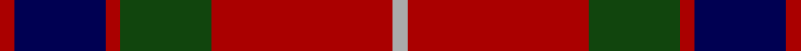
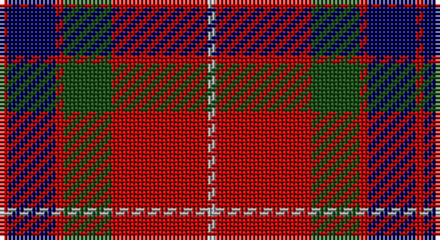

This page is one **sett** — a single exact thread-count. It belongs to the [tartan](/setts/r1db6r1dg6r12lr1/)
(the same proportion at any scale), whose colour order is pattern [RBRGRY](/stripes/rbrgry/).

Sourced from weddslist.  It is a [6 stripe tartan](/stripes/stripes6/).

Original link http://www.weddslist.com/cgi-bin/tartans/pg.pl?source=tinsel

## Also known as

This cloth is also recorded under:

- Fraser Red

2 attestations — the source records this cloth was collapsed from (oldest owns this page)

<ul>
<li>undated — Fraser VS (weddslist, <a href="http://www.weddslist.com/cgi-bin/tartans/pg.pl?source=tinsel">record</a>)</li>
<li>undated — Fraser VS (weddslist, <a href="http://www.weddslist.com/cgi-bin/tartans/pg.pl?source=x">record</a>)</li>
</ul>

## Thread count
DR/2 DB12 DR2 DG12 DR24 N/2

One full sett is **104 threads**.

## Palette

Palette: <strong>custom</strong>
<table><thead><tr><th>Colour</th><th>Threads</th><th>Shade</th><th>Base</th><th>OKLCh</th></tr></thead><tbody><tr><td>DR/</td><td style="text-align:right;font-variant-numeric:tabular-nums">2</td><td><code style="background-color:#AA0000;">#AA0000</code> <small style="color:#888">#AA0000</small></td><td>R <code style="background-color:#CC0000;">#CC0000</code></td><td><small style="color:#888">oklch(46.3% 0.190 29.2)</small></td></tr><tr><td>DB</td><td style="text-align:right;font-variant-numeric:tabular-nums">12</td><td><code style="background-color:#000052;">#000052</code> <small style="color:#888">#000052</small></td><td>B <code style="background-color:#2A418A;">#2A418A</code></td><td><small style="color:#888">oklch(19.8% 0.137 264.1)</small></td></tr><tr><td>DR</td><td style="text-align:right;font-variant-numeric:tabular-nums">2</td><td><code style="background-color:#AA0000;">#AA0000</code> <small style="color:#888">#AA0000</small></td><td>R <code style="background-color:#CC0000;">#CC0000</code></td><td><small style="color:#888">oklch(46.3% 0.190 29.2)</small></td></tr><tr><td>DG</td><td style="text-align:right;font-variant-numeric:tabular-nums">12</td><td><code style="background-color:#11450D;">#11450D</code> <small style="color:#888">#11450D</small></td><td>G <code style="background-color:#006100;">#006100</code></td><td><small style="color:#888">oklch(34.4% 0.101 142.1)</small></td></tr><tr><td>DR</td><td style="text-align:right;font-variant-numeric:tabular-nums">24</td><td><code style="background-color:#AA0000;">#AA0000</code> <small style="color:#888">#AA0000</small></td><td>R <code style="background-color:#CC0000;">#CC0000</code></td><td><small style="color:#888">oklch(46.3% 0.190 29.2)</small></td></tr><tr><td>N/</td><td style="text-align:right;font-variant-numeric:tabular-nums">2</td><td><code style="background-color:#AAAAAA;">#AAAAAA</code> <small style="color:#888">#AAAAAA</small></td><td>Y <code style="background-color:#F2BF00;">#F2BF00</code></td><td><small style="color:#888">oklch(73.8% 0.000 89.9)</small></td></tr></tbody></table>

# Sample pattern

## Nearest tartans

The nearest existing variants by ΔTartan distance, with this tartan at the top so the swatches line up against it.

ΔTartan

Tartan

Sett

—

<a href="/ttd/edit/#slug=r1db6r1dg6r12lr1~x2">Fraser VS</a> <a class="nn-out" href="/variants/s6/r1db6r1dg6r12lr1~x2/" title="open its dictionary page">↗</a>

0.63

<a href="/ttd/edit/#slug=r28db12r3dg20t2dg2r7~x2&amp;base=r1db6r1dg6r12lr1~x2">Carrick (Strathmore) District Tartan</a> <a class="nn-out" href="/variants/s7/r28db12r3dg20t2dg2r7~x2/" title="open its dictionary page">↗</a>

0.64

<a href="/ttd/edit/#slug=r1db6r1dg6r12w1~x2&amp;base=r1db6r1dg6r12lr1~x2">Fraser Red Clan Tartan</a> <a class="nn-out" href="/variants/s6/r1db6r1dg6r12w1~x2/" title="open its dictionary page">↗</a>

0.71

<a href="/ttd/edit/#slug=r1db6r1dg6r12lb1&amp;base=r1db6r1dg6r12lr1~x2">Fraser VS</a> <a class="nn-out" href="/variants/s6/r1db6r1dg6r12lb1/" title="open its dictionary page">↗</a>

0.77

<a href="/ttd/edit/#slug=r3db15r3g8r20k2~x2&amp;base=r1db6r1dg6r12lr1~x2">Finnigan (Estimated threadcount)</a> <a class="nn-out" href="/variants/s6/r3db15r3g8r20k2~x2/" title="open its dictionary page">↗</a>

0.89

<a href="/ttd/edit/#slug=r6dg16r4db12r16b1r2~x2&amp;base=r1db6r1dg6r12lr1~x2">MacQuarrie LO</a> <a class="nn-out" href="/variants/s7/r6dg16r4db12r16b1r2~x2/" title="open its dictionary page">↗</a>

0.91

<a href="/ttd/edit/#slug=r4k2r24k6db6dg16r3~x2&amp;base=r1db6r1dg6r12lr1~x2">MacDuff #4</a> <a class="nn-out" href="/variants/s7/r4k2r24k6db6dg16r3~x2/" title="open its dictionary page">↗</a>

0.93

<a href="/ttd/edit/#slug=dr2dg14lb3dr13ly1dr2~x4&amp;base=r1db6r1dg6r12lr1~x2">Swedish Para Whisky Club (Corporate</a> <a class="nn-out" href="/variants/s6/dr2dg14lb3dr13ly1dr2~x4/" title="open its dictionary page">↗</a>

0.97

<a href="/ttd/edit/#slug=r6dg16r4db12r16lb1r2~x2&amp;base=r1db6r1dg6r12lr1~x2">MacQuarrie LO</a> <a class="nn-out" href="/variants/s7/r6dg16r4db12r16lb1r2~x2/" title="open its dictionary page">↗</a>

1.01

<a href="/ttd/edit/#slug=k2r12db6r3dg12r4db1~x2&amp;base=r1db6r1dg6r12lr1~x2">MacBean/MacElvain</a> <a class="nn-out" href="/variants/s7/k2r12db6r3dg12r4db1~x2/" title="open its dictionary page">↗</a>

1.02

<a href="/ttd/edit/#slug=lb2dr12g6dr1n6dr1~x4&amp;base=r1db6r1dg6r12lr1~x2">Fraser Green</a> <a class="nn-out" href="/variants/s6/lb2dr12g6dr1n6dr1~x4/" title="open its dictionary page">↗</a>

## Neighbour map

Every grey dot is one of 14360 variants placed by the first two principal components of the ΔTartan feature space (44% of its variance). Red is this tartan; blue dots are its nearest — click one to open its page.

<svg viewBox="0 0 640 380" role="img" style="max-width:100%;height:auto;border:1px solid #e0e0e0;border-radius:4px;display:block" xmlns="http://www.w3.org/2000/svg"><image href="/nn/cloud.v1.png" width="640" height="380"/><a href="/variants/s7/r28db12r3dg20t2dg2r7~x2/"><circle cx="308.1" cy="185.9" r="4" fill="#3465a4"><title>Carrick (Strathmore) District Tartan</title></circle></a><a href="/variants/s6/r1db6r1dg6r12w1~x2/"><circle cx="292.6" cy="189.0" r="4" fill="#3465a4"><title>Fraser Red Clan Tartan</title></circle></a><a href="/variants/s6/r1db6r1dg6r12lb1/"><circle cx="280.6" cy="185.4" r="4" fill="#3465a4"><title>Fraser VS</title></circle></a><a href="/variants/s6/r3db15r3g8r20k2~x2/"><circle cx="285.7" cy="208.5" r="4" fill="#3465a4"><title>Finnigan (Estimated threadcount)</title></circle></a><a href="/variants/s7/r6dg16r4db12r16b1r2~x2/"><circle cx="289.1" cy="201.4" r="4" fill="#3465a4"><title>MacQuarrie LO</title></circle></a><a href="/variants/s7/r4k2r24k6db6dg16r3~x2/"><circle cx="278.1" cy="183.7" r="4" fill="#3465a4"><title>MacDuff #4</title></circle></a><a href="/variants/s6/dr2dg14lb3dr13ly1dr2~x4/"><circle cx="312.2" cy="199.8" r="4" fill="#3465a4"><title>Swedish Para Whisky Club (Corporate</title></circle></a><a href="/variants/s7/r6dg16r4db12r16lb1r2~x2/"><circle cx="267.5" cy="187.0" r="4" fill="#3465a4"><title>MacQuarrie LO</title></circle></a><a href="/variants/s7/k2r12db6r3dg12r4db1~x2/"><circle cx="259.2" cy="199.0" r="4" fill="#3465a4"><title>MacBean/MacElvain</title></circle></a><a href="/variants/s6/lb2dr12g6dr1n6dr1~x4/"><circle cx="287.9" cy="212.9" r="4" fill="#3465a4"><title>Fraser Green</title></circle></a><circle cx="298.2" cy="197.8" r="5" fill="#c00000"/></svg>

ID: /variants/s6/r1db6r1dg6r12lr1~x2/
