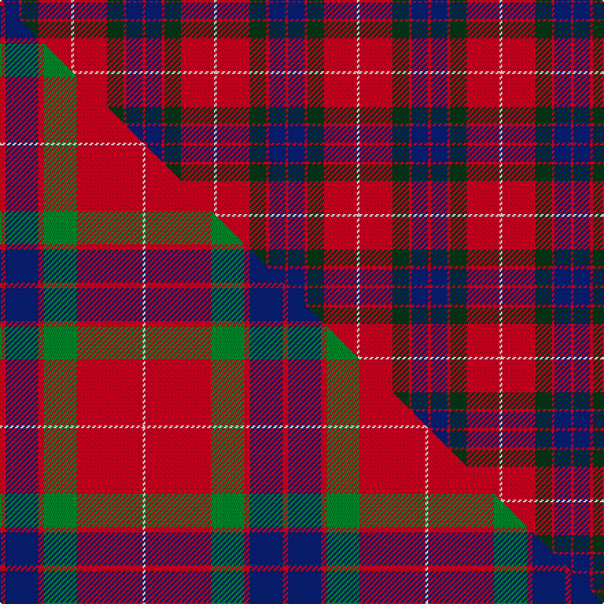

This is one **variant** — a specific cloth: this exact thread count and colourway, with its own
provenance below. It is one weaving of the [sett](/tartans/f/fr/fraser/) (the scale-free proportion — the
same cloth at any scale or shade), whose colour order is pattern [RBRGRW](/stripes/rbrgrw/).

Part of the [Fraser](/tartans/f/fr/fraser/) tartan — the named design grouping this sett with its other cloths.

Sourced from house-of-tartan.  It is a [6 stripe tartan](/stripes/stripes6/).

Original link [http://www.house-of-tartan.scotland.net/house/TartanViewjs.asp?colr=Def&tnam=1424](http://www.house-of-tartan.scotland.net/house/TartanViewjs.asp?colr=Def&tnam=1424)

## Provenance

Earliest known date: 1842 Early references include Wilson's of Bannockburn, but Wilson did not name the sett. D W Stewart contends that this is in fact an early Grant tartan which he traced to a portrait of Robert Grant of Lurg (1678-1771), hanging at Troup House before it was closed around 1894. It is undoubtedly the most popular Fraser pattern today.

Dataset <small>— provenance for this record, inherited from the source manifest</small>

<dl class="dataset-prov">
<dt>source</dt><dd><a href="/sources/house-of-tartan/">House of Tartan</a></dd>
<dt>data captured from</dt><dd><a href="https://github.com/thetartan/tartan-database/blob/master/data/house-of-tartan/data.csv">https://github.com/thetartan/tartan-database/blob/master/data/house-of-tartan/data.csv</a></dd>
<dt>data date</dt><dd>1842 <small>(this record)</small></dd>
<dt>licence</dt><dd><a href="https://creativecommons.org/licenses/by-nc-nd/4.0/">CC BY-NC-ND 4.0</a></dd>
</dl>

Capture chain <small>— the hands this data passed through, oldest first; each capture carries its own licence</small>

<ol class="capture-chain">
<li><a href="http://www.house-of-tartan.scotland.net/">House of Tartan</a> <small>the weaver/retailer's database — the site is now offline; the URL is kept as the ultimate source's identity</small></li>
<li><a href="https://github.com/thetartan/tartan-database">thetartan/tartan-database</a> <small>2016-2017</small> · <a href="https://creativecommons.org/licenses/by-nc-nd/4.0/">CC BY-NC-ND 4.0</a> <small>Levko Kravets's frozen compilation — the capture we vendored, and where its CC licence text came from</small></li>
<li>this dictionary <small>captured 2026-06-10 · commit 5bf86c7566</small> <small>each re-capture is a git commit to data/sources</small></li>
</ol>

## Thread count
R/2 DB12 R2 DG12 R24 W/2

One full sett is **104 threads**.

## Palette
<table><thead><tr><th>Colour</th><th>Shade</th><th>OKLCh</th></tr></thead><tbody><tr><td>DB</td><td><code style="background-color:#082077;">#082077</code> <small style="color:#888">#082077</small></td><td><small style="color:#888">oklch(30.0% 0.149 265.1)</small></td></tr><tr><td>DG</td><td><code style="background-color:#053819;">#053819</code> <small style="color:#888">#053819</small></td><td><small style="color:#888">oklch(30.0% 0.075 151.3)</small></td></tr><tr><td>W</td><td><code style="background-color:#F7F7F7;">#F7F7F7</code> <small style="color:#888">#F7F7F7</small></td><td><small style="color:#888">oklch(97.6% 0.000 89.9)</small></td></tr><tr><td>R</td><td><code style="background-color:#D60020;">#D60020</code> <small style="color:#888">#D60020</small></td><td><small style="color:#888">oklch(55.2% 0.224 25.5)</small></td></tr></tbody></table>

# Sample pattern

## Compared to the master

This cloth is one sett of its design; the master sett (the exemplar the design is anchored on) is below for comparison.

Its **ΔTartan distance** from the master is **0.55** — the same measure the nearest-tartans table ranks by (0 is identical; a re-scale of the same cloth is near 0, a recolour or a different proportion further).

<figure class="master-compare" style="margin:0">

this sett
master sett ★

<figcaption style="color:#888;font-size:smaller">One weave of this sett against the <a href="/setts/r2db12r2g12r24w1/">master sett ★</a>, split on the diagonal: a shared proportion runs seamlessly across it with only the shades shifting; a different proportion breaks on it.</figcaption>
</figure>

## Nearest tartan variants

The nearest existing variants by ΔTartan distance, with this cloth at the top so the swatches line up against it.

ΔTartan

Threads

Variant

Sett

—

104

<a href="/variants/s6/r1db6r1dg6r12w1~x2/">Fraser Red Clan Tartan</a>

<a href="/ttd/edit/#slug=r1db6r1g6r12w1&amp;base=r1db6r1dg6r12w1~x2" title="compare in the TTD">0.11</a>

52

<a href="/variants/s6/r1db6r1g6r12w1/">Fraser VS</a>

<a href="/ttd/edit/#slug=r1db6r1g6r12w1~x2&amp;base=r1db6r1dg6r12w1~x2" title="compare in the TTD">0.11</a>

104

<a href="/variants/s6/r1db6r1g6r12w1~x2/">Fraser VS</a>

<a href="/ttd/edit/#slug=r2db10r2g10r25w2~x2&amp;base=r1db6r1dg6r12w1~x2" title="compare in the TTD">0.32</a>

196

<a href="/variants/s6/r2db10r2g10r25w2~x2/">Grant of Lurg</a>

<a href="/ttd/edit/#slug=r2db12r2dg12r24w1~x2&amp;base=r1db6r1dg6r12w1~x2" title="compare in the TTD">0.49</a>

206

<a href="/variants/s6/r2db12r2dg12r24w1~x2/">Fraser</a>

<a href="/ttd/edit/#slug=r3db15r3g8r20k2~x2&amp;base=r1db6r1dg6r12w1~x2" title="compare in the TTD">0.51</a>

194

<a href="/variants/s6/r3db15r3g8r20k2~x2/">Finnigan (Estimated threadcount)</a>

<a href="/ttd/edit/#slug=r2db12r2g12r24w1~x2&amp;base=r1db6r1dg6r12w1~x2" title="compare in the TTD">0.55</a>

206

<a href="/variants/s6/r2db12r2g12r24w1~x2/">Fraser (1745)</a>

<a href="/ttd/edit/#slug=r15g7db7r1~x4&amp;base=r1db6r1dg6r12w1~x2" title="compare in the TTD">1.53</a>

176

<a href="/variants/s4/r15g7db7r1~x4/">Hugh Fraser of Boblainy</a>

<a href="/ttd/edit/#slug=db2r25g10r2db10r2~x2&amp;base=r1db6r1dg6r12w1~x2" title="compare in the TTD">1.61</a>

196

<a href="/variants/s6/db2r25g10r2db10r2~x2/">Grant of Lurg Artifact Tartan</a>

<a href="/ttd/edit/#slug=r6g16r4db12r16w1r2~x2&amp;base=r1db6r1dg6r12w1~x2" title="compare in the TTD">1.65</a>

212

<a href="/variants/s7/r6g16r4db12r16w1r2~x2/">MacQuarrie LO</a>

<a href="/ttd/edit/#slug=r16db6r2g6r2db1~x2&amp;base=r1db6r1dg6r12w1~x2" title="compare in the TTD">1.67</a>

98

<a href="/variants/s6/r16db6r2g6r2db1~x2/">MacKintosh, Plaid</a>

## Neighbour map

Every grey dot is one of 13662 variants placed by the first two principal components of the ΔTartan feature space (42% of its variance). Red is this tartan; blue dots are its nearest — click one to open its page. The map is a flat projection of a many-dimensional space — [how to read it](/posts/neighbourhood-maps/).

<svg viewBox="0 0 640 380" role="img" style="max-width:100%;height:auto;border:1px solid #e0e0e0;border-radius:4px;display:block" xmlns="http://www.w3.org/2000/svg"><image href="/nn/cloud.v1.png" width="640" height="380"/><a href="/variants/s6/r1db6r1g6r12w1/"><circle cx="286.4" cy="192.0" r="4" fill="#3465a4"><title>Fraser VS</title></circle></a><a href="/variants/s6/r1db6r1g6r12w1~x2/"><circle cx="286.4" cy="192.0" r="4" fill="#3465a4"><title>Fraser VS</title></circle></a><a href="/variants/s6/r2db10r2g10r25w2~x2/"><circle cx="321.7" cy="183.3" r="4" fill="#3465a4"><title>Grant of Lurg</title></circle></a><a href="/variants/s6/r2db12r2dg12r24w1~x2/"><circle cx="327.1" cy="164.3" r="4" fill="#3465a4"><title>Fraser</title></circle></a><a href="/variants/s6/r3db15r3g8r20k2~x2/"><circle cx="248.3" cy="189.8" r="4" fill="#3465a4"><title>Finnigan (Estimated threadcount)</title></circle></a><a href="/variants/s6/r2db12r2g12r24w1~x2/"><circle cx="321.7" cy="165.0" r="4" fill="#3465a4"><title>Fraser (1745)</title></circle></a><a href="/variants/s4/r15g7db7r1~x4/"><circle cx="321.7" cy="234.7" r="4" fill="#3465a4"><title>Hugh Fraser of Boblainy</title></circle></a><a href="/variants/s6/db2r25g10r2db10r2~x2/"><circle cx="351.6" cy="199.2" r="4" fill="#3465a4"><title>Grant of Lurg Artifact Tartan</title></circle></a><a href="/variants/s7/r6g16r4db12r16w1r2~x2/"><circle cx="271.1" cy="191.5" r="4" fill="#3465a4"><title>MacQuarrie LO</title></circle></a><a href="/variants/s6/r16db6r2g6r2db1~x2/"><circle cx="381.5" cy="192.2" r="4" fill="#3465a4"><title>MacKintosh, Plaid</title></circle></a><circle cx="289.9" cy="190.8" r="5" fill="#c00000"/><text x="320" y="376" text-anchor="middle" font-size="11" fill="#999">ground</text><text x="11" y="190" text-anchor="middle" font-size="11" fill="#999" transform="rotate(-90 11 190)">complexity</text></svg>

ID: /variants/s6/r1db6r1dg6r12w1~x2/
