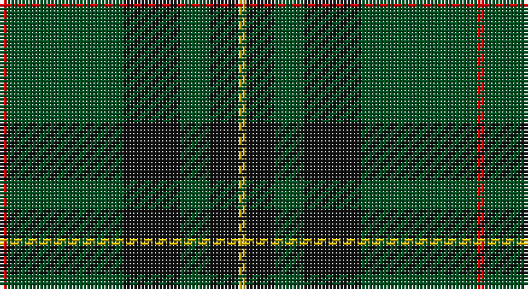

This page is one **sett** — a single exact thread-count. It belongs to the [tartan](/setts/r1dg16k8dg4k4ly1/)
(the same proportion at any scale), whose colour order is pattern [RGKGKY](/stripes/rgkgky/).

Part of the [Forbes](/tartans/forbes/) tartan — the named design grouping this sett with its other cloths.

Sourced from register-of-tartans.  It is a [6 stripe tartan](/stripes/stripes6/).

Original link https://www.tartanregister.gov.uk/tartanDetails.aspx?ref=1219

## Also known as

This cloth is also recorded under:

- 74th Regiment of Foot
- Forbes #2
- Forbes #3
- Forbes #4
- Forbes #5
- Forbes #6
- Forbes Ancient
- Forbes, Ancient

## Register references

External register numbers recorded for this tartan.

- Scottish Register of Tartans: [1219](https://www.tartanregister.gov.uk/tartanDetails.aspx?ref=1219)
- Scottish Tartans World Register: 1490

## Thread count
R/2 G32 K16 G8 K8 Y/2

One full sett is **132 threads**.

## Palette

Palette: <strong>Tartan Register</strong>
<table><thead><tr><th>Colour</th><th>Threads</th><th>Shade</th><th>Base</th><th>OKLCh</th></tr></thead><tbody><tr><td>R/</td><td style="text-align:right;font-variant-numeric:tabular-nums">2</td><td><code style="background-color:#DC0000;">#DC0000</code> <small style="color:#888">#DC0000</small></td><td>R <code style="background-color:#CC0000;">#CC0000</code></td><td><small style="color:#888">oklch(56.2% 0.230 29.2)</small></td></tr><tr><td>G</td><td style="text-align:right;font-variant-numeric:tabular-nums">32</td><td><code style="background-color:#005020;">#005020</code> <small style="color:#888">#005020</small></td><td>G <code style="background-color:#006100;">#006100</code></td><td><small style="color:#888">oklch(37.7% 0.105 149.6)</small></td></tr><tr><td>K</td><td style="text-align:right;font-variant-numeric:tabular-nums">16</td><td><code style="background-color:#101010;">#101010</code> <small style="color:#888">#101010</small></td><td>K <code style="background-color:#000000;">#000000</code></td><td><small style="color:#888">oklch(17.3% 0.000 89.9)</small></td></tr><tr><td>G</td><td style="text-align:right;font-variant-numeric:tabular-nums">8</td><td><code style="background-color:#005020;">#005020</code> <small style="color:#888">#005020</small></td><td>G <code style="background-color:#006100;">#006100</code></td><td><small style="color:#888">oklch(37.7% 0.105 149.6)</small></td></tr><tr><td>K</td><td style="text-align:right;font-variant-numeric:tabular-nums">8</td><td><code style="background-color:#101010;">#101010</code> <small style="color:#888">#101010</small></td><td>K <code style="background-color:#000000;">#000000</code></td><td><small style="color:#888">oklch(17.3% 0.000 89.9)</small></td></tr><tr><td>Y/</td><td style="text-align:right;font-variant-numeric:tabular-nums">2</td><td><code style="background-color:#E8C000;">#E8C000</code> <small style="color:#888">#E8C000</small></td><td>Y <code style="background-color:#F2BF00;">#F2BF00</code></td><td><small style="color:#888">oklch(81.9% 0.168 93.7)</small></td></tr></tbody></table>

# Sample pattern

## Compared to the master

This cloth is one sett of its design; the master sett (the exemplar the design is anchored on) is below for comparison.

<figure style="margin:0"><figcaption style="color:#888;font-size:smaller">this sett</figcaption></figure>
<figure style="margin:0"><figcaption style="color:#888;font-size:smaller"><a href="/setts/db8k1db2k1db2k6g8k1w2k1g8k6db8k1db2/">master sett →</a></figcaption></figure>

## Nearest tartans

The nearest existing variants by ΔTartan distance, with this tartan at the top so the swatches line up against it.

ΔTartan

Tartan

Sett

—

<a href="/ttd/edit/#slug=r1dg16k8dg4k4ly1~x2">Forbes #6</a> <a class="nn-out" href="/variants/s6/r1dg16k8dg4k4ly1~x2/" title="open its dictionary page">↗</a>

0.97

<a href="/ttd/edit/#slug=dg46k18dg6k13r4k4w4~x2&amp;base=r1dg16k8dg4k4ly1~x2">Page</a> <a class="nn-out" href="/variants/s7/dg46k18dg6k13r4k4w4~x2/" title="open its dictionary page">↗</a>

0.99

<a href="/ttd/edit/#slug=g3r1k14g14lo1~x4&amp;base=r1dg16k8dg4k4ly1~x2">Wcwm 1255</a> <a class="nn-out" href="/variants/s5/g3r1k14g14lo1~x4/" title="open its dictionary page">↗</a>

1.08

<a href="/ttd/edit/#slug=k6db1k6g4k10g20r2~x2&amp;base=r1dg16k8dg4k4ly1~x2">MacKinross</a> <a class="nn-out" href="/variants/s7/k6db1k6g4k10g20r2~x2/" title="open its dictionary page">↗</a>

1.14

<a href="/ttd/edit/#slug=dt16g4dt3g3lo2g24r2~x2&amp;base=r1dg16k8dg4k4ly1~x2">St Andrews Links</a> <a class="nn-out" href="/variants/s7/dt16g4dt3g3lo2g24r2~x2/" title="open its dictionary page">↗</a>

1.14

<a href="/ttd/edit/#slug=dt6r3g26dt26w2dt27r5g5~x2&amp;base=r1dg16k8dg4k4ly1~x2">MacHardy (Clan)</a> <a class="nn-out" href="/variants/s8/dt6r3g26dt26w2dt27r5g5~x2/" title="open its dictionary page">↗</a>

1.18

<a href="/ttd/edit/#slug=r3g30k12g6k16ly2~x2&amp;base=r1dg16k8dg4k4ly1~x2">MacArthur (Variant)</a> <a class="nn-out" href="/variants/s6/r3g30k12g6k16ly2~x2/" title="open its dictionary page">↗</a>

1.18

<a href="/ttd/edit/#slug=g70k26g12k14db3k16~x2&amp;base=r1dg16k8dg4k4ly1~x2">Duchess of Fife #2</a> <a class="nn-out" href="/variants/s6/g70k26g12k14db3k16~x2/" title="open its dictionary page">↗</a>

1.19

<a href="/ttd/edit/#slug=ly2dg12db6r3dg12r4db1~x2&amp;base=r1dg16k8dg4k4ly1~x2">MacKintosh Hunting</a> <a class="nn-out" href="/variants/s7/ly2dg12db6r3dg12r4db1~x2/" title="open its dictionary page">↗</a>

1.23

<a href="/ttd/edit/#slug=g3k6r2k6g3k2g16k1~x4&amp;base=r1dg16k8dg4k4ly1~x2">Glenbarr</a> <a class="nn-out" href="/variants/s8/g3k6r2k6g3k2g16k1~x4/" title="open its dictionary page">↗</a>

1.24

<a href="/ttd/edit/#slug=g24k2db3k2db8r2~x2&amp;base=r1dg16k8dg4k4ly1~x2">Shaw (Clan 1)</a> <a class="nn-out" href="/variants/s6/g24k2db3k2db8r2~x2/" title="open its dictionary page">↗</a>

## Neighbour map

Every grey dot is one of 14360 variants placed by the first two principal components of the ΔTartan feature space (44% of its variance). Red is this tartan; blue dots are its nearest — click one to open its page.

<svg viewBox="0 0 640 380" role="img" style="max-width:100%;height:auto;border:1px solid #e0e0e0;border-radius:4px;display:block" xmlns="http://www.w3.org/2000/svg"><image href="/nn/cloud.v1.png" width="640" height="380"/><a href="/variants/s7/dg46k18dg6k13r4k4w4~x2/"><circle cx="343.8" cy="210.4" r="4" fill="#3465a4"><title>Page</title></circle></a><a href="/variants/s5/g3r1k14g14lo1~x4/"><circle cx="337.3" cy="224.0" r="4" fill="#3465a4"><title>Wcwm 1255</title></circle></a><a href="/variants/s7/k6db1k6g4k10g20r2~x2/"><circle cx="332.8" cy="204.5" r="4" fill="#3465a4"><title>MacKinross</title></circle></a><a href="/variants/s7/dt16g4dt3g3lo2g24r2~x2/"><circle cx="383.6" cy="221.5" r="4" fill="#3465a4"><title>St Andrews Links</title></circle></a><a href="/variants/s8/dt6r3g26dt26w2dt27r5g5~x2/"><circle cx="365.1" cy="216.7" r="4" fill="#3465a4"><title>MacHardy (Clan)</title></circle></a><a href="/variants/s6/r3g30k12g6k16ly2~x2/"><circle cx="319.1" cy="214.6" r="4" fill="#3465a4"><title>MacArthur (Variant)</title></circle></a><a href="/variants/s6/g70k26g12k14db3k16~x2/"><circle cx="419.6" cy="222.1" r="4" fill="#3465a4"><title>Duchess of Fife #2</title></circle></a><a href="/variants/s7/ly2dg12db6r3dg12r4db1~x2/"><circle cx="334.0" cy="227.1" r="4" fill="#3465a4"><title>MacKintosh Hunting</title></circle></a><a href="/variants/s8/g3k6r2k6g3k2g16k1~x4/"><circle cx="376.4" cy="215.7" r="4" fill="#3465a4"><title>Glenbarr</title></circle></a><a href="/variants/s6/g24k2db3k2db8r2~x2/"><circle cx="369.4" cy="209.1" r="4" fill="#3465a4"><title>Shaw (Clan 1)</title></circle></a><circle cx="388.3" cy="222.4" r="5" fill="#c00000"/></svg>

ID: /variants/s6/r1dg16k8dg4k4ly1~x2/
