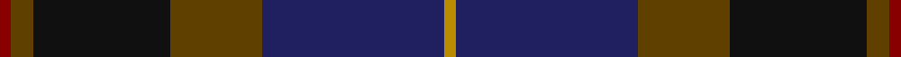
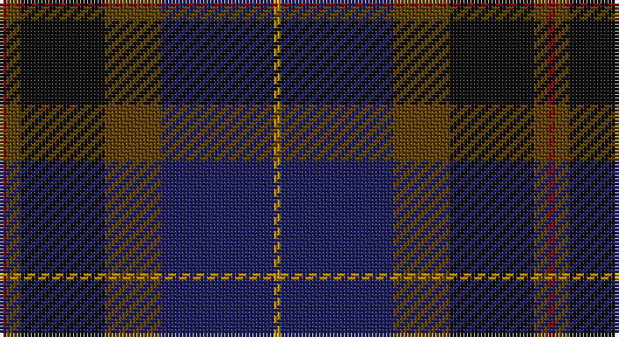

This page is one **sett** — a single exact thread-count. It belongs to the [tartan](/setts/r1dy2k12dy8db16lo1/)
(the same proportion at any scale), whose colour order is pattern [RGKGBY](/stripes/rgkgby/).

Sourced from register-of-tartans.  It is a [6 stripe tartan](/stripes/stripes6/).

Original link https://www.tartanregister.gov.uk/tartanDetails.aspx?ref=4874

## Register references

External register numbers recorded for this tartan.

- Scottish Register of Tartans: [4874](https://www.tartanregister.gov.uk/tartanDetails.aspx?ref=4874)
- Scottish Tartans Authority (ITI): 3711

## Thread count
DR/2 T4 K24 T16 DB32 DY/2

One full sett is **156 threads**.

## Palette

Palette: <strong>Tartan Register</strong>
<table><thead><tr><th>Colour</th><th>Threads</th><th>Shade</th><th>Base</th><th>OKLCh</th></tr></thead><tbody><tr><td>DR/</td><td style="text-align:right;font-variant-numeric:tabular-nums">2</td><td><code style="background-color:#880000;">#880000</code> <small style="color:#888">#880000</small></td><td>R <code style="background-color:#CC0000;">#CC0000</code></td><td><small style="color:#888">oklch(39.4% 0.162 29.2)</small></td></tr><tr><td>T</td><td style="text-align:right;font-variant-numeric:tabular-nums">4</td><td><code style="background-color:#604000;">#604000</code> <small style="color:#888">#604000</small></td><td>G <code style="background-color:#006100;">#006100</code></td><td><small style="color:#888">oklch(39.8% 0.083 76.8)</small></td></tr><tr><td>K</td><td style="text-align:right;font-variant-numeric:tabular-nums">24</td><td><code style="background-color:#101010;">#101010</code> <small style="color:#888">#101010</small></td><td>K <code style="background-color:#000000;">#000000</code></td><td><small style="color:#888">oklch(17.3% 0.000 89.9)</small></td></tr><tr><td>T</td><td style="text-align:right;font-variant-numeric:tabular-nums">16</td><td><code style="background-color:#604000;">#604000</code> <small style="color:#888">#604000</small></td><td>G <code style="background-color:#006100;">#006100</code></td><td><small style="color:#888">oklch(39.8% 0.083 76.8)</small></td></tr><tr><td>DB</td><td style="text-align:right;font-variant-numeric:tabular-nums">32</td><td><code style="background-color:#202060;">#202060</code> <small style="color:#888">#202060</small></td><td>B <code style="background-color:#2A418A;">#2A418A</code></td><td><small style="color:#888">oklch(28.9% 0.111 276.9)</small></td></tr><tr><td>DY/</td><td style="text-align:right;font-variant-numeric:tabular-nums">2</td><td><code style="background-color:#BC8C00;">#BC8C00</code> <small style="color:#888">#BC8C00</small></td><td>Y <code style="background-color:#F2BF00;">#F2BF00</code></td><td><small style="color:#888">oklch(66.8% 0.137 84.1)</small></td></tr></tbody></table>

# Sample pattern

## Nearest tartans

The nearest existing variants by ΔTartan distance, with this tartan at the top so the swatches line up against it.

ΔTartan

Tartan

Sett

—

<a href="/ttd/edit/#slug=r1dy2k12dy8db16lo1~x2">Bobby Jones (Personal)</a> <a class="nn-out" href="/variants/s6/r1dy2k12dy8db16lo1~x2/" title="open its dictionary page">↗</a>

0.84

<a href="/ttd/edit/#slug=r1dy2dt12dy8db16lo1~x2&amp;base=r1dy2k12dy8db16lo1~x2">Bobby Jones (Personal)</a> <a class="nn-out" href="/variants/s6/r1dy2dt12dy8db16lo1~x2/" title="open its dictionary page">↗</a>

1.05

<a href="/variants/s5/n8o3ni34k34dp3~x2/">Passion of Scotland, Pewter (Fashion</a>

1.09

<a href="/variants/s6/r1n12ki6k1do10r1~x4/">Andover</a>

1.13

<a href="/ttd/edit/#slug=dp5db8dt13g21db34dt55o3&amp;base=r1dy2k12dy8db16lo1~x2">Bouncing Blackie (Personal)</a> <a class="nn-out" href="/variants/s7/dp5db8dt13g21db34dt55o3/" title="open its dictionary page">↗</a>

1.16

<a href="/variants/s5/k37dg37n8ki3dp5~x2/">Dallard (Personal)</a>

1.18

<a href="/ttd/edit/#slug=dt6o4dt2db25k30g2k2~x2&amp;base=r1dy2k12dy8db16lo1~x2">Passion of Scotland (Fashion)</a> <a class="nn-out" href="/variants/s7/dt6o4dt2db25k30g2k2~x2/" title="open its dictionary page">↗</a>

1.21

<a href="/ttd/edit/#slug=r3db22k11dg32ly3~x2&amp;base=r1dy2k12dy8db16lo1~x2">Cultoquhey Hotel Corporate Tartan</a> <a class="nn-out" href="/variants/s5/r3db22k11dg32ly3~x2/" title="open its dictionary page">↗</a>

1.22

<a href="/ttd/edit/#slug=db4dg2r17ri9dg10db30n2~x2&amp;base=r1dy2k12dy8db16lo1~x2">Dempster, Ross (Personal)</a> <a class="nn-out" href="/variants/s7/db4dg2r17ri9dg10db30n2~x2/" title="open its dictionary page">↗</a>

1.22

<a href="/ttd/edit/#slug=dr4dg27o2db25lo5dg3o3~x2&amp;base=r1dy2k12dy8db16lo1~x2">Kilkenny, County (District)</a> <a class="nn-out" href="/variants/s7/dr4dg27o2db25lo5dg3o3~x2/" title="open its dictionary page">↗</a>

1.26

<a href="/ttd/edit/#slug=y27dr2y4o15db26k2db6~x2&amp;base=r1dy2k12dy8db16lo1~x2">Bailies of Bennachie Corporate Tartan</a> <a class="nn-out" href="/variants/s7/y27dr2y4o15db26k2db6~x2/" title="open its dictionary page">↗</a>

## Neighbour map

Every grey dot is one of 14360 variants placed by the first two principal components of the ΔTartan feature space (44% of its variance). Red is this tartan; blue dots are its nearest — click one to open its page.

<svg viewBox="0 0 640 380" role="img" style="max-width:100%;height:auto;border:1px solid #e0e0e0;border-radius:4px;display:block" xmlns="http://www.w3.org/2000/svg"><image href="/nn/cloud.v1.png" width="640" height="380"/><a href="/variants/s6/r1dy2dt12dy8db16lo1~x2/"><circle cx="306.2" cy="229.7" r="4" fill="#3465a4"><title>Bobby Jones (Personal)</title></circle></a><a href="/variants/s5/n8o3ni34k34dp3~x2/"><circle cx="314.1" cy="247.1" r="4" fill="#3465a4"><title>Passion of Scotland, Pewter (Fashion</title></circle></a><a href="/variants/s6/r1n12ki6k1do10r1~x4/"><circle cx="255.4" cy="217.3" r="4" fill="#3465a4"><title>Andover</title></circle></a><a href="/variants/s7/dp5db8dt13g21db34dt55o3/"><circle cx="344.7" cy="218.9" r="4" fill="#3465a4"><title>Bouncing Blackie (Personal)</title></circle></a><a href="/variants/s5/k37dg37n8ki3dp5~x2/"><circle cx="296.4" cy="246.4" r="4" fill="#3465a4"><title>Dallard (Personal)</title></circle></a><a href="/variants/s7/dt6o4dt2db25k30g2k2~x2/"><circle cx="335.1" cy="211.3" r="4" fill="#3465a4"><title>Passion of Scotland (Fashion)</title></circle></a><a href="/variants/s5/r3db22k11dg32ly3~x2/"><circle cx="271.5" cy="244.1" r="4" fill="#3465a4"><title>Cultoquhey Hotel Corporate Tartan</title></circle></a><a href="/variants/s7/db4dg2r17ri9dg10db30n2~x2/"><circle cx="281.0" cy="195.7" r="4" fill="#3465a4"><title>Dempster, Ross (Personal)</title></circle></a><a href="/variants/s7/dr4dg27o2db25lo5dg3o3~x2/"><circle cx="282.7" cy="195.6" r="4" fill="#3465a4"><title>Kilkenny, County (District)</title></circle></a><a href="/variants/s7/y27dr2y4o15db26k2db6~x2/"><circle cx="261.2" cy="207.7" r="4" fill="#3465a4"><title>Bailies of Bennachie Corporate Tartan</title></circle></a><circle cx="286.2" cy="218.8" r="5" fill="#c00000"/></svg>

ID: /variants/s6/r1dy2k12dy8db16lo1~x2/
