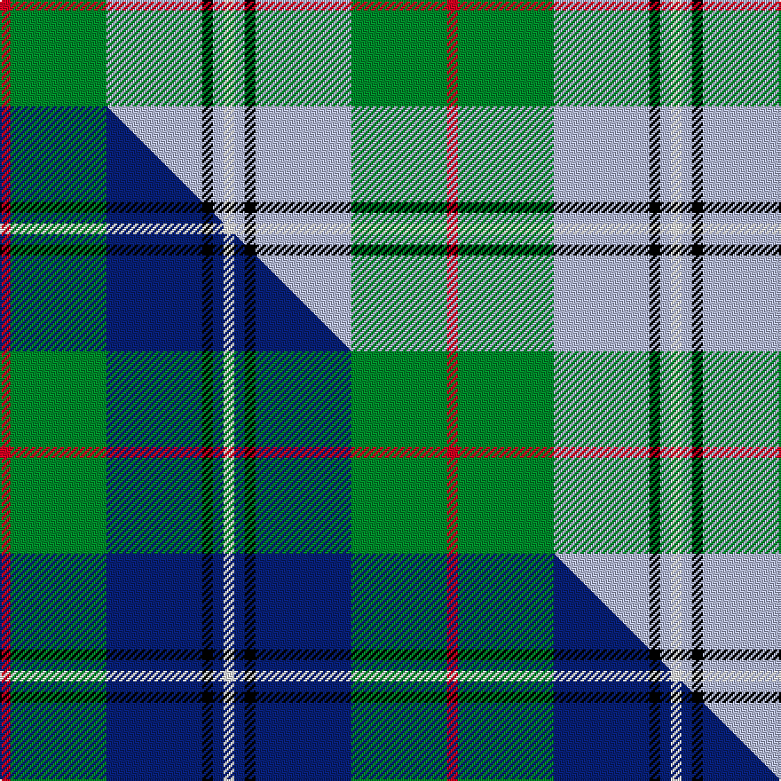

This is one **variant** — a specific cloth: this exact thread count and colourway, with its own
provenance below. It is one weaving of the [sett](/tartans/i/ir/irving-of-glentulchan-2/) (the scale-free proportion — the
same cloth at any scale or shade), whose colour order is pattern [RGWKWW](/stripes/rgwkww/).

Part of the [Irving of Glentulchan](/tartans/i/ir/irving-of-glentulchan-2/) tartan — the named design grouping this sett with its other cloths.

Sourced from tartans-authority.  It is a [6 stripe tartan](/stripes/stripes6/).

Original link <code>http://www.tartansauthority.com/tartan-ferret/display/1460/</code> — retired · [Internet Archive copy](https://web.archive.org/web/*/http://www.tartansauthority.com/tartan-ferret/display/1460/*)

Dataset <small>— provenance for this record, inherited from the source manifest</small>

<dl class="dataset-prov">
<dt>source</dt><dd><a href="/sources/tartans-authority/">Scottish Tartans Authority</a></dd>
<dt>data captured from</dt><dd><a href="https://github.com/thetartan/tartan-database/blob/master/data/tartans-authority/data.csv">https://github.com/thetartan/tartan-database/blob/master/data/tartans-authority/data.csv</a></dd>
<dt>data date</dt><dd>pre 2002 <small>(this record)</small></dd>
<dt>licence</dt><dd><a href="https://creativecommons.org/licenses/by-nc-nd/4.0/">CC BY-NC-ND 4.0</a></dd>
</dl>

Capture chain <small>— the hands this data passed through, oldest first; each capture carries its own licence</small>

<ol class="capture-chain">
<li><a href="https://www.tartansauthority.com/">Scottish Tartans Authority</a> <small>the heritage body’s archive — its tartan-ferret record browser is retired; dead record links are shown unlinked, with an Internet Archive copy (ITI numbers are not SRT references)</small></li>
<li><a href="https://github.com/thetartan/tartan-database">thetartan/tartan-database</a> <small>2016-2017</small> · <a href="https://creativecommons.org/licenses/by-nc-nd/4.0/">CC BY-NC-ND 4.0</a> <small>Levko Kravets's frozen compilation — the capture we vendored, and where its CC licence text came from</small></li>
<li>this dictionary <small>captured 2026-06-10 · commit 5bf86c7566</small> <small>each re-capture is a git commit to data/sources</small></li>
</ol>

## Register references

External register numbers recorded for this tartan.

- Scottish Tartans Authority (ITI): 1460

## Thread count
R/6 G54 LB54 K6 LB6 W/6

One full sett is **252 threads**.

## Palette
<table><thead><tr><th>Colour</th><th>Shade</th><th>OKLCh</th></tr></thead><tbody><tr><td>LB</td><td><code style="background-color:#B5BBDE;">#B5BBDE</code> <small style="color:#888">#B5BBDE</small></td><td><small style="color:#888">oklch(79.9% 0.050 277.6)</small></td></tr><tr><td>K</td><td><code style="background-color:#000000;">#000000</code> <small style="color:#888">#000000</small></td><td><small style="color:#888">oklch(0.0% 0.000 0.0)</small></td></tr><tr><td>G</td><td><code style="background-color:#008B2A;">#008B2A</code> <small style="color:#888">#008B2A</small></td><td><small style="color:#888">oklch(55.4% 0.170 145.9)</small></td></tr><tr><td>W</td><td><code style="background-color:#F7F7F7;">#F7F7F7</code> <small style="color:#888">#F7F7F7</small></td><td><small style="color:#888">oklch(97.6% 0.000 89.9)</small></td></tr><tr><td>R</td><td><code style="background-color:#D60020;">#D60020</code> <small style="color:#888">#D60020</small></td><td><small style="color:#888">oklch(55.2% 0.224 25.5)</small></td></tr></tbody></table>

# Sample pattern

## Compared to the master

This cloth is one sett of its design; the master sett (the exemplar the design is anchored on) is below for comparison.

Its **ΔTartan distance** from the master is **0.23** — the same measure the nearest-tartans table ranks by (0 is identical; a re-scale of the same cloth is near 0, a recolour or a different proportion further).

<figure class="master-compare" style="margin:0">

this sett
master sett ★

<figcaption style="color:#888;font-size:smaller">One weave of this sett against the <a href="/setts/r1g9db9k1db1w1/">master sett ★</a>, split on the diagonal: a shared proportion runs seamlessly across it with only the shades shifting; a different proportion breaks on it.</figcaption>
</figure>

## Nearest tartan variants

The nearest existing variants by ΔTartan distance, with this cloth at the top so the swatches line up against it.

ΔTartan

Threads

Variant

Sett

—

252

<a href="/variants/s6/r1g9lb9k1lb1w1~x6/">Irving of Glentulchan (Personal)</a>

<a href="/ttd/edit/#slug=r1g9db9k1db1w1~x6&amp;base=r1g9lb9k1lb1w1~x6" title="compare in the TTD">0.23</a>

252

<a href="/variants/s6/r1g9db9k1db1w1~x6/">Irving of Glentulchan Family Tartan</a>

<a href="/ttd/edit/#slug=k3db3g23db21w2~x2~db3514276&amp;base=r1g9lb9k1lb1w1~x6" title="compare in the TTD">1.19</a>

198

<a href="/variants/s5/k3db3g23db21w2~x2~db3514276/">Douglas Clan Tartan</a>

<a href="/ttd/edit/#slug=lr4g24db10r3db12lo4~x2&amp;base=r1g9lb9k1lb1w1~x6" title="compare in the TTD">1.47</a>

212

<a href="/variants/s6/lr4g24db10r3db12lo4~x2/">Inglis (Name)</a>

<a href="/ttd/edit/#slug=k3lb2g13w2lb24dr3~x4&amp;base=r1g9lb9k1lb1w1~x6" title="compare in the TTD">1.47</a>

352

<a href="/variants/s6/k3lb2g13w2lb24dr3~x4/">Vance (Name?)</a>

<a href="/ttd/edit/#slug=k3t2g13w2t24dr3~x4~t5912243-g6019141&amp;base=r1g9lb9k1lb1w1~x6" title="compare in the TTD">1.47</a>

352

<a href="/variants/s6/k3t2g13w2t24dr3~x4~t5912243-g6019141/">Vance</a>

<a href="/ttd/edit/#slug=r7y3g28db28w3~x2&amp;base=r1g9lb9k1lb1w1~x6" title="compare in the TTD">1.78</a>

256

<a href="/variants/s5/r7y3g28db28w3~x2/">Turnbull, hunting</a>

<a href="/ttd/edit/#slug=r2y1g10db10w1~x6&amp;base=r1g9lb9k1lb1w1~x6" title="compare in the TTD">1.83</a>

270

<a href="/variants/s5/r2y1g10db10w1~x6/">Turnbull Hunting (Name)</a>

<a href="/ttd/edit/#slug=k2lb2k2lb15g15k2g2w2~x4&amp;base=r1g9lb9k1lb1w1~x6" title="compare in the TTD">1.84</a>

320

<a href="/variants/s8/k2lb2k2lb15g15k2g2w2~x4/">Ben Lomond (Fashion)</a>

<a href="/ttd/edit/#slug=r5t25w5t3dg25t3~x2&amp;base=r1g9lb9k1lb1w1~x6" title="compare in the TTD">1.92</a>

248

<a href="/variants/s6/r5t25w5t3dg25t3~x2/">Thayer USA</a>

<a href="/ttd/edit/#slug=g3r1g12w4lb15ly1lb3~x4&amp;base=r1g9lb9k1lb1w1~x6" title="compare in the TTD">2.04</a>

288

<a href="/variants/s7/g3r1g12w4lb15ly1lb3~x4/">Postcode Lottery</a>

## Neighbour map

Every grey dot is one of 13662 variants placed by the first two principal components of the ΔTartan feature space (42% of its variance). Red is this tartan; blue dots are its nearest — click one to open its page. The map is a flat projection of a many-dimensional space — [how to read it](/posts/neighbourhood-maps/).

<svg viewBox="0 0 640 380" role="img" style="max-width:100%;height:auto;border:1px solid #e0e0e0;border-radius:4px;display:block" xmlns="http://www.w3.org/2000/svg"><image href="/nn/cloud.v1.png" width="640" height="380"/><a href="/variants/s6/r1g9db9k1db1w1~x6/"><circle cx="218.5" cy="178.8" r="4" fill="#3465a4"><title>Irving of Glentulchan Family Tartan</title></circle></a><a href="/variants/s5/k3db3g23db21w2~x2~db3514276/"><circle cx="226.7" cy="190.1" r="4" fill="#3465a4"><title>Douglas Clan Tartan</title></circle></a><a href="/variants/s6/lr4g24db10r3db12lo4~x2/"><circle cx="201.4" cy="219.6" r="4" fill="#3465a4"><title>Inglis (Name)</title></circle></a><a href="/variants/s6/k3lb2g13w2lb24dr3~x4/"><circle cx="260.8" cy="164.2" r="4" fill="#3465a4"><title>Vance (Name?)</title></circle></a><a href="/variants/s6/k3t2g13w2t24dr3~x4~t5912243-g6019141/"><circle cx="274.8" cy="172.5" r="4" fill="#3465a4"><title>Vance</title></circle></a><a href="/variants/s5/r7y3g28db28w3~x2/"><circle cx="211.8" cy="212.9" r="4" fill="#3465a4"><title>Turnbull, hunting</title></circle></a><a href="/variants/s5/r2y1g10db10w1~x6/"><circle cx="225.4" cy="207.6" r="4" fill="#3465a4"><title>Turnbull Hunting (Name)</title></circle></a><a href="/variants/s8/k2lb2k2lb15g15k2g2w2~x4/"><circle cx="179.3" cy="180.2" r="4" fill="#3465a4"><title>Ben Lomond (Fashion)</title></circle></a><a href="/variants/s6/r5t25w5t3dg25t3~x2/"><circle cx="268.5" cy="224.3" r="4" fill="#3465a4"><title>Thayer USA</title></circle></a><a href="/variants/s7/g3r1g12w4lb15ly1lb3~x4/"><circle cx="286.8" cy="190.5" r="4" fill="#3465a4"><title>Postcode Lottery</title></circle></a><circle cx="234.5" cy="187.6" r="5" fill="#c00000"/><text x="320" y="376" text-anchor="middle" font-size="11" fill="#999">ground</text><text x="11" y="190" text-anchor="middle" font-size="11" fill="#999" transform="rotate(-90 11 190)">complexity</text></svg>

ID: /variants/s6/r1g9lb9k1lb1w1~x6/
