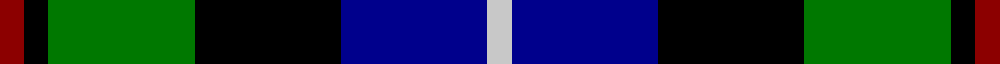
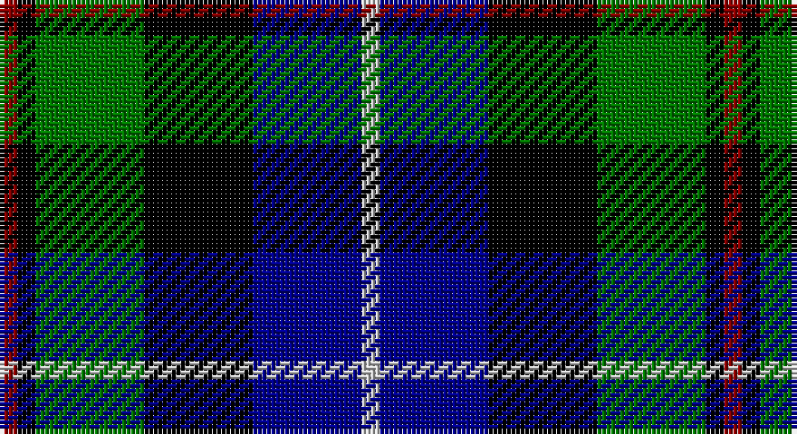

This page is one **sett** — a single exact thread-count. It belongs to the [tartan](/setts/r1k1g6k6db6lb1/)
(the same proportion at any scale), whose colour order is pattern [RKGKBW](/stripes/rkgkbw/).

Sourced from register-of-tartans.  It is a [6 stripe tartan](/stripes/stripes6/).

Original link https://www.tartanregister.gov.uk/tartanDetails.aspx?ref=1295

## Also known as

This cloth is also recorded under:

- Gaines Center for the Humanities

2 attestations — the source records this cloth was collapsed from (oldest owns this page)

<ul>
<li>01/01/1998 — Gaines Center for the Humanities (register-of-tartans, <a href="https://www.tartanregister.gov.uk/tartanDetails.aspx?ref=1295">record</a>)</li>
<li>1998 — Gaines Center for Humanities (Corp) (tartans-authority, <a href="http://www.tartansauthority.com/tartan-ferret/display/4190/">record</a>)</li>
</ul>

## Register references

External register numbers recorded for this tartan.

- Scottish Register of Tartans: [1295](https://www.tartanregister.gov.uk/tartanDetails.aspx?ref=1295)
- Scottish Tartans Authority (ITI): 4190

## Thread count
DR/4 K4 G24 K24 DB24 N/4

One full sett is **160 threads**.

## Palette

Palette: <strong>Tartan Register</strong> <small style="color:#888">(4 of 5 colours)</small>
<table><thead><tr><th>Colour</th><th>Threads</th><th>Shade</th><th>Base</th><th>OKLCh</th></tr></thead><tbody><tr><td>DR/</td><td style="text-align:right;font-variant-numeric:tabular-nums">4</td><td><code style="background-color:#8C0000;">#8C0000</code> <small style="color:#888">#8C0000</small></td><td>R <code style="background-color:#CC0000;">#CC0000</code></td><td><small style="color:#888">oklch(40.2% 0.165 29.2)</small></td></tr><tr><td>K</td><td style="text-align:right;font-variant-numeric:tabular-nums">4</td><td><code style="background-color:#000000;">#000000</code> <small style="color:#888">#000000</small></td><td>K <code style="background-color:#000000;">#000000</code></td><td><small style="color:#888">oklch(0.0% 0.000 0.0)</small></td></tr><tr><td>G</td><td style="text-align:right;font-variant-numeric:tabular-nums">24</td><td><code style="background-color:#007800;">#007800</code> <small style="color:#888">#007800</small></td><td>G <code style="background-color:#006100;">#006100</code></td><td><small style="color:#888">oklch(49.6% 0.169 142.5)</small></td></tr><tr><td>K</td><td style="text-align:right;font-variant-numeric:tabular-nums">24</td><td><code style="background-color:#000000;">#000000</code> <small style="color:#888">#000000</small></td><td>K <code style="background-color:#000000;">#000000</code></td><td><small style="color:#888">oklch(0.0% 0.000 0.0)</small></td></tr><tr><td>DB</td><td style="text-align:right;font-variant-numeric:tabular-nums">24</td><td><code style="background-color:#00008C;">#00008C</code> <small style="color:#888">#00008C</small></td><td>B <code style="background-color:#2A418A;">#2A418A</code></td><td><small style="color:#888">oklch(28.9% 0.200 264.1)</small></td></tr><tr><td>N/</td><td style="text-align:right;font-variant-numeric:tabular-nums">4</td><td><code style="background-color:#C8C8C8;">#C8C8C8</code> <small style="color:#888">#C8C8C8</small></td><td>W <code style="background-color:#F7F7F7;">#F7F7F7</code></td><td><small style="color:#888">oklch(83.3% 0.000 89.9)</small></td></tr></tbody></table>

# Sample pattern

## Nearest tartans

The nearest existing variants by ΔTartan distance, with this tartan at the top so the swatches line up against it.

ΔTartan

Tartan

Sett

—

<a href="/ttd/edit/#slug=r1k1g6k6db6lb1~x4">Gaines Center for the Humanities</a> <a class="nn-out" href="/variants/s6/r1k1g6k6db6lb1~x4/" title="open its dictionary page">↗</a>

0.47

<a href="/ttd/edit/#slug=ly3k2dg12k12db14lb3&amp;base=r1k1g6k6db6lb1~x4">MacNeil of Barra</a> <a class="nn-out" href="/variants/s6/ly3k2dg12k12db14lb3/" title="open its dictionary page">↗</a>

0.69

<a href="/ttd/edit/#slug=lr3db14k12dg12k2ly3~x2&amp;base=r1k1g6k6db6lb1~x4">MacNiel of Barra</a> <a class="nn-out" href="/variants/s6/lr3db14k12dg12k2ly3~x2/" title="open its dictionary page">↗</a>

0.69

<a href="/ttd/edit/#slug=lr3db14k12dg12k2ly3&amp;base=r1k1g6k6db6lb1~x4">MacNiel of Barra</a> <a class="nn-out" href="/variants/s6/lr3db14k12dg12k2ly3/" title="open its dictionary page">↗</a>

0.72

<a href="/ttd/edit/#slug=r1db6k3dg6lb1&amp;base=r1k1g6k6db6lb1~x4">Davidson of Tulloch</a> <a class="nn-out" href="/variants/s5/r1db6k3dg6lb1/" title="open its dictionary page">↗</a>

0.73

<a href="/ttd/edit/#slug=db1r1db6k6g6w1~x2&amp;base=r1k1g6k6db6lb1~x4">Wellington</a> <a class="nn-out" href="/variants/s6/db1r1db6k6g6w1~x2/" title="open its dictionary page">↗</a>

0.76

<a href="/ttd/edit/#slug=b2g6ly1k6db6k1db1~x2&amp;base=r1k1g6k6db6lb1~x4">Hogarth, of Firhill</a> <a class="nn-out" href="/variants/s7/b2g6ly1k6db6k1db1~x2/" title="open its dictionary page">↗</a>

0.78

<a href="/ttd/edit/#slug=lr4g17k17db17r3db3~x2&amp;base=r1k1g6k6db6lb1~x4">Royal Highland</a> <a class="nn-out" href="/variants/s6/lr4g17k17db17r3db3~x2/" title="open its dictionary page">↗</a>

0.85

<a href="/ttd/edit/#slug=r2db8k8lb1dg8k1&amp;base=r1k1g6k6db6lb1~x4">Leslie Hunting</a> <a class="nn-out" href="/variants/s6/r2db8k8lb1dg8k1/" title="open its dictionary page">↗</a>

0.86

<a href="/ttd/edit/#slug=k2ly1g6k6db6w1~x4&amp;base=r1k1g6k6db6lb1~x4">Dyce</a> <a class="nn-out" href="/variants/s6/k2ly1g6k6db6w1~x4/" title="open its dictionary page">↗</a>

0.89

<a href="/ttd/edit/#slug=r2db8k8w1g8k1~x2&amp;base=r1k1g6k6db6lb1~x4">Leslie, hunting</a> <a class="nn-out" href="/variants/s6/r2db8k8w1g8k1~x2/" title="open its dictionary page">↗</a>

## Neighbour map

Every grey dot is one of 14360 variants placed by the first two principal components of the ΔTartan feature space (44% of its variance). Red is this tartan; blue dots are its nearest — click one to open its page.

<svg viewBox="0 0 640 380" role="img" style="max-width:100%;height:auto;border:1px solid #e0e0e0;border-radius:4px;display:block" xmlns="http://www.w3.org/2000/svg"><image href="/nn/cloud.v1.png" width="640" height="380"/><a href="/variants/s6/ly3k2dg12k12db14lb3/"><circle cx="87.9" cy="223.5" r="4" fill="#3465a4"><title>MacNeil of Barra</title></circle></a><a href="/variants/s6/lr3db14k12dg12k2ly3~x2/"><circle cx="100.5" cy="229.9" r="4" fill="#3465a4"><title>MacNiel of Barra</title></circle></a><a href="/variants/s6/lr3db14k12dg12k2ly3/"><circle cx="100.5" cy="229.9" r="4" fill="#3465a4"><title>MacNiel of Barra</title></circle></a><a href="/variants/s5/r1db6k3dg6lb1/"><circle cx="126.1" cy="243.3" r="4" fill="#3465a4"><title>Davidson of Tulloch</title></circle></a><a href="/variants/s6/db1r1db6k6g6w1~x2/"><circle cx="101.8" cy="218.5" r="4" fill="#3465a4"><title>Wellington</title></circle></a><a href="/variants/s7/b2g6ly1k6db6k1db1~x2/"><circle cx="83.1" cy="211.2" r="4" fill="#3465a4"><title>Hogarth, of Firhill</title></circle></a><a href="/variants/s6/lr4g17k17db17r3db3~x2/"><circle cx="93.3" cy="225.4" r="4" fill="#3465a4"><title>Royal Highland</title></circle></a><a href="/variants/s6/r2db8k8lb1dg8k1/"><circle cx="125.0" cy="220.4" r="4" fill="#3465a4"><title>Leslie Hunting</title></circle></a><a href="/variants/s6/k2ly1g6k6db6w1~x4/"><circle cx="100.7" cy="224.7" r="4" fill="#3465a4"><title>Dyce</title></circle></a><a href="/variants/s6/r2db8k8w1g8k1~x2/"><circle cx="107.5" cy="207.8" r="4" fill="#3465a4"><title>Leslie, hunting</title></circle></a><circle cx="103.1" cy="224.1" r="5" fill="#c00000"/></svg>

ID: /variants/s6/r1k1g6k6db6lb1~x4/
