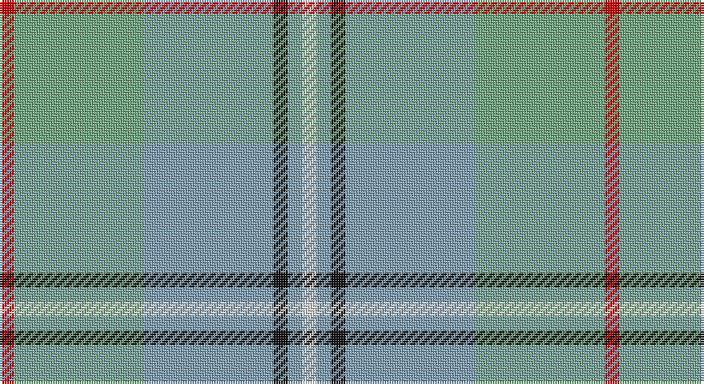

This page is one **sett** — a single exact thread-count. It belongs to the [tartan](/setts/r1lg9lr9k1lr1w1/)
(the same proportion at any scale), whose colour order is pattern [RYYKYW](/stripes/ryykyw/).

Part of the [Irving of Glentulchan](/tartans/irving-of-glentulchan/) tartan — the named design grouping this sett with its other cloths.

Sourced from tartans-authority.  It is a [6 stripe tartan](/stripes/stripes6/).

Original link http://www.tartansauthority.com/tartan-ferret/display/1460/

## Register references

External register numbers recorded for this tartan.

- Scottish Tartans Authority (ITI): 1460

## Thread count
R/6 LG54 B54 K6 B6 LN/6

One full sett is **252 threads**.

## Palette

Palette: <strong>Tartan Register</strong> <small style="color:#888">(3 of 5 colours)</small>
<table><thead><tr><th>Colour</th><th>Threads</th><th>Shade</th><th>Base</th><th>OKLCh</th></tr></thead><tbody><tr><td>R/</td><td style="text-align:right;font-variant-numeric:tabular-nums">6</td><td><code style="background-color:#C80000;">#C80000</code> <small style="color:#888">#C80000</small></td><td>R <code style="background-color:#CC0000;">#CC0000</code></td><td><small style="color:#888">oklch(52.3% 0.215 29.2)</small></td></tr><tr><td>LG</td><td style="text-align:right;font-variant-numeric:tabular-nums">54</td><td><code style="background-color:#70A880;">#70A880</code> <small style="color:#888">#70A880</small></td><td>Y <code style="background-color:#F2BF00;">#F2BF00</code></td><td><small style="color:#888">oklch(68.1% 0.083 152.7)</small></td></tr><tr><td>B</td><td style="text-align:right;font-variant-numeric:tabular-nums">54</td><td><code style="background-color:#80A0B4;">#80A0B4</code> <small style="color:#888">#80A0B4</small></td><td>Y <code style="background-color:#F2BF00;">#F2BF00</code></td><td><small style="color:#888">oklch(68.9% 0.046 235.8)</small></td></tr><tr><td>K</td><td style="text-align:right;font-variant-numeric:tabular-nums">6</td><td><code style="background-color:#101010;">#101010</code> <small style="color:#888">#101010</small></td><td>K <code style="background-color:#000000;">#000000</code></td><td><small style="color:#888">oklch(17.3% 0.000 89.9)</small></td></tr><tr><td>B</td><td style="text-align:right;font-variant-numeric:tabular-nums">6</td><td><code style="background-color:#80A0B4;">#80A0B4</code> <small style="color:#888">#80A0B4</small></td><td>Y <code style="background-color:#F2BF00;">#F2BF00</code></td><td><small style="color:#888">oklch(68.9% 0.046 235.8)</small></td></tr><tr><td>LN/</td><td style="text-align:right;font-variant-numeric:tabular-nums">6</td><td><code style="background-color:#E0E0E0;">#E0E0E0</code> <small style="color:#888">#E0E0E0</small></td><td>W <code style="background-color:#F7F7F7;">#F7F7F7</code></td><td><small style="color:#888">oklch(90.7% 0.000 89.9)</small></td></tr></tbody></table>

# Sample pattern

## Compared to the master

This cloth is one sett of its design; the master sett (the exemplar the design is anchored on) is below for comparison.

<figure style="margin:0"><figcaption style="color:#888;font-size:smaller">this sett</figcaption></figure>
<figure style="margin:0"><figcaption style="color:#888;font-size:smaller"><a href="/setts/lg9lr9k1lr1w1lr1k1lr9lg9r1/">master sett →</a></figcaption></figure>

## Nearest tartans

The nearest existing variants by ΔTartan distance, with this tartan at the top so the swatches line up against it.

ΔTartan

Tartan

Sett

—

<a href="/ttd/edit/#slug=r1lg9lr9k1lr1w1~x6">Irving of Glentulchan (Personal)</a> <a class="nn-out" href="/variants/s6/r1lg9lr9k1lr1w1~x6/" title="open its dictionary page">↗</a>

1.27

<a href="/ttd/edit/#slug=lg9lr9k1lr1w1lr1k1lr9lg9r1~x6&amp;base=r1lg9lr9k1lr1w1~x6">Irving of Glentulchan (Personal)</a> <a class="nn-out" href="/variants/s10/lg9lr9k1lr1w1lr1k1lr9lg9r1~x6/" title="open its dictionary page">↗</a>

1.33

<a href="/ttd/edit/#slug=g2t15lr5g2t2g7w2~x4&amp;base=r1lg9lr9k1lr1w1~x6">Chambers Bay</a> <a class="nn-out" href="/variants/s7/g2t15lr5g2t2g7w2~x4/" title="open its dictionary page">↗</a>

1.51

<a href="/ttd/edit/#slug=k3lr15t3lr4t3lr4t10y30w3~x2&amp;base=r1lg9lr9k1lr1w1~x6">Highland Road (Fashion)</a> <a class="nn-out" href="/variants/s9/k3lr15t3lr4t3lr4t10y30w3~x2/" title="open its dictionary page">↗</a>

1.53

<a href="/ttd/edit/#slug=ly30g3t2lb2t30lo4~x2&amp;base=r1lg9lr9k1lr1w1~x6">South Aiken Presby Church (Corporate</a> <a class="nn-out" href="/variants/s6/ly30g3t2lb2t30lo4~x2/" title="open its dictionary page">↗</a>

1.61

<a href="/ttd/edit/#slug=y25p3y8p13lyi8lr2ly11y2p3~x2&amp;base=r1lg9lr9k1lr1w1~x6">Organic</a> <a class="nn-out" href="/variants/s9/y25p3y8p13lyi8lr2ly11y2p3~x2/" title="open its dictionary page">↗</a>

1.70

<a href="/ttd/edit/#slug=lr30w3lr3w3lr12n30o3n5~x2&amp;base=r1lg9lr9k1lr1w1~x6">Dama Classic (Fashion)</a> <a class="nn-out" href="/variants/s8/lr30w3lr3w3lr12n30o3n5~x2/" title="open its dictionary page">↗</a>

1.77

<a href="/ttd/edit/#slug=w1dp1lb7o4lb1w1~x4&amp;base=r1lg9lr9k1lr1w1~x6">Lochnagar Trade Tartan</a> <a class="nn-out" href="/variants/s6/w1dp1lb7o4lb1w1~x4/" title="open its dictionary page">↗</a>

1.77

<a href="/ttd/edit/#slug=t3k3t21g49t21k3t3w3~x2&amp;base=r1lg9lr9k1lr1w1~x6">Irvine of Drum</a> <a class="nn-out" href="/variants/s8/t3k3t21g49t21k3t3w3~x2/" title="open its dictionary page">↗</a>

1.78

<a href="/ttd/edit/#slug=b5lg2b2lg9k3b9g3b3g25lr2~x2&amp;base=r1lg9lr9k1lr1w1~x6">Un-named (D C Dalgliesh) #2</a> <a class="nn-out" href="/variants/s10/b5lg2b2lg9k3b9g3b3g25lr2~x2/" title="open its dictionary page">↗</a>

1.84

<a href="/ttd/edit/#slug=n10lr3o3r1g1~x10&amp;base=r1lg9lr9k1lr1w1~x6">Bagpipe Shop, The (Corporate)</a> <a class="nn-out" href="/variants/s5/n10lr3o3r1g1~x10/" title="open its dictionary page">↗</a>

## Neighbour map

Every grey dot is one of 14360 variants placed by the first two principal components of the ΔTartan feature space (44% of its variance). Red is this tartan; blue dots are its nearest — click one to open its page.

<svg viewBox="0 0 640 380" role="img" style="max-width:100%;height:auto;border:1px solid #e0e0e0;border-radius:4px;display:block" xmlns="http://www.w3.org/2000/svg"><image href="/nn/cloud.v1.png" width="640" height="380"/><a href="/variants/s10/lg9lr9k1lr1w1lr1k1lr9lg9r1~x6/"><circle cx="315.1" cy="210.3" r="4" fill="#3465a4"><title>Irving of Glentulchan (Personal)</title></circle></a><a href="/variants/s7/g2t15lr5g2t2g7w2~x4/"><circle cx="305.5" cy="243.8" r="4" fill="#3465a4"><title>Chambers Bay</title></circle></a><a href="/variants/s9/k3lr15t3lr4t3lr4t10y30w3~x2/"><circle cx="268.2" cy="202.1" r="4" fill="#3465a4"><title>Highland Road (Fashion)</title></circle></a><a href="/variants/s6/ly30g3t2lb2t30lo4~x2/"><circle cx="304.5" cy="177.2" r="4" fill="#3465a4"><title>South Aiken Presby Church (Corporate</title></circle></a><a href="/variants/s9/y25p3y8p13lyi8lr2ly11y2p3~x2/"><circle cx="269.3" cy="190.9" r="4" fill="#3465a4"><title>Organic</title></circle></a><a href="/variants/s8/lr30w3lr3w3lr12n30o3n5~x2/"><circle cx="343.4" cy="208.2" r="4" fill="#3465a4"><title>Dama Classic (Fashion)</title></circle></a><a href="/variants/s6/w1dp1lb7o4lb1w1~x4/"><circle cx="317.8" cy="230.3" r="4" fill="#3465a4"><title>Lochnagar Trade Tartan</title></circle></a><a href="/variants/s8/t3k3t21g49t21k3t3w3~x2/"><circle cx="367.3" cy="200.9" r="4" fill="#3465a4"><title>Irvine of Drum</title></circle></a><a href="/variants/s10/b5lg2b2lg9k3b9g3b3g25lr2~x2/"><circle cx="286.6" cy="189.9" r="4" fill="#3465a4"><title>Un-named (D C Dalgliesh) #2</title></circle></a><a href="/variants/s5/n10lr3o3r1g1~x10/"><circle cx="363.7" cy="239.7" r="4" fill="#3465a4"><title>Bagpipe Shop, The (Corporate)</title></circle></a><circle cx="299.2" cy="214.3" r="5" fill="#c00000"/></svg>

ID: /variants/s6/r1lg9lr9k1lr1w1~x6/
