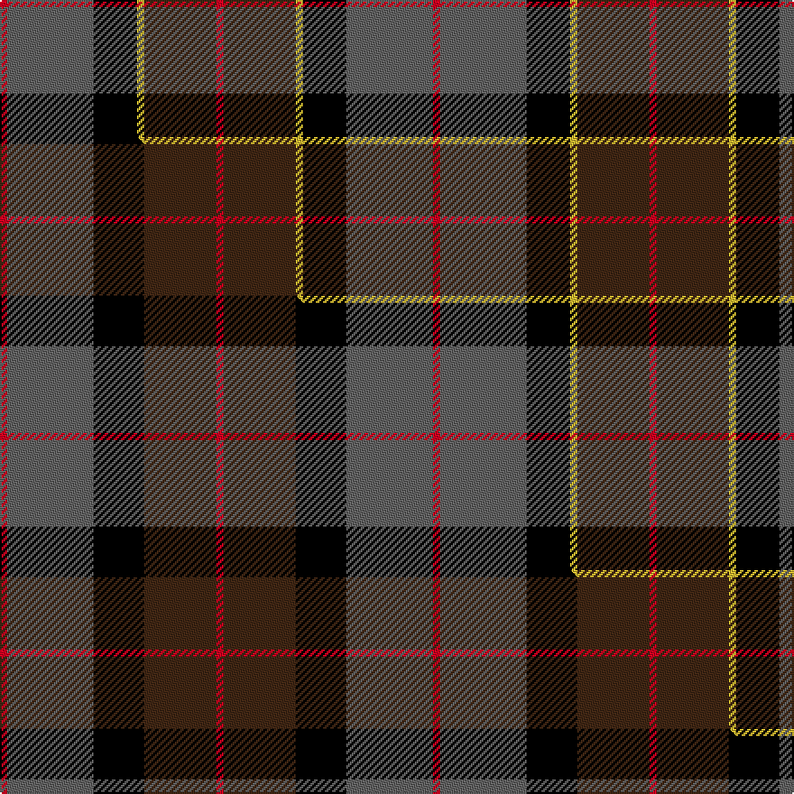

This page is one **sett** — a single exact thread-count. It belongs to the [tartan](/setts/r1n12k6ly1do10r1/)
(the same proportion at any scale), whose colour order is pattern [RBKYBR](/stripes/rbkybr/).

Part of the [Andover](/tartans/andover/) tartan — the named design grouping this sett with its other cloths.

Sourced from tartans-authority.  It is a [6 stripe tartan](/stripes/stripes6/).

Original link http://www.tartansauthority.com/tartan-ferret/display/3019/

## Register references

External register numbers recorded for this tartan.

- Scottish Tartans Authority (ITI): 3019

## Thread count
R/4 N48 K24 LY4 DO40 R/4

One full sett is **240 threads**.

## Palette
<table><thead><tr><th>Colour</th><th>Shade</th><th>OKLCh</th></tr></thead><tbody><tr><td>K</td><td><code style="background-color:#000000;">#000000</code> <small style="color:#888">#000000</small></td><td><small style="color:#888">oklch(0.0% 0.000 0.0)</small></td></tr><tr><td>N</td><td><code style="background-color:#636363;">#636363</code> <small style="color:#888">#636363</small></td><td><small style="color:#888">oklch(50.0% 0.000 89.9)</small></td></tr><tr><td>R</td><td><code style="background-color:#D60020;">#D60020</code> <small style="color:#888">#D60020</small></td><td><small style="color:#888">oklch(55.2% 0.224 25.5)</small></td></tr><tr><td>DO</td><td><code style="background-color:#412714;">#412714</code> <small style="color:#888">#412714</small></td><td><small style="color:#888">oklch(30.1% 0.050 55.7)</small></td></tr><tr><td>LY</td><td><code style="background-color:#DCBC32;">#DCBC32</code> <small style="color:#888">#DCBC32</small></td><td><small style="color:#888">oklch(80.0% 0.150 95.2)</small></td></tr></tbody></table>

# Sample pattern

## Compared to the master

This cloth is one sett of its design; the master sett (the exemplar the design is anchored on) is below for comparison.

Its **ΔTartan distance** from the master is **1.09** — the same measure the nearest-tartans table ranks by (0 is identical; a re-scale of the same cloth is near 0, a recolour or a different proportion further).

<figure class="master-compare" style="margin:0">

this sett
master sett ★

<figcaption style="color:#888;font-size:smaller">One weave of this sett against the <a href="/setts/r1n12k7do10r1/">master sett ★</a>, split on the diagonal: a shared proportion runs seamlessly across it with only the shades shifting; a different proportion breaks on it.</figcaption>
</figure>

## Nearest variants

The nearest existing variants by ΔTartan distance, with this cloth at the top so the swatches line up against it.

ΔTartan

Threads

Variant

Sett

—

240

<a href="/variants/s6/r1n12k6ly1do10r1~x4/">Andover (Fashion)</a>

<a href="/ttd/edit/#slug=r1n12k7do10r1~x4&amp;base=r1n12k6ly1do10r1~x4" title="compare in the TTD">1.70</a>

240

<a href="/variants/s5/r1n12k7do10r1~x4/">Andover</a>

<a href="/ttd/edit/#slug=n8dr3dt34k34dp3~x2~n1900000-dt1600000&amp;base=r1n12k6ly1do10r1~x4" title="compare in the TTD">2.27</a>

306

<a href="/variants/s5/n8dr3dt34k34dp3~x2~n1900000-dt1600000/">Passion of Scotland, Pewter (Fashion</a>

<a href="/ttd/edit/#slug=y15k10n30o11w3y5~x2&amp;base=r1n12k6ly1do10r1~x4" title="compare in the TTD">2.37</a>

256

<a href="/variants/s6/y15k10n30o11w3y5~x2/">McHale (Personal)</a>

<a href="/ttd/edit/#slug=dg37k22w4r15y3~x2&amp;base=r1n12k6ly1do10r1~x4" title="compare in the TTD">2.59</a>

244

<a href="/variants/s5/dg37k22w4r15y3~x2/">Oakley (2015)</a>

<a href="/ttd/edit/#slug=dp8y6k2n1w1~x8&amp;base=r1n12k6ly1do10r1~x4" title="compare in the TTD">2.60</a>

216

<a href="/variants/s5/dp8y6k2n1w1~x8/">Ballater Victoria Week</a>

<a href="/ttd/edit/#slug=k8lo2n30dr30lb3~x2&amp;base=r1n12k6ly1do10r1~x4" title="compare in the TTD">2.69</a>

270

<a href="/variants/s5/k8lo2n30dr30lb3~x2/">Douglas Ancient Red</a>

<a href="/ttd/edit/#slug=o3k17dt11o2oi20w2~x2~dt1600000-oi2500000&amp;base=r1n12k6ly1do10r1~x4" title="compare in the TTD">2.76</a>

210

<a href="/variants/s6/o3k17dt11o2oi20w2~x2~dt1600000-oi2500000/">Commonwealth Games Council (Corp.)</a>

## Neighbour map

Every grey dot is one of 13620 variants placed by the first two principal components of the ΔTartan feature space (42% of its variance). Red is this tartan; blue dots are its nearest — click one to open its page.

<svg viewBox="0 0 640 380" role="img" style="max-width:100%;height:auto;border:1px solid #e0e0e0;border-radius:4px;display:block" xmlns="http://www.w3.org/2000/svg"><image href="/nn/cloud.v1.png" width="640" height="380"/><a href="/variants/s5/r1n12k7do10r1~x4/"><circle cx="194.0" cy="176.7" r="4" fill="#3465a4"><title>Andover</title></circle></a><a href="/variants/s5/n8dr3dt34k34dp3~x2~n1900000-dt1600000/"><circle cx="234.5" cy="191.6" r="4" fill="#3465a4"><title>Passion of Scotland, Pewter (Fashion</title></circle></a><a href="/variants/s6/y15k10n30o11w3y5~x2/"><circle cx="183.1" cy="205.9" r="4" fill="#3465a4"><title>McHale (Personal)</title></circle></a><a href="/variants/s5/dg37k22w4r15y3~x2/"><circle cx="188.1" cy="181.8" r="4" fill="#3465a4"><title>Oakley (2015)</title></circle></a><a href="/variants/s5/dp8y6k2n1w1~x8/"><circle cx="192.2" cy="198.6" r="4" fill="#3465a4"><title>Ballater Victoria Week</title></circle></a><a href="/variants/s5/k8lo2n30dr30lb3~x2/"><circle cx="251.4" cy="185.1" r="4" fill="#3465a4"><title>Douglas Ancient Red</title></circle></a><a href="/variants/s6/o3k17dt11o2oi20w2~x2~dt1600000-oi2500000/"><circle cx="128.7" cy="180.8" r="4" fill="#3465a4"><title>Commonwealth Games Council (Corp.)</title></circle></a><circle cx="195.9" cy="180.5" r="5" fill="#c00000"/><text x="320" y="376" text-anchor="middle" font-size="11" fill="#999">ground</text><text x="11" y="190" text-anchor="middle" font-size="11" fill="#999" transform="rotate(-90 11 190)">complexity</text></svg>

ID: /variants/s6/r1n12k6ly1do10r1~x4/
