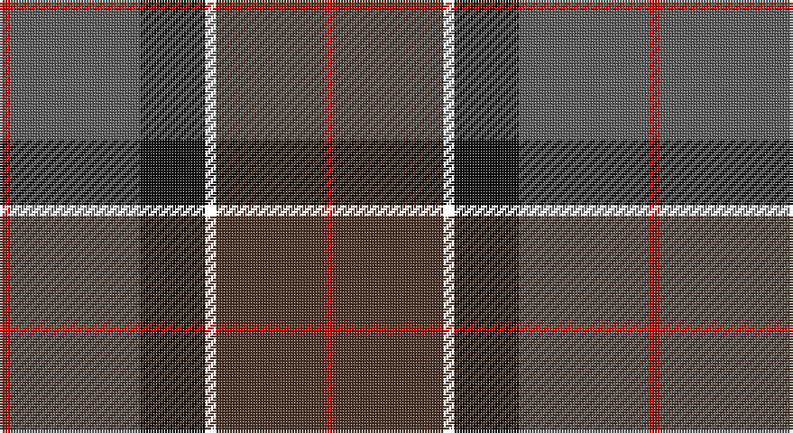

This page is one **sett** — a single exact thread-count. It belongs to the [tartan](/setts/r1n12ki6k1do10r1/)
(the same proportion at any scale), whose colour order is pattern [RBKKBR](/stripes/rbkkbr/).

Part of the [Andover](/tartans/andover/) tartan — the named design grouping this sett with its other cloths.

Sourced from register-of-tartans.  It is a [6 stripe tartan](/stripes/stripes6/).

Original link https://www.tartanregister.gov.uk/tartanDetails.aspx?ref=5256

## Register references

External register numbers recorded for this tartan.

- Scottish Register of Tartans: [5256](https://www.tartanregister.gov.uk/tartanDetails.aspx?ref=5256)
- Scottish Tartans Authority (ITI): 3019

## Thread count
R/4 N48 K24 YY4 T40 R/4

One full sett is **240 threads**.

## Palette

Palette: <strong>Tartan Register</strong> <small style="color:#888">(5 of 6 colours)</small>
<table><thead><tr><th>Colour</th><th>Threads</th><th>Shade</th><th>Base</th><th>OKLCh</th></tr></thead><tbody><tr><td>R/</td><td style="text-align:right;font-variant-numeric:tabular-nums">4</td><td><code style="background-color:#C80000;">#C80000</code> <small style="color:#888">#C80000</small></td><td>R <code style="background-color:#CC0000;">#CC0000</code></td><td><small style="color:#888">oklch(52.3% 0.215 29.2)</small></td></tr><tr><td>N</td><td style="text-align:right;font-variant-numeric:tabular-nums">48</td><td><code style="background-color:#5C5C5C;">#5C5C5C</code> <small style="color:#888">#5C5C5C</small></td><td>B <code style="background-color:#2A418A;">#2A418A</code></td><td><small style="color:#888">oklch(47.5% 0.000 89.9)</small></td></tr><tr><td>K</td><td style="text-align:right;font-variant-numeric:tabular-nums">24</td><td><code style="background-color:#101010;">#101010</code> <small style="color:#888">#101010</small></td><td>K <code style="background-color:#000000;">#000000</code></td><td><small style="color:#888">oklch(17.3% 0.000 89.9)</small></td></tr><tr><td></td><td style="text-align:right;font-variant-numeric:tabular-nums">4</td><td><code style="background-color:;"></code> <small style="color:#888"></small></td><td> <code style="background-color:;"></code></td><td><small style="color:#888"></small></td></tr><tr><td>T</td><td style="text-align:right;font-variant-numeric:tabular-nums">40</td><td><code style="background-color:#4C3428;">#4C3428</code> <small style="color:#888">#4C3428</small></td><td>B <code style="background-color:#2A418A;">#2A418A</code></td><td><small style="color:#888">oklch(34.9% 0.040 47.5)</small></td></tr><tr><td>R/</td><td style="text-align:right;font-variant-numeric:tabular-nums">4</td><td><code style="background-color:#C80000;">#C80000</code> <small style="color:#888">#C80000</small></td><td>R <code style="background-color:#CC0000;">#CC0000</code></td><td><small style="color:#888">oklch(52.3% 0.215 29.2)</small></td></tr></tbody></table>

# Sample pattern

## Nearest tartans

The nearest existing variants by ΔTartan distance, with this tartan at the top so the swatches line up against it.

ΔTartan

Tartan

Sett

—

<a href="/ttd/edit/#slug=r1n12ki6k1do10r1~x4">Andover</a> <a class="nn-out" href="/variants/s6/r1n12ki6k1do10r1~x4/" title="open its dictionary page">↗</a>

0.52

<a href="/ttd/edit/#slug=r1n12k6ly1do10r1~x4&amp;base=r1n12ki6k1do10r1~x4">Andover (Fashion)</a> <a class="nn-out" href="/variants/s6/r1n12k6ly1do10r1~x4/" title="open its dictionary page">↗</a>

0.76

<a href="/ttd/edit/#slug=k6y1r18b6dg18k2~x2&amp;base=r1n12ki6k1do10r1~x4">Eachaidh</a> <a class="nn-out" href="/variants/s6/k6y1r18b6dg18k2~x2/" title="open its dictionary page">↗</a>

0.87

<a href="/ttd/edit/#slug=y27dr2y4o15db26k2db6~x2&amp;base=r1n12ki6k1do10r1~x4">Bailies of Bennachie Corporate Tartan</a> <a class="nn-out" href="/variants/s7/y27dr2y4o15db26k2db6~x2/" title="open its dictionary page">↗</a>

0.97

<a href="/ttd/edit/#slug=lo4k28r2do22t8do3~x2&amp;base=r1n12ki6k1do10r1~x4">Loch Long One Design</a> <a class="nn-out" href="/variants/s6/lo4k28r2do22t8do3~x2/" title="open its dictionary page">↗</a>

0.99

<a href="/ttd/edit/#slug=k6t1r18db6dg18k2~x2&amp;base=r1n12ki6k1do10r1~x4">Eachaidh (Personal)</a> <a class="nn-out" href="/variants/s6/k6t1r18db6dg18k2~x2/" title="open its dictionary page">↗</a>

1.04

<a href="/ttd/edit/#slug=db4dg2r17ri9dg10db30n2~x2&amp;base=r1n12ki6k1do10r1~x4">Dempster, Ross (Personal)</a> <a class="nn-out" href="/variants/s7/db4dg2r17ri9dg10db30n2~x2/" title="open its dictionary page">↗</a>

1.04

<a href="/variants/s5/db6w1dyi6dy12r2~x4/">Vass (Personal)</a>

1.09

<a href="/ttd/edit/#slug=r1dy2k12dy8db16lo1~x2&amp;base=r1n12ki6k1do10r1~x4">Bobby Jones (Personal)</a> <a class="nn-out" href="/variants/s6/r1dy2k12dy8db16lo1~x2/" title="open its dictionary page">↗</a>

1.09

<a href="/ttd/edit/#slug=r2do22g22do3db12y2~x2&amp;base=r1n12ki6k1do10r1~x4">Lisbon</a> <a class="nn-out" href="/variants/s6/r2do22g22do3db12y2~x2/" title="open its dictionary page">↗</a>

1.11

<a href="/ttd/edit/#slug=dy6r3dy34k16ly3dt22r4~x2&amp;base=r1n12ki6k1do10r1~x4">Ballantrae (Macnaughtons)</a> <a class="nn-out" href="/variants/s7/dy6r3dy34k16ly3dt22r4~x2/" title="open its dictionary page">↗</a>

## Neighbour map

Every grey dot is one of 14360 variants placed by the first two principal components of the ΔTartan feature space (44% of its variance). Red is this tartan; blue dots are its nearest — click one to open its page.

<svg viewBox="0 0 640 380" role="img" style="max-width:100%;height:auto;border:1px solid #e0e0e0;border-radius:4px;display:block" xmlns="http://www.w3.org/2000/svg"><image href="/nn/cloud.v1.png" width="640" height="380"/><a href="/variants/s6/r1n12k6ly1do10r1~x4/"><circle cx="241.5" cy="208.7" r="4" fill="#3465a4"><title>Andover (Fashion)</title></circle></a><a href="/variants/s6/k6y1r18b6dg18k2~x2/"><circle cx="251.2" cy="204.8" r="4" fill="#3465a4"><title>Eachaidh</title></circle></a><a href="/variants/s7/y27dr2y4o15db26k2db6~x2/"><circle cx="261.2" cy="207.7" r="4" fill="#3465a4"><title>Bailies of Bennachie Corporate Tartan</title></circle></a><a href="/variants/s6/lo4k28r2do22t8do3~x2/"><circle cx="265.3" cy="202.2" r="4" fill="#3465a4"><title>Loch Long One Design</title></circle></a><a href="/variants/s6/k6t1r18db6dg18k2~x2/"><circle cx="237.2" cy="198.6" r="4" fill="#3465a4"><title>Eachaidh (Personal)</title></circle></a><a href="/variants/s7/db4dg2r17ri9dg10db30n2~x2/"><circle cx="281.0" cy="195.7" r="4" fill="#3465a4"><title>Dempster, Ross (Personal)</title></circle></a><a href="/variants/s5/db6w1dyi6dy12r2~x4/"><circle cx="252.8" cy="235.5" r="4" fill="#3465a4"><title>Vass (Personal)</title></circle></a><a href="/variants/s6/r1dy2k12dy8db16lo1~x2/"><circle cx="286.2" cy="218.8" r="4" fill="#3465a4"><title>Bobby Jones (Personal)</title></circle></a><a href="/variants/s6/r2do22g22do3db12y2~x2/"><circle cx="240.9" cy="218.7" r="4" fill="#3465a4"><title>Lisbon</title></circle></a><a href="/variants/s7/dy6r3dy34k16ly3dt22r4~x2/"><circle cx="264.2" cy="205.0" r="4" fill="#3465a4"><title>Ballantrae (Macnaughtons)</title></circle></a><circle cx="255.4" cy="217.3" r="5" fill="#c00000"/></svg>

ID: /variants/s6/r1n12ki6k1do10r1~x4/
