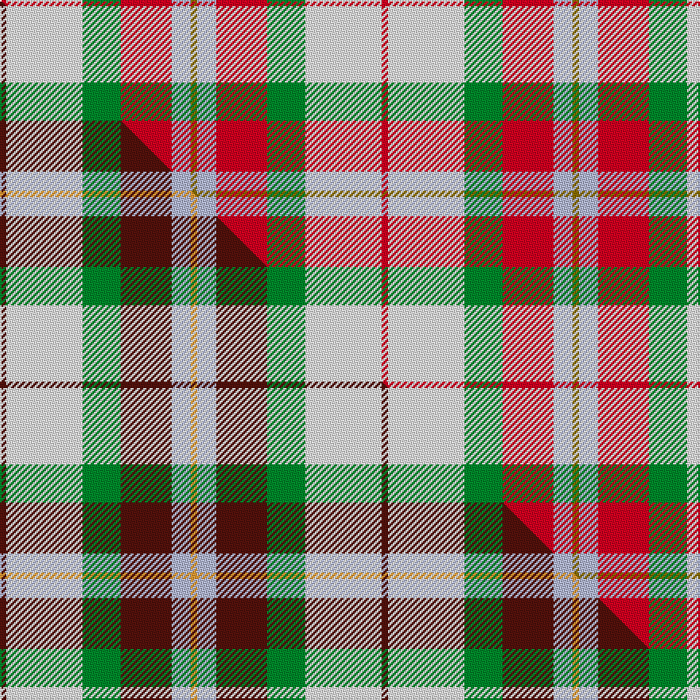

This is one **variant** — a specific cloth: this exact thread count and colourway, with its own
provenance below. It is one weaving of the [sett](/setts/r1w12g6r8lb3y1/) (the scale-free proportion — the
same cloth at any scale or shade), whose colour order is pattern [GWRGWR](/stripes/gwrgwr/).

Part of the [MacLean Dress](/tartans/m/ma/maclean-dress/) tartan — the named design grouping this sett with its other cloths.

Sourced from weddslist.  It is a [6 stripe tartan](/stripes/stripes6/).

Original link [http://www.weddslist.com/cgi-bin/tartans/pg.pl?source=sts](http://www.weddslist.com/cgi-bin/tartans/pg.pl?source=sts)

Dataset <small>— provenance for this record, inherited from the source manifest</small>

<dl class="dataset-prov">
<dt>source</dt><dd><a href="/sources/weddslist/">Weddslist</a></dd>
<dt>data captured from</dt><dd><a href="https://github.com/thetartan/tartan-database/blob/master/data/weddslist/data.csv">https://github.com/thetartan/tartan-database/blob/master/data/weddslist/data.csv</a></dd>
<dt>data date</dt><dd>2016-11-17 <small>(dataset default)</small></dd>
<dt>licence</dt><dd><a href="https://creativecommons.org/licenses/by-nc-nd/4.0/">CC BY-NC-ND 4.0</a></dd>
</dl>

Capture chain <small>— the hands this data passed through, oldest first; each capture carries its own licence</small>

<ol class="capture-chain">
<li><a href="https://www.weddslist.com/tartans/">Weddslist</a> <small>the living privately compiled reference</small></li>
<li><a href="https://github.com/thetartan/tartan-database">thetartan/tartan-database</a> <small>2016-2017</small> · <a href="https://creativecommons.org/licenses/by-nc-nd/4.0/">CC BY-NC-ND 4.0</a> <small>Levko Kravets's frozen compilation — the capture we vendored, and where its CC licence text came from</small></li>
<li>this dictionary <small>captured 2026-06-10 · commit 5bf86c7566</small> <small>each re-capture is a git commit to data/sources</small></li>
</ol>

## Thread count
R/4 W48 G24 R32 LB12 Y/4

One full sett is **240 threads**.

## Palette
<table><thead><tr><th>Colour</th><th>Shade</th><th>OKLCh</th></tr></thead><tbody><tr><td>LB</td><td><code style="background-color:#B5BBDE;">#B5BBDE</code> <small style="color:#888">#B5BBDE</small></td><td><small style="color:#888">oklch(79.9% 0.050 277.6)</small></td></tr><tr><td>G</td><td><code style="background-color:#008B2A;">#008B2A</code> <small style="color:#888">#008B2A</small></td><td><small style="color:#888">oklch(55.4% 0.170 145.9)</small></td></tr><tr><td>W</td><td><code style="background-color:#F7F7F7;">#F7F7F7</code> <small style="color:#888">#F7F7F7</small></td><td><small style="color:#888">oklch(97.6% 0.000 89.9)</small></td></tr><tr><td>R</td><td><code style="background-color:#D60020;">#D60020</code> <small style="color:#888">#D60020</small></td><td><small style="color:#888">oklch(55.2% 0.224 25.5)</small></td></tr><tr><td>Y</td><td><code style="background-color:#8B6E00;">#8B6E00</code> <small style="color:#888">#8B6E00</small></td><td><small style="color:#888">oklch(55.1% 0.113 90.4)</small></td></tr></tbody></table>

# Sample pattern

## Compared to the master

This cloth is one sett of its design; the master sett (the exemplar the design is anchored on) is below for comparison.

Its **ΔTartan distance** from the master is **0.40** — the same measure the nearest-tartans table ranks by (0 is identical; a re-scale of the same cloth is near 0, a recolour or a different proportion further).

<figure class="master-compare" style="margin:0">

this sett
master sett ★

<figcaption style="color:#888;font-size:smaller">One weave of this sett against the <a href="/setts/dr1w12g6dr8lb3lo1/">master sett ★</a>, split on the diagonal: a shared proportion runs seamlessly across it with only the shades shifting; a different proportion breaks on it.</figcaption>
</figure>

## Nearest tartan variants

The nearest existing variants by ΔTartan distance, with this cloth at the top so the swatches line up against it.

ΔTartan

Threads

Variant

Sett

—

240

<a href="/variants/s6/r1w12g6r8lb3y1~x4/">MacLean, dress</a>

<a href="/ttd/edit/#slug=dr1w12g6dr8lb3lo1~x4&amp;base=r1w12g6r8lb3y1~x4" title="compare in the TTD">0.40</a>

240

<a href="/variants/s6/dr1w12g6dr8lb3lo1~x4/">MacLean Dress (Lumsden)</a>

<a href="/ttd/edit/#slug=r3w33dp8dg18r9g3~x2&amp;base=r1w12g6r8lb3y1~x4" title="compare in the TTD">1.38</a>

284

<a href="/variants/s6/r3w33dp8dg18r9g3~x2/">MacKintosh Dress (Dance)</a>

<a href="/ttd/edit/#slug=w3dg24r13g4ly11r8db2~x2~dg1806142-g2304202&amp;base=r1w12g6r8lb3y1~x4" title="compare in the TTD">1.49</a>

250

<a href="/variants/s7/w3dg24r13g4ly11r8db2~x2~dg1806142-g2304202/">Elystan Glodrydd (Name)</a>

<a href="/ttd/edit/#slug=r3w8db4g14r4db2~x2&amp;base=r1w12g6r8lb3y1~x4" title="compare in the TTD">2.06</a>

130

<a href="/variants/s6/r3w8db4g14r4db2~x2/">MacIntosh Dress Clan Tartan</a>

<a href="/ttd/edit/#slug=db30r3w10g14r3o30~x2&amp;base=r1w12g6r8lb3y1~x4" title="compare in the TTD">2.14</a>

240

<a href="/variants/s6/db30r3w10g14r3o30~x2/">Cercle de Fermières Varennes</a>

<a href="/ttd/edit/#slug=b2ly4bi22ly20r19ly2~x2~ly3608101-bi2505279&amp;base=r1w12g6r8lb3y1~x4" title="compare in the TTD">2.42</a>

268

<a href="/variants/s6/b2ly4bi22ly20r19ly2~x2~ly3608101-bi2505279/">Barbie's Plaid</a>

<a href="/ttd/edit/#slug=ly8r3t2db1w6g12db2~x2&amp;base=r1w12g6r8lb3y1~x4" title="compare in the TTD">2.64</a>

116

<a href="/variants/s7/ly8r3t2db1w6g12db2~x2/">Carmen Lau (Hong Kong) (Personal)</a>

<a href="/ttd/edit/#slug=db24r27g20y6g20r2lb3~x2&amp;base=r1w12g6r8lb3y1~x4" title="compare in the TTD">2.74</a>

354

<a href="/variants/s7/db24r27g20y6g20r2lb3~x2/">Buchanhaven Heritage</a>

<a href="/ttd/edit/#slug=r48t16ly5g17w8dy3~x2&amp;base=r1w12g6r8lb3y1~x4" title="compare in the TTD">2.83</a>

286

<a href="/variants/s6/r48t16ly5g17w8dy3~x2/">Scottish American Soc. of Michigan</a>

<a href="/ttd/edit/#slug=r19lb5t2w12t2y4g8~x2&amp;base=r1w12g6r8lb3y1~x4" title="compare in the TTD">2.83</a>

154

<a href="/variants/s7/r19lb5t2w12t2y4g8~x2/">Northern Ontario (District)</a>

## Neighbour map

Every grey dot is one of 13621 variants placed by the first two principal components of the ΔTartan feature space (42% of its variance). Red is this tartan; blue dots are its nearest — click one to open its page.

<svg viewBox="0 0 640 380" role="img" style="max-width:100%;height:auto;border:1px solid #e0e0e0;border-radius:4px;display:block" xmlns="http://www.w3.org/2000/svg"><image href="/nn/cloud.v1.png" width="640" height="380"/><a href="/variants/s6/dr1w12g6dr8lb3lo1~x4/"><circle cx="183.0" cy="209.9" r="4" fill="#3465a4"><title>MacLean Dress (Lumsden)</title></circle></a><a href="/variants/s6/r3w33dp8dg18r9g3~x2/"><circle cx="178.6" cy="182.9" r="4" fill="#3465a4"><title>MacKintosh Dress (Dance)</title></circle></a><a href="/variants/s7/w3dg24r13g4ly11r8db2~x2~dg1806142-g2304202/"><circle cx="169.8" cy="184.7" r="4" fill="#3465a4"><title>Elystan Glodrydd (Name)</title></circle></a><a href="/variants/s6/r3w8db4g14r4db2~x2/"><circle cx="163.4" cy="236.5" r="4" fill="#3465a4"><title>MacIntosh Dress Clan Tartan</title></circle></a><a href="/variants/s6/db30r3w10g14r3o30~x2/"><circle cx="147.6" cy="205.4" r="4" fill="#3465a4"><title>Cercle de Fermières Varennes</title></circle></a><a href="/variants/s6/b2ly4bi22ly20r19ly2~x2~ly3608101-bi2505279/"><circle cx="223.9" cy="219.8" r="4" fill="#3465a4"><title>Barbie's Plaid</title></circle></a><a href="/variants/s7/ly8r3t2db1w6g12db2~x2/"><circle cx="135.0" cy="189.6" r="4" fill="#3465a4"><title>Carmen Lau (Hong Kong) (Personal)</title></circle></a><a href="/variants/s7/db24r27g20y6g20r2lb3~x2/"><circle cx="195.8" cy="203.8" r="4" fill="#3465a4"><title>Buchanhaven Heritage</title></circle></a><a href="/variants/s6/r48t16ly5g17w8dy3~x2/"><circle cx="252.8" cy="160.4" r="4" fill="#3465a4"><title>Scottish American Soc. of Michigan</title></circle></a><a href="/variants/s7/r19lb5t2w12t2y4g8~x2/"><circle cx="141.2" cy="188.1" r="4" fill="#3465a4"><title>Northern Ontario (District)</title></circle></a><circle cx="183.6" cy="199.0" r="5" fill="#c00000"/><text x="320" y="376" text-anchor="middle" font-size="11" fill="#999">ground</text><text x="11" y="190" text-anchor="middle" font-size="11" fill="#999" transform="rotate(-90 11 190)">complexity</text></svg>

ID: /variants/s6/r1w12g6r8lb3y1~x4/
