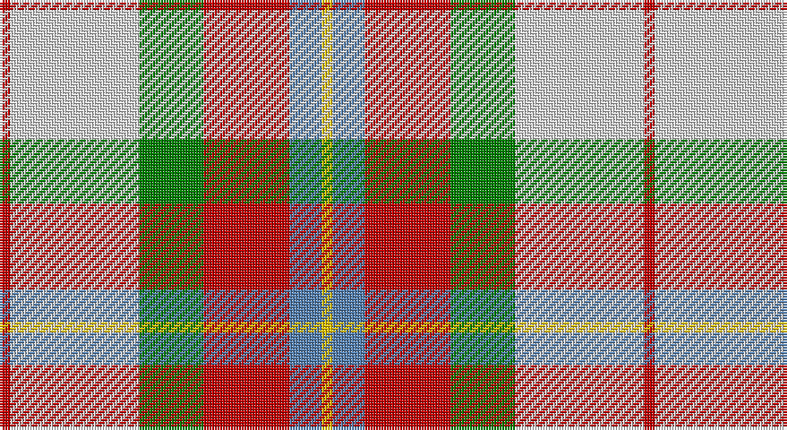

This page is one **sett** — a single exact thread-count. It belongs to the [tartan](/setts/r1w12g6r8t3ly1/)
(the same proportion at any scale), whose colour order is pattern [RWGRBY](/stripes/rwgrby/).

Sourced from weddslist.  It is a [6 stripe tartan](/stripes/stripes6/).

Original link http://www.weddslist.com/cgi-bin/tartans/pg.pl?source=sts

## Thread count
R/4 LN48 G24 R32 B12 Y/4

One full sett is **240 threads**.

## Palette

Palette: <strong>Tartan Dictionary</strong> <small style="color:#888">(1 of 5 colours)</small>
<table><thead><tr><th>Colour</th><th>Threads</th><th>Shade</th><th>Base</th><th>OKLCh</th></tr></thead><tbody><tr><td>R/</td><td style="text-align:right;font-variant-numeric:tabular-nums">4</td><td><code style="background-color:#C00000;">#C00000</code> <small style="color:#888">#C00000</small></td><td>R <code style="background-color:#CC0000;">#CC0000</code></td><td><small style="color:#888">oklch(50.7% 0.208 29.2)</small></td></tr><tr><td>LN</td><td style="text-align:right;font-variant-numeric:tabular-nums">48</td><td><code style="background-color:#E0E0E0;">#E0E0E0</code> <small style="color:#888">#E0E0E0</small></td><td>W <code style="background-color:#F7F7F7;">#F7F7F7</code></td><td><small style="color:#888">oklch(90.7% 0.000 89.9)</small></td></tr><tr><td>G</td><td style="text-align:right;font-variant-numeric:tabular-nums">24</td><td><code style="background-color:#008000;">#008000</code> <small style="color:#888">#008000</small></td><td>G <code style="background-color:#006100;">#006100</code></td><td><small style="color:#888">oklch(52.0% 0.177 142.5)</small></td></tr><tr><td>R</td><td style="text-align:right;font-variant-numeric:tabular-nums">32</td><td><code style="background-color:#C00000;">#C00000</code> <small style="color:#888">#C00000</small></td><td>R <code style="background-color:#CC0000;">#CC0000</code></td><td><small style="color:#888">oklch(50.7% 0.208 29.2)</small></td></tr><tr><td>B</td><td style="text-align:right;font-variant-numeric:tabular-nums">12</td><td><code style="background-color:#5480B0;">#5480B0</code> <small style="color:#888">#5480B0</small></td><td>B <code style="background-color:#2A418A;">#2A418A</code></td><td><small style="color:#888">oklch(58.8% 0.089 251.5)</small></td></tr><tr><td>Y/</td><td style="text-align:right;font-variant-numeric:tabular-nums">4</td><td><code style="background-color:#F0C000;">#F0C000</code> <small style="color:#888">#F0C000</small></td><td>Y <code style="background-color:#F2BF00;">#F2BF00</code></td><td><small style="color:#888">oklch(82.7% 0.169 90.5)</small></td></tr></tbody></table>

# Sample pattern

## Nearest tartans

The nearest existing variants by ΔTartan distance, with this tartan at the top so the swatches line up against it.

ΔTartan

Tartan

Sett

—

<a href="/ttd/edit/#slug=r1w12g6r8t3ly1~x4">MacLean, dress</a> <a class="nn-out" href="/variants/s6/r1w12g6r8t3ly1~x4/" title="open its dictionary page">↗</a>

0.39

<a href="/ttd/edit/#slug=r1w12g6r8lb3lo1~x4&amp;base=r1w12g6r8t3ly1~x4">MacLean Dress (Lumsden)</a> <a class="nn-out" href="/variants/s6/r1w12g6r8lb3lo1~x4/" title="open its dictionary page">↗</a>

0.77

<a href="/ttd/edit/#slug=r34w3gi4g23w24k3gi4~x2&amp;base=r1w12g6r8t3ly1~x4">MacLachlan Dress Clan Tartan</a> <a class="nn-out" href="/variants/s7/r34w3gi4g23w24k3gi4~x2/" title="open its dictionary page">↗</a>

0.80

<a href="/ttd/edit/#slug=r3w33dp8dg18r9g3~x2&amp;base=r1w12g6r8t3ly1~x4">MacKintosh Dress (Dance)</a> <a class="nn-out" href="/variants/s6/r3w33dp8dg18r9g3~x2/" title="open its dictionary page">↗</a>

0.85

<a href="/ttd/edit/#slug=r34w3dg4g23w24k3dg4~x2&amp;base=r1w12g6r8t3ly1~x4">MacLachlan, dress</a> <a class="nn-out" href="/variants/s7/r34w3dg4g23w24k3dg4~x2/" title="open its dictionary page">↗</a>

1.06

<a href="/ttd/edit/#slug=g4lo7r9lo9b20w2b2~x2&amp;base=r1w12g6r8t3ly1~x4">Tombow 140th Anniversary, The</a> <a class="nn-out" href="/variants/s7/g4lo7r9lo9b20w2b2~x2/" title="open its dictionary page">↗</a>

1.13

<a href="/ttd/edit/#slug=r36w3lo4g24w24k3lo6~x2&amp;base=r1w12g6r8t3ly1~x4">MacLachlan Dress</a> <a class="nn-out" href="/variants/s7/r36w3lo4g24w24k3lo6~x2/" title="open its dictionary page">↗</a>

1.14

<a href="/ttd/edit/#slug=lo13b8r5k3w2g1~x4&amp;base=r1w12g6r8t3ly1~x4">Ball</a> <a class="nn-out" href="/variants/s6/lo13b8r5k3w2g1~x4/" title="open its dictionary page">↗</a>

1.15

<a href="/ttd/edit/#slug=ly25r10g10db11w2~x2&amp;base=r1w12g6r8t3ly1~x4">Samye</a> <a class="nn-out" href="/variants/s5/ly25r10g10db11w2~x2/" title="open its dictionary page">↗</a>

1.23

<a href="/ttd/edit/#slug=lo13g8k5lb3w2r1~x4&amp;base=r1w12g6r8t3ly1~x4">Ball Hunting</a> <a class="nn-out" href="/variants/s6/lo13g8k5lb3w2r1~x4/" title="open its dictionary page">↗</a>

1.25

<a href="/ttd/edit/#slug=r5w36p14r9g28r8p2~x2&amp;base=r1w12g6r8t3ly1~x4">MacKintosh, Arisaid</a> <a class="nn-out" href="/variants/s7/r5w36p14r9g28r8p2~x2/" title="open its dictionary page">↗</a>

## Neighbour map

Every grey dot is one of 14360 variants placed by the first two principal components of the ΔTartan feature space (44% of its variance). Red is this tartan; blue dots are its nearest — click one to open its page.

<svg viewBox="0 0 640 380" role="img" style="max-width:100%;height:auto;border:1px solid #e0e0e0;border-radius:4px;display:block" xmlns="http://www.w3.org/2000/svg"><image href="/nn/cloud.v1.png" width="640" height="380"/><a href="/variants/s6/r1w12g6r8lb3lo1~x4/"><circle cx="148.4" cy="159.7" r="4" fill="#3465a4"><title>MacLean Dress (Lumsden)</title></circle></a><a href="/variants/s7/r34w3gi4g23w24k3gi4~x2/"><circle cx="153.8" cy="156.0" r="4" fill="#3465a4"><title>MacLachlan Dress Clan Tartan</title></circle></a><a href="/variants/s6/r3w33dp8dg18r9g3~x2/"><circle cx="175.2" cy="158.8" r="4" fill="#3465a4"><title>MacKintosh Dress (Dance)</title></circle></a><a href="/variants/s7/r34w3dg4g23w24k3dg4~x2/"><circle cx="148.0" cy="151.7" r="4" fill="#3465a4"><title>MacLachlan, dress</title></circle></a><a href="/variants/s7/g4lo7r9lo9b20w2b2~x2/"><circle cx="181.7" cy="182.6" r="4" fill="#3465a4"><title>Tombow 140th Anniversary, The</title></circle></a><a href="/variants/s7/r36w3lo4g24w24k3lo6~x2/"><circle cx="139.4" cy="147.3" r="4" fill="#3465a4"><title>MacLachlan Dress</title></circle></a><a href="/variants/s6/lo13b8r5k3w2g1~x4/"><circle cx="150.2" cy="152.2" r="4" fill="#3465a4"><title>Ball</title></circle></a><a href="/variants/s5/ly25r10g10db11w2~x2/"><circle cx="158.9" cy="184.5" r="4" fill="#3465a4"><title>Samye</title></circle></a><a href="/variants/s6/lo13g8k5lb3w2r1~x4/"><circle cx="140.7" cy="153.5" r="4" fill="#3465a4"><title>Ball Hunting</title></circle></a><a href="/variants/s7/r5w36p14r9g28r8p2~x2/"><circle cx="169.1" cy="155.6" r="4" fill="#3465a4"><title>MacKintosh, Arisaid</title></circle></a><circle cx="157.9" cy="165.6" r="5" fill="#c00000"/></svg>

ID: /variants/s6/r1w12g6r8t3ly1~x4/
