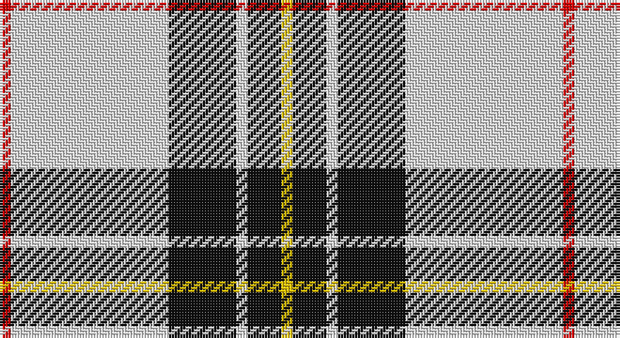

This page is one **sett** — a single exact thread-count. It belongs to the [tartan](/setts/r1w14k6w1k3ly1/)
(the same proportion at any scale), whose colour order is pattern [RWKWKY](/stripes/rwkwky/).

Sourced from register-of-tartans.  It is a [6 stripe tartan](/stripes/stripes6/).

Original link https://www.tartanregister.gov.uk/tartanDetails.aspx?ref=2702

## Also known as

This cloth is also recorded under:

- MacPherson #10

2 attestations — the source records this cloth was collapsed from (oldest owns this page)

<ul>
<li>undated — MacPherson #10 (register-of-tartans, <a href="https://www.tartanregister.gov.uk/tartanDetails.aspx?ref=2702">record</a>)</li>
<li>undated — MacPherson 8 (weddslist, <a href="http://www.weddslist.com/cgi-bin/tartans/pg.pl?source=sts">record</a>)</li>
</ul>

## Register references

External register numbers recorded for this tartan.

- Scottish Register of Tartans: [2702](https://www.tartanregister.gov.uk/tartanDetails.aspx?ref=2702)
- Scottish Tartans World Register: 1690

## Thread count
R/4 LN56 K24 LN4 K12 Y/4

One full sett is **200 threads**.

## Palette

Palette: <strong>Tartan Register</strong>
<table><thead><tr><th>Colour</th><th>Threads</th><th>Shade</th><th>Base</th><th>OKLCh</th></tr></thead><tbody><tr><td>R/</td><td style="text-align:right;font-variant-numeric:tabular-nums">4</td><td><code style="background-color:#DC0000;">#DC0000</code> <small style="color:#888">#DC0000</small></td><td>R <code style="background-color:#CC0000;">#CC0000</code></td><td><small style="color:#888">oklch(56.2% 0.230 29.2)</small></td></tr><tr><td>LN</td><td style="text-align:right;font-variant-numeric:tabular-nums">56</td><td><code style="background-color:#E0E0E0;">#E0E0E0</code> <small style="color:#888">#E0E0E0</small></td><td>W <code style="background-color:#F7F7F7;">#F7F7F7</code></td><td><small style="color:#888">oklch(90.7% 0.000 89.9)</small></td></tr><tr><td>K</td><td style="text-align:right;font-variant-numeric:tabular-nums">24</td><td><code style="background-color:#101010;">#101010</code> <small style="color:#888">#101010</small></td><td>K <code style="background-color:#000000;">#000000</code></td><td><small style="color:#888">oklch(17.3% 0.000 89.9)</small></td></tr><tr><td>LN</td><td style="text-align:right;font-variant-numeric:tabular-nums">4</td><td><code style="background-color:#E0E0E0;">#E0E0E0</code> <small style="color:#888">#E0E0E0</small></td><td>W <code style="background-color:#F7F7F7;">#F7F7F7</code></td><td><small style="color:#888">oklch(90.7% 0.000 89.9)</small></td></tr><tr><td>K</td><td style="text-align:right;font-variant-numeric:tabular-nums">12</td><td><code style="background-color:#101010;">#101010</code> <small style="color:#888">#101010</small></td><td>K <code style="background-color:#000000;">#000000</code></td><td><small style="color:#888">oklch(17.3% 0.000 89.9)</small></td></tr><tr><td>Y/</td><td style="text-align:right;font-variant-numeric:tabular-nums">4</td><td><code style="background-color:#E8C000;">#E8C000</code> <small style="color:#888">#E8C000</small></td><td>Y <code style="background-color:#F2BF00;">#F2BF00</code></td><td><small style="color:#888">oklch(81.9% 0.168 93.7)</small></td></tr></tbody></table>

# Sample pattern

## Nearest tartans

The nearest existing variants by ΔTartan distance, with this tartan at the top so the swatches line up against it.

ΔTartan

Tartan

Sett

—

<a href="/ttd/edit/#slug=r1w14k6w1k3ly1~x4">MacPherson #10</a> <a class="nn-out" href="/variants/s6/r1w14k6w1k3ly1~x4/" title="open its dictionary page">↗</a>

0.74

<a href="/ttd/edit/#slug=w1m2w17k11w2k4ly1~x4&amp;base=r1w14k6w1k3ly1~x4">MacPherson - 1842 (VS) Dress</a> <a class="nn-out" href="/variants/s7/w1m2w17k11w2k4ly1~x4/" title="open its dictionary page">↗</a>

0.84

<a href="/ttd/edit/#slug=r1lb12k1w2k5r1~x4&amp;base=r1w14k6w1k3ly1~x4">Rui (Personal)</a> <a class="nn-out" href="/variants/s6/r1lb12k1w2k5r1~x4/" title="open its dictionary page">↗</a>

1.00

<a href="/ttd/edit/#slug=w3p3w30k20w3k9ly3~x2&amp;base=r1w14k6w1k3ly1~x4">MacPherson Dress (1951)</a> <a class="nn-out" href="/variants/s7/w3p3w30k20w3k9ly3~x2/" title="open its dictionary page">↗</a>

1.13

<a href="/ttd/edit/#slug=w5r3w35k28w4k11w2~x2&amp;base=r1w14k6w1k3ly1~x4">MacPherson of Cluny (Black and White)</a> <a class="nn-out" href="/variants/s7/w5r3w35k28w4k11w2~x2/" title="open its dictionary page">↗</a>

1.16

<a href="/ttd/edit/#slug=w6b3w20k2w3k25w3~x2&amp;base=r1w14k6w1k3ly1~x4">Forbes Dress (Clans Originaux)</a> <a class="nn-out" href="/variants/s7/w6b3w20k2w3k25w3~x2/" title="open its dictionary page">↗</a>

1.31

<a href="/ttd/edit/#slug=k4ly18n44k3ly10k4&amp;base=r1w14k6w1k3ly1~x4">Stutterheim</a> <a class="nn-out" href="/variants/s6/k4ly18n44k3ly10k4/" title="open its dictionary page">↗</a>

1.32

<a href="/ttd/edit/#slug=r2w30k15lo2k15r2~x2&amp;base=r1w14k6w1k3ly1~x4">Brodie (WCWM)</a> <a class="nn-out" href="/variants/s6/r2w30k15lo2k15r2~x2/" title="open its dictionary page">↗</a>

1.34

<a href="/ttd/edit/#slug=w3r1w30k20w3k9ly1~x2&amp;base=r1w14k6w1k3ly1~x4">MacPherson Dress (1842)</a> <a class="nn-out" href="/variants/s7/w3r1w30k20w3k9ly1~x2/" title="open its dictionary page">↗</a>

1.35

<a href="/ttd/edit/#slug=w2g4k7w2k1w11db2w2~x4&amp;base=r1w14k6w1k3ly1~x4">Forbes - 1880 (Clans Originaux)</a> <a class="nn-out" href="/variants/s8/w2g4k7w2k1w11db2w2~x4/" title="open its dictionary page">↗</a>

1.40

<a href="/ttd/edit/#slug=dt3n2w2n30w30r2w3~x2&amp;base=r1w14k6w1k3ly1~x4">Torridon, Royal Blue (Dance)</a> <a class="nn-out" href="/variants/s7/dt3n2w2n30w30r2w3~x2/" title="open its dictionary page">↗</a>

## Neighbour map

Every grey dot is one of 14360 variants placed by the first two principal components of the ΔTartan feature space (44% of its variance). Red is this tartan; blue dots are its nearest — click one to open its page.

<svg viewBox="0 0 640 380" role="img" style="max-width:100%;height:auto;border:1px solid #e0e0e0;border-radius:4px;display:block" xmlns="http://www.w3.org/2000/svg"><image href="/nn/cloud.v1.png" width="640" height="380"/><a href="/variants/s7/w1m2w17k11w2k4ly1~x4/"><circle cx="280.8" cy="140.6" r="4" fill="#3465a4"><title>MacPherson - 1842 (VS) Dress</title></circle></a><a href="/variants/s6/r1lb12k1w2k5r1~x4/"><circle cx="259.6" cy="153.0" r="4" fill="#3465a4"><title>Rui (Personal)</title></circle></a><a href="/variants/s7/w3p3w30k20w3k9ly3~x2/"><circle cx="246.6" cy="164.5" r="4" fill="#3465a4"><title>MacPherson Dress (1951)</title></circle></a><a href="/variants/s7/w5r3w35k28w4k11w2~x2/"><circle cx="300.9" cy="158.2" r="4" fill="#3465a4"><title>MacPherson of Cluny (Black and White)</title></circle></a><a href="/variants/s7/w6b3w20k2w3k25w3~x2/"><circle cx="281.1" cy="170.5" r="4" fill="#3465a4"><title>Forbes Dress (Clans Originaux)</title></circle></a><a href="/variants/s6/k4ly18n44k3ly10k4/"><circle cx="305.0" cy="178.3" r="4" fill="#3465a4"><title>Stutterheim</title></circle></a><a href="/variants/s6/r2w30k15lo2k15r2~x2/"><circle cx="241.9" cy="160.0" r="4" fill="#3465a4"><title>Brodie (WCWM)</title></circle></a><a href="/variants/s7/w3r1w30k20w3k9ly1~x2/"><circle cx="321.3" cy="121.2" r="4" fill="#3465a4"><title>MacPherson Dress (1842)</title></circle></a><a href="/variants/s8/w2g4k7w2k1w11db2w2~x4/"><circle cx="224.0" cy="163.7" r="4" fill="#3465a4"><title>Forbes - 1880 (Clans Originaux)</title></circle></a><a href="/variants/s7/dt3n2w2n30w30r2w3~x2/"><circle cx="284.2" cy="142.4" r="4" fill="#3465a4"><title>Torridon, Royal Blue (Dance)</title></circle></a><circle cx="300.1" cy="150.2" r="5" fill="#c00000"/></svg>

ID: /variants/s6/r1w14k6w1k3ly1~x4/
