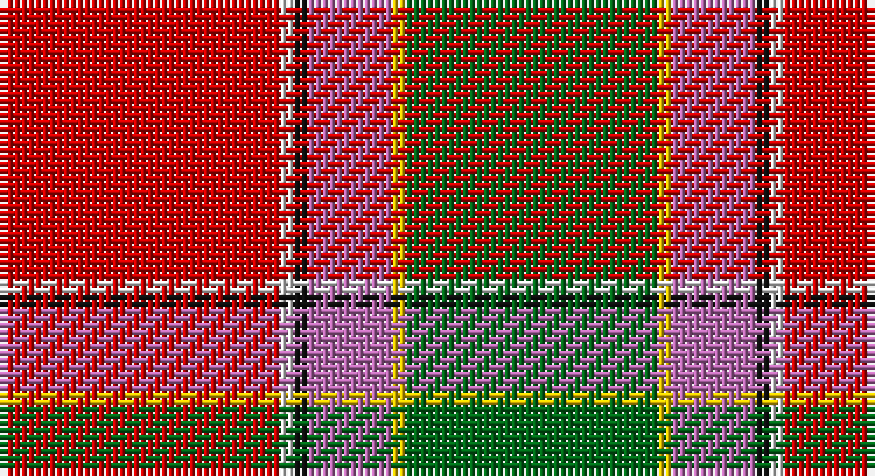

This page is one **sett** — a single exact thread-count. It belongs to the [tartan](/setts/r20w1k1m6ly1g18/)
(the same proportion at any scale), whose colour order is pattern [GYRKWR](/stripes/gyrkwr/).

Part of the [Gordon of Abergeldie](/tartans/gordon-of-abergeldie/) tartan — the named design grouping this sett with its other cloths.

Sourced from house-of-tartan.  It is a [6 stripe tartan](/stripes/stripes6/).

Original link http://www.house-of-tartan.scotland.net/house/TartanViewjs.asp?colr=Def&tnam=955

## Provenance

Earliest known date: 1723 This sett was reconstructed from a scarf in a painting of Rachael Gordon, hanging in Abergeldie Castle, painted by Alexander in 1723. The count and colour desciption was taken by the Lord Lyon in 1953.

## Also known as

This cloth is also recorded under:

- Gordon of Abergeldie Portrait
- Gordon of Abergeldie,

## Thread count
R/40 LN2 K2 P12 Y2 G/36

One full sett is **112 threads**.

## Palette

Palette: <strong>Tartan Register</strong> <small style="color:#888">(5 of 6 colours)</small>
<table><thead><tr><th>Colour</th><th>Threads</th><th>Shade</th><th>Base</th><th>OKLCh</th></tr></thead><tbody><tr><td>R/</td><td style="text-align:right;font-variant-numeric:tabular-nums">40</td><td><code style="background-color:#C80000;">#C80000</code> <small style="color:#888">#C80000</small></td><td>R <code style="background-color:#CC0000;">#CC0000</code></td><td><small style="color:#888">oklch(52.3% 0.215 29.2)</small></td></tr><tr><td>LN</td><td style="text-align:right;font-variant-numeric:tabular-nums">2</td><td><code style="background-color:#E0E0E0;">#E0E0E0</code> <small style="color:#888">#E0E0E0</small></td><td>W <code style="background-color:#F7F7F7;">#F7F7F7</code></td><td><small style="color:#888">oklch(90.7% 0.000 89.9)</small></td></tr><tr><td>K</td><td style="text-align:right;font-variant-numeric:tabular-nums">2</td><td><code style="background-color:#101010;">#101010</code> <small style="color:#888">#101010</small></td><td>K <code style="background-color:#000000;">#000000</code></td><td><small style="color:#888">oklch(17.3% 0.000 89.9)</small></td></tr><tr><td>P</td><td style="text-align:right;font-variant-numeric:tabular-nums">12</td><td><code style="background-color:#B468AC;">#B468AC</code> <small style="color:#888">#B468AC</small></td><td>R <code style="background-color:#CC0000;">#CC0000</code></td><td><small style="color:#888">oklch(62.5% 0.131 330.9)</small></td></tr><tr><td>Y</td><td style="text-align:right;font-variant-numeric:tabular-nums">2</td><td><code style="background-color:#E8C000;">#E8C000</code> <small style="color:#888">#E8C000</small></td><td>Y <code style="background-color:#F2BF00;">#F2BF00</code></td><td><small style="color:#888">oklch(81.9% 0.168 93.7)</small></td></tr><tr><td>G/</td><td style="text-align:right;font-variant-numeric:tabular-nums">36</td><td><code style="background-color:#006818;">#006818</code> <small style="color:#888">#006818</small></td><td>G <code style="background-color:#006100;">#006100</code></td><td><small style="color:#888">oklch(45.0% 0.142 145.0)</small></td></tr></tbody></table>

# Sample pattern

## Compared to the master

This cloth is one sett of its design; the master sett (the exemplar the design is anchored on) is below for comparison.

<figure style="margin:0"><figcaption style="color:#888;font-size:smaller">this sett</figcaption></figure>
<figure style="margin:0"><figcaption style="color:#888;font-size:smaller"><a href="/setts/r63w4k4dp18ly4dg50/">master sett →</a></figcaption></figure>

## Nearest tartans

The nearest existing variants by ΔTartan distance, with this tartan at the top so the swatches line up against it.

ΔTartan

Tartan

Sett

—

<a href="/ttd/edit/#slug=r20w1k1m6ly1g18~x2">Gordon of Abergeldie (Red..) Portrait Tartan</a> <a class="nn-out" href="/variants/s6/r20w1k1m6ly1g18~x2/" title="open its dictionary page">↗</a>

0.40

<a href="/ttd/edit/#slug=r20w1k1dp6ly1g18~x2&amp;base=r20w1k1m6ly1g18~x2">Gordon of Abergeldie, (Red..)</a> <a class="nn-out" href="/variants/s6/r20w1k1dp6ly1g18~x2/" title="open its dictionary page">↗</a>

0.80

<a href="/ttd/edit/#slug=r63w4k4dp18ly4dg50~x2&amp;base=r20w1k1m6ly1g18~x2">Gordon of Abergeldie (Portrait)</a> <a class="nn-out" href="/variants/s6/r63w4k4dp18ly4dg50~x2/" title="open its dictionary page">↗</a>

0.94

<a href="/ttd/edit/#slug=r48b16lo5g17w8dy3~x2&amp;base=r20w1k1m6ly1g18~x2">Scottish American Soc. of Michigan</a> <a class="nn-out" href="/variants/s6/r48b16lo5g17w8dy3~x2/" title="open its dictionary page">↗</a>

1.06

<a href="/ttd/edit/#slug=r30db12k3g12ly2g3w2~x2&amp;base=r20w1k1m6ly1g18~x2">Hewitt (Name)</a> <a class="nn-out" href="/variants/s7/r30db12k3g12ly2g3w2~x2/" title="open its dictionary page">↗</a>

1.08

<a href="/ttd/edit/#slug=r3lo15g4dt6w2r30dt6ly3~x2&amp;base=r20w1k1m6ly1g18~x2">Round Table Sweden</a> <a class="nn-out" href="/variants/s8/r3lo15g4dt6w2r30dt6ly3~x2/" title="open its dictionary page">↗</a>

1.22

<a href="/ttd/edit/#slug=r15w1db4ly1g15~x4&amp;base=r20w1k1m6ly1g18~x2">Eglinton, Duke of (Artefact)</a> <a class="nn-out" href="/variants/s5/r15w1db4ly1g15~x4/" title="open its dictionary page">↗</a>

1.22

<a href="/ttd/edit/#slug=r22db3ly1g12r6db3t3w1~x2&amp;base=r20w1k1m6ly1g18~x2">Drummond, (Fingask)</a> <a class="nn-out" href="/variants/s8/r22db3ly1g12r6db3t3w1~x2/" title="open its dictionary page">↗</a>

1.24

<a href="/ttd/edit/#slug=r30db12k6dg12ly2dg3w2~x2&amp;base=r20w1k1m6ly1g18~x2">Hewitt</a> <a class="nn-out" href="/variants/s7/r30db12k6dg12ly2dg3w2~x2/" title="open its dictionary page">↗</a>

1.27

<a href="/ttd/edit/#slug=w3dy1r29dy16g23db3g3ly2~x2&amp;base=r20w1k1m6ly1g18~x2">Etienne Paschal Tache Sir... Canadian Tartan</a> <a class="nn-out" href="/variants/s8/w3dy1r29dy16g23db3g3ly2~x2/" title="open its dictionary page">↗</a>

1.27

<a href="/ttd/edit/#slug=w3dy1r29dy16dg23db3dg3lo2~x2&amp;base=r20w1k1m6ly1g18~x2">Tache, Sir Etienne Paschal #2</a> <a class="nn-out" href="/variants/s8/w3dy1r29dy16dg23db3dg3lo2~x2/" title="open its dictionary page">↗</a>

## Neighbour map

Every grey dot is one of 14360 variants placed by the first two principal components of the ΔTartan feature space (44% of its variance). Red is this tartan; blue dots are its nearest — click one to open its page.

<svg viewBox="0 0 640 380" role="img" style="max-width:100%;height:auto;border:1px solid #e0e0e0;border-radius:4px;display:block" xmlns="http://www.w3.org/2000/svg"><image href="/nn/cloud.v1.png" width="640" height="380"/><a href="/variants/s6/r20w1k1dp6ly1g18~x2/"><circle cx="243.2" cy="129.3" r="4" fill="#3465a4"><title>Gordon of Abergeldie, (Red..)</title></circle></a><a href="/variants/s6/r63w4k4dp18ly4dg50~x2/"><circle cx="241.6" cy="141.5" r="4" fill="#3465a4"><title>Gordon of Abergeldie (Portrait)</title></circle></a><a href="/variants/s6/r48b16lo5g17w8dy3~x2/"><circle cx="242.6" cy="140.8" r="4" fill="#3465a4"><title>Scottish American Soc. of Michigan</title></circle></a><a href="/variants/s7/r30db12k3g12ly2g3w2~x2/"><circle cx="230.1" cy="130.1" r="4" fill="#3465a4"><title>Hewitt (Name)</title></circle></a><a href="/variants/s8/r3lo15g4dt6w2r30dt6ly3~x2/"><circle cx="229.2" cy="120.6" r="4" fill="#3465a4"><title>Round Table Sweden</title></circle></a><a href="/variants/s5/r15w1db4ly1g15~x4/"><circle cx="249.6" cy="177.9" r="4" fill="#3465a4"><title>Eglinton, Duke of (Artefact)</title></circle></a><a href="/variants/s8/r22db3ly1g12r6db3t3w1~x2/"><circle cx="306.9" cy="116.0" r="4" fill="#3465a4"><title>Drummond, (Fingask)</title></circle></a><a href="/variants/s7/r30db12k6dg12ly2dg3w2~x2/"><circle cx="206.9" cy="131.8" r="4" fill="#3465a4"><title>Hewitt</title></circle></a><a href="/variants/s8/w3dy1r29dy16g23db3g3ly2~x2/"><circle cx="227.1" cy="115.1" r="4" fill="#3465a4"><title>Etienne Paschal Tache Sir... Canadian Tartan</title></circle></a><a href="/variants/s8/w3dy1r29dy16dg23db3dg3lo2~x2/"><circle cx="225.9" cy="114.8" r="4" fill="#3465a4"><title>Tache, Sir Etienne Paschal #2</title></circle></a><circle cx="253.3" cy="133.4" r="5" fill="#c00000"/></svg>

ID: /variants/s6/r20w1k1m6ly1g18~x2/
