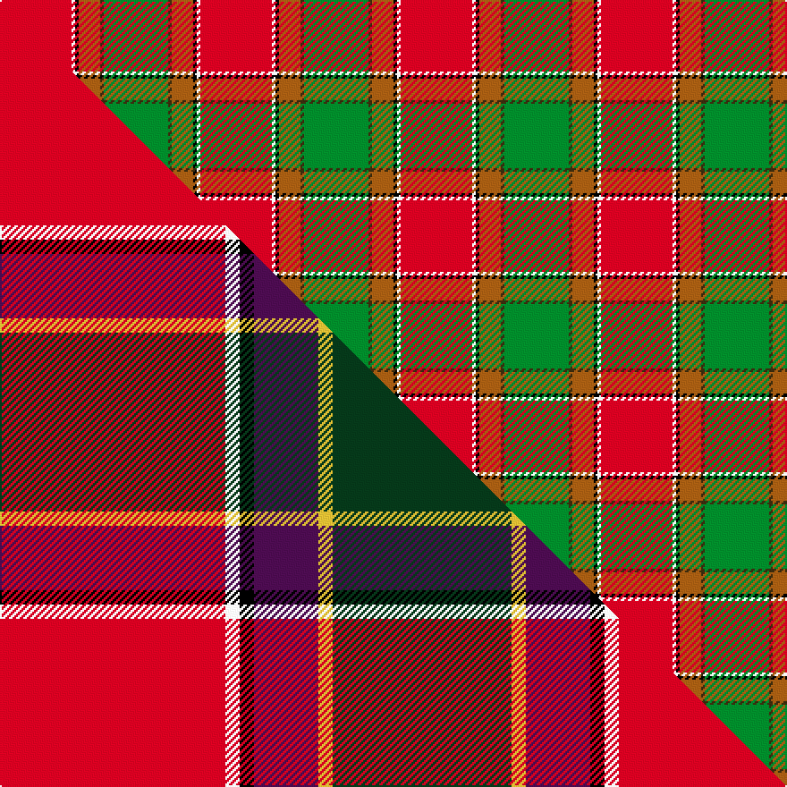

This is one **variant** — a specific cloth: this exact thread count and colourway, with its own
provenance below. It is one weaving of the [sett](/tartans/g/go/gordon-of-abergeldie/) (the scale-free proportion — the
same cloth at any scale or shade), whose colour order is pattern [GGRKWR](/stripes/ggrkwr/).

Part of the [Gordon of Abergeldie](/tartans/g/go/gordon-of-abergeldie/) tartan — the named design grouping this sett with its other cloths.

Sourced from house-of-tartan.  It is a [6 stripe tartan](/stripes/stripes6/).

Original link [http://www.house-of-tartan.scotland.net/house/TartanViewjs.asp?colr=Def&tnam=955](http://www.house-of-tartan.scotland.net/house/TartanViewjs.asp?colr=Def&tnam=955)

## Provenance

Earliest known date: 1723 This sett was reconstructed from a scarf in a painting of Rachael Gordon, hanging in Abergeldie Castle, painted by Alexander in 1723. The count and colour desciption was taken by the Lord Lyon in 1953.

Dataset <small>— provenance for this record, inherited from the source manifest</small>

<dl class="dataset-prov">
<dt>source</dt><dd><a href="/sources/house-of-tartan/">House of Tartan</a></dd>
<dt>data captured from</dt><dd><a href="https://github.com/thetartan/tartan-database/blob/master/data/house-of-tartan/data.csv">https://github.com/thetartan/tartan-database/blob/master/data/house-of-tartan/data.csv</a></dd>
<dt>data date</dt><dd>1723 <small>(this record)</small></dd>
<dt>licence</dt><dd><a href="https://creativecommons.org/licenses/by-nc-nd/4.0/">CC BY-NC-ND 4.0</a></dd>
</dl>

Capture chain <small>— the hands this data passed through, oldest first; each capture carries its own licence</small>

<ol class="capture-chain">
<li><a href="http://www.house-of-tartan.scotland.net/">House of Tartan</a> <small>the weaver/retailer's database — the site is now offline; the URL is kept as the ultimate source's identity</small></li>
<li><a href="https://github.com/thetartan/tartan-database">thetartan/tartan-database</a> <small>2016-2017</small> · <a href="https://creativecommons.org/licenses/by-nc-nd/4.0/">CC BY-NC-ND 4.0</a> <small>Levko Kravets's frozen compilation — the capture we vendored, and where its CC licence text came from</small></li>
<li>this dictionary <small>captured 2026-06-10 · commit 5bf86c7566</small> <small>each re-capture is a git commit to data/sources</small></li>
</ol>

## Thread count
R/40 W2 K2 O12 DY2 G/36

One full sett is **112 threads**.

## Palette
<table><thead><tr><th>Colour</th><th>Shade</th><th>OKLCh</th></tr></thead><tbody><tr><td>G</td><td><code style="background-color:#008B2A;">#008B2A</code> <small style="color:#888">#008B2A</small></td><td><small style="color:#888">oklch(55.4% 0.170 145.9)</small></td></tr><tr><td>K</td><td><code style="background-color:#000000;">#000000</code> <small style="color:#888">#000000</small></td><td><small style="color:#888">oklch(0.0% 0.000 0.0)</small></td></tr><tr><td>W</td><td><code style="background-color:#F7F7F7;">#F7F7F7</code> <small style="color:#888">#F7F7F7</small></td><td><small style="color:#888">oklch(97.6% 0.000 89.9)</small></td></tr><tr><td>O</td><td><code style="background-color:#A65C11;">#A65C11</code> <small style="color:#888">#A65C11</small></td><td><small style="color:#888">oklch(55.0% 0.125 58.3)</small></td></tr><tr><td>R</td><td><code style="background-color:#D60020;">#D60020</code> <small style="color:#888">#D60020</small></td><td><small style="color:#888">oklch(55.2% 0.224 25.5)</small></td></tr><tr><td>DY</td><td><code style="background-color:#3A2B0D;">#3A2B0D</code> <small style="color:#888">#3A2B0D</small></td><td><small style="color:#888">oklch(30.0% 0.049 82.0)</small></td></tr></tbody></table>

# Sample pattern

## Compared to the master

This cloth is one sett of its design; the master sett (the exemplar the design is anchored on) is below for comparison.

Its **ΔTartan distance** from the master is **0.72** — the same measure the nearest-tartans table ranks by (0 is identical; a re-scale of the same cloth is near 0, a recolour or a different proportion further).

<figure class="master-compare" style="margin:0">

this sett
master sett ★

<figcaption style="color:#888;font-size:smaller">One weave of this sett against the <a href="/setts/r63w4k4dp18ly4dg50/">master sett ★</a>, split on the diagonal: a shared proportion runs seamlessly across it with only the shades shifting; a different proportion breaks on it.</figcaption>
</figure>

## Nearest tartan variants

The nearest existing variants by ΔTartan distance, with this cloth at the top so the swatches line up against it.

ΔTartan

Threads

Variant

Sett

—

112

<a href="/variants/s6/r20w1k1o6dy1g18~x2/">Gordon of Abergeldie (Red..) Portrait Tartan</a>

<a href="/ttd/edit/#slug=r20w1k1b6y1g18~x2&amp;base=r20w1k1o6dy1g18~x2" title="compare in the TTD">0.31</a>

112

<a href="/variants/s6/r20w1k1b6y1g18~x2/">Gordon of Abergeldie, (Red..)</a>

<a href="/ttd/edit/#slug=r63w4k4dp18ly4dg50~x2&amp;base=r20w1k1o6dy1g18~x2" title="compare in the TTD">0.72</a>

346

<a href="/variants/s6/r63w4k4dp18ly4dg50~x2/">Gordon of Abergeldie (Portrait)</a>

<a href="/ttd/edit/#slug=r15w1db4y1g15~x4&amp;base=r20w1k1o6dy1g18~x2" title="compare in the TTD">0.92</a>

168

<a href="/variants/s5/r15w1db4y1g15~x4/">Eglinton, Duke of (Artefact)</a>

<a href="/ttd/edit/#slug=k2db1g10r10ly1~x6&amp;base=r20w1k1o6dy1g18~x2" title="compare in the TTD">1.43</a>

270

<a href="/variants/s5/k2db1g10r10ly1~x6/">Turnbull Dress</a>

<a href="/ttd/edit/#slug=k7db3g28r28y3~x2&amp;base=r20w1k1o6dy1g18~x2" title="compare in the TTD">1.45</a>

256

<a href="/variants/s5/k7db3g28r28y3~x2/">Turnbull Dress Clan Tartan</a>

<a href="/ttd/edit/#slug=t6dp5k2g18r28w2~x2&amp;base=r20w1k1o6dy1g18~x2" title="compare in the TTD">1.49</a>

228

<a href="/variants/s6/t6dp5k2g18r28w2~x2/">Dundhuin Ladies (Personal)</a>

<a href="/ttd/edit/#slug=g24t2r25y2k3~x2&amp;base=r20w1k1o6dy1g18~x2" title="compare in the TTD">1.63</a>

170

<a href="/variants/s5/g24t2r25y2k3~x2/">Bronte (Name)</a>

<a href="/ttd/edit/#slug=g24db2r25y2k3~x2&amp;base=r20w1k1o6dy1g18~x2" title="compare in the TTD">1.63</a>

170

<a href="/variants/s5/g24db2r25y2k3~x2/">Bronte</a>

<a href="/ttd/edit/#slug=y9r31g12dy2lb9~x2&amp;base=r20w1k1o6dy1g18~x2" title="compare in the TTD">1.75</a>

216

<a href="/variants/s5/y9r31g12dy2lb9~x2/">Buncle (Duns)</a>

<a href="/ttd/edit/#slug=ly9r31g12dy2lb9~x2&amp;base=r20w1k1o6dy1g18~x2" title="compare in the TTD">1.75</a>

216

<a href="/variants/s5/ly9r31g12dy2lb9~x2/">Buncle (Name)</a>

## Neighbour map

Every grey dot is one of 13662 variants placed by the first two principal components of the ΔTartan feature space (42% of its variance). Red is this tartan; blue dots are its nearest — click one to open its page. The map is a flat projection of a many-dimensional space — [how to read it](/posts/neighbourhood-maps/).

<svg viewBox="0 0 640 380" role="img" style="max-width:100%;height:auto;border:1px solid #e0e0e0;border-radius:4px;display:block" xmlns="http://www.w3.org/2000/svg"><image href="/nn/cloud.v1.png" width="640" height="380"/><a href="/variants/s6/r20w1k1b6y1g18~x2/"><circle cx="238.1" cy="137.3" r="4" fill="#3465a4"><title>Gordon of Abergeldie, (Red..)</title></circle></a><a href="/variants/s6/r63w4k4dp18ly4dg50~x2/"><circle cx="221.8" cy="138.6" r="4" fill="#3465a4"><title>Gordon of Abergeldie (Portrait)</title></circle></a><a href="/variants/s5/r15w1db4y1g15~x4/"><circle cx="257.4" cy="189.1" r="4" fill="#3465a4"><title>Eglinton, Duke of (Artefact)</title></circle></a><a href="/variants/s5/k2db1g10r10ly1~x6/"><circle cx="206.9" cy="186.5" r="4" fill="#3465a4"><title>Turnbull Dress</title></circle></a><a href="/variants/s5/k7db3g28r28y3~x2/"><circle cx="190.8" cy="190.3" r="4" fill="#3465a4"><title>Turnbull Dress Clan Tartan</title></circle></a><a href="/variants/s6/t6dp5k2g18r28w2~x2/"><circle cx="209.2" cy="147.6" r="4" fill="#3465a4"><title>Dundhuin Ladies (Personal)</title></circle></a><a href="/variants/s5/g24t2r25y2k3~x2/"><circle cx="253.6" cy="175.0" r="4" fill="#3465a4"><title>Bronte (Name)</title></circle></a><a href="/variants/s5/g24db2r25y2k3~x2/"><circle cx="249.2" cy="173.0" r="4" fill="#3465a4"><title>Bronte</title></circle></a><a href="/variants/s5/y9r31g12dy2lb9~x2/"><circle cx="292.8" cy="203.0" r="4" fill="#3465a4"><title>Buncle (Duns)</title></circle></a><a href="/variants/s5/ly9r31g12dy2lb9~x2/"><circle cx="273.2" cy="196.5" r="4" fill="#3465a4"><title>Buncle (Name)</title></circle></a><circle cx="246.5" cy="136.8" r="5" fill="#c00000"/><text x="320" y="376" text-anchor="middle" font-size="11" fill="#999">ground</text><text x="11" y="190" text-anchor="middle" font-size="11" fill="#999" transform="rotate(-90 11 190)">complexity</text></svg>

ID: /variants/s6/r20w1k1o6dy1g18~x2/
