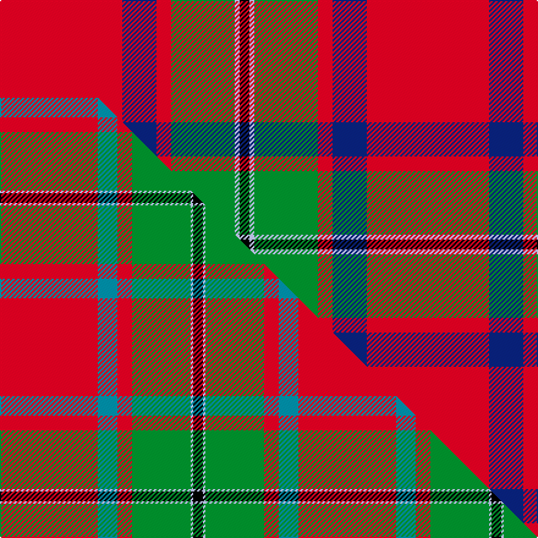

This is one **variant** — a specific cloth: this exact thread count and colourway, with its own
provenance below. It is one weaving of the [sett](/setts/r25db7r3g13lb1k2/) (the scale-free proportion — the
same cloth at any scale or shade), whose colour order is pattern [KWGRBR](/stripes/kwgrbr/).

Part of the [MacPhail](/tartans/m/ma/macphail-2/) tartan — the named design grouping this sett with its other cloths.

Sourced from house-of-tartan.  It is a [6 stripe tartan](/stripes/stripes6/).

Original link [http://www.house-of-tartan.scotland.net/house/TartanViewjs.asp?colr=Def&tnam=1028](http://www.house-of-tartan.scotland.net/house/TartanViewjs.asp?colr=Def&tnam=1028)

## Provenance

Earliest known date: pre 1950 This sample comes from the MacGregor-Hastie collection which forms the basis of the cloth archive of the Scottish Tartans Society. Some of the samples, including this one, were unmarked. One can assume that the sample dates between 1930 and 1950.

2 attestations — the source records this cloth was collapsed from (oldest owns this page)

<ul>
<li>pre 1950 — MacPhail Clan Tartan (house-of-tartan, <a href="http://www.house-of-tartan.scotland.net/house/TartanViewjs.asp?colr=Def&tnam=1028">record</a>) </li>
<li>undated — MacPhail (weddslist, <a href="http://www.weddslist.com/cgi-bin/tartans/pg.pl?source=sts">record</a>) </li>
</ul>

Dataset <small>— provenance for this record, inherited from the source manifest</small>

<dl class="dataset-prov">
<dt>source</dt><dd><a href="/sources/house-of-tartan/">House of Tartan</a></dd>
<dt>data captured from</dt><dd><a href="https://github.com/thetartan/tartan-database/blob/master/data/house-of-tartan/data.csv">https://github.com/thetartan/tartan-database/blob/master/data/house-of-tartan/data.csv</a></dd>
<dt>data date</dt><dd>pre 1950 <small>(this record)</small></dd>
<dt>licence</dt><dd><a href="https://creativecommons.org/licenses/by-nc-nd/4.0/">CC BY-NC-ND 4.0</a></dd>
</dl>

Capture chain <small>— the hands this data passed through, oldest first; each capture carries its own licence</small>

<ol class="capture-chain">
<li><a href="http://www.house-of-tartan.scotland.net/">House of Tartan</a> <small>the weaver/retailer's database — the site is now offline; the URL is kept as the ultimate source's identity</small></li>
<li><a href="https://github.com/thetartan/tartan-database">thetartan/tartan-database</a> <small>2016-2017</small> · <a href="https://creativecommons.org/licenses/by-nc-nd/4.0/">CC BY-NC-ND 4.0</a> <small>Levko Kravets's frozen compilation — the capture we vendored, and where its CC licence text came from</small></li>
<li>this dictionary <small>captured 2026-06-10 · commit 5bf86c7566</small> <small>each re-capture is a git commit to data/sources</small></li>
</ol>

## Thread count
R/100 DB28 R12 G52 LB4 K/8

One full sett is **300 threads**.

## Palette
<table><thead><tr><th>Colour</th><th>Shade</th><th>OKLCh</th></tr></thead><tbody><tr><td>LB</td><td><code style="background-color:#B5BBDE;">#B5BBDE</code> <small style="color:#888">#B5BBDE</small></td><td><small style="color:#888">oklch(79.9% 0.050 277.6)</small></td></tr><tr><td>DB</td><td><code style="background-color:#082077;">#082077</code> <small style="color:#888">#082077</small></td><td><small style="color:#888">oklch(30.0% 0.149 265.1)</small></td></tr><tr><td>G</td><td><code style="background-color:#008B2A;">#008B2A</code> <small style="color:#888">#008B2A</small></td><td><small style="color:#888">oklch(55.4% 0.170 145.9)</small></td></tr><tr><td>K</td><td><code style="background-color:#000000;">#000000</code> <small style="color:#888">#000000</small></td><td><small style="color:#888">oklch(0.0% 0.000 0.0)</small></td></tr><tr><td>R</td><td><code style="background-color:#D60020;">#D60020</code> <small style="color:#888">#D60020</small></td><td><small style="color:#888">oklch(55.2% 0.224 25.5)</small></td></tr></tbody></table>

# Sample pattern

## Compared to the master

This cloth is one sett of its design; the master sett (the exemplar the design is anchored on) is below for comparison.

Its **ΔTartan distance** from the master is **0.52** — the same measure the nearest-tartans table ranks by (0 is identical; a re-scale of the same cloth is near 0, a recolour or a different proportion further).

<figure class="master-compare" style="margin:0">

this sett
master sett ★

<figcaption style="color:#888;font-size:smaller">One weave of this sett against the <a href="/setts/r40t8r6g24lb1k4/">master sett ★</a>, split on the diagonal: a shared proportion runs seamlessly across it with only the shades shifting; a different proportion breaks on it.</figcaption>
</figure>

## Nearest tartan variants

The nearest existing variants by ΔTartan distance, with this cloth at the top so the swatches line up against it.

ΔTartan

Threads

Variant

Sett

—

300

<a href="/variants/s6/r25db7r3g13lb1k2~x4/">MacPhail Clan Tartan</a>

<a href="/ttd/edit/#slug=r40t8r6g24lb1k4~x2&amp;base=r25db7r3g13lb1k2~x4" title="compare in the TTD">0.52</a>

244

<a href="/variants/s6/r40t8r6g24lb1k4~x2/">MacPhail (Blue Bands)</a>

<a href="/ttd/edit/#slug=r100k15g48db5r7db16~x2&amp;base=r25db7r3g13lb1k2~x4" title="compare in the TTD">0.96</a>

532

<a href="/variants/s6/r100k15g48db5r7db16~x2/">Plummer (Personal)</a>

<a href="/ttd/edit/#slug=r25k7r3g13lb1k2~x4&amp;base=r25db7r3g13lb1k2~x4" title="compare in the TTD">1.30</a>

300

<a href="/variants/s6/r25k7r3g13lb1k2~x4/">MacPhail Red Clan Tartan</a>

<a href="/ttd/edit/#slug=r25k7r3g13y1k2~x4&amp;base=r25db7r3g13lb1k2~x4" title="compare in the TTD">1.30</a>

300

<a href="/variants/s6/r25k7r3g13y1k2~x4/">MacPhail</a>

<a href="/ttd/edit/#slug=r22db3y1g12r6db3lb3w1~x2&amp;base=r25db7r3g13lb1k2~x4" title="compare in the TTD">1.52</a>

158

<a href="/variants/s8/r22db3y1g12r6db3lb3w1~x2/">Drummond, (Fingask)</a>

<a href="/ttd/edit/#slug=g15k10r30dp2r20w1~x2&amp;base=r25db7r3g13lb1k2~x4" title="compare in the TTD">1.56</a>

280

<a href="/variants/s6/g15k10r30dp2r20w1~x2/">Kinnaird (Name)</a>

<a href="/ttd/edit/#slug=r51y2k4w2g21r10k4lb4w2~x2&amp;base=r25db7r3g13lb1k2~x4" title="compare in the TTD">1.60</a>

294

<a href="/variants/s9/r51y2k4w2g21r10k4lb4w2~x2/">Drummond of Perth Clan Tartan</a>

<a href="/ttd/edit/#slug=r2db12r2g12r24w1~x2&amp;base=r25db7r3g13lb1k2~x4" title="compare in the TTD">1.66</a>

206

<a href="/variants/s6/r2db12r2g12r24w1~x2/">Fraser (1745)</a>

<a href="/ttd/edit/#slug=r2db12r2dg12r24w1~x2&amp;base=r25db7r3g13lb1k2~x4" title="compare in the TTD">1.66</a>

206

<a href="/variants/s6/r2db12r2dg12r24w1~x2/">Fraser</a>

<a href="/ttd/edit/#slug=r4k2dg28r38k1ly4~x2&amp;base=r25db7r3g13lb1k2~x4" title="compare in the TTD">1.67</a>

292

<a href="/variants/s6/r4k2dg28r38k1ly4~x2/">Wcwm 9275 5471-1</a>

## Neighbour map

Every grey dot is one of 13621 variants placed by the first two principal components of the ΔTartan feature space (42% of its variance). Red is this tartan; blue dots are its nearest — click one to open its page.

<svg viewBox="0 0 640 380" role="img" style="max-width:100%;height:auto;border:1px solid #e0e0e0;border-radius:4px;display:block" xmlns="http://www.w3.org/2000/svg"><image href="/nn/cloud.v1.png" width="640" height="380"/><a href="/variants/s6/r40t8r6g24lb1k4~x2/"><circle cx="323.8" cy="116.3" r="4" fill="#3465a4"><title>MacPhail (Blue Bands)</title></circle></a><a href="/variants/s6/r100k15g48db5r7db16~x2/"><circle cx="305.4" cy="143.6" r="4" fill="#3465a4"><title>Plummer (Personal)</title></circle></a><a href="/variants/s6/r25k7r3g13lb1k2~x4/"><circle cx="290.0" cy="134.6" r="4" fill="#3465a4"><title>MacPhail Red Clan Tartan</title></circle></a><a href="/variants/s6/r25k7r3g13y1k2~x4/"><circle cx="291.8" cy="135.2" r="4" fill="#3465a4"><title>MacPhail</title></circle></a><a href="/variants/s8/r22db3y1g12r6db3lb3w1~x2/"><circle cx="298.5" cy="123.2" r="4" fill="#3465a4"><title>Drummond, (Fingask)</title></circle></a><a href="/variants/s6/g15k10r30dp2r20w1~x2/"><circle cx="328.7" cy="130.6" r="4" fill="#3465a4"><title>Kinnaird (Name)</title></circle></a><a href="/variants/s9/r51y2k4w2g21r10k4lb4w2~x2/"><circle cx="310.1" cy="70.1" r="4" fill="#3465a4"><title>Drummond of Perth Clan Tartan</title></circle></a><a href="/variants/s6/r2db12r2g12r24w1~x2/"><circle cx="321.6" cy="165.8" r="4" fill="#3465a4"><title>Fraser (1745)</title></circle></a><a href="/variants/s6/r2db12r2dg12r24w1~x2/"><circle cx="327.0" cy="165.1" r="4" fill="#3465a4"><title>Fraser</title></circle></a><a href="/variants/s6/r4k2dg28r38k1ly4~x2/"><circle cx="348.3" cy="116.5" r="4" fill="#3465a4"><title>Wcwm 9275 5471-1</title></circle></a><circle cx="292.4" cy="129.7" r="5" fill="#c00000"/><text x="320" y="376" text-anchor="middle" font-size="11" fill="#999">ground</text><text x="11" y="190" text-anchor="middle" font-size="11" fill="#999" transform="rotate(-90 11 190)">complexity</text></svg>

ID: /variants/s6/r25db7r3g13lb1k2~x4/
