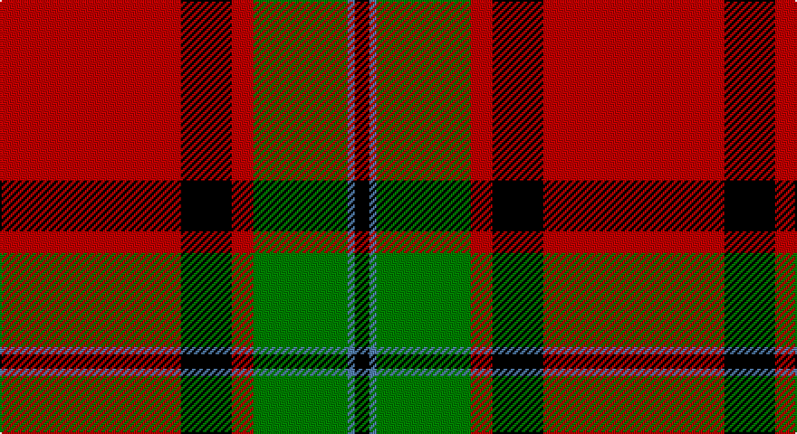

This page is one **sett** — a single exact thread-count. It belongs to the [tartan](/setts/r25k7r3g13t1k2/)
(the same proportion at any scale), whose colour order is pattern [KBGRKR](/stripes/kbgrkr/).

Part of the [MacPhail](/tartans/macphail/) tartan — the named design grouping this sett with its other cloths.

Sourced from weddslist.  It is a [6 stripe tartan](/stripes/stripes6/).

Original link http://www.weddslist.com/cgi-bin/tartans/pg.pl?source=sts

## Provenance

Earliest known date: 1930-50 This sample comes from the MacGregor-Hastie collection which forms the basis of the cloth archive of the Scottish Tartans Society. Some of the samples, including this one, were unmarked. One can assume that the sample dates between 1930 and 1950.

## Also known as

This cloth is also recorded under:

- MacPhail Red

2 attestations — the source records this cloth was collapsed from (oldest owns this page)

<ul>
<li>undated — MacPhail (weddslist, <a href="http://www.weddslist.com/cgi-bin/tartans/pg.pl?source=sts">record</a>)</li>
<li>undated — MacPhail Red Clan Tartan (house-of-tartan, <a href="http://www.house-of-tartan.scotland.net/house/TartanViewjs.asp?colr=Def&tnam=1031">record</a>)</li>
</ul>

## Thread count
R/100 K28 R12 G52 B4 K/8

One full sett is **300 threads**.

## Palette

Palette: <strong>Ingles Buchan</strong> <small style="color:#888">(1 of 4 colours)</small>
<table><thead><tr><th>Colour</th><th>Threads</th><th>Shade</th><th>Base</th><th>OKLCh</th></tr></thead><tbody><tr><td>R/</td><td style="text-align:right;font-variant-numeric:tabular-nums">100</td><td><code style="background-color:#C00000;">#C00000</code> <small style="color:#888">#C00000</small></td><td>R <code style="background-color:#CC0000;">#CC0000</code></td><td><small style="color:#888">oklch(50.7% 0.208 29.2)</small></td></tr><tr><td>K</td><td style="text-align:right;font-variant-numeric:tabular-nums">28</td><td><code style="background-color:#000000;">#000000</code> <small style="color:#888">#000000</small></td><td>K <code style="background-color:#000000;">#000000</code></td><td><small style="color:#888">oklch(0.0% 0.000 0.0)</small></td></tr><tr><td>R</td><td style="text-align:right;font-variant-numeric:tabular-nums">12</td><td><code style="background-color:#C00000;">#C00000</code> <small style="color:#888">#C00000</small></td><td>R <code style="background-color:#CC0000;">#CC0000</code></td><td><small style="color:#888">oklch(50.7% 0.208 29.2)</small></td></tr><tr><td>G</td><td style="text-align:right;font-variant-numeric:tabular-nums">52</td><td><code style="background-color:#008000;">#008000</code> <small style="color:#888">#008000</small></td><td>G <code style="background-color:#006100;">#006100</code></td><td><small style="color:#888">oklch(52.0% 0.177 142.5)</small></td></tr><tr><td>B</td><td style="text-align:right;font-variant-numeric:tabular-nums">4</td><td><code style="background-color:#5480B0;">#5480B0</code> <small style="color:#888">#5480B0</small></td><td>B <code style="background-color:#2A418A;">#2A418A</code></td><td><small style="color:#888">oklch(58.8% 0.089 251.5)</small></td></tr><tr><td>K/</td><td style="text-align:right;font-variant-numeric:tabular-nums">8</td><td><code style="background-color:#000000;">#000000</code> <small style="color:#888">#000000</small></td><td>K <code style="background-color:#000000;">#000000</code></td><td><small style="color:#888">oklch(0.0% 0.000 0.0)</small></td></tr></tbody></table>

# Sample pattern

## Compared to the master

This cloth is one sett of its design; the master sett (the exemplar the design is anchored on) is below for comparison.

<figure style="margin:0"><figcaption style="color:#888;font-size:smaller">this sett</figcaption></figure>
<figure style="margin:0"><figcaption style="color:#888;font-size:smaller"><a href="/setts/r25k7r3g13y1k2/">master sett →</a></figcaption></figure>

## Nearest tartans

The nearest existing variants by ΔTartan distance, with this tartan at the top so the swatches line up against it.

ΔTartan

Tartan

Sett

—

<a href="/ttd/edit/#slug=r25k7r3g13t1k2~x4">MacPhail</a> <a class="nn-out" href="/variants/s6/r25k7r3g13t1k2~x4/" title="open its dictionary page">↗</a>

0.92

<a href="/ttd/edit/#slug=r25k7r3g13y1k2~x4&amp;base=r25k7r3g13t1k2~x4">MacPhail</a> <a class="nn-out" href="/variants/s6/r25k7r3g13y1k2~x4/" title="open its dictionary page">↗</a>

1.03

<a href="/ttd/edit/#slug=r5w2r28k12g16r3~x2&amp;base=r25k7r3g13t1k2~x4">MacKintosh 6</a> <a class="nn-out" href="/variants/s6/r5w2r28k12g16r3~x2/" title="open its dictionary page">↗</a>

1.04

<a href="/ttd/edit/#slug=r6g21k8r28k1r4~x2&amp;base=r25k7r3g13t1k2~x4">Dunbar</a> <a class="nn-out" href="/variants/s6/r6g21k8r28k1r4~x2/" title="open its dictionary page">↗</a>

1.09

<a href="/ttd/edit/#slug=k2r16dg6r3dg8lb1&amp;base=r25k7r3g13t1k2~x4">MacAulay</a> <a class="nn-out" href="/variants/s6/k2r16dg6r3dg8lb1/" title="open its dictionary page">↗</a>

1.10

<a href="/ttd/edit/#slug=r6dg21k8r28dg1r4~x2&amp;base=r25k7r3g13t1k2~x4">Dunbar</a> <a class="nn-out" href="/variants/s6/r6dg21k8r28dg1r4~x2/" title="open its dictionary page">↗</a>

1.12

<a href="/ttd/edit/#slug=g4r4k2r20t1k7r2g10r3k2~x2&amp;base=r25k7r3g13t1k2~x4">MacKillop</a> <a class="nn-out" href="/variants/s10/g4r4k2r20t1k7r2g10r3k2~x2/" title="open its dictionary page">↗</a>

1.14

<a href="/ttd/edit/#slug=r2db12r2dg12r24w1~x2&amp;base=r25k7r3g13t1k2~x4">Fraser</a> <a class="nn-out" href="/variants/s6/r2db12r2dg12r24w1~x2/" title="open its dictionary page">↗</a>

1.17

<a href="/ttd/edit/#slug=r28g4k4g4k4t6ly1~x2&amp;base=r25k7r3g13t1k2~x4">Livingstone, MacLay MacLeay</a> <a class="nn-out" href="/variants/s7/r28g4k4g4k4t6ly1~x2/" title="open its dictionary page">↗</a>

1.19

<a href="/ttd/edit/#slug=r107k9r5db41r5g51r14&amp;base=r25k7r3g13t1k2~x4">Buccleuch</a> <a class="nn-out" href="/variants/s7/r107k9r5db41r5g51r14/" title="open its dictionary page">↗</a>

1.21

<a href="/ttd/edit/#slug=k1g6k1g6r16db1~x2&amp;base=r25k7r3g13t1k2~x4">Denny, hunting</a> <a class="nn-out" href="/variants/s6/k1g6k1g6r16db1~x2/" title="open its dictionary page">↗</a>

## Neighbour map

Every grey dot is one of 14360 variants placed by the first two principal components of the ΔTartan feature space (44% of its variance). Red is this tartan; blue dots are its nearest — click one to open its page.

<svg viewBox="0 0 640 380" role="img" style="max-width:100%;height:auto;border:1px solid #e0e0e0;border-radius:4px;display:block" xmlns="http://www.w3.org/2000/svg"><image href="/nn/cloud.v1.png" width="640" height="380"/><a href="/variants/s6/r25k7r3g13y1k2~x4/"><circle cx="350.5" cy="158.7" r="4" fill="#3465a4"><title>MacPhail</title></circle></a><a href="/variants/s6/r5w2r28k12g16r3~x2/"><circle cx="282.9" cy="178.5" r="4" fill="#3465a4"><title>MacKintosh 6</title></circle></a><a href="/variants/s6/r6g21k8r28k1r4~x2/"><circle cx="353.7" cy="171.9" r="4" fill="#3465a4"><title>Dunbar</title></circle></a><a href="/variants/s6/k2r16dg6r3dg8lb1/"><circle cx="321.2" cy="184.3" r="4" fill="#3465a4"><title>MacAulay</title></circle></a><a href="/variants/s6/r6dg21k8r28dg1r4~x2/"><circle cx="365.4" cy="175.9" r="4" fill="#3465a4"><title>Dunbar</title></circle></a><a href="/variants/s10/g4r4k2r20t1k7r2g10r3k2~x2/"><circle cx="291.9" cy="134.1" r="4" fill="#3465a4"><title>MacKillop</title></circle></a><a href="/variants/s6/r2db12r2dg12r24w1~x2/"><circle cx="321.0" cy="162.2" r="4" fill="#3465a4"><title>Fraser</title></circle></a><a href="/variants/s7/r28g4k4g4k4t6ly1~x2/"><circle cx="308.9" cy="107.5" r="4" fill="#3465a4"><title>Livingstone, MacLay MacLeay</title></circle></a><a href="/variants/s7/r107k9r5db41r5g51r14/"><circle cx="351.1" cy="153.9" r="4" fill="#3465a4"><title>Buccleuch</title></circle></a><a href="/variants/s6/k1g6k1g6r16db1~x2/"><circle cx="322.6" cy="169.9" r="4" fill="#3465a4"><title>Denny, hunting</title></circle></a><circle cx="324.7" cy="148.4" r="5" fill="#c00000"/></svg>

ID: /variants/s6/r25k7r3g13t1k2~x4/
