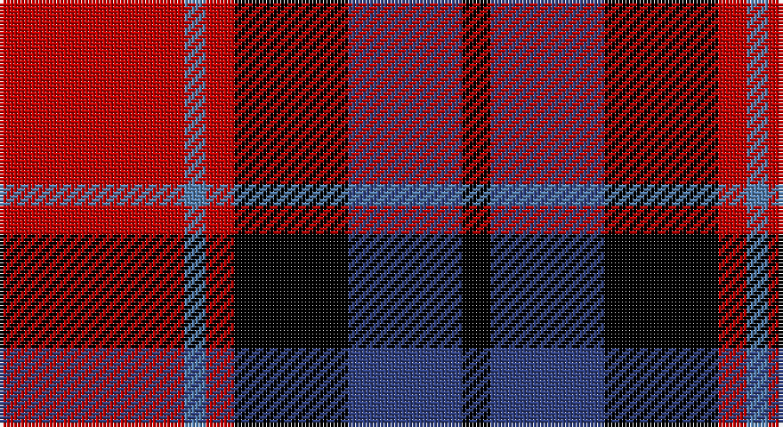

This page is one **sett** — a single exact thread-count. It belongs to the [tartan](/setts/r26t3r4k16db16k4/)
(the same proportion at any scale), whose colour order is pattern [KBKRBR](/stripes/kbkrbr/).

Part of the [Graham of Menteith](/tartans/graham-of-menteith/) tartan — the named design grouping this sett with its other cloths.

Sourced from weddslist.  It is a [6 stripe tartan](/stripes/stripes6/).

Original link http://www.weddslist.com/cgi-bin/tartans/pg.pl?source=sts

## Also known as

This cloth is also recorded under:

- Graham of Menteith,

## Thread count
R/52 Ba6 R8 K32 B32 K/8

One full sett is **216 threads**.

## Palette

Palette: <strong>Ingles Buchan</strong> <small style="color:#888">(1 of 4 colours)</small>
<table><thead><tr><th>Colour</th><th>Threads</th><th>Shade</th><th>Base</th><th>OKLCh</th></tr></thead><tbody><tr><td>R/</td><td style="text-align:right;font-variant-numeric:tabular-nums">52</td><td><code style="background-color:#C00000;">#C00000</code> <small style="color:#888">#C00000</small></td><td>R <code style="background-color:#CC0000;">#CC0000</code></td><td><small style="color:#888">oklch(50.7% 0.208 29.2)</small></td></tr><tr><td>Ba</td><td style="text-align:right;font-variant-numeric:tabular-nums">6</td><td><code style="background-color:#5480B0;">#5480B0</code> <small style="color:#888">#5480B0</small></td><td>B <code style="background-color:#2A418A;">#2A418A</code></td><td><small style="color:#888">oklch(58.8% 0.089 251.5)</small></td></tr><tr><td>R</td><td style="text-align:right;font-variant-numeric:tabular-nums">8</td><td><code style="background-color:#C00000;">#C00000</code> <small style="color:#888">#C00000</small></td><td>R <code style="background-color:#CC0000;">#CC0000</code></td><td><small style="color:#888">oklch(50.7% 0.208 29.2)</small></td></tr><tr><td>K</td><td style="text-align:right;font-variant-numeric:tabular-nums">32</td><td><code style="background-color:#000000;">#000000</code> <small style="color:#888">#000000</small></td><td>K <code style="background-color:#000000;">#000000</code></td><td><small style="color:#888">oklch(0.0% 0.000 0.0)</small></td></tr><tr><td>B</td><td style="text-align:right;font-variant-numeric:tabular-nums">32</td><td><code style="background-color:#304080;">#304080</code> <small style="color:#888">#304080</small></td><td>B <code style="background-color:#2A418A;">#2A418A</code></td><td><small style="color:#888">oklch(39.4% 0.109 270.2)</small></td></tr><tr><td>K/</td><td style="text-align:right;font-variant-numeric:tabular-nums">8</td><td><code style="background-color:#000000;">#000000</code> <small style="color:#888">#000000</small></td><td>K <code style="background-color:#000000;">#000000</code></td><td><small style="color:#888">oklch(0.0% 0.000 0.0)</small></td></tr></tbody></table>

# Sample pattern

## Compared to the master

This cloth is one sett of its design; the master sett (the exemplar the design is anchored on) is below for comparison.

<figure style="margin:0"><figcaption style="color:#888;font-size:smaller">this sett</figcaption></figure>
<figure style="margin:0"><figcaption style="color:#888;font-size:smaller"><a href="/setts/g8b1g1k6db6k1/">master sett →</a></figcaption></figure>

## Nearest tartans

The nearest existing variants by ΔTartan distance, with this tartan at the top so the swatches line up against it.

ΔTartan

Tartan

Sett

—

<a href="/ttd/edit/#slug=r26t3r4k16db16k4~x2">Graham of Menteith, (Red)</a> <a class="nn-out" href="/variants/s6/r26t3r4k16db16k4~x2/" title="open its dictionary page">↗</a>

0.71

<a href="/ttd/edit/#slug=lb5r34k22r4o24r4~x2&amp;base=r26t3r4k16db16k4~x2">Wcwm 759-2</a> <a class="nn-out" href="/variants/s6/lb5r34k22r4o24r4~x2/" title="open its dictionary page">↗</a>

0.73

<a href="/ttd/edit/#slug=r9k4r9k25ly3dp18k4~x2&amp;base=r26t3r4k16db16k4~x2">Wounded Warriors Canada</a> <a class="nn-out" href="/variants/s7/r9k4r9k25ly3dp18k4~x2/" title="open its dictionary page">↗</a>

0.85

<a href="/ttd/edit/#slug=b2r12db2b6k6b1~x2&amp;base=r26t3r4k16db16k4~x2">MacTavish</a> <a class="nn-out" href="/variants/s6/b2r12db2b6k6b1~x2/" title="open its dictionary page">↗</a>

0.85

<a href="/ttd/edit/#slug=b2r12db2b6k6b1&amp;base=r26t3r4k16db16k4~x2">MacTavish</a> <a class="nn-out" href="/variants/s6/b2r12db2b6k6b1/" title="open its dictionary page">↗</a>

0.98

<a href="/ttd/edit/#slug=ly2r15k7db8ly2~x4&amp;base=r26t3r4k16db16k4~x2">Aberdeen University</a> <a class="nn-out" href="/variants/s5/ly2r15k7db8ly2~x4/" title="open its dictionary page">↗</a>

1.00

<a href="/variants/s5/ki3r29ki11k29t3~x2/">Wallace Red Dress Tartan</a>

1.03

<a href="/ttd/edit/#slug=ly3db22k3db3k11r20ly3~x2&amp;base=r26t3r4k16db16k4~x2">Biffy Clyro</a> <a class="nn-out" href="/variants/s7/ly3db22k3db3k11r20ly3~x2/" title="open its dictionary page">↗</a>

1.04

<a href="/ttd/edit/#slug=r36lb3r5k21db24k3~x2&amp;base=r26t3r4k16db16k4~x2">Graham of Menteith (Red)</a> <a class="nn-out" href="/variants/s6/r36lb3r5k21db24k3~x2/" title="open its dictionary page">↗</a>

1.09

<a href="/ttd/edit/#slug=r2dp8k8w1r2~x2&amp;base=r26t3r4k16db16k4~x2">Inder (Corporate)</a> <a class="nn-out" href="/variants/s5/r2dp8k8w1r2~x2/" title="open its dictionary page">↗</a>

1.11

<a href="/variants/s6/dg3k20ki20r20k3r3~x2/">Unidentified #65</a>

## Neighbour map

Every grey dot is one of 14360 variants placed by the first two principal components of the ΔTartan feature space (44% of its variance). Red is this tartan; blue dots are its nearest — click one to open its page.

<svg viewBox="0 0 640 380" role="img" style="max-width:100%;height:auto;border:1px solid #e0e0e0;border-radius:4px;display:block" xmlns="http://www.w3.org/2000/svg"><image href="/nn/cloud.v1.png" width="640" height="380"/><a href="/variants/s6/lb5r34k22r4o24r4~x2/"><circle cx="205.7" cy="203.8" r="4" fill="#3465a4"><title>Wcwm 759-2</title></circle></a><a href="/variants/s7/r9k4r9k25ly3dp18k4~x2/"><circle cx="229.3" cy="211.0" r="4" fill="#3465a4"><title>Wounded Warriors Canada</title></circle></a><a href="/variants/s6/b2r12db2b6k6b1~x2/"><circle cx="209.9" cy="196.7" r="4" fill="#3465a4"><title>MacTavish</title></circle></a><a href="/variants/s6/b2r12db2b6k6b1/"><circle cx="209.9" cy="196.7" r="4" fill="#3465a4"><title>MacTavish</title></circle></a><a href="/variants/s5/ly2r15k7db8ly2~x4/"><circle cx="185.1" cy="214.9" r="4" fill="#3465a4"><title>Aberdeen University</title></circle></a><a href="/variants/s5/ki3r29ki11k29t3~x2/"><circle cx="204.0" cy="212.4" r="4" fill="#3465a4"><title>Wallace Red Dress Tartan</title></circle></a><a href="/variants/s7/ly3db22k3db3k11r20ly3~x2/"><circle cx="163.4" cy="192.5" r="4" fill="#3465a4"><title>Biffy Clyro</title></circle></a><a href="/variants/s6/r36lb3r5k21db24k3~x2/"><circle cx="248.5" cy="195.7" r="4" fill="#3465a4"><title>Graham of Menteith (Red)</title></circle></a><a href="/variants/s5/r2dp8k8w1r2~x2/"><circle cx="203.1" cy="223.2" r="4" fill="#3465a4"><title>Inder (Corporate)</title></circle></a><a href="/variants/s6/dg3k20ki20r20k3r3~x2/"><circle cx="164.7" cy="227.9" r="4" fill="#3465a4"><title>Unidentified #65</title></circle></a><circle cx="205.3" cy="208.7" r="5" fill="#c00000"/></svg>

ID: /variants/s6/r26t3r4k16db16k4~x2/
